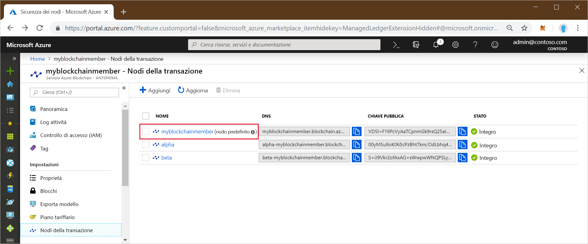
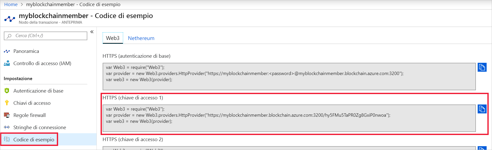

# <a name="quickstart-use-truffle-to-connect-to-an-azure-blockchain-service-network"></a>Guida introduttiva: Usare Truffle per connettersi a una rete del servizio Azure Blockchain

Truffle è un ambiente di sviluppo di blockchain che è possibile usare per connettersi a un nodo del servizio Azure Blockchain.

[!INCLUDE [quickstarts-free-trial-note](../../../includes/quickstarts-free-trial-note.md)]

## <a name="prerequisites"></a>Prerequisiti

* [Creare un membro di Azure Blockchain](create-member.md)
* Installare [Truffle](https://github.com/trufflesuite/truffle). Truffle richiede l'installazione di diversi strumenti, tra cui [Node.js](https://nodejs.org) e [Git](https://git-scm.com/book/en/v2/Getting-Started-Installing-Git).
* Installare [Python 2.7.15](https://www.python.org/downloads/release/python-2715/). Python è necessario per Web3.

## <a name="create-truffle-project"></a>Creare il progetto Truffle

1. Aprire una shell o un prompt dei comandi Node.js.
1. Passare alla directory in cui si vuole creare la directory del progetto Truffle.
1. Creare una directory per il progetto e impostare il percorso sulla nuova directory. Ad esempio,

    ``` bash
    mkdir truffledemo
    cd truffledemo
    ```

1. Inizializzare il progetto Truffle.

    ``` bash
    truffle init
    ```

1. Installare web3 dell'API Ethereum JavaScript nella cartella del progetto. Attualmente è necessario web3 versione 1.0.0-beta.37.

    ``` bash
    npm install web3@1.0.0-beta.37
    ```

    Durante l'installazione potrebbero essere visualizzati avvisi di npm.

1. Avviare la console di sviluppo interattiva di Truffle.

    ``` bash
    truffle develop
    ```

    Truffle crea una blockchain di sviluppo locale e fornisce una console interattiva.

## <a name="connect-to-transaction-node"></a>Connettersi al nodo della transazione

Usare *Web3* per connettersi al nodo della transazione. È possibile ottenere la stringa di connessione di *Web3* nel portale di Azure.

1. Accedere al [portale di Azure](https://portal.azure.com).
1. Passare al membro del servizio Azure Blockchain. Selezionare **Transaction nodes** (Nodi transazione) e il collegamento al nodo della transazione predefinito.

    

1. Selezionare **Sample Code > Web3** (Codice di esempio > Web3).
1. Copiare il codice JavaScript da **HTTPS (Access key 1)** (HTTPS - codice di accesso 1). Il codice è necessario per la console di sviluppo interattiva di Truffle.

    

1. Incollare il codice JavaScript del passaggio precedente nella console di sviluppo interattiva di Truffle. Il codice crea un oggetto web3 connesso al nodo della transazione del servizio Azure Blockchain.

    Output di esempio:

    ```bash
    truffle(develop)> var Web3 = require("Web3");
    truffle(develop)> var provider = new Web3.providers.HttpProvider("https://myblockchainmember.blockchain.azure.com:3200/hy5FMu5TaPR0Zg8GxiPwned");
    truffle(develop)> var web3 = new Web3(provider);
    ```

    È possibile chiamare metodi sull'oggetto **web3** per interagire con il nodo della transazione.

1. Chiamare il metodo **getBlockNumber** per restituire il numero di blocco corrente.

    ```bash
    web3.eth.getBlockNumber();
    ```

    Output di esempio:

    ```bash
    truffle(develop)> web3.eth.getBlockNumber();
    18567
    ```
1. Uscire dalla console di sviluppo di Truffle.

    ```bash
    .exit
    ```

## <a name="next-steps"></a>Passaggi successivi

In questa guida di avvio rapido è stato creato un progetto Truffle per connettersi al nodo della transazione predefinito del servizio Azure Blockchain.

Provare l'esercitazione successiva per inviare una transazione alla rete della blockchain del consorzio.

> [!div class="nextstepaction"]
> [Inviare una transazione](send-transaction.md)