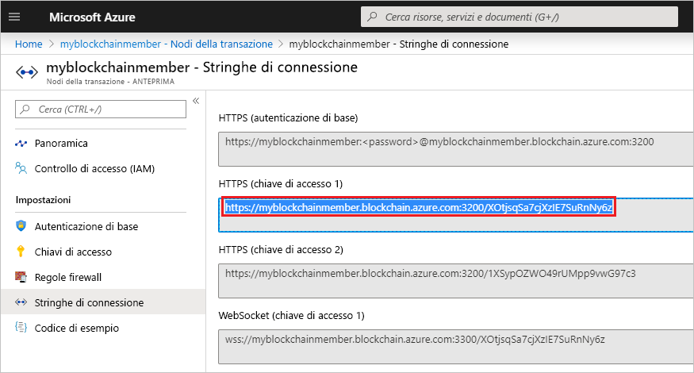

# <a name="quickstart-use-truffle-to-connect-to-azure-blockchain-service"></a>Guida introduttiva: Usare Truffle per connettersi al servizio Azure Blockchain

In questo argomento di avvio rapido si usa Truffle per connettersi a un nodo di transazione del servizio Azure Blockchain. Si usa quindi la console interattiva Truffle per chiamare i metodi **web3** per interagire con la rete blockchain.

[!INCLUDE [quickstarts-free-trial-note](../../../includes/quickstarts-free-trial-note.md)]

## <a name="prerequisites"></a>Prerequisiti

* Completare [Avvio rapido: Creare un membro della blockchain con il portale di Azure](create-member.md) o [Avvio rapido: Creare un membro della blockchain del servizio Azure Blockchain usando l'interfaccia della riga di comando di Azure](create-member-cli.md)
* Installare [Truffle](https://github.com/trufflesuite/truffle). Truffle richiede l'installazione di diversi strumenti, tra cui [Node.js](https://nodejs.org) e [Git](https://git-scm.com/book/en/v2/Getting-Started-Installing-Git).
* Installare [Python 2.7.15](https://www.python.org/downloads/release/python-2715/). Python è necessario per Web3.

## <a name="create-truffle-project"></a>Creare il progetto Truffle

1. Aprire una shell o un prompt dei comandi Node.js.
1. Passare alla directory in cui si vuole creare la directory del progetto Truffle.
1. Creare una directory per il progetto e impostare il percorso sulla nuova directory. Ad esempio,

    ``` bash
    mkdir truffledemo
    cd truffledemo
    ```

1. Inizializzare il progetto Truffle.

    ``` bash
    truffle init
    ```

1. Installare web3 dell'API Ethereum JavaScript nella cartella del progetto. Attualmente è necessario web3 versione 1.0.0-beta.37.

    ``` bash
    npm install web3@1.0.0-beta.37
    ```

    Durante l'installazione potrebbero essere visualizzati avvisi di npm.
    
## <a name="configure-truffle-project"></a>Configurare il progetto Truffle

Per configurare il progetto Truffle, sono necessarie alcune informazioni sul nodo di transazioni disponibili nel portale di Azure.

1. Accedere al [portale di Azure](https://portal.azure.com).
1. Passare al membro del servizio Azure Blockchain. Selezionare **Transaction nodes** (Nodi transazione) e il collegamento al nodo della transazione predefinito.

    

1. Selezionare **Connection strings** (Stringhe di connessione).
1. Copiare la stringa di connessione da **HTTPS (Access key 1)** (HTTPS - chiave di accesso 1). La stringa è necessaria per la sezione successiva.

    

### <a name="edit-configuration-file"></a>Modificare il file di configurazione

Successivamente, è necessario aggiornare il file di configurazione Truffle con l'endpoint del nodo della transazione.

1. Nella cartella del progetto **truffledemo** aprire il file di configurazione Truffle `truffle-config.js` in un editor.
1. Sostituire il contenuto del file con le informazioni di configurazione seguenti. Aggiungere una variabile contenente l'indirizzo dell'endpoint. Sostituire i valori tra parentesi uncinate con i valori raccolti nella sezione precedente.

    ``` javascript
    var defaultnode = "<default transaction node connection string>";   
    var Web3 = require("web3");
    
    module.exports = {
      networks: {
        defaultnode: {
          provider: new Web3.providers.HttpProvider(defaultnode),
          network_id: "*"
        }
      }
    }
    ```

1. Salvare le modifiche in `truffle-config.js`.

## <a name="connect-to-transaction-node"></a>Connettersi al nodo della transazione

Usare *Web3* per connettersi al nodo della transazione.

1. Usare la console di Truffle per connettersi al nodo di transazioni predefinito. Al prompt dei comandi o nella shell eseguire il comando seguente:

    ``` bash
    truffle console --network defaultnode
    ```

    Truffle si connette al nodo di transazioni predefinito e fornisce una console interattiva.

    È possibile chiamare metodi sull'oggetto **web3** per interagire con la rete blockchain.

1. Chiamare il metodo **getBlockNumber** per restituire il numero di blocco corrente.

    ```bash
    web3.eth.getBlockNumber();
    ```

    Output di esempio:

    ```bash
    truffle(defaultnode)> web3.eth.getBlockNumber();
    18567
    ```
1. Uscire dalla console di Truffle.

    ```bash
    .exit
    ```

## <a name="next-steps"></a>Passaggi successivi

In questo argomento di avvio rapido si è usato Truffle per connettersi a un nodo di transazione predefinito del servizio Azure Blockchain e si è usata la console interattiva per restituire il numero di blocco blockchain corrente.

Provare l'esercitazione successiva per usare Azure Blockchain Development Kit per Ethereum per creare, compilare, distribuire ed eseguire una funzione di contratto intelligente tramite una transazione.

> [!div class="nextstepaction"]
> [Creare, compilare e distribuire contratti intelligenti in Servizio Azure Blockchain](send-transaction.md)
