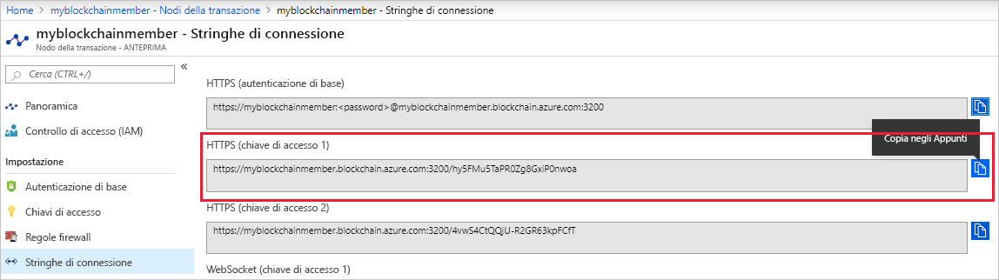

# <a name="quickstart-use-truffle-to-connect-to-a-transaction-node"></a>Guida introduttiva: Usare Truffle per connettersi a un nodo della transazione

Truffle è un ambiente di sviluppo di blockchain che è possibile usare per connettersi a un nodo della transazione del servizio Azure Blockchain.

[!INCLUDE [quickstarts-free-trial-note](../../../includes/quickstarts-free-trial-note.md)]

## <a name="prerequisites"></a>Prerequisiti

* [Creare un membro di Azure Blockchain](create-member.md)
* Installare [Truffle](https://github.com/trufflesuite/truffle). Truffle richiede l'installazione di diversi strumenti, tra cui [Node.js](https://nodejs.org) e [Git](https://git-scm.com/book/en/v2/Getting-Started-Installing-Git).
* Installare [Python 2.7.15](https://www.python.org/downloads/release/python-2715/). Python è necessario per Web3.

## <a name="create-truffle-project"></a>Creare il progetto Truffle

1. Aprire una shell o un prompt dei comandi Node.js.
1. Passare alla directory in cui si vuole creare la directory del progetto Truffle.
1. Creare una directory per il progetto e impostare il percorso sulla nuova directory. Ad esempio,

    ``` bash
    mkdir truffledemo
    cd truffledemo
    ```

1. Inizializzare il progetto Truffle.

    ``` bash
    truffle init
    ```

1. Installare web3 dell'API Ethereum JavaScript nella cartella del progetto. Attualmente è necessario web3 versione 1.0.0-beta.37.

    ``` bash
    npm install web3@1.0.0-beta.37
    ```

    Durante l'installazione potrebbero essere visualizzati avvisi di npm.
    
## <a name="configure-truffle-project"></a>Configurare il progetto Truffle

Per configurare il progetto Truffle, sono necessarie alcune informazioni sul nodo di transazioni disponibili nel portale di Azure.

### <a name="transaction-node-endpoint-addresses"></a>Indirizzi degli endpoint dei nodi di transazioni

1. Nel portale di Azure passare al nodo della transazione predefinito e selezionare **Transaction nodes > Connection strings** (Nodi della transazione > Stringhe di connessione).
1. Copiare e salvare l'URL dell'endpoint da **HTTPS (Access key 1)** (HTTPS - chiave di accesso 1). Gli indirizzi degli endpoint sono necessari per il file di configurazione del contratto intelligente più avanti nell'esercitazione.

    

### <a name="edit-configuration-file"></a>Modificare il file di configurazione

Successivamente, è necessario aggiornare il file di configurazione Truffle con l'endpoint del nodo della transazione.

1. Nella cartella del progetto **truffledemo** aprire il file di configurazione Truffle `truffle-config.js` in un editor.
1. Sostituire il contenuto del file con le informazioni di configurazione seguenti. Aggiungere una variabile contenente l'indirizzo dell'endpoint. Sostituire i valori tra parentesi uncinate con i valori raccolti nella sezione precedente.

    ``` javascript
    var defaultnode = "<default transaction node connection string>";   
    var Web3 = require("web3");
    
    module.exports = {
      networks: {
        defaultnode: {
          provider: new Web3.providers.HttpProvider(defaultnode),
          network_id: "*"
        }
      }
    }
    ```

1. Salvare le modifiche in `truffle-config.js`.

## <a name="connect-to-transaction-node"></a>Connettersi al nodo della transazione

Usare *Web3* per connettersi al nodo della transazione.

1. Usare la console di Truffle per connettersi al nodo di transazioni predefinito. Al prompt dei comandi o nella shell eseguire il comando seguente:

    ``` bash
    truffle console --network defaultnode
    ```

    Truffle si connette al nodo di transazioni predefinito e fornisce una console interattiva.

    È possibile chiamare metodi sull'oggetto **web3** per interagire con il nodo della transazione.

1. Chiamare il metodo **getBlockNumber** per restituire il numero di blocco corrente.

    ```bash
    web3.eth.getBlockNumber();
    ```

    Output di esempio:

    ```bash
    truffle(defaultnode)> web3.eth.getBlockNumber();
    18567
    ```
1. Uscire dalla console di Truffle.

    ```bash
    .exit
    ```

## <a name="next-steps"></a>Passaggi successivi

In questa guida di avvio rapido è stato creato un progetto Truffle per connettersi al nodo della transazione predefinito del servizio Azure Blockchain.

Provare l'esercitazione successiva per usare Azure Blockchain Development Kit per Ethereum e Truffle per eseguire una funzione del contratto intelligente tramite una transazione in una rete blockchain per consorzi.

> [!div class="nextstepaction"]
> [Usare i contratti intelligenti nel servizio Azure Blockchain](send-transaction.md)
