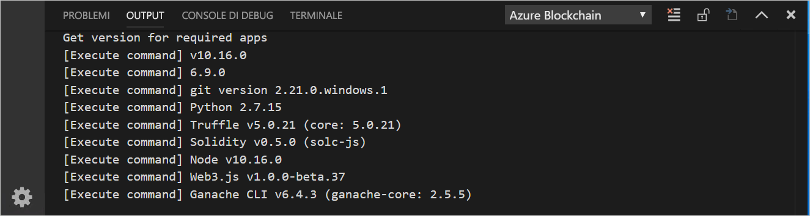
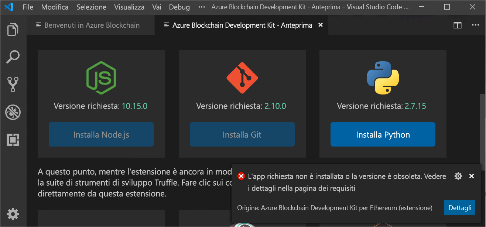
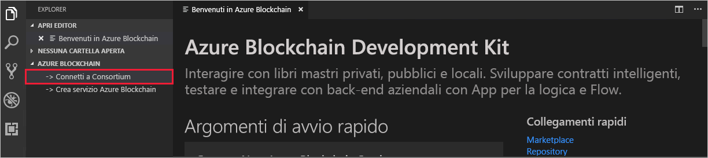
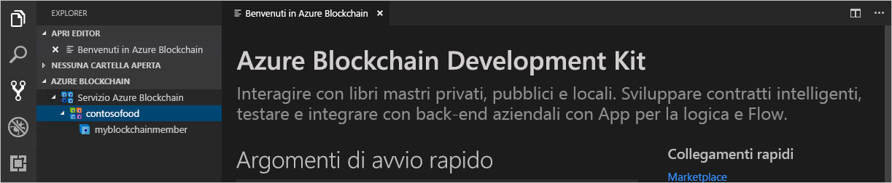

# Guida introduttiva: Usare Visual Studio Code per connettersi alla rete di un consorzio del servizio Azure Blockchain

In questa guida di avvio rapido si installa e si usa l'estensione Azure Blockchain Development Kit per Ethereum di Visual Studio Code per connettersi a un consorzio nel servizio Azure Blockchain. Azure Blockchain Development Kit semplifica la creazione, la connessione, la compilazione e la distribuzione di contratti intelligenti nei libri mastro Ethereum. 

[!INCLUDE [quickstarts-free-trial-note](../../../includes/quickstarts-free-trial-note.md)]

## Prerequisiti

* Completare [Avvio rapido: Creare un membro della blockchain con il portale di Azure](create-member.md) o [Avvio rapido: Creare un membro della blockchain del servizio Azure Blockchain usando l'interfaccia della riga di comando di Azure](create-member-cli.md)
* [Visual Studio Code](https://code.visualstudio.com/Download)
* [Estensione Azure Blockchain Development Kit per Ethereum](https://marketplace.visualstudio.com/items?itemName=AzBlockchain.azure-blockchain)
* [Node.js](https://nodejs.org)
* [Git](https://git-scm.com)
* [Python](https://www.python.org/downloads/release/python-2715/). Aggiungere python.exe al percorso. Python nel percorso è necessario per Azure Blockchain Development Kit.
* [Truffle](https://www.trufflesuite.com/docs/truffle/getting-started/installation)
* [Interfaccia della riga di comando di Ganache](https://github.com/trufflesuite/ganache-cli)

### Verificare l'ambiente di Azure Blockchain Development Kit

Azure Blockchain Development Kit verifica che siano stati soddisfatti i prerequisiti per l'ambiente di sviluppo. Per verificare l'ambiente di sviluppo:

Dal riquadro comandi di VS Code scegliere **Azure Blockchain: Mostra pagina iniziale**.

Azure Blockchain Development Kit esegue uno script di convalida che richiede circa un minuto per il completamento. È possibile visualizzare l'output selezionando **Terminale > Nuovo terminale**. Nella barra dei menu del terminale selezionare la scheda **Output** e **Azure Blockchain** nell'elenco a discesa. Una convalida con esito positivo ha un aspetto simile all'immagine seguente:

 Se non è presente uno strumento necessario, una nuova scheda denominata **Azure Blockchain Development Kit - Anteprima** elenca le app necessarie da installare e i collegamenti per scaricare gli strumenti.

Installare gli eventuali prerequisiti mancanti prima di continuare con questa guida di avvio rapido.

## Connettersi a un membro del consorzio

È possibile connettersi ai membri del consorzio usando l'estensione di VS Code Azure Blockchain Development Kit. Una volta connessi a un consorzio, è possibile compilare e distribuire contratti intelligenti a un membro del consorzio del servizio Azure Blockchain.

Se non si ha accesso a un membro del consorzio del servizio Azure Blockchain, completare il prerequisito [Avvio rapido: Creare un membro della blockchain con il portale di Azure](create-member.md) o [Avvio rapido: Creare un membro della blockchain del servizio Azure Blockchain usando l'interfaccia della riga di comando di Azure](create-member-cli.md).

1. Nel riquadro Explorer di Visual Studio Code (VS Code) espandere l'estensione **Azure Blockchain**.
1. Selezionare **Connect to Consortium** (Connetti al consorzio).

   

    Se viene richiesta l'autenticazione di Azure, seguire le istruzioni per eseguire l'autenticazione tramite un browser.
1. Scegliere **Connect to Azure Blockchain Service consortium** (Connetti al consorzio del servizio Azure Blockchain) nell'elenco a discesa del riquadro comandi.
1. Scegliere la sottoscrizione e il gruppo di risorse associati al membro del consorzio del servizio Azure Blockchain.
1. Scegliere il consorzio dall'elenco.

I membri del consorzio e della blockchain sono elencati nella barra laterale di Visual Studio Explorer.

## Passaggi successivi

In questa guida di avvio rapido è stata usata l'estensione Azure Blockchain Development Kit per Ethereum di Visual Studio Code per collegarsi a un consorzio nel servizio Azure Blockchain. Provare l'esercitazione successiva per usare Azure Blockchain Development Kit per Ethereum e Truffle per creare, compilare, distribuire ed eseguire una funzione di contratto intelligente tramite una transazione.

> [!div class="nextstepaction"]
> [Usare Visual Studio Code per creare, compilare e distribuire contratti intelligenti](send-transaction.md)