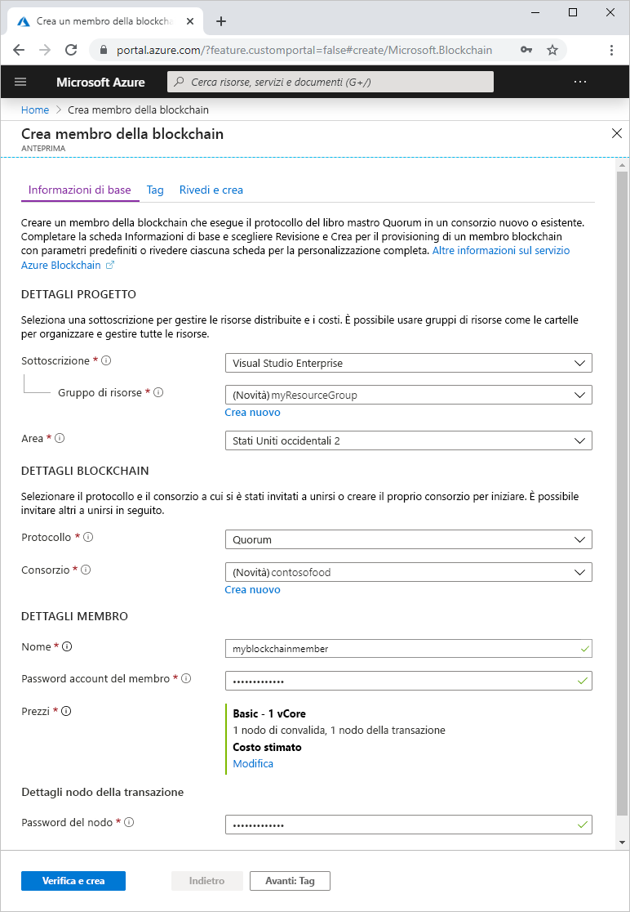
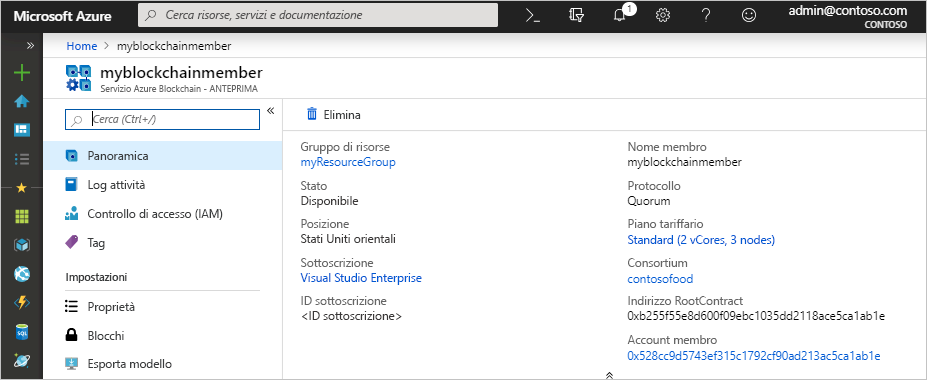

# Avvio rapido: Creare un servizio Azure Blockchain con il portale di Azure

Il servizio Azure Blockchain è una piattaforma per blockchain che consente di eseguire la logica di business in un contratto intelligente. Questa guida di avvio rapido illustra come iniziare a creare un libro mastro gestito con il portale di Azure.

[!INCLUDE [quickstarts-free-trial-note](../../../includes/quickstarts-free-trial-note.md)]

## Creare un libro mastro gestito

Il servizio Azure Blockchain viene creato con un set definito di risorse di calcolo e di archiviazione.

1. Accedere al [portale di Azure](https://portal.azure.com).
1. Selezionare **Crea risorsa** nell'angolo superiore sinistro del portale di Azure.
1. Selezionare **Blockchain** > **Servizio Azure Blockchain**.
1. Completare il modello.

    

    Impostazione | DESCRIZIONE
    --------|------------
    Blockchain Member (Membro della blockchain) | Scegliere un nome univoco che identifica il membro del servizio Azure Blockchain. Il nome del membro della blockchain può contenere solo lettere minuscole e numeri. Il primo carattere deve essere una lettera. Il valore deve avere una lunghezza compresa tra 2 e 20 caratteri.
    Sottoscrizione | Selezionare la sottoscrizione di Azure da usare per il servizio. Se si hanno più sottoscrizioni, scegliere quella in cui viene fatturata la risorsa.
    Gruppo di risorse | Nuovo nome di gruppo di risorse o uno esistente nella sottoscrizione.
    Region | La località deve essere la stessa per tutti i membri del consorzio.
    Member account password (Password dell'account del membro) | Specificare una nuova password per l'account del membro. Viene usata per eseguire l'autenticazione all'endpoint pubblico del membro della blockchain usando l'autenticazione di base.
    Nome del consorzio | Immettere un nome univoco per un nuovo consorzio. Se si accede a un consorzio tramite invito, il valore da immettere è il consorzio a cui si sta accedendo.
    DESCRIZIONE | Descrizione del consorzio.
    Protocollo |  La versione di anteprima supporta il protocollo Quorum.
    Prezzi | Configurazione del nodo per il nuovo servizio. Selezionare **Standard**. L'impostazione predefinita prevede 2 nodi di convalida e 1 nodo della transazione.

1. Selezionare **Create** (Crea) per effettuare il provisioning del servizio. Il provisioning richiede circa 10 minuti.
1. Per monitorare il processo di distribuzione, selezionare **Notifications** (Notifiche) sulla barra degli strumenti.
1. Dopo la distribuzione, passare al membro della blockchain.

Selezionare **Overview** (Panoramica), in cui è possibile visualizzare le informazioni di base sul servizio tra cui account del membro e indirizzo RootContract.

## Pulire le risorse

È possibile usare il membro creato per l'esercitazione o la guida di avvio rapido successiva. Quando non sono più necessarie, è possibile eliminare le risorse eliminando il gruppo di risorse `myResourceGroup` creato dal servizio Azure Blockchain.

Per eliminare il gruppo di risorse:

1. Nel portale di Azure passare a **Gruppo di risorse** nel riquadro di spostamento a sinistra e selezionare il gruppo di risorse da eliminare.
2. Selezionare **Elimina gruppo di risorse**. Confermare l'eliminazione immettendo il nome del gruppo di risorse e selezionare **Elimina**.

## Passaggi successivi

> [!div class="nextstepaction"]
> [Usare MetaMask per connettersi e distribuire un contratto intelligente](connect-metamask.md)