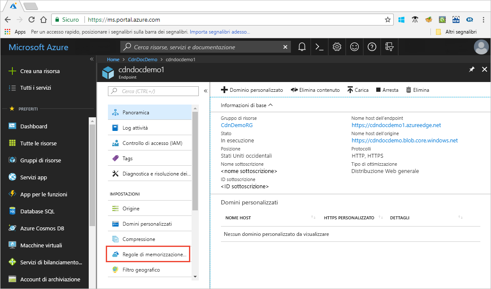

# Esercitazione: Impostare regole di memorizzazione nella cache della rete CDN di Azure

> [!NOTE] 
> Le regole di memorizzazione nella cache della rete CDN di Azure sono disponibili solo per i profili di **rete CDN Standard di Azure con tecnologia Verizon** e di **rete CDN Standard di Azure con tecnologia Akamai**. Per la **rete CDN Premium di Azure con tecnologia Verizon** usare il [motore delle regole della rete CDN di Azure](cdn-rules-engine.md) nel portale a cui si accedere tramite il pulsante **Gestisci** per funzionalità analoghe.
 

Questa esercitazione descrive come è possibile usare le regole di memorizzazione nella cache della rete CDN di Azure o modificare il comportamento predefinito di scadenza della cache a livello globale e con condizioni personalizzate, ad esempio un percorso URL e le estensioni dei file. La rete CDN di Azure offre due tipi di regole di memorizzazione nella cache:
- Regole di memorizzazione nella cache globali: è possibile impostare una regola di memorizzazione nella cache globale per ogni endpoint nel profilo, che influisce su tutte le richieste all'endpoint. La regola di memorizzazione nella cache globale esegue l'override di eventuali intestazioni di direttive della cache HTTP, se impostate.

- Regole di memorizzazione nella cache personalizzate: è possibile impostare una o più regole di memorizzazione nella cache personalizzate per ogni endpoint nel profilo. Le regole di memorizzazione nella cache personalizzate corrispondono a percorsi ed estensioni dei file specifici, vengono elaborate in ordine e sostituiscono la regola di memorizzazione nella cache globale, se impostata. 

In questa esercitazione si apprenderà come:
> [!div class="checklist"]
> - Aprire la pagina delle regole di memorizzazione nella cache.
> - Creare una regola di memorizzazione nella cache globale.
> - Creare una regola di memorizzazione nella cache personalizzata.

[!INCLUDE [quickstarts-free-trial-note](../../includes/quickstarts-free-trial-note.md)]

## prerequisiti

Prima di poter completare i passaggi di questa esercitazione, è necessario creare un profilo della rete CDN e almeno un endpoint della rete CDN. Per altre informazioni, vedere [Guida introduttiva: Creare un profilo e un endpoint della rete CDN di Azure](cdn-create-new-endpoint.md).

## Aprire la pagina delle regole di memorizzazione nella cache della rete CDN di Azure

1. Nel [portale di Azure](https://portal.azure.com), selezionare un profilo della rete CDN e un endpoint.

2. In Impostazioni nel riquadro sinistro selezionare **Regole di memorizzazione nella cache**.

   

   Viene visualizzata la pagina **Regole di memorizzazione nella cache**.

   

## Impostare regole di memorizzazione nella cache globali

Creare una regola di memorizzazione nella cache globale come segue:

1. In **Regole di memorizzazione nella cache globali** impostare **Comportamento di memorizzazione nella cache della stringa di query** su **Ignora stringhe di query**.

2. Impostare **Comportamento di memorizzazione nella cache** su **Imposta se mancante**.
       
3. Per **Durata scadenza cache** immettere 10 nel campo **Giorni**.

    La regola di memorizzazione nella cache globale influisce su tutte le richieste all'endpoint. Questa regola rispetta le intestazioni delle direttive della cache di origine, se presenti (`Cache-Control` o `Expires`); in caso contrario, se non sono specificate, imposta la cache su 10 giorni. 

    

## Impostare regole di memorizzazione nella cache personalizzate

Creare una regola di memorizzazione nella cache personalizzata come segue:

1. In **Regole di memorizzazione nella cache personalizzate** impostare **Condizione di corrispondenza** su **Percorso** e **Valori di corrispondenza** su `/images/*.jpg`.
    
2. Impostare **Comportamento di memorizzazione nella cache** su **Override** e immettere 30 nel campo **Giorni**.
       
    Questa regola di memorizzazione nella cache personalizzata imposta una durata della cache di 30 giorni in qualsiasi file di immagine `.jpg` nella cartella `/images` dell'endpoint. Esegue l'override di qualsiasi intestazione HTTP `Cache-Control` o `Expires` inviata dal server di origine.

    

    
## Pulire le risorse

Nei passaggi precedenti sono state create regole di memorizzazione nella cache. Se non si desidera più usare tali regole di memorizzazione nella cache, è possibile rimuoverle mediante i passaggi indicati:
 
1. Selezionare un profilo della rete CDN, quindi selezionare l'endpoint con le regole di memorizzazione nella cache da rimuovere.

2. In Impostazioni nel riquadro sinistro selezionare **Regole di memorizzazione nella cache**.

3. Sotto **Regole di memorizzazione nella cache globali**, impostare il **Comportamento di memorizzazione nella cache** su **Non impostato**.
 
4. Sotto **Regole di memorizzazione nella cache personalizzate**, selezionare la casella di controllo accanto alla regola da eliminare.

5. Selezionare **Elimina**.

6. Nella parte superiore della pagina, selezionare **Salva**.

## Passaggi successivi

Questa esercitazione illustra come:

> [!div class="checklist"]
> - Aprire la pagina delle regole di memorizzazione nella cache.
> - Creare una regola di memorizzazione nella cache globale.
> - Creare una regola di memorizzazione nella cache personalizzata.

Passare al prossimo articolo per informazioni su come configurare altre impostazioni delle regole di memorizzazione nella cache.

> [!div class="nextstepaction"]
> [Controllare il comportamento di memorizzazione nella cache della rete CDN di Azure con regole di memorizzazione nella cache](cdn-caching-rules.md)

