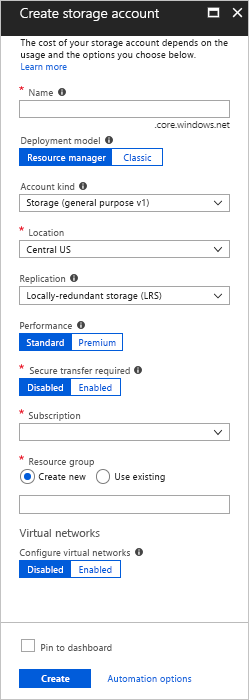
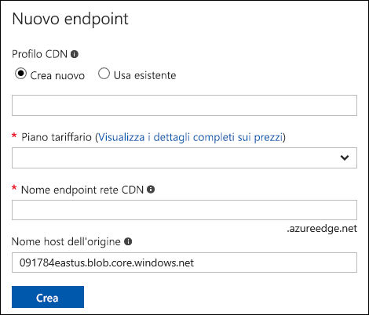
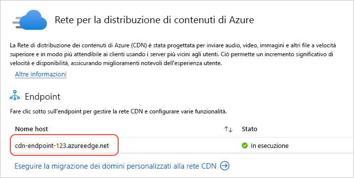
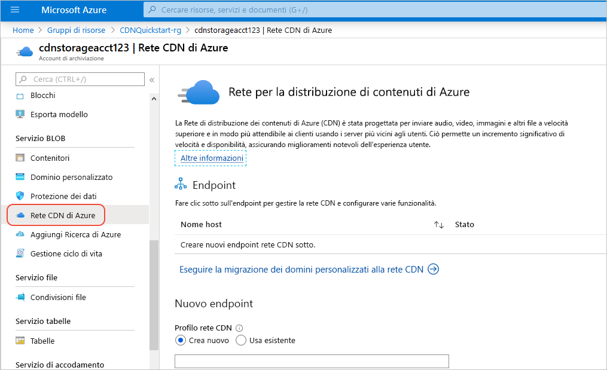

# Integrare un account di archiviazione di Azure con la rete CDN di Azure
È possibile abilitare la rete per la distribuzione di contenuti (rete CDN) di Azure per memorizzare nella cache i contenuti dall'archiviazione di Azure. La rete CDN di Azure offre agli sviluppatori una soluzione globale per distribuire contenuti con esigenze di larghezza di banda elevata. Consente di memorizzare nella cache oggetti BLOB e contenuti statici di istanze di calcolo in nodi fisici negli Stati Uniti, in Europa, Asia, Australia e Sud America.

## Passaggio 1: Creare un account di archiviazione
Usare la procedura seguente per creare un nuovo account di archiviazione per una sottoscrizione ad Azure. Un account di archiviazione consente di accedere ai servizi di archiviazione di Azure. L'account di archiviazione rappresenta il livello più elevato dello spazio dei nomi per l'accesso a ogni componente dei servizi di archiviazione di Azure: ovvero servizi BLOB, servizi di accodamento e servizi tabelle. Per altre informazioni, vedere [Introduzione ad Archiviazione di Microsoft Azure](../storage/common/storage-introduction.md).

Per creare un account di archiviazione, è necessario essere amministratori del servizio o coamministratori della sottoscrizione.

> [!NOTE]
> È possibile usare diversi metodi per creare un account di archiviazione, compresi il portale di Azure e PowerShell. Questa esercitazione illustra come usare il portale di Azure.   
> 

**Per creare un account di archiviazione per una sottoscrizione di Azure**

1. Accedere al [portale di Azure](https://portal.azure.com).
2. Nell'angolo in alto a sinistra della schermata selezionare **Crea una risorsa**. Nel riquadro **Nuovo** selezionare **Archiviazione** e quindi **Account di archiviazione: BLOB, File, Tabelle, Code**.
    
    Viene visualizzato il riquadro **Crea account di archiviazione**.   

    

3. Nella casella **Nome** immettere un nome di sottodominio. Il nome può contenere tra 3 e 24 lettere minuscole e numeri.
   
    Questo valore diventa il nome host all'interno dell'URI usato per fare riferimento a risorse BLOB, di accodamento o tabelle per la sottoscrizione. Per accedere a una risorsa contenitore nell'archiviazione BLOB, usare un URI nel formato seguente:
   
    http://*&lt;EtichettaAccountArchiviazione&gt;*.blob.core.windows.net/*&lt;contenitorepersonale&gt;*

    dove *&lt;EtichettaAccountArchiviazione&gt;* fa riferimento al valore inserito nella casella **Nome**.
   
    > [!IMPORTANT]    
    > L'etichetta dell'URL costituisce il sottodominio dell'URI dell'account di archiviazione e deve essere univoca in tutti i servizi ospitati in Azure.
   
    Questo valore viene usato anche come nome dell'account di archiviazione nel portale o quando si accede a questo account a livello di codice.
    
4. Usare le impostazioni predefinite per **Modello di distribuzione**, **Tipologia account**, **Prestazioni** e **Replica**. 
    
5. Per **Sottoscrizione** selezionare la sottoscrizione da usare con l'account di archiviazione.
    
6. Per **Gruppo di risorse** selezionare o creare un gruppo di risorse. Per informazioni sui gruppi di risorse, vedere [Panoramica di Azure Resource Manager](../azure-resource-manager/resource-group-overview.md#resource-groups).
    
7. Per **Posizione** selezionare la località per l'account di archiviazione.
    
8. Selezionare **Create**. Il completamento del processo di creazione dell'account di archiviazione potrebbe richiedere diversi minuti.

## Passaggio 2: Abilitare la rete CDN per l'account di archiviazione

È possibile abilitare la rete CDN per l'account di archiviazione direttamente dall'account di archiviazione. 

1. Nel dashboard selezionare un account di archiviazione e quindi selezionare **Rete CDN di Azure** nel riquadro a sinistra. Se il pulsante **Rete CDN di Azure** non è immediatamente visibile, è possibile immettere CDN nella casella di **ricerca** del riquadro sinistro.
    
    Viene visualizzato il riquadro **Rete per la distribuzione di contenuti di Azure**.

    
    
2. Creare un nuovo endpoint immettendo le informazioni necessarie:
    - **Profilo CDN**: creare un nuovo profilo CDN o usarne uno esistente.
    - **Piano tariffario**: selezionare un piano tariffario solo se si crea un nuovo profilo CDN.
    - **Nome endpoint rete CDN** : immettere un nome dell'endpoint CDN.

    > [!TIP]
    > Per impostazione predefinita, un nuovo endpoint della rete CDN usa il nome host dell'account di archiviazione come server di origine.

3. Selezionare **Create**. Dopo la creazione, l'endpoint verrà visualizzato nell'elenco di endpoint.

    

> [!NOTE]
> Se si vuole specificare delle impostazioni di configurazione avanzata per l'endpoint della rete CDN, come ad esempio il tipo di ottimizzazione, è possibile usare l'[estensione Rete CDN di Azure](cdn-create-new-endpoint.md#create-a-new-cdn-endpoint) per creare un endpoint della rete CDN o un profilo di rete CDN.

## Passaggio 3: Abilitare funzionalità aggiuntive della rete CDN

Dal riquadro **Rete CDN di Azure** dell'account di archiviazione selezionare l'endpoint della rete CDN dall'elenco per aprire il riquadro di configurazione della rete CDN. È possibile abilitare funzionalità aggiuntive della rete CDN per il recapito, ad esempio la compressione, la stringa di query e il filtro geografico. È inoltre possibile aggiungere mapping dominio personalizzato all'endpoint della rete CDN e abilitare HTTPS per il dominio personalizzato.
    

## Passaggio 4: Accedere al contenuto della rete CDN
Per accedere al contenuto memorizzato nella cache nella rete CDN, usare l'URL della rete CDN specificato nel portale. L'indirizzo per un oggetto BLOB memorizzato nella cache ha il formato seguente:

http://<*EndpointName*\>.azureedge.net/<*myPublicContainer*\>/<*BlobName*\>

> [!NOTE]
> Dopo l'abilitazione dell'accesso della rete CDN a un account di archiviazione, tutti gli oggetti disponibili pubblicamente saranno idonei per la memorizzazione nella cache perimetrale della rete CDN. Se si modifica un oggetto attualmente memorizzato nella cache nella rete CDN, il nuovo contenuto sarà disponibile tramite la rete CDN solo dopo l'aggiornamento dei contenuti della rete CDN alla scadenza della durata specificata per i contenuti memorizzati nella cache.

## Passaggio 5: rimuovere contenuto dalla rete CDN
Se non si vuole più memorizzare un oggetto nella cache della rete CDN di Azure, è possibile eseguire una delle operazioni seguenti:

* Rendere privato il contenitore, invece di pubblico. Per altre informazioni, vedere [Gestire l'accesso in lettura anonimo a contenitori e BLOB](../storage/blobs/storage-manage-access-to-resources.md).
* Disabilitare o eliminare l'endpoint della rete CDN usando il portale di Azure.
* Modificare il servizio ospitato, in modo che non risponda più a richieste per l'oggetto.

Un oggetto già memorizzato nella cache della rete CDN di Azure rimane nella cache fino alla scadenza della durata prevista per l'oggetto o fino a quando l'endpoint non verrà eliminato. Al termine della durata prevista, la rete CDN di Azure verifica se l'endpoint della rete CDN è ancora valido e se l'oggetto è ancora accessibile in modo anonimo. In caso contrario, l'oggetto non sarà più memorizzato nella cache.

## Risorse aggiuntive
* [Aggiungere un dominio personalizzato all'endpoint della rete CDN](cdn-map-content-to-custom-domain.md)
* [Configurare HTTPS in un dominio personalizzato della rete CDN di Azure](cdn-custom-ssl.md)

