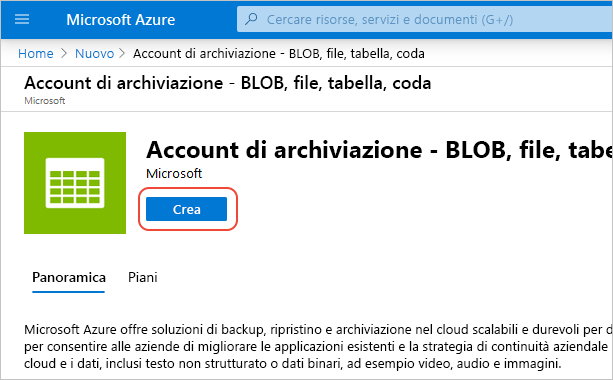

# Avvio rapido: Integrare un account di archiviazione di Azure con la rete CDN di Azure
In questa guida introduttiva, la [rete per la distribuzione di contenuti (rete CDN) di Azure](cdn-overview.md) viene abilitata per memorizzare nella cache i contenuti dall'archiviazione di Azure. La rete CDN di Azure offre agli sviluppatori una soluzione globale per distribuire contenuti con esigenze di larghezza di banda elevata. Consente di memorizzare nella cache oggetti BLOB e contenuti statici di istanze di calcolo in nodi fisici negli Stati Uniti, in Europa, Asia, Australia e Sud America.

[!INCLUDE [quickstarts-free-trial-note](../../includes/quickstarts-free-trial-note.md)]

## Accedere al Portale di Azure
Accedere al [portale di Azure](https://portal.azure.com) con il proprio account Azure.

## Creare un account di archiviazione
Usare la procedura seguente per creare un nuovo account di archiviazione per una sottoscrizione ad Azure. Un account di archiviazione consente di accedere ai servizi di archiviazione di Azure. L'account di archiviazione rappresenta il livello più elevato dello spazio dei nomi per l'accesso a ogni componente del servizio Archiviazione di Azure: BLOB di Azure, Coda di Azure e Archivio tabelle. Per altre informazioni, vedere [Introduzione ad Archiviazione di Microsoft Azure](../storage/common/storage-introduction.md).

Per creare un account di archiviazione, è necessario essere amministratori del servizio o coamministratori della sottoscrizione.

È possibile usare diversi metodi per creare un account di archiviazione, compresi il portale di Azure e PowerShell. Questa guida introduttiva illustra come usare il portale di Azure.   

**Per creare un account di archiviazione per una sottoscrizione di Azure**

1. In alto a sinistra nel portale di Azure selezionare **Crea una risorsa**. 

    Viene visualizzato il riquadro **Nuovo**.

2. Selezionare **Storage** (Archiviazione) e quindi **Storage account - blob, file, table, queue** (Account di archiviazione: BLOB, File, Tabelle, Code).
    
    

    Viene visualizzato il riquadro **Crea account di archiviazione**.   

    

3. Nella casella **Nome** immettere un nome di sottodominio. Il nome può contenere tra 3 e 24 lettere minuscole e numeri.
   
    Questo valore diventa il nome host all'interno dell'URI usato per fare riferimento a risorse BLOB, di accodamento o tabelle per la sottoscrizione. Per accedere a una risorsa contenitore nell'archiviazione BLOB, usare un URI nel formato seguente:
   
    http://*&lt;EtichettaAccountArchiviazione&gt;*.blob.core.windows.net/*&lt;contenitorepersonale&gt;*

    dove *&lt;EtichettaAccountArchiviazione&gt;* fa riferimento al valore inserito nella casella **Nome**.
   
    > [!IMPORTANT]    
    > L'etichetta dell'URL costituisce il sottodominio dell'URI dell'account di archiviazione e deve essere univoca in tutti i servizi ospitati in Azure.
   
    Questo valore viene usato anche come nome dell'account di archiviazione nel portale o quando si accede a questo account a livello di codice.
    
4. Per il resto delle impostazioni, usare i valori specificati nella tabella seguente:

    | Impostazione  | Valore |
    | -------- | ----- |
    | **Modello di distribuzione** | Usare il valore predefinito. |
    | **Tipo di account** | Usare il valore predefinito. |
    | **Posizione**    | Selezionare **Stati Uniti centrali** dall'elenco a discesa. |
    | **Replica** | Usare il valore predefinito. |
    | **Prestazioni** | Usare il valore predefinito. |
    | **Trasferimento sicuro necessario** | Usare il valore predefinito. |
    | **Sottoscrizione** | Selezionare una sottoscrizione di Azure dall'elenco a discesa. |
    | **Gruppo di risorse** | Selezionare **Crea nuovo** e immettere *my-resource-group-123* per il nome del gruppo di risorse. Il nome deve essere univoco a livello globale. Se è già in uso, è possibile immettere un nome diverso o è possibile selezionare **Usa esistente** e selezionare **my-resource-group-123** nell'elenco a discesa.  Per informazioni sui gruppi di risorse, vedere [Panoramica di Azure Resource Manager](../azure-resource-manager/resource-group-overview.md#resource-groups).| 
    | **Configurare reti virtuali** | Usare il valore predefinito. |  
    
5. Selezionare **Aggiungi al dashboard** per salvare l'account di archiviazione nel dashboard dopo la creazione.
    
6. Selezionare **Create**. Per completare la creazione dell'account di archiviazione potrebbero essere richiesti diversi minuti.

## Abilitare la rete CDN di Azure per l'account di archiviazione

È possibile abilitare la rete CDN di Azure per l'account di archiviazione direttamente dall'account di archiviazione. Se si vogliono specificare impostazioni di configurazione avanzate per l'endpoint della rete CDN, come ad esempio l'[ottimizzazione del download di un file di grandi dimensioni](cdn-optimization-overview.md#large-file-download), è invece possibile usare l'[estensione Rete CDN di Azure](cdn-create-new-endpoint.md) per creare un profilo e un endpoint di rete CDN.

1. Nel dashboard selezionare un account di archiviazione e quindi selezionare **Rete CDN di Azure** nel riquadro a sinistra. Se il pulsante **Rete CDN di Azure** non viene visualizzato immediatamente, è possibile immettere CDN nella casella di **ricerca** del riquadro sinistro per trovarlo.
    
    Verrà visualizzata la pagina **Rete CDN di Azure**.

    
    
2. Creare un nuovo endpoint immettendo le informazioni necessarie specificate nella tabella seguente:

    | Impostazione  | Valore |
    | -------- | ----- |
    | **Profilo CDN** | Selezionare **Crea nuovo** e immettere il nome del profilo, ad esempio *my-cdn-profile-123*. Il nome deve essere univoco a livello globale.  |
    | **Piano tariffario** | Selezionare **Verizon standard** dall'elenco a discesa. |
    | **Nome endpoint rete CDN** | Immettere il nome host dell'endpoint, ad esempio *my-endpoint-123*. Il nome deve essere univoco a livello globale. Questo nome viene usato per accedere alle risorse memorizzate nella cache nel dominio _&lt;nome endpoint&gt;_.azureedge.net. |
    | **Nome host dell'origine** | Per impostazione predefinita, un nuovo endpoint della rete CDN usa il nome host dell'account di archiviazione come server di origine. |

3. Selezionare **Create**. Dopo la creazione, l'endpoint verrà visualizzato nell'elenco di endpoint.

    

## Abilitare funzionalità aggiuntive della rete CDN
Dalla pagina **Rete CDN di Azure** dell'account di archiviazione selezionare l'endpoint della rete CDN nell'elenco per aprire la pagina di configurazione della rete CDN. Da questa pagina è possibile abilitare funzionalità aggiuntive della rete CDN per il recapito, ad esempio la [compressione](cdn-improve-performance.md), la [memorizzazione nella cache della stringa di query](cdn-query-string.md) e il [filtro geografico](cdn-restrict-access-by-country.md). 
    

## Abilitare SAS
Se si desidera concedere l'accesso limitato ai contenitori di archiviazione privati, è possibile usare la funzionalità di firma di accesso condiviso, ovvero SAS, dell'account di archiviazione di Azure. Una firma di accesso condiviso è un URI che concede diritti di accesso limitati alle risorse di Archiviazione di Azure senza esporre la chiave dell'account. Per altre informazioni, vedere [Uso della rete CDN di Azure con SAS](cdn-sas-storage-support.md).

## Accedere al contenuto della rete CDN
Per accedere al contenuto memorizzato nella cache nella rete CDN, usare l'URL della rete CDN specificato nel portale. L'indirizzo per un oggetto BLOB memorizzato nella cache ha il formato seguente:

http://<*EndpointName*\>.azureedge.net/<*myPublicContainer*\>/<*BlobName*\>

> [!NOTE]
> Dopo l'abilitazione dell'accesso della rete CDN di Azure a un account di archiviazione, tutti gli oggetti disponibili pubblicamente saranno idonei per la memorizzazione nella cache POP della rete CDN. Se si modifica un oggetto attualmente memorizzato nella cache nella rete CDN, il nuovo contenuto sarà disponibile tramite la rete CDN di Azure solo dopo l'aggiornamento dei contenuti della rete CDN di Azure alla scadenza della durata specificata per i contenuti memorizzati nella cache.

## Rimuovere contenuti dalla rete CDN di Azure
Se non si vuole più memorizzare un oggetto nella cache della rete CDN di Azure, è possibile eseguire una delle operazioni seguenti:

* Rendere privato il contenitore, invece di pubblico. Per altre informazioni, vedere [Gestire l'accesso in lettura anonimo a contenitori e BLOB](../storage/blobs/storage-manage-access-to-resources.md).
* Disabilitare o eliminare l'endpoint della rete CDN usando il portale di Azure.
* Modificare il servizio ospitato, in modo che non risponda più a richieste per l'oggetto.

Un oggetto già memorizzato nella cache della rete CDN di Azure rimane nella cache fino alla scadenza della durata prevista per l'oggetto o fino a quando l'endpoint non viene [ripulito](cdn-purge-endpoint.md). Al termine della durata prevista, la rete CDN di Azure determina se l'endpoint della rete CDN è ancora valido e se l'oggetto è ancora accessibile in modo anonimo. In caso contrario, l'oggetto non sarà più memorizzato nella cache.

## Pulire le risorse
Nei passaggi precedenti sono stati creati un profilo e un endpoint della rete CDN in un gruppo di risorse. Salvare queste risorse se si vuole continuare con i [passaggi successivi](#next-steps) e ottenere informazioni su come aggiungere un dominio personalizzato all'endpoint. Se tuttavia non si prevede di usare queste risorse in futuro, è possibile eliminarle eliminando il gruppo di risorse, evitando così costi aggiuntivi:

1. Dal menu a sinistra nel portale di Azure scegliere **Gruppi di risorse** e quindi selezionare **my-resource-group-123**.

2. Nella pagina **Gruppo di risorse** selezionare **Elimina gruppo di risorse**, immettere *my-resource-group-123* nella casella di testo e quindi selezionare **Elimina**.

    Con questa azione si elimineranno il gruppo di risorse, il profilo e l'endpoint creati in questa guida introduttiva.

3. Per eliminare l'account di archiviazione, selezionarlo dal dashboard, e quindi scegliere **Elimina** dal menu in alto.

## Passaggi successivi
Per informazioni sull'aggiunta di un dominio personalizzato e su come abilitare HTTPS per l'endpoint della rete CDN, vedere l'esercitazione seguente:

> [!div class="nextstepaction"]
> [Esercitazione: Accedere ai BLOB di archiviazione con un dominio personalizzato della rete CDN di Azure tramite HTTPS](cdn-storage-custom-domain-https.md)

