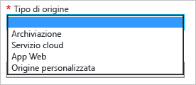

<properties
	 pageTitle="Come abilitare la rete per la distribuzione di contenuti (rete CDN) per Azure"
	 description="Questo argomento illustra come abilitare la rete per la distribuzione di contenuti (CDN) per Azure."
	 services="cdn"
	 documentationCenter=""
	 authors="camsoper"
	 manager="erikre"
	 editor=""/>
<tags
	 ms.service="cdn"
	 ms.workload="media"
	 ms.tgt_pltfrm="na"
	 ms.devlang="na"
	 ms.topic="get-started-article"
	 ms.date="02/25/2016" 
	 ms.author="casoper"/>

#Come abilitare la rete per la distribuzione di contenuti (CDN) per Azure  

È possibile abilitare la rete CDN per l’origine tramite il portale di gestione di Azure. Sono supportati diversi tipi di origini di Azure integrati, compresi App Web, archiviazione BLOB, e Servizi Cloud. È inoltre possibile abilitare la rete CDN per l'endpoint di streaming di Servizi multimediali di Azure. Se l'origine non corrisponde a uno di questi servizi di Azure, o è ospitata in un' posizione all'esterno di Azure, è anche possibile creare un'origine personalizzata. Dopo aver abilitato un endpoint della rete CDN per l'origine, tutti gli oggetti disponibili pubblicamente saranno idonei per la memorizzazione nella cache perimetrale della rete CDN.

## Creare un nuovo profilo di rete CDN

Un profilo di rete CDN è una raccolta di endpoint della rete CDN. Ogni profilo contiene uno o più endpoint della rete CDN. Si consiglia di usare più profili per organizzare gli endpoint della rete CDN tramite il dominio internet, l’applicazione web o altri criteri.

> [AZURE.NOTE] Per impostazione predefinita, ogni sottoscrizione di Azure è limitata a quattro profili della rete CDN. Ogni profilo della rete CDN è limitato a dieci endpoint della rete CDN.
>
> I prezzi della rete CDN vengono applicati a livello di profilo della rete CDN. Se si desidera usare una combinazione di funzionalità della rete CDN Standard e Premium, è necessario disporre di più profili della rete CDN.

**Per creare un nuovo profilo di rete CDN**

1. Nel [portale di gestione di Azure](https://portal.azure.com), in alto a sinistra, fare clic su **Nuovo**. Nel pannello **Nuovo** selezionare **Contenuti multimediali e rete CDN**, quindi **Rete CDN**.

    Viene visualizzato il pannello del nuovo profilo di rete CDN.

    ![Nuovo profilo di rete CDN][new-cdn-profile]

2. Inserire un nome per il profilo di rete CDN.

3. Selezionare un **Piano tariffario** oppure usare il valore predefinito.

4. Selezionare o creare un **gruppo di risorse**. Per altre informazioni sui Gruppi di risorse, vedere [Panoramica di Gestione risorse di Azure](resource-group-overview/#resource-groups).

5. Selezionare la **Sottoscrizione** per questo profilo di rete CDN.

6. Selezionare un **Percorso**. Questo è il percorso di Azure in cui verranno archiviate le informazioni relative al profilo di rete CDN. Non incide sulle posizioni dell’endpoint di rete CDN. Non è necessario che sia lo stesso percorso dell'account di archiviazione.

7. Per creare il nuovo profilo, fare clic sul pulsante **Crea**.

## Creare un nuovo endpoint della rete CDN

**Per creare un nuovo endpoint della rete CDN per l'account di archiviazione**

1. Nel [portale di gestione di Azure](https://portal.azure.com) passare al profilo di rete CDN. Lo si potrebbe aver bloccato nel dashboard nel passaggio precedente. Se così non fosse, è possibile trovarlo cliccando su **Sfoglia**, quindi su **Profili di rete CDN** e facendo clic sul profilo in cui si prevede di aggiungere l'endpoint.

    Viene visualizzato il pannello del profilo di rete CDN.

    ![Profilo di rete CDN][cdn-profile-settings]

2. Fare clic sul pulsante **Aggiungi Endpoint**.

    ![Pulsante Aggiungi endpoint][cdn-new-endpoint-button]

    Viene visualizzato il pannello **Aggiungi un endpoint**.

    ![Pannello Aggiungi endpoint][cdn-add-endpoint]

3. Immettere un **Nome** per questo endpoint della rete CDN. Questo nome verrà usato per accedere alle risorse memorizzate nella cache nel dominio `<EndpointName>.azureedge.net`.

4. Nell'elenco a discesa **Tipo origine** selezionare il tipo di origine.

	

5. Nell'elenco a discesa **Nome host origine** selezionare o digitare il dominio di origine. Nell’elenco a discesa compariranno tutte le origini disponibili del tipo specificato nel passaggio 4. Se è stato selezionato l’elemento *Origine personalizzata* come **Tipo di origine**, si digiterà nel dominio di origine personalizzato.

6. Nella casella di testo **Percorso origine** inserire il percorso per le risorse che si desidera memorizzare nella cache oppure lasciare vuoto per consentire la memorizzazione nella cache di qualsiasi risorsa nel dominio specificato nel passaggio 5.

7. Nell’**Intestazione dell’host di origine**, inserire l'intestazione dell’host che si desidera che la rete CDN invii con ogni richiesta di immettere, o lasciare il valore predefinito.

8. Per **Protocollo** e **Porta origine** specificare i protocolli e le porte usate per accedere alle risorse in corrispondenza dell'origine. I client continueranno a usare gli stessi protocolli e le stesse porte quando accedono a risorse nella rete CDN. È necessario selezionare almeno un protocollo (HTTP o HTTPS).

9. Per creare il nuovo endpoint, fare clic sul pulsante **Aggiungi**.

10. Dopo la creazione, l'endpoint sarà visualizzato in un elenco di endpoint per il profilo. Nella visualizzazione elenco sono mostrati gli URL da usare per accedere a contenuti memorizzati nella cache, oltre al dominio di origine.

    ![Endpoint della rete CDN][cdn-endpoint-success]

    > [AZURE.NOTE] L'endpoint non sarà immediatamente disponibile per l'uso. Ci possono volere fino a 90 minuti per far sì che la registrazione si propaghi attraverso la rete CDN. È possibile che gli utenti che provano a usare immediatamente il nome di dominio della rete CDN ricevano un errore con codice di stato 404 fino a quando il contenuto non risulterà disponibile tramite la rete CDN.

##Vedere anche
- [Come eseguire il mapping del contenuto della rete per la distribuzione di contenuti (CDN) a un dominio personalizzato](cdn-map-content-to-custom-domain.md)
- [Ripulire un endpoint della rete CDN di Azure](cdn-purge-endpoint.md)

[new-cdn-profile]: ./media/cdn-create-new-endpoint/cdn-new-profile.png
[cdn-profile-settings]: ./media/cdn-create-new-endpoint/cdn-profile-settings.png
[cdn-new-endpoint-button]: ./media/cdn-create-new-endpoint/cdn-new-endpoint-button.png
[cdn-add-endpoint]: ./media/cdn-create-new-endpoint/cdn-add-endpoint.png
[cdn-endpoint-success]: ./media/cdn-create-new-endpoint/cdn-endpoint-success.png

<!---HONumber=AcomDC_0302_2016-->