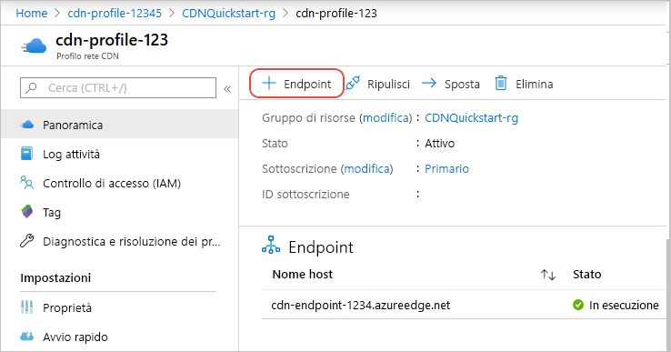
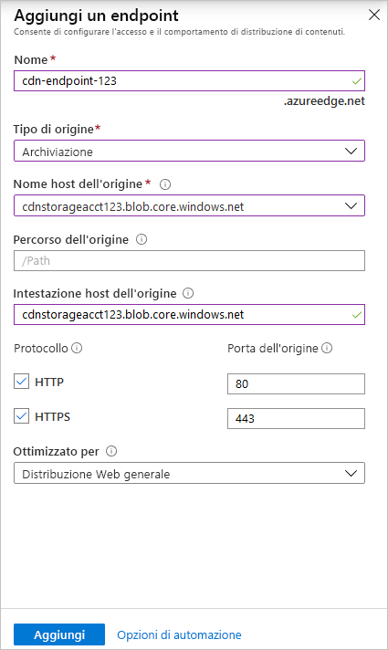

# Guida introduttiva: Creare un profilo e un endpoint della rete CDN di Azure
In questa guida introduttiva si abilita la rete per la distribuzione di contenuti (rete CDN) di Azure creando un nuovo profilo e un nuovo endpoint della rete CDN. Dopo aver creato un profilo e un endpoint, è possibile avviare la distribuzione di contenuti ai clienti.

[!INCLUDE [quickstarts-free-trial-note](../../includes/quickstarts-free-trial-note.md)]

## Prerequisiti
Ai fini di questa guida introduttiva è necessario aver creato un account di archiviazione denominato *mystorageacct123*, che verrà usato per il nome host dell'origine. Per altre informazioni, vedere [Integrare un account di archiviazione di Azure con la rete CDN di Azure](cdn-create-a-storage-account-with-cdn.md).

## Accedere al Portale di Azure
Accedere al [portale di Azure](https://portal.azure.com) con il proprio account Azure.

[!INCLUDE [cdn-create-profile](../../includes/cdn-create-profile.md)]

## Creare un nuovo endpoint della rete CDN

Dopo aver creato un profilo di rete CDN, è possibile usarlo per creare un endpoint.

1. Nel portale di Azure selezionare nel dashboard il profilo di rete CDN creato. Se il profilo non è immediatamente visibile, selezionare **Tutti i servizi** e quindi **Profili CDN**. Nella pagina **Profili CDN** selezionare il profilo da usare. 
   
    Verrà visualizzata la pagina del profilo di rete CDN.

2. Selezionare **Endpoint**.
   
    
   
    Verrà visualizzato il riquadro **Aggiungi un endpoint**.

3. Per le impostazioni dell'endpoint, usare i valori specificati nella tabella seguente:

    | Impostazione | Valore |
    | ------- | ----- |
    | **Nome** | Immettere *my-endpoint-123* come nome host dell'endpoint. Il nome deve essere univoco a livello globale. Se è già in uso, è possibile immettere un nome diverso. Questo nome viene usato per accedere alle risorse memorizzate nella cache nel dominio _&lt;nome endpoint&gt;_.azureedge.net.|
    | **Tipo di origine** | Selezionare **Archiviazione**. | 
    | **Nome host dell'origine** | Immettere *mystorageacct123.blob.core.windows.net* per il nome host. Il nome deve essere univoco a livello globale. Se è già in uso, è possibile immettere un nome diverso. |
    | **Percorso dell'origine** | Lasciare vuoto. |
    | **Intestazione host dell'origine** | Lasciare il valore predefinito generato. |  
    | **Protocollo** | Lasciare selezionate le opzioni **HTTP** e **HTTPS** predefinite. |
    | **Porta dell'origine** | Lasciare i valori di porta predefiniti. | 
    | **Ottimizzato per** | Lasciare la selezione predefinita, ovvero **Distribuzione Web generale**. |

    

3. Selezionare **Aggiungi** per creare il nuovo endpoint.
   
   Dopo la creazione, l'endpoint verrà visualizzato nell'elenco di endpoint per il profilo.
    
   
    
   Dato che la propagazione della registrazione richiede tempo, l'endpoint non è immediatamente disponibile per l'uso: 
   - La propagazione dei profili della **rete CDN Standard di Azure con tecnologia Microsoft** viene in genere completata in 10 minuti. 
   - La propagazione dei profili di **rete CDN Standard di Azure con tecnologia Akamai** viene in genere completata entro un minuto. 
   - La propagazione dei profili della **rete CDN Standard di Azure con tecnologia Verizon** e della **rete CDN Premium di Azure con tecnologia Verizon** viene in genere completata entro 90 minuti. 

## Pulire le risorse
Nei passaggi precedenti sono stati creati un profilo e un endpoint della rete CDN in un gruppo di risorse. Salvare queste risorse se si vuole continuare con i [passaggi successivi](#next-steps) e ottenere informazioni su come aggiungere un dominio personalizzato all'endpoint. Se tuttavia non si prevede di usare queste risorse in futuro, è possibile eliminarle eliminando il gruppo di risorse, evitando così costi aggiuntivi:

1. Dal menu a sinistra nel portale di Azure scegliere **Gruppi di risorse** e quindi selezionare **my-resource-group-123**.

2. Nella pagina **Gruppo di risorse** selezionare **Elimina gruppo di risorse**, immettere *my-resource-group-123* nella casella di testo e quindi selezionare **Elimina**.

    Con questa azione si elimineranno il gruppo di risorse, il profilo e l'endpoint creati in questa guida introduttiva.

## Passaggi successivi
Per informazioni sull'aggiunta di un dominio personalizzato all'endpoint della rete CDN, vedere l'esercitazione seguente:

> [!div class="nextstepaction"]
> [Esercitazione: Aggiungere un dominio personalizzato all'endpoint della rete CDN di Azure](cdn-map-content-to-custom-domain.md)

