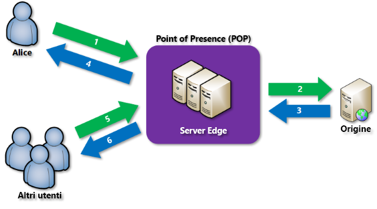

# Panoramica della rete per la distribuzione di contenuti di Azure

La rete per la distribuzione di contenuti (rete CDN) di Azure memorizza nella cache il contenuto Web statico in località strategiche per offrire la massima velocità effettiva per la distribuzione del contenuto agli utenti in tutta sicurezza. La rete CDN offre agli sviluppatori una soluzione globale per distribuire rapidamente contenuto con esigenze di larghezza di banda elevata tramite la memorizzazione di tale contenuto nella cache in nodi fisici ubicati in tutto il mondo. 

> [!NOTE]
> Questo articolo illustra la rete CDN di Azure, il relativo funzionamento e le funzionalità di ogni prodotto della rete CDN di Azure. Per ignorare queste informazioni e visualizzare un'esercitazione sulla creazione di un endpoint CDN, vedere [Introduzione alla rete CDN di Azure](cdn-create-new-endpoint.md). Per visualizzare un elenco aggiornato delle posizioni dei nodi della rete CDN, vedere [Località POP della rete per la distribuzione di contenuti (rete CDN) di Azure](cdn-pop-locations.md).

L'uso di una rete CDN per memorizzare nella cache gli asset dei siti Web offre diversi vantaggi, inclusi i seguenti:

* Prestazioni migliori e un'esperienza migliore per gli utenti finali, specialmente quando usano applicazioni in cui sono necessari più round trip per caricare il contenuto.
* Grande scalabilità per gestire al meglio un carico elevato immediato, ad esempio all'inizio di un evento per il lancio di un prodotto.
* Distribuzione di richieste utente e di contenuti direttamente dai server perimetrali, in modo da inviare una quantità minore di traffico all'origine.

## Funzionamento

1. Un utente (Alice) richiede un file, detto anche asset, usando un URL con un nome di dominio particolare, ad esempio `<endpointname>.azureedge.net`. Il servizio DNS instrada la richiesta alla località POP (Point of Presence) che offre le migliori prestazioni, in genere quella geograficamente più vicina all'utente.
2. Se nella cache dei server perimetrali del POP il file non è disponibile, verrà richiesto automaticamente all'origine.  L'origine può essere un'app Web di Azure, il servizio Cloud di Azure, un account di archiviazione di Azure o qualsiasi server Web accessibile pubblicamente.
3. L'origine restituisce il file al server perimetrale, comprese le intestazioni HTTP facoltative che descrivono la durata (TTL) del file.
4. Il server perimetrale memorizza il file nella cache e lo restituisce al richiedente originale (Alice).  Il file rimane nella cache del server perimetrale fino alla scadenza del valore TTL.  Se l'origine ha specificato un valore TTL, il valore predefinito è di sette giorni.
5. Altri utenti possono quindi richiedere lo stesso file usando lo stesso URL e anche essere indirizzati allo stesso POP.
6. Se il valore TTL per il file non è ancora scaduto, il server perimetrale restituisce il file dalla cache. Questo processo offre un'esperienza utente più veloce ed efficiente.

## Funzionalità della rete CDN di Azure
Per la rete CDN di Azure sono disponibili tre prodotti: **rete CDN Standard di Azure fornita da Akamai**, **rete CDN Standard di Azure fornita da Verizon** e **rete CDN Premium di Azure fornita da Verizon**.  La tabella seguente include l'elenco delle funzionalità disponibili con ogni prodotto.

|  | Standard Akamai | Standard Verizon | Premium Verizon |
| --- | --- | --- | --- |
| __Ottimizzazioni e funzionalità per le prestazioni__ |
| [Accelerazione sito dinamico](https://docs.microsoft.com/azure/cdn/cdn-dynamic-site-acceleration) | **&#x2713;**  | **&amp;#x2713;** | **&amp;#x2713;** |
| &nbsp;&nbsp;&nbsp;&nbsp;&nbsp;  [Accelerazione sito dinamico - Compressione di immagini adattiva](https://docs.microsoft.com/azure/cdn/cdn-dynamic-site-acceleration#adaptive-image-compression-akamai-only) | **&amp;#x2713;**  |  |  |
| &nbsp;&nbsp;&nbsp;&nbsp;&nbsp;[Accelerazione sito dinamico - Prelettura degli oggetti](https://docs.microsoft.com/azure/cdn/cdn-dynamic-site-acceleration#object-prefetch-akamai-only) | **&amp;#x2713;**  |  |  |
| [Ottimizzazione dello streaming video](https://docs.microsoft.com/azure/cdn/cdn-media-streaming-optimization) | **&amp;#x2713;**  | \* |  \* |
| [Ottimizzazione di file di grandi dimensioni](https://docs.microsoft.com/azure/cdn/cdn-large-file-optimization) | **&amp;#x2713;**  | \* |  \* |
| [Bilanciamento del carico del server globale](https://docs.microsoft.com/azure/traffic-manager/traffic-manager-load-balancing-azure) |**&#x2713;** |**&amp;#x2713;** |**&amp;#x2713;** |
| [Eliminazione veloce](cdn-purge-endpoint.md) |**&#x2713;** |**&amp;#x2713;** |**&amp;#x2713;** |
| [Precaricamento Asset](cdn-preload-endpoint.md) | |**&amp;#x2713;** |**&amp;#x2713;** |
| Impostazioni cache/intestazioni (con [regole di memorizzazione nella cache](cdn-caching-rules.md)) |**&amp;#x2713;** |**&amp;#x2713;** | |
| Impostazioni cache/intestazioni (con il [motore regole](cdn-rules-engine.md)) | | |**&amp;#x2713;** |
| [Memorizzazione nella cache della stringa di query](cdn-query-string.md) |**&#x2713;** |**&amp;#x2713;** |**&#x2713;** |
| IPv4/IPv6 dual stack |**&amp;#x2713;** |**&amp;#x2713;** |**&amp;#x2713;** |
| [Supporto HTTP/2](cdn-http2.md) |**&#x2713;** |**&amp;#x2713;** |**&amp;#x2713;** |
| __Sicurezza__ |
| Supporto per HTTPS con endpoint della rete CDN |**&#x2713;** |**&amp;#x2713;** |**&amp;#x2713;** |
| [HTTPS dominio personalizzato](cdn-custom-ssl.md) | |**&amp;#x2713;** |**&#x2713;** |
| [Supporto del nome di dominio personalizzato.](cdn-map-content-to-custom-domain.md) |**&#x2713;** |**&amp;#x2713;** |**&amp;#x2713;** |
| [Filtro geografico](cdn-restrict-access-by-country.md) |**&amp;#x2713;** |**&amp;#x2713;** |**&amp;#x2713;** |
| [Autenticazione tramite token](cdn-token-auth.md)|  |  |**&#x2713;**| 
| [Protezione DDoS](https://www.us-cert.gov/ncas/tips/ST04-015) |**&#x2713;** |**&amp;#x2713;** |**&amp;#x2713;** |
| __Analisi e report__ |
| [Log di diagnostica di Azure](cdn-azure-diagnostic-logs.md) | **&amp;#x2713;** |**&amp;#x2713;** |**&amp;#x2713;** |
| [Report principali da Verizon](cdn-analyze-usage-patterns.md) | |**&amp;#x2713;** |**&amp;#x2713;** |
| [Report personalizzati da Verizon](cdn-verizon-custom-reports.md) | |**&amp;#x2713;** |**&amp;#x2713;** |
| [Report HTTP avanzati](cdn-advanced-http-reports.md) | | |**&amp;#x2713;** |
| [Statistiche in tempo reale](cdn-real-time-stats.md) | | |**&amp;#x2713;** |
| [Prestazioni del nodo perimetrale](cdn-edge-performance.md) | | |**&amp;#x2713;** |
| [Avvisi in tempo reale](cdn-real-time-alerts.md) | | |**&amp;#x2713;** |
| __Semplicità d'uso__ |
| Semplice integrazione con i servizi di Azure, ad esempio [Archiviazione](cdn-create-a-storage-account-with-cdn.md), [Servizi cloud](cdn-cloud-service-with-cdn.md), [App Web](../app-service/app-service-web-tutorial-content-delivery-network.md) e [Servizi multimediali](../media-services/media-services-portal-manage-streaming-endpoints.md) |**&amp;#x2713;** |**&amp;#x2713;** |**&#x2713;** |
| Gestione tramite [API REST](https://msdn.microsoft.com/library/mt634456.aspx), [.NET](cdn-app-dev-net.md), [Node.js](cdn-app-dev-node.md) oppure [PowerShell](cdn-manage-powershell.md). |**&#x2713;** |**&amp;#x2713;** |**&#x2713;** |
| [Motore di distribuzione di contenuti personalizzabile, basato su regole](cdn-rules-engine.md) | | |**&amp;#x2713;** |
| Riscrittura/reindirizzamento URL (con il [motore regole](cdn-rules-engine.md)) | | |**&amp;#x2713;** |
| Regole per dispositivi mobili (con il [motore regole](cdn-rules-engine.md)) | | |**&#x2713;** |

\* Verizon supporta la distribuzione di file di grandi dimensioni e di file multimediali direttamente tramite la distribuzione Web generale.

> [!TIP]
> Per esaminare una funzionalità presente nella rete CDN di Azure, inviare  [Commenti e suggerimenti](https://feedback.azure.com/forums/169397-cdn) 
> 
> 

## Passaggi successivi
Per iniziare a usare la rete CDN, vedere [Introduzione alla rete CDN di Azure](cdn-create-new-endpoint.md).

I clienti esistenti della rete CDN possono ora gestire gli endpoint della rete CDN con il [portale di Microsoft Azure](https://portal.azure.com) o [PowerShell](cdn-manage-powershell.md).

Per informazioni sul funzionamento della rete CDN, guardare il [video della sessione di Build 2016](https://azure.microsoft.com/documentation/videos/build-2016-leveraging-the-new-azure-cdn-apis-to-build-wicked-fast-applications/).

Informazioni su come automatizzare la rete CDN di Azure con [.NET](cdn-app-dev-net.md) o [Node.js](cdn-app-dev-node.md).

Per informazioni sui prezzi, vedere [Prezzi della rete per la distribuzione di contenuti](https://azure.microsoft.com/pricing/details/cdn/).

