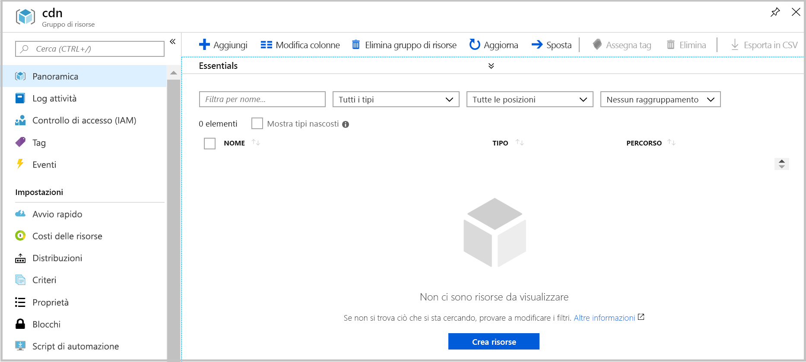

# <a name="quickstart-create-an-azure-cdn-profile-and-endpoint-using-resource-manager-template"></a>Guida introduttiva: Creare un profilo e un endpoint della rete CDN di Azure usando un modello di Resource Manager

In questo argomento di avvio rapido verrà distribuito un modello di Azure Resource Manager usando l'interfaccia della riga di comando. Il modello creato consentirà di distribuire un profilo e un endpoint della rete CDN per un'applicazione Web.
La procedura richiede circa dieci minuti.

[!INCLUDE [quickstarts-free-trial-note](../../includes/quickstarts-free-trial-note.md)]

## <a name="prequisites"></a>Prerequisiti

Ai fini di questo avvio rapido, è necessario avere un'applicazione Web da usare come origine. L'applicazione Web di esempio usata in questo argomento di avvio rapido è stata distribuita in https://cdndemo.azurewebsites.net

Per altre informazioni, vedere [Creare un'app Web HTML statica in Azure](https://docs.microsoft.com/azure/app-service/app-service-web-get-started-html).

## <a name="create-a-resource-group"></a>Creare un gruppo di risorse

Tutte le risorse devono essere distribuite nello stesso gruppo di risorse.

Creare il gruppo di risorse nella località selezionata. Questo esempio descrive la creazione di un gruppo di risorse denominato cdn nell'area Stati Uniti orientali.

```bash
az group create --name cdn --location eastus
```



## <a name="create-the-resource-manager-template"></a>Creare il modello di Azure Resource Manager

In questo passaggio verrà creato un file modello che distribuisce le risorse.

Anche se questo esempio illustra uno scenario di accelerazione di sito Web generale, esistono molte altre impostazioni che possono essere configurate. Queste impostazioni sono disponibili nelle informazioni di riferimento sui modelli di Azure Resource Manager. Vedere le informazioni di riferimento per il [profilo della rete CDN](https://docs.microsoft.com/azure/templates/microsoft.cdn/2017-10-12/profiles) e per l'[endpoint di tale profilo](https://docs.microsoft.com/azure/templates/microsoft.cdn/2017-10-12/profiles/endpoints).

Si noti che la rete CDN di Microsoft non supporta la modifica dell'elenco dei tipi di contenuto.

Salvare il modello come **resource-manager-cdn.json**.

```json
{
    "$schema": "https://schema.management.azure.com/schemas/2015-01-01/deploymentTemplate.json#",
    "contentVersion": "1.0.0.0",
    "parameters": {
        "cdnProfileSku": {
            "type": "string",
            "allowedValues": [
                "Standard_Microsoft",
                "Standard_Akamai",
                "Standard_Verizon",
                "Premium_Verizon"
            ]
        },
        "endpointOriginHostName": {
            "type": "string"
        }
    },
    "variables": {
        "profile": {
            "name": "[replace(toLower(parameters('cdnProfileSku')), '_', '-')]"
        },
        "endpoint": {
            "name": "[replace(toLower(parameters('endpointOriginHostName')), '.', '-')]",
            "originHostName": "[parameters('endpointOriginHostName')]"
        }
    },
    "resources": [
        {
            "type": "Microsoft.Cdn/profiles",
            "apiVersion": "2017-10-12",
            "location": "[resourceGroup().location]",
            "name": "[variables('profile').name]",
            "sku": {
                "name": "[parameters('cdnProfileSku')]"
            }
        },
        {
            "dependsOn": [
                "[resourceId('Microsoft.Cdn/profiles', variables('profile').name)]"
            ],
            "type": "Microsoft.Cdn/profiles/endpoints",
            "apiVersion": "2017-10-12",
            "location": "[resourceGroup().location]",
            "name": "[concat(variables('profile').name, '/', variables('endpoint').name)]",
            "properties": {
                "hostName": "[concat(variables('endpoint').name, '.azureedge.net')]",
                "originHostHeader": "[variables('endpoint').originHostName]",
                "isHttpAllowed": true,
                "isHttpsAllowed": true,
                "queryStringCachingBehavior": "IgnoreQueryString",
                "origins": [
                    {
                        "name": "[replace(variables('endpoint').originHostName, '.', '-')]",
                        "properties": {
                            "hostName": "[variables('endpoint').originHostName]",
                            "httpPort": 80,
                            "httpsPort": 443
                        }
                    }
                ],
                "contentTypesToCompress": [
                    "application/eot",
                    "application/font",
                    "application/font-sfnt",
                    "application/javascript",
                    "application/json",
                    "application/opentype",
                    "application/otf",
                    "application/pkcs7-mime",
                    "application/truetype",
                    "application/ttf",
                    "application/vnd.ms-fontobject",
                    "application/xhtml+xml",
                    "application/xml",
                    "application/xml+rss",
                    "application/x-font-opentype",
                    "application/x-font-truetype",
                    "application/x-font-ttf",
                    "application/x-httpd-cgi",
                    "application/x-javascript",
                    "application/x-mpegurl",
                    "application/x-opentype",
                    "application/x-otf",
                    "application/x-perl",
                    "application/x-ttf",
                    "font/eot",
                    "font/ttf",
                    "font/otf",
                    "font/opentype",
                    "image/svg+xml",
                    "text/css",
                    "text/csv",
                    "text/html",
                    "text/javascript",
                    "text/js",
                    "text/plain",
                    "text/richtext",
                    "text/tab-separated-values",
                    "text/xml",
                    "text/x-script",
                    "text/x-component",
                    "text/x-java-source"
                ],
                "isCompressionEnabled": true,
                "optimizationType": "GeneralWebDelivery"
            }
        }
    ],
    "outputs": {
        "cdnUrl": {
            "type": "string",
            "value": "[concat('https://', variables('endpoint').name, '.azureedge.net')]"
        }
    }
}
```

## <a name="create-the-resources"></a>Creare le risorse

Distribuire il modello tramite l'interfaccia della riga di comando di Azure. Verranno richiesti due input:

**cdnProfileSku**: il provider della rete CDN che si vuole usare. Le opzioni sono:

* Standard_Microsoft
* Standard_Akamai
* Standard_Verizon
* Premium_Verizon

**endpointOriginHostName**: l'endpoint che verrà gestito tramite la rete CDN, ad esempio cdndemo.azurewebsites.net.

```bash
az group deployment create --resource-group cdn --template-file arm-cdn.json
```


## <a name="view-the-cdn-profile"></a>Visualizzare il profilo della rete CDN

```bash
az cdn profile list --resource-group cdn -o table
```


## <a name="view-the-cdn-endpoint-for-the-profile-standard-microsoft"></a>Visualizzare l'endpoint della rete CDN per il profilo standard-microsoft

```bash
az cdn endpoint list --profile-name standard-microsoft --resource-group cdn -o table
```


Usare i dati specificati per HostName per visualizzare il contenuto. Accedere ad esempio a https://cdndemo-azurewebsites-net.azureedge.net usando un browser.

## <a name="clean-up"></a>Eseguire la pulizia

L'eliminazione del gruppo di risorse comporterà la rimozione automatica di tutte le risorse che sono state distribuite in tale gruppo.

```bash
az group delete --name cdn
```


## <a name="references"></a>Riferimenti

* Profilo della rete CDN: [Azure Resource Manager Template Reference](https://docs.microsoft.com/azure/templates/microsoft.cdn/2017-10-12/profiles) (Informazioni di riferimento sui modelli di Azure Resource Manager)
* Endpoint della rete CDN: [Azure Resource Manager Template Reference Documentation](https://docs.microsoft.com/azure/templates/microsoft.cdn/2017-10-12/profiles/endpoints) (Documentazione di riferimento sui modelli di Azure Resource Manager)

## <a name="next-steps"></a>Passaggi successivi

Per informazioni sull'aggiunta di un dominio personalizzato all'endpoint della rete CDN, vedere l'esercitazione seguente:

> [!div class="nextstepaction"]
> [Esercitazione: Aggiungere un dominio personalizzato all'endpoint della rete CDN di Azure](cdn-map-content-to-custom-domain.md)
