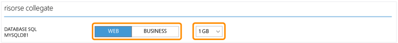

<properties linkid="manage-services-how-to-scale-a-cloud-service" urlDisplayName="How to scale" pageTitle="How to scale a cloud service - Azure" metaKeywords="Azure link resource, scaling cloud service" description="Learn how to scale a cloud service and linked resources in Azure." metaCanonical="" services="cloud-services" documentationCenter="" title="How to Scale an Application" authors="davidmu" solutions="" manager="jeffreyg" editor="mattshel" />

Come scalare un'applicazione
============================

[WACOM.INCLUDE [disclaimer](../includes/disclaimer.md)]

Nella pagina Scale del portale di gestione di Azure è possibile scalare manualmente l'applicazione o impostare parametri per la scalabilità automatica. È possibile scalare le applicazioni che eseguono ruoli Web, ruoli di lavoro o macchine virtuali. Per scalare un'applicazione che esegue istanze di ruoli Web o ruoli di lavoro, vengono aggiunte o rimosse istanze dei ruoli per supportare il carico di lavoro.

Quando si scala un'applicazione che esegue macchine virtuali, non vengono create o eliminate macchine ma vengono attivate o disattivate macchine da un set di disponibilità di macchine create in precedenza. È possibile specificare la scalabilità in base a una percentuale media di utilizzo della CPU o al numero di messaggi in una coda.

Prima di configurare la scalabilità per l'applicazione, tenere presente quanto segue:

-   Le macchine virtuali create devono essere aggiunte a un set di disponibilità per scalare un'applicazione che le utilizza. Le macchine virtuali aggiunte possono essere inizialmente attivate o disattivate, ma verranno attivate in caso di aumento e disattivate in caso di riduzione del numero di istanze. Per ulteriori informazioni sulle macchine virtuali e sui set di disponibilità, vedere [Gestione della disponibilità delle macchine virtuali](http://www.windowsazure.com/it-it/manage/windows/common-tasks/manage-vm-availability/).
-   La scalabilità è influenzata dall'utilizzo di core. Le istanze del ruolo o le macchine virtuali più ampie utilizzano più core. Un'applicazione può essere scalata solo entro i limiti di core previsti dalla sottoscrizione. Ad esempio, se la sottoscrizione prevede al massimo venti core e si esegue un'applicazione con due macchine virtuali di medie dimensioni (per un totale di quattro core), l'aumento di istanze di altre distribuzioni del servizio cloud nella sottoscrizione è limitata a sedici core. Tutte le macchine virtuali in un set di disponibilità utilizzate per scalare un'applicazione devono avere le stesse dimensioni. Per ulteriori informazioni sull'utilizzo di core e sulle dimensioni delle macchine, vedere [Dimensioni delle macchine virtuali e dei servizi cloud per Azure](http://msdn.microsoft.com/it-it/library/dn197896.aspx).
-   È necessario creare una coda e associarla a un ruolo o set di disponibilità prima di scalare un'applicazione in base a una soglia di messaggi. Per ulteriori informazioni, vedere [Come utilizzare il servizio di archiviazione di accodamento](http://www.windowsazure.com/it-it/develop/net/how-to-guides/queue-service).
-   È possibile scalare le risorse collegate al servizio cloud. Per ulteriori informazioni sul collegamento di risorse, vedere [Procedura: Collegare una risorsa a un servizio cloud](http://www.windowsazure.com/it-it/manage/services/cloud-services/how-to-manage-a-cloud-service/#linkresources).
-   Per abilitare la disponibilità elevata dell'applicazione, è necessario accertarsi che sia distribuita con due o più istanze del ruolo o macchine virtuali. Per ulteriori informazioni, vedere [Contratti di servizio](https://www.windowsazure.com/en-us/support/legal/sla/).

È possibile eseguire le seguenti azioni di scalabilità per un servizio cloud:

-   [Scalare manualmente un'applicazione che esegue ruoli Web o ruoli di lavoro](#manualscale)
-   [Scalare automaticamente un'applicazione che esegue ruoli Web, ruoli di lavoro o macchine virtuali](#autoscale)
-   [Scalare risorse collegate](#scalelink)
-   [Pianificare la scalabilità dell'applicazione](#schedule)

Scalare manualmente un'applicazione che esegue ruoli Web o ruoli di lavoro
--------------------------------------------------------------------------

Nella pagina Scale è possibile aumentare o diminuire manualmente il numero delle istanze in esecuzione in un servizio di cloud.

1.  Nel [portale di gestione](https://manage.windowsazure.com/) fare clic su **Cloud Services** e quindi sul nome del servizio cloud per aprire il dashboard.

2.  Fare clic su **Scale**. La scalabilità automatica è disattivata per impostazione predefinita per tutti i ruoli, ovvero è possibile modificare manualmente il numero di istanze utilizzate dall'applicazione.

    

3.  In ogni ruolo nel servizio cloud è presente un dispositivo di scorrimento che consente di modificare il numero di istanze da utilizzare. Per aggiungere un'istanza del ruolo, trascinare la barra verso destra. Per rimuovere un'istanza, trascinare la barra verso sinistra.

    

    È possibile aumentare il numero di istanze utilizzate solo se è disponibile il numero di core appropriato per supportare le istanze. I colori del dispositivo di scorrimento rappresentano i core utilizzati e disponibili nella sottoscrizione:

    -   Il blu rappresenta i core utilizzati dal ruolo selezionato
    -   Il grigio scuro rappresenta i core utilizzati da tutti i ruoli e da tutte le macchine virtuali nella sottoscrizione
    -   Il grigio chiaro rappresenta i core disponibili per l'utilizzo per la scalabilità
    -   Il rosa rappresenta una modifica apportata che non è stata salvata

4.  Fare clic su **Save**. Verranno aggiunte o rimosse istanze del ruolo in base alle selezioni effettuate.

Scalare automaticamente un'applicazione che esegue ruoli Web, ruoli di lavoro o macchine virtuali
-------------------------------------------------------------------------------------------------

Nella pagina Scale è possibile configurare il servizio cloud in modo da aumentare o ridurre automaticamente il numero di istanze o macchine virtuali utilizzate dall'applicazione. La scalabilità può essere configurata in base ai parametri seguenti:

-   [Utilizzo medio della CPU](#averagecpu): se la percentuale media di utilizzo della CPU sale o scende oltre le soglie specificate, vengono create o eliminate istanze del ruolo o vengono attivate o disattivate macchine virtuali da un set di disponibilità.
-   [Messaggi in coda](#queuemessages): se il numero di messaggi in una coda sale o scende oltre una soglia specificata, vengono create o eliminate istanze del ruolo o vengono attivate o disattivate macchine virtuali da un set di disponibilità.

### Utilizzo medio della CPU

1.  Nel [portale di gestione](https://manage.windowsazure.com/) fare clic su **Cloud Services** e quindi sul nome del servizio cloud per aprire il dashboard.
2.  Fare clic su **Scale**.
3.  Scorrere fino alla sezione relativa al ruolo o al set di disponibilità, quindi fare clic su **CPU**. In questo modo viene abilitata la scalabilità automatica dell'applicazione in base alla percentuale media di utilizzo delle risorse di CPU.

    

4.  Per ogni ruolo o set di disponibilità è presente un dispositivo di scorrimento che consente di modificare il numero di istanze che possono essere utilizzate. Per impostare il numero massimo di istanze utilizzabili, trascinare verso destra la barra di destra. Per impostare il numero minimo di istanze utilizzabili, trascinare verso sinistra la barra di sinistra.

    **Nota:** Il valore **Instance** nella pagina Scale rappresenta un'istanza del ruolo o un'istanza di una macchina virtuale.

    

    Il numero massimo di istanze è limitato dai core disponibili nella sottoscrizione. I colori del dispositivo di scorrimento rappresentano i core utilizzati e disponibili nella sottoscrizione:

    -   Il blu rappresenta il numero massimo di core che il ruolo può utilizzare.
    -   Il grigio scuro rappresenta i core utilizzati da tutti i ruoli e da tutte le macchine virtuali nella sottoscrizione. Quando questo valore si sovrappone ai core utilizzati dal ruolo, il colore diventa blu scuro.
    -   Il grigio chiaro rappresenta i core disponibili per l'utilizzo per la scalabilità.
    -   Il rosa rappresenta una modifica apportata che non è stata salvata.

5.  Tramite un dispositivo di scorrimento è possibile specificare l'intervallo della percentuale media di utilizzo della CPU. Quando la percentuale media di utilizzo della CPU supera l'impostazione massima, vengono create più istanze del ruolo o vengono attivate più macchine virtuali. Quando la percentuale media di utilizzo della CPU scende al di sotto dell'impostazione minima, vengono eliminate istanze del ruolo o vengono disattivate macchine virtuali. Per impostare il valore massimo di percentuale media di utilizzo della CPU, trascinare verso destra la barra di destra. Per impostare il valore minimo di percentuale media di utilizzo della CPU, trascinare verso sinistra la barra di sinistra.

    

6.  È possibile specificare il numero di istanze da aggiungere o attivare ogni volta che viene aumentato il numero di istanze dell'applicazione. Per aumentare il numero di istanze create o attivate quando viene aumentato il numero di istanze dell'applicazione, trascinare la barra verso destra. Per ridurre il numero, trascinare la barra verso sinistra.

    

7.  Impostare il numero di minuti di attesa tra l'ultima azione di ridimensionamento e la successiva azione di aumento del numero di istanze. L'ultima azione di ridimensionamento può essere un aumento o una riduzione del numero di istanze.

    

    Nel calcolo della percentuale media di utilizzo della CPU vengono incluse tutte le istanze e la media si basa sull'utilizzo nell'ora precedente. A seconda del numero di istanze utilizzate dall'applicazione, l'azione di ridimensionamento può richiedere più tempo rispetto al tempo di attesa specificato, se quest'ultimo è impostato su un valore molto basso. Il tempo minimo tra le azioni di ridimensionamento è pari a cinque minuti. Le azioni di ridimensionamento non possono avere luogo se è in corso la transizione di una delle istanze.

8.  È inoltre possibile specificare il numero di istanze da eliminare o disattivare ogni volta che viene ridotto il numero di istanze dell'applicazione. Per aumentare il numero di istanze eliminate o disattivate quando viene ridotto il numero di istanze dell'applicazione, trascinare la barra verso destra. Per ridurre il numero, trascinare la barra verso sinistra.

    

    Se l'applicazione può presentare improvvisi incrementi di utilizzo della CPU, assicurarsi di disporre di un numero minimo di istanze sufficiente per gestirli.

9.  Impostare il numero di minuti di attesa tra l'ultima azione di ridimensionamento e la successiva azione di riduzione del numero di istanze. L'ultima azione di ridimensionamento può essere un aumento o una riduzione del numero di istanze.

    

10. Fare clic su **Save**. Per completare l'azione di ridimensionamento possono essere necessari fino a cinque minuti.

### Messaggi in coda

1.  Nel [portale di gestione](https://manage.windowsazure.com/) fare clic su **Cloud Services** e quindi sul nome del servizio cloud per aprire il dashboard.
2.  Fare clic su **Scale**.
3.  Scorrere fino alla sezione relativa al ruolo o al set di disponibilità, quindi fare clic su **Queue**. In questo modo viene abilitata la scalabilità automatica dell'applicazione in base a un determinato numero di messaggi in coda.

    

4.  Per ogni ruolo o set di disponibilità nel servizio cloud è presente un dispositivo di scorrimento che consente di modificare il numero di istanze che possono essere utilizzate. Per impostare il numero massimo di istanze utilizzabili, trascinare verso destra la barra di destra. Per impostare il numero minimo di istanze utilizzabili, trascinare verso sinistra la barra di sinistra.

    

    **Nota:** Il valore **Instance** nella pagina Scale rappresenta un'istanza del ruolo o un'istanza di una macchina virtuale.

    Il numero massimo di istanze è limitato dai core disponibili nella sottoscrizione. I colori del dispositivo di scorrimento rappresentano i core utilizzati e disponibili nella sottoscrizione: 
	- Il blu rappresenta il numero massimo di core che il ruolo può utilizzare. 
	- Il grigio scuro rappresenta i core utilizzati da tutti i ruoli e da tutte le macchine virtuali nella sottoscrizione. Quando questo valore si sovrappone ai core utilizzati dal ruolo, il colore diventa blu scuro. 
	- Il grigio chiaro rappresenta i core disponibili per l'utilizzo per la scalabilità. 
	- Il rosa rappresenta una modifica apportata che non è stata salvata.

5.  Selezionare l'account di archiviazione associato alla coda che si desidera utilizzare.

    

6.  Selezionare la coda.

    

7.  Specificare il numero di messaggi che si prevede che ogni istanza supporterà. Le istanze verranno scalate in base al numero totale di messaggi diviso per il numero di messaggi definito per ogni macchina.

    

8.  È possibile specificare il numero di istanze da aggiungere o attivare ogni volta che viene aumentato il numero di istanze dell'applicazione. Per aumentare il numero di istanze aggiunte o attivate quando viene aumentato il numero di istanze dell'applicazione, trascinare la barra verso destra. Per ridurre il numero, trascinare la barra verso sinistra.

    

9.  Impostare il numero di minuti di attesa tra l'ultima azione di ridimensionamento e la successiva azione di aumento del numero di istanze. L'ultima azione di ridimensionamento può essere un aumento o una riduzione del numero di istanze.

    

    Il tempo minimo tra le azioni di ridimensionamento è pari a cinque minuti. Le azioni di ridimensionamento non possono avere luogo se è in corso la transizione di una delle istanze.

10. È inoltre possibile specificare il numero di istanze da eliminare o non utilizzare ogni volta che viene ridotto il numero di istanze dell'applicazione. Per specificare l'incremento di scalabilità viene utilizzato un dispositivo di scorrimento. Per aumentare il numero di istanze eliminate o inutilizzate quando viene ridotto il numero di istanze dell'applicazione, trascinare la barra verso destra. Per ridurre il numero, trascinare la barra verso sinistra.

    

11. Impostare il numero di minuti di attesa tra l'ultima azione di ridimensionamento e la successiva azione di riduzione del numero di istanze. L'ultima azione di ridimensionamento può essere un aumento o una riduzione del numero di istanze.

    

12. Fare clic su **Save**. Per completare l'azione di ridimensionamento possono essere necessari fino a cinque minuti.

Scalare risorse collegate
-------------------------

Quando si scala un ruolo, spesso risulta utile scalare anche il database utilizzato dall'applicazione. Se si collega il database al servizio cloud, nella pagina Scale viene modificata l'edizione del database SQL e viene ridimensionato il database.

1.  Nel [portale di gestione](https://manage.windowsazure.com/) fare clic su **Cloud Services** e quindi sul nome del servizio cloud per aprire il dashboard.
2.  Fare clic su **Scale**.
3.  Nella sezione Linked Resources selezionare l'edizione da utilizzare per il database.

    

4.  Selezionare le dimensioni del database.
5.  Fare clic su **Save** per aggiornare le risorse collegate.

Pianificare la scalabilità dell'applicazione
--------------------------------------------

È possibile pianificare la scalabilità automatica dell'applicazione configurando pianificazioni per orari diversi. Per la scalabilità automatica sono disponibili le opzioni seguenti:

-   **No schedule**: opzione predefinita che consente di scalare automaticamente l'applicazione sempre nello stesso modo.

-   **Day and night**: questa opzione consente di specificare la scalabilità per determinati orari del giorno e della notte.

**Nota:** Le pianificazioni non sono attualmente disponibili per le applicazioni che utilizzano Macchine virtuali.

1.  Nel [portale di gestione](https://manage.windowsazure.com/) fare clic su **Cloud Services** e quindi sul nome del servizio cloud per aprire il dashboard.
2.  Fare clic su **Scale**.
3.  Nella pagina Scale fare clic su **set up schedule times**.

    

4.  Selezionare il tipo di pianificazione della scalabilità che si desidera impostare.

5.  Specificare gli orari di inizio e fine del giorno e impostare il fuso orario. Per la pianificazione diurna e notturna, gli orari rappresentano l'inizio e la fine del giorno e il tempo rimanente rappresenta la notte.

6.  Fare clic sul segno di spunta nella parte inferiore della pagina per salvare le pianificazioni.

7.  Dopo il salvataggio, le pianificazioni verranno visualizzate nell'elenco. È possibile selezionare la pianificazione oraria da utilizzare, quindi modificare le impostazioni di scalabilità. Le impostazioni di scalabilità verranno applicate solo durante la pianificazione selezionata. Per modificare le pianificazioni, fare clic su **set up schedule times**.

