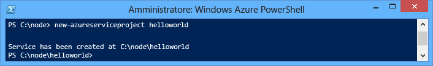
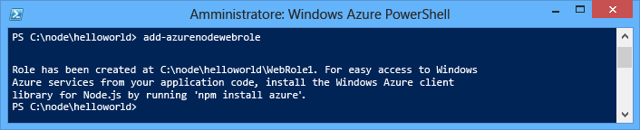
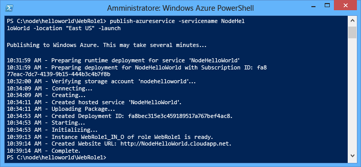
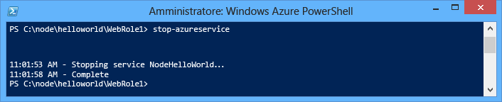
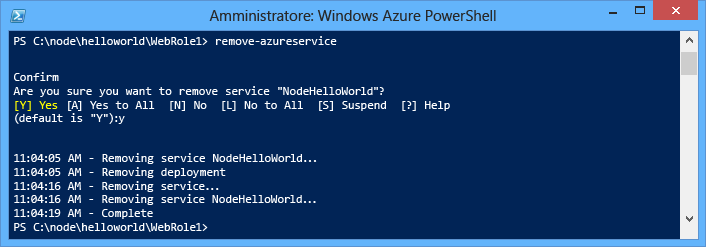

<properties
	pageTitle="Guida introduttiva di Node.js - Esercitazione di Azure"
	description="Informazioni su come creare una semplice applicazione Web Node.js e distribuirla in un servizio cloud di Azure."
	services="cloud-services"
	documentationCenter="nodejs"
	authors="MikeWasson"
	manager="wpickett"
	editor=""/>

<tags
	ms.service="cloud-services"
	ms.workload="tbd"
	ms.tgt_pltfrm="na" 
	ms.devlang="nodejs"
	ms.topic="get-started-article"
	ms.date="06/01/2015"
	ms.author="mwasson"/>

# Creazione e distribuzione di un'applicazione Node.js a un servizio cloud di Azure

> [AZURE.SELECTOR]
- [Node.js](cloud-services-nodejs-develop-deploy-app.md)
- [.NET](cloud-services-dotnet-get-started.md)

Questa esercitazione illustra come creare una semplice applicazione Node.js in esecuzione in un servizio cloud di Azure. Servizi cloud è costituito da blocchi predefiniti di applicazioni cloud scalabili in Azure. Consentono la separazione e la gestione indipendente e la scalabilità dei componenti front-end e back-end dell'applicazione. Servizi cloud offre una potente macchina virtuale dedicata per ospitare ogni ruolo in modo affidabile.

Per altre informazioni su Servizi cloud e sulle differenze rispetto ai servizi Siti Web e Macchine virtuali di Azure, vedere [Confronto tra siti Web, servizi cloud e macchine virtuali](../choose-web-site-cloud-service-vm.md).

>[AZURE.TIP]Come creare un semplice sito Web Se si intende creare un semplice sito Web front-end, è possibile <a href="/documentation/articles/web-sites-nodejs-develop-deploy-mac/">usare un’app Web semplificata.</a> È possibile procedere all'aggiornamento a un Servizio cloud con facilità, in base alla crescita dell’app Web e all'insorgere di nuove esigenze.

Questa esercitazione consente di creare una semplice applicazione Web ospitata in un ruolo Web. Si utilizzerà l'emulatore di calcolo per testare in locale l'applicazione, che verrà quindi distribuita con gli strumenti della riga di comando di PowerShell.

L'applicazione è una semplice applicazione "hello world":

## Prerequisiti

> [AZURE.NOTE]Questa esercitazione usa Azure PowerShell, che richiede Windows.

- Installare e configurare [Azure PowerShell](../install-configure-powershell.md).
- Scaricare e installare [Azure SDK per .NET 2.5](http://go.microsoft.com/fwlink/?linkid=518091). Nel programma di installazione, selezionare:
    - MicrosoftAzureAuthoringTools
    - MicrosoftAzureComputeEmulator

## Creare un progetto di Servizi cloud di Azure

Per creare un nuovo progetto di Servizi cloud di Azure, oltre allo scaffolding di Node.js è necessario eseguire queste operazioni:

1. Eseguire **Azure PowerShell** come amministratore. Dal **menu Start** o dalla **schermata Start** cercare **Azure PowerShell**.

2.  Immettere il seguente cmdlet di PowerShell per creare il progetto:

        New-AzureServiceProject helloworld

	

	Il cmdlet **New-AzureServiceProject** genera una struttura di base per la pubblicazione di un'applicazione Node.js in un servizio cloud. Contiene i file di configurazione necessari per la pubblicazione in Azure. Il cmdlet modifica inoltre la directory di lavoro nella directory per il servizio.

	Il cmdlet crea i seguenti file:

	-   **ServiceConfiguration.Cloud.cscfg**, **ServiceConfiguration.Local.cscfg** e **ServiceDefinition.csdef** sono file specifici di Azure, necessari per la pubblicazione dell'applicazione. Per altre informazioni, vedere [Creazione di un servizio ospitato per Azure][].

	-   **deploymentSettings.json**: archivia le impostazioni locali utilizzate dai cmdlet di distribuzione di Azure PowerShell.

4.  Immettere il seguente comando per aggiungere un nuovo ruolo Web:

        Add-AzureNodeWebRole

	

	Il cmdlet **Add-AzureNodeWebRole** crea un'applicazione Node.js di base. Modifica inoltre i file con estensione **csfg** e **csdef** per aggiungere voci di configurazione per il nuovo ruolo.

	> [AZURE.NOTE]Se non si specifica un nome di ruolo, viene usato un nome predefinito. È possibile specificare un nome come primo parametro di cmdlet: `Add-AzureNodeWebRole MyRole`

L'app Node.js è definita nel file **server.js**, contenuto nella directory per il ruolo Web (**WebRole1** per impostazione predefinita). Il codice è il seguente:

	var http = require('http');
	var port = process.env.port || 1337;
	http.createServer(function (req, res) {
	    res.writeHead(200, { 'Content-Type': 'text/plain' });
	    res.end('Hello World\n');
	}).listen(port);

Questo codice è essenzialmente lo stesso dell'esempio "Hello World" nel sito Web [nodejs.org][], si differenzia solo perché usa il numero di porta assegnato dall'ambiente cloud.

## Distribuire l'applicazione in Azure

	[AZURE.INCLUDE [create-account-note](../../includes/create-account-note.md)]

### Scaricare le impostazioni di pubblicazione di Azure

Per distribuire l'applicazione in Azure, è necessario innanzitutto scaricare le impostazioni di pubblicazione per la sottoscrizione Azure.

1.  Eseguire questo cmdlet di Azure PowerShell:

        Get-AzurePublishSettingsFile

	Il browser verrà così usato per passare alla pagina di download delle impostazioni di pubblicazione. È possibile che venga richiesto di effettuare l'accesso con un account Microsoft. In tal caso, utilizzare l'account associato alla sottoscrizione Azure.

	Salvare il profilo scaricato in un percorso di file facilmente accessibile.

2.  Eseguire questo cmdlet per importare il profilo di pubblicazione che è stato scaricato:

        Import-AzurePublishSettingsFile [path to file]

	> [AZURE.NOTE]Dopo aver importato le impostazioni di pubblicazione, è consigliabile eliminare il file con estensione publishsettings, perché contiene informazioni che potrebbero consentire l'accesso all'account.

### Pubblicare l'applicazione

Per pubblicare l'applicazione, eseguire il cmdlet **Publish-AzureServiceProject** come indicato di seguito:

    Publish-AzureServiceProject -ServiceName NodeHelloWorld -Location "East US" -Launch

- **-ServiceName** specifica il nome per la distribuzione. Deve essere un nome univoco, in caso contrario il processo di pubblicazione avrà esito negativo.

- **-Location** specifica il datacenter su cui viene ospitata l'applicazione. Per visualizzare un elenco dei datacenter disponibili, usare il cmdlet **Get-AzureLocation**.

- **-Launch** apre una finestra del browser e passa al servizio ospitato dopo che è stata completata la distribuzione.

Al termine della pubblicazione, verrà visualizzata una risposta simile alla seguente:

> [AZURE.NOTE]Possono essere necessari alcuni minuti per la distribuzione dell'applicazione e prima che questa sia disponibile dopo la prima pubblicazione.

Al termine della distribuzione, verrà visualizzata una finestra del browser che consente di passare al servizio cloud.

L'applicazione è in esecuzione su Azure.

Il cmdlet **Publish-AzureServiceProject** esegue le operazioni seguenti:

1.  Crea un pacchetto da distribuire. Il pacchetto contiene tutti i file della cartella dell'applicazione.

2.  Crea un nuovo **account di archiviazione** nel caso non ne esista uno. L'account di archiviazione di Azure viene utilizzato per archiviare il pacchetto dell'applicazione durante la distribuzione. L'account di archiviazione può essere eliminato dopo il completamento della distribuzione.

3.  Crea un nuovo **servizio cloud** nel caso in cui non ne esista già uno. Un **servizio cloud** è il contenitore nel quale l'applicazione è ospitata quando viene distribuita in Azure. Per altre informazioni, vedere [Creazione di un servizio ospitato per Azure][].

4.  Pubblica il pacchetto di distribuzione in Azure.

## Arrestare ed eliminare l'applicazione

Dopo aver distribuito l'applicazione, è possibile disabilitarla per evitare costi aggiuntivi. Azure addebita le istanze del ruolo Web al consumo, in base all'utilizzo di tempo del server su base oraria. Un'applicazione distribuita utilizza tempo del server anche se le istanze non sono in esecuzione e sono in stato arrestato.

1.  Nella finestra di Windows PowerShell arrestare la distribuzione del servizio creato nella sezione precedente con il cmdlet seguente:

        Stop-AzureService

	L'arresto del servizio può richiedere diversi minuti. Dopo l'arresto del servizio, viene visualizzato un messaggio di conferma dell'arresto.

	

2.  Per eliminare il servizio, chiamare il cmdlet seguente:

        Remove-AzureService

	Quando richiesto, immettere **Y** per eliminare il servizio.

	L'eliminazione del servizio può richiedere diversi minuti. Al termine dell'eliminazione del servizio, verrà visualizzato un messaggio di conferma dell'eliminazione.

	

	> [AZURE.NOTE]L'eliminazione del servizio non comporta l'eliminazione dell'account di archiviazione creato quando il servizio è stato pubblicato e lo spazio di archiviazione usato continuerà a essere addebitato. Per ulteriori informazioni sull'eliminazione di un account di archiviazione, vedere [Come eliminare un account di archiviazione da una sottoscrizione Azure](http://msdn.microsoft.com/library/windowsazure/hh531562.aspx).

[The Windows Start menu with the Azure SDK Node.js entry expanded]: ./media/cloud-services-nodejs-develop-deploy-app/azure-powershell-menu.png
[mkdir]: ./media/cloud-services-nodejs-develop-deploy-app/getting-started-6.png
[nodejs.org]: http://nodejs.org/
[A directory listing of the helloworld folder.]: ./media/cloud-services-nodejs-develop-deploy-app/getting-started-7.png
[Creazione di un servizio ospitato per Azure]: http://msdn.microsoft.com/library/windowsazure/jj155995.aspx
[A directory listing of the WebRole1 folder]: ./media/cloud-services-nodejs-develop-deploy-app/getting-started-8.png
[The menu displayed when right-clicking the Azure emulator from the task bar.]: ./media/cloud-services-nodejs-develop-deploy-app/getting-started-11.png
[A browser window displaying http://www.windowsazure.com/ with the Free Trial link highlighted]: ./media/cloud-services-nodejs-develop-deploy-app/getting-started-12.png
[A browser window displaying the liveID sign in page]: ./media/cloud-services-nodejs-develop-deploy-app/getting-started-13.png
[Internet Explorer displaying the save as dialog for the publishSettings file.]: ./media/cloud-services-nodejs-develop-deploy-app/getting-started-14.png

[The full status output of the Publish-AzureService command]: ./media/cloud-services-nodejs-develop-deploy-app/node20.png
[How to Delete a Storage Account from an Azure Subscription]: https://www.windowsazure.com/manage/services/storage/how-to-manage-a-storage-account/
[powershell-menu]: ./media/cloud-services-nodejs-develop-deploy-app/azure-powershell-start.png
 

<!---HONumber=July15_HO3-->