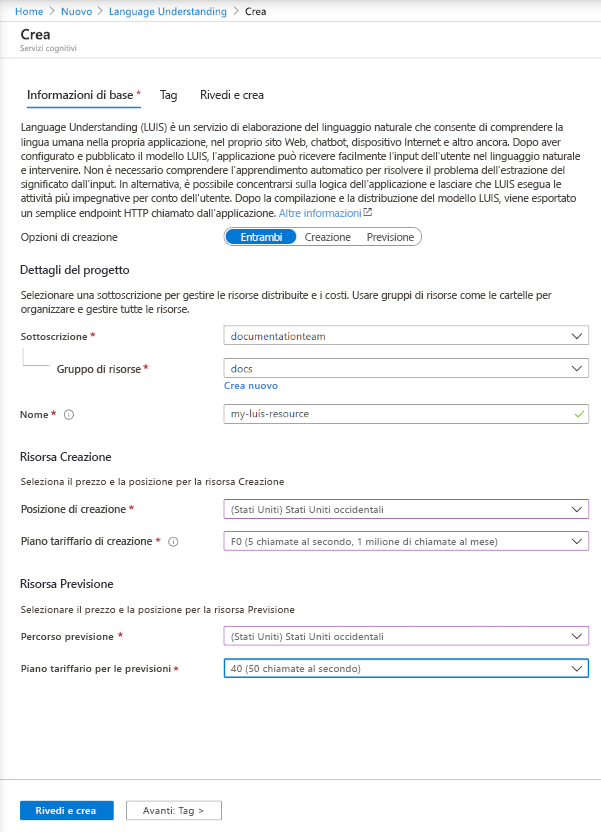

## Creare risorse LUIS nel portale di Azure

1. Seguire [questo collegamento](https://ms.portal.azure.com/#create/Microsoft.CognitiveServicesLUISAllInOne) per iniziare a creare risorse LUIS nel portale di Azure.

1. Immettere tutte le impostazioni richieste:

    |Nome|Scopo|
    |--|--|
    |Nome sottoscrizione| La sottoscrizione a cui verrà fatturata la risorsa.|
    |Resource group| Il nome di un gruppo di risorse personalizzato scelto o creato. I gruppi di risorse consentono di raggruppare le risorse di Azure per l'accesso e la gestione.|
    |Nome| Un nome personalizzato scelto e usato come sottodominio personalizzato per le query sugli endpoint di creazione e previsione.|
    |Posizione di creazione|L'area associata al modello.|
    |Piano tariffario di creazione|Il piano tariffario determina il numero massimo di transazioni al secondo e al mese.|
    |Posizione di runtime|L'area associata al runtime dell'endpoint di previsione pubblicato.|
    |Piano tariffario per il runtime|Il piano tariffario determina il numero massimo di transazioni al secondo e al mese.|

    > [!div class="mx-imgBorder"]
    > 

1. Fare clic su **Rivedi e crea** e attendere che venga creata la risorsa.
1. Dopo aver creato entrambe le risorse, ancora nella portale di Azure selezionare la nuova risorsa di creazione, quindi **Avvio rapido** per ottenere l'**URL** e la **chiave** dell'endpoint di creazione per la creazione a livello di codice.

> [!TIP]
> Per usare le risorse, [assegnarle](../luis-how-to-azure-subscription.md#assign-an-authoring-resource-in-the-luis-portal-for-all-apps) nel portale LUIS.