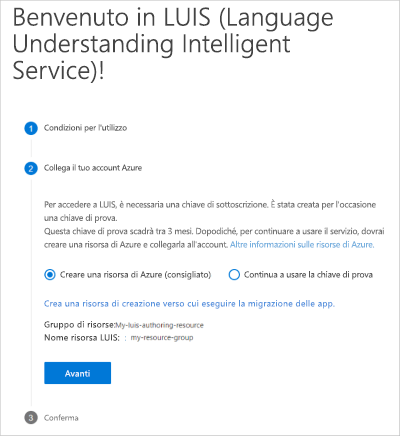
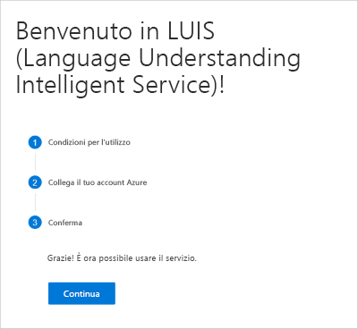

## Accedere al portale LUIS

Un nuovo utente di LUIS deve seguire questa procedura:

1. Accedere al [portale LUIS](https://www.luis.ai), selezionare il paese o l'area geografica e accettare le condizioni per l'utilizzo. Se invece si visualizza **App personali**, significa che esiste già una risorsa LUIS ed è necessario procedere alla creazione di un'app. Per le aree supportate, vedere [Creazione e pubblicazione di aree e chiavi associate](https://docs.microsoft.com/azure/cognitive-services/luis/luis-reference-regions).

1. Selezionare **Create Azure resource** (Crea risorsa di Azure) e quindi **Create an authoring resource to migrate your apps to** (Crea una risorsa di creazione in cui eseguire la migrazione delle app).

    

1. Inserire i dettagli relativi alla risorsa.

    

    Durante la **creazione di una nuova risorsa di creazione** specificare le informazioni seguenti:

    * **Nome della risorsa**: nome personalizzato scelto dall'utente, che viene usato nell'URL per le query dell'endpoint di creazione e stima.
    * **Tenant**: tenant a cui è associata la sottoscrizione di Azure.
    * **Nome della sottoscrizione**: sottoscrizione a cui verrà fatturata la risorsa.
    * **Gruppo di risorse**: nome del gruppo di risorse scelto o creato. I gruppi di risorse consentono di raggruppare le risorse di Azure per l'accesso e la gestione.
    * **Località**: la località scelta dipende dalla selezione del **gruppo di risorse**.
    * **Piano tariffario**: il piano tariffario determina il numero massimo di transazioni al secondo e al mese.

1. Viene visualizzato un riepilogo della risorsa da creare. Selezionare **Avanti**.

    

1. Per confermare, selezionare **Continua**.

    
