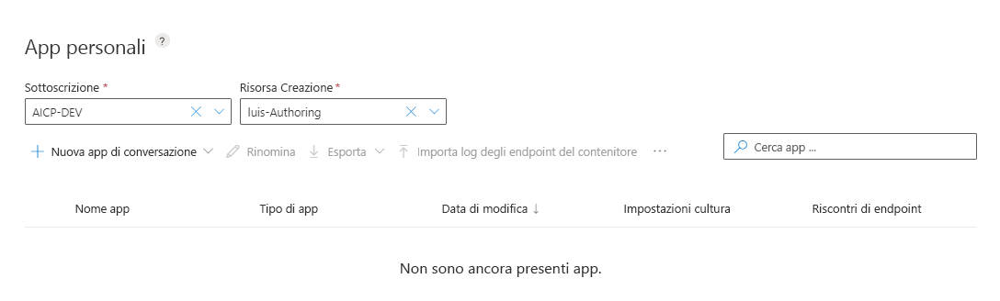

# <a name="quickstart-use-prebuilt-home-automation-app"></a>Avvio rapido: Usare l'app di domotica predefinita

In questa guida introduttiva si crea un'app LUIS che usa il dominio predefinito `HomeAutomation` per accendere e spegnere luci ed elettrodomestici. Questo dominio predefinito fornisce all'utente finalità, entità ed espressioni di esempio. Al termine, sarà disponibile un endpoint LUIS in esecuzione nel cloud.

## <a name="prerequisites"></a>Prerequisiti

Per questo articolo è necessario un account LUIS gratuito, creato nel portale LUIS all'indirizzo [https://www.luis.ai](https://www.luis.ai). 

[!INCLUDE [Sign in to LUIS](./includes/sign-in-process.md)]

## <a name="create-a-new-app"></a>Creare una nuova app
È possibile creare e gestire le applicazioni in **My Apps** (App personali). 

1. Nell'elenco App personali del portale LUIS selezionare **+Crea**.

    

1. Nella finestra di dialogo, assegnare all'applicazione il nome `Home Automation` e selezionare **Operazione completata**. LUIS crea l'app.

    

    >[!NOTE]
    >Le impostazioni cultura non possono essere modificate dopo la creazione dell'applicazione. 

## <a name="add-prebuilt-domain"></a>Aggiungi dominio predefinito

Selezionare **Domini predefiniti** quindi cercare **HomeAutomation**. Selezionare **Add domain** (Aggiungi dominio) nella scheda HomeAutomation.


Dopo che il dominio è stato aggiunto, nella casella del dominio predefinito viene visualizzato un pulsante **Remove domain** (Rimuovi dominio).

## <a name="intents-and-entities"></a>Finalità ed entità

Selezionare **Finalità** per esaminare le finalità del dominio HomeAutomation. Le finalità del dominio predefinite contengono espressioni di esempio.


> [!NOTE]
> **None** (Nessuna) è una finalità fornita da tutte le app LUIS. Viene usata per gestire le espressioni che non corrispondono alle funzionalità offerte dall'app. 

Selezionare la finalità **HomeAutomation.TurnOff**. È possibile vedere che la finalità contiene un elenco di espressioni con etichette di entità.

[](media/luis-quickstart-new-app/home-automation-turnoff.png)

## <a name="train-the-luis-app"></a>Eseguire il training dell'app di Language Understanding

[!INCLUDE [LUIS How to Train steps](../../../includes/cognitive-services-luis-tutorial-how-to-train.md)]

## <a name="test-your-app"></a>Test dell'app
Dopo aver eseguito il training dell'app, è possibile eseguirne il test. Selezionare **Test**. Digitare un'espressione di test, ad esempio `Turn off the lights` nel riquadro di test interattivo e premere INVIO. 

```
Turn off the lights
```

Verificare che la finalità con il punteggio più elevato corrisponda a quella prevista per ogni espressione di test.

In questo esempio `Turn off the lights` viene correttamente identificata come la finalità con il punteggio più elevato per **HomeAutomation.TurnOff**.


Selezionare **Inspect** (Esamina) per esaminare altre informazioni sulla stima.


Selezionare nuovamente **Test** per comprimere il riquadro di test. 

<a name="publish-your-app"></a>

## <a name="publish-the-app-to-get-the-endpoint-url"></a>Pubblicare l'app per ottenere l'URL endpoint

[!INCLUDE [LUIS How to Publish steps](./includes/howto-publish.md)]

<a name="query-the-v2-api-prediction-endpoint"></a>

## <a name="query-the-v3-api-prediction-endpoint"></a>Eseguire le query sull'endpoint di stima dell'API V3

[!INCLUDE [LUIS How to get endpoint first step](./includes/v3-prediction-endpoint.md)] 

1. Nella barra degli indirizzi del browser, per la stringa di query, verificare che le barre nome e valore seguenti siano presenti nell'URL. Se non sono presenti nella stringa di query, aggiungerle:

    |Coppia nome/valore|
    |--|
    |`verbose=true`|
    |`show-all-intents=true`|

1. Nella barra degli indirizzi del browser andare alla fine dell'URL e immettere `turn off the living room light` per il valore di _query_, quindi premere INVIO.

    ```json
    {
        "query": "turn off the living room light",
        "prediction": {
            "topIntent": "HomeAutomation.TurnOff",
            "intents": {
                "HomeAutomation.TurnOff": {
                    "score": 0.967174649
                }
            },
            "entities": {
                "HomeAutomation.Location": [
                    "living room"
                ],
                "HomeAutomation.DeviceName": [
                    [
                        "living room light"
                    ]
                ],
                "HomeAutomation.DeviceType": [
                    [
                        "light"
                    ]
                ],
                "$instance": {
                    "HomeAutomation.Location": [
                        {
                            "type": "HomeAutomation.Location",
                            "text": "living room",
                            "startIndex": 13,
                            "length": 11,
                            "score": 0.9494325,
                            "modelTypeId": 1,
                            "modelType": "Entity Extractor",
                            "recognitionSources": [
                                "model"
                            ]
                        }
                    ],
                    "HomeAutomation.DeviceName": [
                        {
                            "type": "HomeAutomation.DeviceName",
                            "text": "living room light",
                            "startIndex": 13,
                            "length": 17,
                            "modelTypeId": 5,
                            "modelType": "List Entity Extractor",
                            "recognitionSources": [
                                "model"
                            ]
                        }
                    ],
                    "HomeAutomation.DeviceType": [
                        {
                            "type": "HomeAutomation.DeviceType",
                            "text": "light",
                            "startIndex": 25,
                            "length": 5,
                            "modelTypeId": 5,
                            "modelType": "List Entity Extractor",
                            "recognitionSources": [
                                "model"
                            ]
                        }
                    ]
                }
            }
        }
    }
    ```

    Altre informazioni sull'[endpoint di previsione V3](luis-migration-api-v3.md).
    

## <a name="clean-up-resources"></a>Pulire le risorse

[!INCLUDE [LUIS How to clean up resources](../../../includes/cognitive-services-luis-tutorial-how-to-clean-up-resources.md)]

## <a name="next-steps"></a>Passaggi successivi

È possibile chiamare l'endpoint dal codice:

> [!div class="nextstepaction"]
> [Chiamare un endpoint LUIS tramite codice](luis-get-started-cs-get-intent.md)
