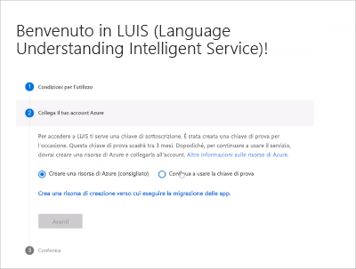

# <a name="using-authoring-and-runtime-resource-keys"></a>Uso delle chiavi di creazione e di risorsa di runtime

Le risorse di creazione e di runtime forniscono l'autenticazione per l'app LUIS e l'endpoint di stima.

<a name="create-luis-service"></a>
<a name="create-language-understanding-endpoint-key-in-the-azure-portal"></a>

Quando si accede al portale LUIS, è possibile scegliere di continuare con:

* una [chiave di valutazione](#trial-key) gratuita, che fornisce la creazione e alcune query sugli endpoint di stima.
* una risorsa di creazione di Azure [Luis](https://ms.portal.azure.com/#create/Microsoft.CognitiveServicesLUISAllInOne) . 


<a name="starter-key"></a>

## <a name="sign-in-to-luis-portal-and-begin-authoring"></a>Accedere al portale di LUIS e iniziare la creazione

1. Accedere a [Luis Portal](https://www.luis.ai) e accettare le condizioni per l'utilizzo.
1. Avviare l'app LUIS scegliendo il tipo di chiave di authoring LUIS da usare: chiave di valutazione gratuita o nuova chiave di creazione di Azure LUIS. 

    

1. Al termine del processo di selezione delle risorse, [creare una nuova app](luis-how-to-start-new-app.md#create-new-app-in-luis). 

## <a name="trial-key"></a>Chiave di valutazione

La chiave di prova (Starter) viene fornita. Viene usato come chiave di autenticazione per eseguire una query sul runtime dell'endpoint di stima, fino a 1000 query al mese. 

È visibile nella pagina **impostazioni utente** e nelle pagine di **gestione delle risorse di Azure >** nel portale Luis. 

Quando si è pronti per pubblicare l'endpoint di stima, creare e assegnare chiavi di runtime di creazione e di stima per sostituire la funzionalità della chiave di avvio. 

## <a name="create-resources-in-the-azure-portal"></a>Creare risorse nel portale di Azure

1. Usare [questo collegamento](https://ms.portal.azure.com/#create/Microsoft.CognitiveServicesLUISAllInOne) per aprire il portale di Azure in per la creazione di risorse.
1. Selezionare **entrambi** per creare una chiave di runtime per la creazione e l'endpoint di stima. 
1. Immettere le informazioni necessarie per creare la risorsa e quindi selezionare **Crea** per terminare il processo.

    

    |name|Finalità|
    |--|--|
    |Nome risorsa| Nome personalizzato scelto, usato come parte dell'URL per le query dell'endpoint di creazione e di stima.|
    |Nome della sottoscrizione| sottoscrizione che verrà fatturata per la risorsa.|
    |Gruppo di risorse| Nome del gruppo di risorse personalizzato scelto o creato. I gruppi di risorse consentono di raggruppare le risorse di Azure per l'accesso e la gestione nella stessa area.|
    |Posizione di creazione|Area associata al modello.|
    |Piano tariffario per la creazione|Il piano tariffario determina il numero massimo di transazioni al secondo e al mese.|
    |Percorso runtime|Area associata al runtime dell'endpoint di stima pubblicato.|
    |Piano tariffario di runtime|Il piano tariffario determina il numero massimo di transazioni al secondo e al mese.|

    Una volta create entrambe le risorse, assegnare le risorse nel portale LUIS.

## <a name="create-resources-in-azure-cli"></a>Creare risorse nell'interfaccia della riga di comando di Azure

Usare l' [interfaccia](https://docs.microsoft.com/cli/azure/install-azure-cli?view=azure-cli-latest) della riga di comando di Azure per creare ogni risorsa singolarmente. 

`kind`di risorse:

* Creazione e modifica: `LUIS.Authoring`
* Stima: `LUIS` 

1. Accedere all'interfaccia della riga di comando di Azure:

    ```console
    az login
    ```

    Verrà visualizzato un browser che consente di selezionare l'account corretto e di fornire l'autenticazione.

1. Creare una **risorsa Luis authoring**, di tipo `LUIS.Authoring`, denominata `my-luis-authoring-resource` nel gruppo di risorse _esistente_ denominato `my-resource-group` per l'area `westus`. 

    ```console
    az cognitiveservices account create -n my-luis-authoring-resource -g my-resource-group --kind LUIS.Authoring --sku F0 -l westus --yes
    ```

1. Creare una **risorsa dell'endpoint di stima Luis**, di tipo `LUIS`, denominata `my-luis-prediction-resource` nel gruppo di risorse _esistente_ denominato `my-resource-group` per l'area `westus`. Se si desidera una velocità effettiva superiore a quella del livello gratuito, modificare `F0` in `S0`. Altre informazioni sui [piani tariffari e la velocità effettiva](luis-boundaries.md#key-limits).

    ```console
    az cognitiveservices account create -n my-luis-prediction-resource -g my-resource-group --kind LUIS --sku F0 -l westus --yes
    ```

    > [!Note] 
    > Queste chiavi **non** vengono usate dal portale Luis fino a quando non vengono assegnate nel portale Luis sulle **risorse di Azure manage->** .

## <a name="assign-an-authoring-resource-in-the-luis-portal-for-all-apps"></a>Assegnare una risorsa di creazione nel portale LUIS per tutte le app

È possibile assegnare una risorsa di creazione per una singola app o per tutte le app in LUIS. La procedura seguente consente di assegnare tutte le app a una singola risorsa di creazione.

1. Accedere al [portale Luis](https://www.luis.ai).
1. Nella barra di spostamento superiore, all'estrema destra, selezionare l'account utente e quindi selezionare **Impostazioni**.
1. Nella pagina **impostazioni utente** selezionare **Aggiungi risorsa di creazione** e quindi selezionare una risorsa di creazione esistente. Selezionare **Salva**. 

## <a name="assign-a-resource-to-an-app"></a>Assegnare una risorsa a un'app

È possibile assegnare un'unica risorsa, la creazione o la fase di esecuzione di un endpoint di stima a un'app con la procedura seguente.

1. Accedere al [portale Luis](https://www.luis.ai), quindi selezionare un'app dall'elenco **app personali** .
1. Passare alla pagina **Gestisci-> risorse di Azure** .

    

1. Selezionare la scheda stima o Crea risorsa e quindi selezionare il pulsante **Aggiungi risorsa di stima** o **Aggiungi risorsa di creazione** . 
1. Selezionare i campi nel modulo per trovare la risorsa corretta, quindi selezionare **Salva**.  

### <a name="assign-runtime-resource-without-using-luis-portal"></a>Assegnare la risorsa di runtime senza usare il portale LUIS

Per scopi di automazione, ad esempio una pipeline di integrazione continua/recapito continuo, è possibile automatizzare l'assegnazione di una risorsa di runtime LUIS a un'app LUIS. Per farlo, è necessario seguire questa procedura:

1. Ottenere un token di Azure Resource Manager per questo [sito Web](https://resources.azure.com/api/token?plaintext=true). Il token scade, perciò usarlo immediatamente. La richiesta restituisce un token di Azure Resource Manager.

    

1. Usare il token per richiedere le risorse di runtime LUIS tra le sottoscrizioni, dall' [API per ottenere gli account Luis Azure](https://westus.dev.cognitive.microsoft.com/docs/services/5890b47c39e2bb17b84a55ff/operations/5be313cec181ae720aa2b26c)a cui l'account utente ha accesso. 

    Questa API POST richiede le impostazioni seguenti:

    |Intestazione|Value|
    |--|--|
    |`Authorization`|Il valore di `Authorization` è `Bearer {token}`. Si noti che il valore del token deve essere preceduto dalla parola `Bearer` e uno spazio.| 
    |`Ocp-Apim-Subscription-Key`|Chiave di creazione.|

    Questa API restituisce una matrice di oggetti JSON delle sottoscrizioni LUIS inclusi ID sottoscrizione, gruppo di risorse e nome della risorsa restituito come nome dell'account. Trovare l'elemento della matrice che rappresenta la risorsa LUIS da assegnare all'app LUIS. 

1. Assegnare il token alla risorsa servizio LUIS con l'API [Assign a LUIS azure accounts to an application](https://westus.dev.cognitive.microsoft.com/docs/services/5890b47c39e2bb17b84a55ff/operations/5be32228e8473de116325515) (Assegnare un account LUIS di Azure a un'applicazione). 

    Questa API POST richiede le impostazioni seguenti:

    |Type|Impostazione|Value|
    |--|--|--|
    |Intestazione|`Authorization`|Il valore di `Authorization` è `Bearer {token}`. Si noti che il valore del token deve essere preceduto dalla parola `Bearer` e uno spazio.|
    |Intestazione|`Ocp-Apim-Subscription-Key`|Chiave di creazione.|
    |Intestazione|`Content-type`|`application/json`|
    |QueryString|`appid`|L'ID dell'app LUIS. 
    |Corpo||{"AzureSubscriptionId":"ddda2925-af7f-4b05-9ba1-2155c5fe8a8e",<br>"ResourceGroup": "resourcegroup-2",<br>"AccountName": "luis-uswest-S0-2"}|

    Quando l'API ha esito positivo, restituisce 201 - stato creato. 

## <a name="unassign-resource"></a>Annullare l'assegnazione di una risorsa

1. Accedere al [portale Luis](https://www.luis.ai), quindi selezionare un'app dall'elenco **app personali** .
1. Passare alla pagina **Gestisci-> risorse di Azure** .
1. Selezionare la scheda stima o Crea risorsa e quindi selezionare il pulsante Annulla **assegnazione risorsa** per la risorsa. 

Quando si annulla l'assegnazione di una risorsa, questa non viene eliminata da Azure. Viene soltanto scollegata da LUIS. 

## <a name="reset-authoring-key"></a>Reimpostare la chiave di creazione

**Per la creazione di app [migrate delle risorse](luis-migration-authoring.md)** : se la chiave di creazione è compromessa, reimpostare la chiave nella portale di Azure nella pagina **chiavi** della risorsa di creazione. 

**Per le app che non sono ancora state migrate**: la chiave viene reimpostata su tutte le app nel portale Luis. Se si creano le app tramite le API di creazione, è necessario modificare il valore di OCP-gestione API-Subscription-Key nella nuova chiave.

## <a name="regenerate-azure-key"></a>Rigenera chiave di Azure

Rigenerare le chiavi di Azure dalla portale di Azure, nella pagina **chiavi** .

## <a name="delete-account"></a>Eliminare l'account

Per informazioni sui dati che vengono eliminati quando viene eliminato l'account, vedere [Data storage and removal](luis-concept-data-storage.md#accounts) (Archiviazione e rimozione dei dati).

## <a name="change-pricing-tier"></a>Modificare il piano tariffario

1.  In [Azure](https://portal.azure.com), trova la sottoscrizione LUIS. Selezionare la sottoscrizione LUIS.
    
1.  Selezionare **Piano tariffario** per visualizzare i piani tariffari disponibili. 
    
1.  Selezionare il piano tariffario e scegliere **Seleziona** per salvare la modifica. 
    
1.  Una volta completata la modifica dei prezzi, una finestra popup verifica il nuovo piano tariffario. 
    
1. Ricorda di [assegnare questa chiave di endpoint](#assign-a-resource-to-an-app) nella pagina **Pubblica** e di usarla in tutte le query di endpoint. 

## <a name="viewing-azure-resource-metrics"></a>Visualizzazione delle metriche delle risorse di Azure

### <a name="viewing-azure-resource-summary-usage"></a>Visualizzazione dell'utilizzo di riepilogo delle risorse di Azure
È possibile visualizzare le informazioni sull'utilizzo di LUIS in Azure. La pagina **Panoramica** contiene informazioni di riepilogo recenti, incluse chiamate ed errori. Se effettui una richiesta LUIS di endpoint, quindi osservi la **pagina Panoramica**, attendi fino a cinque minuti perché compaia l'utilizzo.


### <a name="customizing-azure-resource-usage-charts"></a>Personalizzazione dei grafici di utilizzo delle risorse di Azure
Metrica offre una visualizzazione più dettagliata dei dati.


È possibile configurare i grafici delle metriche per periodo di tempo e il tipo di metrica. 


### <a name="total-transactions-threshold-alert"></a>Avviso di superamento della soglia delle transazioni totali
Se desideri sapere quando è stata raggiunta una determinata soglia delle transazioni, ad esempio 10.000 transazioni, puoi creare un avviso. 


Aggiungi un avviso di metrica per la metrica **Totale chiamate** riferito a un determinato periodo di tempo. Aggiungi gli indirizzi e-mail di tutti gli utenti che devono ricevere l'avviso. Aggiungi webhook per tutti i sistemi che devono ricevere l'avviso. È anche possibile eseguire un'app per la logica quando viene generato l'avviso. 

## <a name="next-steps"></a>Passaggi successivi

* Informazioni [su come usare le versioni](luis-how-to-manage-versions.md) per controllare il ciclo di vita dell'app.
* Comprendere i concetti che includono la [risorsa di creazione](luis-concept-keys.md#authoring-key) e i [collaboratori](luis-concept-keys.md#contributions-from-other-authors) di tale risorsa.
* Informazioni [su come creare risorse di](luis-how-to-azure-subscription.md) creazione e di runtime
* Eseguire la migrazione alla nuova [risorsa di creazione](luis-migration-authoring.md) 
