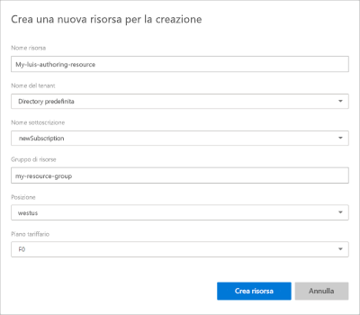

# Passaggi per eseguire la migrazione alla risorsa di creazione di Azure

Dal portale di Language Understanding (LUIS) eseguire la migrazione di tutte le app di cui si è proprietari per usare la risorsa di creazione di Azure.

## Prerequisiti

* **Facoltativamente**, eseguire il backup delle app dall'elenco di app del portale Luis esportando ogni app o usando l' [API](https://westus.dev.cognitive.microsoft.com/docs/services/5890b47c39e2bb17b84a55ff/operations/5890b47c39e2bb052c5b9c40)di esportazione.
* **Facoltativamente**, salvare l'elenco collaborator's di ogni app. Questo elenco di messaggi di posta elettronica viene fornito come parte del processo di migrazione.
* **Obbligatorio**, è necessario avere una [sottoscrizione di Azure](https://azure.microsoft.com/free/). Una parte del processo di sottoscrizione richiede informazioni sulla fatturazione. È tuttavia possibile usare piani tariffari gratuiti (F0) quando si usa LUIS. È possibile che sia necessario un livello a pagamento, a mano a mano che aumenta l'utilizzo. 

Se non si ha una sottoscrizione di Azure, [iscriversi](https://azure.microsoft.com/free/). 

## Accedere al processo di migrazione

Con cadenza settimanale, viene richiesto di eseguire la migrazione delle app. È possibile annullare questa finestra senza eseguire la migrazione. Se si desidera eseguire la migrazione prima del successivo periodo pianificato, è possibile avviare il processo di migrazione dall'icona del **lucchetto** nella barra degli strumenti superiore del portale Luis. 

## Il proprietario dell'app avvia il processo di migrazione

Il processo di migrazione è disponibile se si è il proprietario di qualsiasi app LUIS. 

1. 1. Accedere a [Luis Portal](https://www.luis.ai) e accettare le condizioni per l'utilizzo.
1. La finestra popup migrazione consente di continuare la migrazione o eseguire la migrazione in un secondo momento. Selezionare **migrate Now**. Se si sceglie di eseguire la migrazione in un secondo momento, è necessario eseguire la migrazione di 9 mesi alla nuova chiave di creazione in Azure.

    

1. Se una qualsiasi delle app dispone di collaboratori, viene richiesto di **inviarle un messaggio di posta elettronica** che informa sulla migrazione. Si tratta di un passaggio facoltativo. L'applicazione di posta elettronica predefinita si apre con un messaggio di posta elettronica in formato lieve. 

    

1. Scegliere di creare una risorsa LUIS authoring selezionando **inizia creando una risorsa di creazione per la migrazione delle app**. 

    

1. Nella finestra successiva immettere le informazioni sulla chiave della risorsa. Dopo aver immesso le informazioni, selezionare **Crea risorsa**. 

    

    Quando si **Crea una nuova risorsa di creazione**, fornire le seguenti informazioni: 

    * **Nome risorsa** : nome personalizzato scelto, usato come parte dell'URL per le query dell'endpoint di creazione e di stima.
    * **Tenant** : il tenant a cui è associata la sottoscrizione di Azure. 
    * **Nome sottoscrizione** : la sottoscrizione che verrà fatturata per la risorsa.
    * **Gruppo di risorse** : nome del gruppo di risorse personalizzato scelto o creato. I gruppi di risorse consentono di raggruppare le risorse di Azure per l'accesso e la gestione. 
    * **Località** : la scelta del percorso è basata sulla selezione del **gruppo di risorse** .
    * Piano **tariffario** : il piano tariffario determina il numero massimo di transazioni al secondo e al mese. 

1. Quando viene creata la risorsa di creazione, viene visualizzato il messaggio di operazione riuscita. Selezionare **Chiudi** per chiudere la finestra popup.

    

    L'elenco **app personali** Mostra le app di cui è stata eseguita la migrazione alla nuova risorsa di creazione. 

    Non è necessario essere a conoscenza della chiave della risorsa di creazione per continuare a modificare le app nel portale LUIS. Se si prevede di modificare le app a livello di codice, sono necessari i valori delle chiavi di creazione. Questi valori vengono visualizzati nella pagina **gestisci > risorse di Azure** nel portale Luis e sono disponibili anche nella portale di Azure nella pagina **chiavi** della risorsa.  

## Dopo il processo di migrazione, aggiungere collaboratori alla risorsa di creazione

[!INCLUDE [Manage contributors for the Azure authoring resource for language understanding](./includes/manage-contributors-authoring-resource.md)]

Informazioni [su come aggiungere collaboratori](luis-how-to-collaborate.md). 

## Passaggi successivi

* Esaminare i [concetti](luis-concept-keys.md) relativi alla creazione e alle chiavi di runtime
* Esaminare [come assegnare chiavi](luis-how-to-azure-subscription.md) e aggiungere [collaboratori](luis-how-to-collaborate.md)
