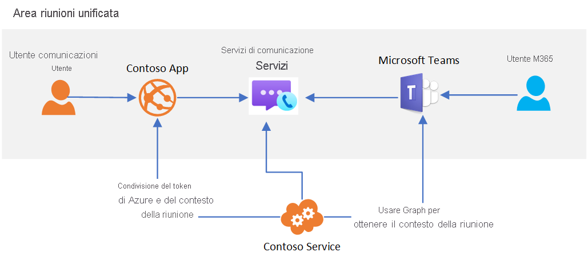

# Interoperabilità di Teams

[!INCLUDE [Private Preview Notice](../../includes/private-preview-include.md)]

È possibile usare Servizi di comunicazione di Azure per creare esperienze personalizzate di riunioni che interagiscono con Microsoft Teams. Gli utenti delle soluzioni di Servizi di comunicazione possono interagire con i partecipanti di Teams tramite voce, video e condivisione dello schermo.

Questa interoperabilità consente di creare applicazioni Azure personalizzate che connettono gli utenti alle riunioni di Teams. Gli utenti delle applicazioni personalizzate non devono necessariamente avere identità di Azure Active Directory o licenze di Teams per provare questa funzionalità. Questa soluzione è ideale per coinvolgere i dipendenti (che possono avere familiarità con Teams) e gli utenti esterni (che usano un'esperienza di applicazione personalizzata) in un'esperienza di riunione senza soluzione di continuità. È quindi possibile creare esperienze simili alle seguenti:

1. I dipendenti usano Teams per pianificare una riunione
2. L'applicazione personalizzata di Servizi di comunicazione usa le API Microsoft Graph per accedere ai dettagli della riunione
3. I dettagli della riunione vengono condivisi con utenti esterni tramite l'applicazione personalizzata
4. Gli utenti esterni usano l'applicazione personalizzata per partecipare alla riunione di Teams, tramite la libreria client Chiamata di Servizi di comunicazione

L'architettura generale per questo caso d'uso è simile alla seguente: 

Anche se alcune funzionalità delle riunioni di Teams, come le mani alzate, la modalità Insieme e i gruppi di lavoro, sono disponibili solo per gli utenti di Teams, l'applicazione personalizzata avrà accesso alle funzionalità di base di audio, video e condivisione dello schermo della riunione.

Quando un utente di Servizi di comunicazione partecipa alla riunione di Teams, agli utenti di Teams verrà mostrato il nome visualizzato fornito tramite la libreria client Chiamata. L'utente di Servizi di comunicazione verrà altrimenti trattato come un utente anonimo in Teams. Per l'applicazione personalizzata è necessario considerare l'autenticazione degli utenti e altre misure di sicurezza, in modo da proteggere le riunioni di Teams. Tenere presenti le implicazioni per la sicurezza derivanti dalla partecipazione di utenti anonimi alle riunioni e seguire la [guida alla sicurezza di Teams](/microsoftteams/teams-security-guide#addressing-threats-to-teams-meetings) per configurare le funzionalità disponibili per utenti anonimi.

Gli utenti di Servizi di comunicazione possono partecipare a riunioni pianificate di Teams purché la partecipazione anonima sia abilitata nelle [impostazioni](/microsoftteams/meeting-settings-in-teams).

## Passaggi successivi

> [!div class="nextstepaction"]
> [Aggiungere l'app di chiamata a una riunione di Teams](../../quickstarts/voice-video-calling/get-started-teams-interop.md)