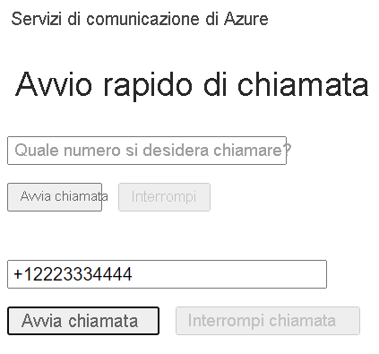

[!INCLUDE [Emergency Calling Notice](../../../includes/emergency-calling-notice-include.md)]
## <a name="prerequisites"></a>Prerequisiti

- Un account Azure con una sottoscrizione attiva. [Creare un account gratuitamente](https://azure.microsoft.com/free/?WT.mc_id=A261C142F). 
- Una risorsa di Servizi di comunicazione distribuita. [Creare una risorsa di Servizi di comunicazione](../../create-communication-resource.md).
- Un numero di telefono acquisito nella risorsa di Servizi di comunicazione. [Come ottenere un numero di telefono](../../telephony-sms/get-phone-number.md).
- Un `User Access Token` per abilitare il client di chiamata. Per altre informazioni, vedere [come ottenere un `User Access Token`](../../access-tokens.md)
- Completare la guida di avvio rapido per [aggiungere funzionalità per chiamate all'applicazione](../getting-started-with-calling.md)

### <a name="prerequisite-check"></a>Controllo dei prerequisiti

- Per visualizzare i numeri di telefono associati alla risorsa di Servizi di comunicazione, accedere al [portale di Azure](https://portal.azure.com/), individuare la risorsa di Servizi di comunicazione e aprire la scheda dei **numeri di telefono** nel riquadro di spostamento sinistro.
- È possibile compilare ed eseguire l'app con la libreria client Chiamate di Servizi di comunicazione per JavaScript:

```console
npx webpack-dev-server --entry ./client.js --output bundle.js
```

## <a name="setting-up"></a>Configurazione

### <a name="add-pstn-functionality-to-your-app"></a>Aggiungere funzionalità PSTN all'app

Estendere il layout con i controlli di composizione del numero di telefono.

Inserire questo codice alla fine della sezione `<body />` del file **index.html**, prima dei tag `<script />`:

```html
<input 
  id="callee-phone-input"
  type="text"
  placeholder="Phone number you would like to dial"
  style="margin-bottom:1em; width: 230px;"
/>
<div>
  <button id="call-phone-button" type="button">
    Start Phone Call
  </button>
  &nbsp;
  <button id="hang-up-phone-button" type="button" disabled="true">
    Hang Up Phone Call
  </button>
</div>
```

Estendere la logica dell'applicazione con la funzionalità di telefonia.

Aggiungere questo codice al file **client.js**:

```javascript
const calleePhoneInput = document.getElementById("callee-phone-input");
const callPhoneButton = document.getElementById("call-phone-button");
const hangUpPhoneButton = document.getElementById("hang-up-phone-button");
```

## <a name="start-a-call-to-phone"></a>Avviare una chiamata al telefono

Specificare il numero di telefono acquisito nella risorsa di Servizi di comunicazione, che verrà usato per avviare la chiamata:
> [!WARNING]
> Si noti che i numeri di telefono devono essere specificati nel formato standard internazionale E.164, ad esempio +12223334444.

Aggiungere un gestore dell'evento per avviare una chiamata al numero di telefono specificato facendo clic su `callPhoneButton`:


```javascript
callPhoneButton.addEventListener("click", () => {
  // start a call to phone
  const phoneToCall = calleePhoneInput.value;
  call = callAgent.call(
    [{phoneNumber: phoneToCall}], { alternateCallerId: {phoneNumber: '+18336528005'}
  });

  // toggle button states
  hangUpPhoneButton.disabled = false;
  callPhoneButton.disabled = true;
});
```

## <a name="end-a-call-to-phone"></a>Terminare una chiamata al telefono

Aggiungere un listener di eventi per terminare la chiamata corrente quando si fa clic su `hangUpPhoneButton`:

```javascript
hangUpPhoneButton.addEventListener("click", () => {
  // end the current call
  call.hangUp({
    forEveryone: true
  });

  // toggle button states
  hangUpPhoneButton.disabled = true;
  callPhoneButton.disabled = false;
});
```

La proprietà `forEveryone` termina la chiamata per tutti i partecipanti.

## <a name="run-the-code"></a>Eseguire il codice

Usare `webpack-dev-server` per compilare ed eseguire l'app. Eseguire il comando seguente per aggregare l'host dell'applicazione in un server Web locale:


```console
npx webpack-dev-server --entry ./client.js --output bundle.js
```

Aprire il browser e passare a `http://localhost:8080/`. Dovrebbe essere visualizzata la seguente schermata:




È possibile effettuare una chiamata a un numero di telefono reale specificandolo nel campo di testo aggiunto e facendo clic sul pulsante **Start Phone Call** (Avvia chiamata telefonica).

> [!WARNING]
> Si noti che i numeri di telefono devono essere specificati nel formato standard internazionale E.164, ad esempio +12223334444.
