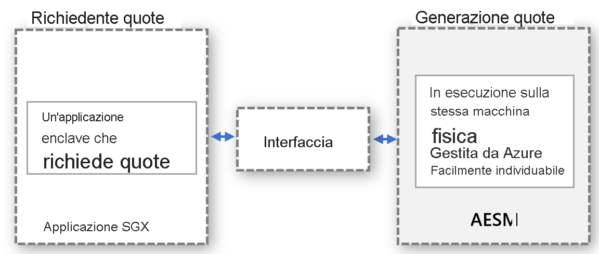

# <a name="platform-software-management-with-sgx-quote-helper-daemon-set"></a>Gestione del software di piattaforma con il DaemonSet helper di citazioni SGX

Le [applicazioni enclave](confidential-computing-enclaves.md) che eseguono l'attestazione remota hanno bisogno di una CITAZIONE generata. Questa CITAZIONE fornisce la prova crittografica dell'identità e dello stato dell'applicazione, oltre all'ambiente in cui l'enclave è in esecuzione. Per generare la CITAZIONE sono necessari componenti software attendibili che fanno parte dei componenti software della piattaforma (PSW) di Intel.

## <a name="overview"></a>Panoramica
 
Intel supporta due modalità di attestazione per l'esecuzione della generazione di citazioni:
- **in-process**: ospita i componenti software attendibili all'interno del processo dell'applicazione enclave

- **out-of-process**: ospita i componenti software attendibili all'esterno dell'applicazione enclave.
 
Per impostazione predefinita, le applicazioni SGX create con Open Enclave SDK usano la modalità di attestazione in-process. Le applicazioni basate su SGX supportano la modalità out-of-process e richiedono un hosting e un'esposizione aggiuntivi dei componenti necessari, come Architectural Enclave Service Manager (AESM), esterni all'applicazione.

L'uso di questa funzionalità è **altamente consigliato**, in quanto migliora il tempo di attività delle app enclave durante gli aggiornamenti della piattaforma Intel o del driver DCAP.

## <a name="why-and-what-are-the-benefits-of-out-of-proc"></a>Perché la modalità out-of-process è efficace e quali vantaggi offre?

-   Non sono necessari aggiornamenti per i componenti di generazione delle citazioni di PSW per ogni applicazione in contenitori: la modalità out-of-process evita ai proprietari di contenitori la necessità di gestire gli aggiornamenti all'interno del contenitore. I proprietari di contenitori usano invece l'interfaccia fornita dal provider che richiama il servizio centralizzato all'esterno del contenitore, che viene aggiornato e gestito dal provider.

-   Non occorre preoccuparsi degli errori di attestazione dovuti a componenti PSW non aggiornati: la generazione delle citazioni coinvolge i componenti software attendibili Quoting Enclave (QE) e Provisioning Certificate Enclave (PCE), che fanno parte della Trusted Computing Base (TCB). Questi componenti software devono essere aggiornati per poter gestire i requisiti di attestazione. Poiché il provider gestisce gli aggiornamenti per questi componenti, i clienti non dovranno mai occuparsi degli errori di attestazione dovuti a componenti software attendibili non aggiornati all'interno del contenitore.

-   Migliore utilizzo della memoria EPC in modalità di attestazione in-process: ogni applicazione enclave deve creare un'istanza della copia di QE e PCE per l'attestazione remota. Con la modalità out-of-process non è necessario che il contenitore ospiti tali enclave, pertanto non viene utilizzata la memoria dell'enclave dalla quota del contenitore.

-   Protezione contro l'applicazione del kernel: quando il driver SGX viene trasmesso nel kernel Linux, a un'enclave viene applicato un privilegio più elevato. Questo privilegio consente all'enclave di richiamare PCE, che interrompe l'applicazione enclave in esecuzione in modalità in-process. Per impostazione predefinita, le enclave non ottengono questa autorizzazione. Per concedere questo privilegio a un'applicazione enclave è necessario modificare il processo di installazione dell'applicazione. Questa situazione viene gestita facilmente per il modello out-of-process, in quanto il provider del servizio che gestisce le richieste out-of-process verifica che il servizio sia installato con questo privilegio.

-   Non è necessario verificare la compatibilità con le versioni precedenti di PSW e DCAP. Questa compatibilità per gli aggiornamenti dei componenti di generazione delle citazioni viene verificata dal provider prima dell'aggiornamento. Questo consente di gestire preventivamente i problemi di compatibilità e di risolverli prima di distribuire gli aggiornamenti per i carichi di lavoro riservati.

## <a name="how-does-the-out-of-proc-attestation-mode-work-for-confidential-workloads-scenario"></a>Come funziona la modalità di attestazione out-of-process per uno scenario di carichi di lavoro riservati?

La struttura generale segue il modello in base al quale il richiedente della citazione e la generazione della citazione vengono eseguiti separatamente, ma nello stesso computer fisico. La generazione della citazione verrà eseguita in modo centralizzato e servirà le richieste di CITAZIONI di tutte le entità. Per consentire a qualsiasi entità di richiedere citazioni, l'interfaccia deve essere definita correttamente e individuabile.



Il modello astratto rappresentato sopra si applica a uno scenario di carichi di lavoro riservati, sfruttando il servizio AESM già disponibile. AESM viene inserito in un contenitore e distribuito come DaemonSet nel cluster Kubernetes. Kubernetes garantisce che una singola istanza di un contenitore del servizio AESM, racchiusa in un pod, venga distribuita in ogni nodo dell'agente. Il nuovo DaemonSet delle citazioni SGX avrà una dipendenza dal DaemonSet sgx-device-plugin, poiché il contenitore del servizio AESM dovrebbe richiedere memoria EPC a sgx-device-plugin per avviare le enclave QE e PCE.

Ogni contenitore deve acconsentire esplicitamente all'uso della generazione di citazioni out-of-process impostando la variabile di ambiente **SGX_AESM_ADDR=1** durante la creazione. Il contenitore deve includere anche il pacchetto libsgx-quote-ex responsabile dell'indirizzamento della richiesta al socket di dominio UNIX predefinito.

Un'applicazione può continuare a usare l'attestazione in-process come prima, ma le modalità in-process e out-of-process non possono essere usate contemporaneamente all'interno di un'applicazione. L'infrastruttura out-of-process è disponibile per impostazione predefinita e utilizza risorse.

## <a name="sample-implementation"></a>Implementazione di esempio

Il file Docker riportato di seguito è un esempio di applicazione basata su Open Enclave. Impostare la variabile di ambiente SGX_AESM_ADDR=1 nel file Docker o impostarla nel file di distribuzione. Seguire l'esempio riportato di seguito per i dettagli del file Docker e del file YAML di distribuzione. 

  > [!Note] 
  > Per i corretto funzionamento dell'attestazione out-of-process, il contenitore dell'applicazione deve includere il pacchetto **libsgx-quote-ex** di Intel.
    
```yaml
# Refer to Intel_SGX_Installation_Guide_Linux for detail
FROM ubuntu:18.04 as sgx_base
RUN apt-get update && apt-get install -y \
    wget \
    gnupg

# Add the repository to sources, and add the key to the list of
# trusted keys used by the apt to authenticate packages
RUN echo "deb [arch=amd64] https://download.01.org/intel-sgx/sgx_repo/ubuntu bionic main" | tee /etc/apt/sources.list.d/intel-sgx.list \
    && wget -qO - https://download.01.org/intel-sgx/sgx_repo/ubuntu/intel-sgx-deb.key | apt-key add -
# Add Microsoft repo for az-dcap-client
RUN echo "deb [arch=amd64] https://packages.microsoft.com/ubuntu/18.04/prod bionic main" | tee /etc/apt/sources.list.d/msprod.list \
    && wget -qO - https://packages.microsoft.com/keys/microsoft.asc | apt-key add -

FROM sgx_base as sgx_sample
RUN apt-get update && apt-get install -y \
    clang-7 \
    libssl-dev \
    gdb \
    libprotobuf10 \
    libsgx-dcap-ql \
    libsgx-quote-ex \
    az-dcap-client \
    open-enclave
WORKDIR /opt/openenclave/share/openenclave/samples/remote_attestation
RUN . /opt/openenclave/share/openenclave/openenclaverc \
    && make build
# this sets the flag for out of proc attestation mode. alternatively you can set this flag on the deployment files
ENV SGX_AESM_ADDR=1 

CMD make run
```
In alternativa, la modalità di attestazione out-of-process può essere impostata nel file YAML di distribuzione, come illustrato di seguito.

```yaml
apiVersion: batch/v1
kind: Job
metadata:
  name: sgx-test
spec:
  template:
    spec:
      containers:
      - name: sgxtest
        image: <registry>/<repository>:<version>
        env:
        - name: SGX_AESM_ADDR
          value: 1
        resources:
          limits:
            kubernetes.azure.com/sgx_epc_mem_in_MiB: 10
        volumeMounts:
        - name: var-run-aesmd
          mountPath: /var/run/aesmd
      restartPolicy: "Never"
      volumes:
      - name: var-run-aesmd
        hostPath:
          path: /var/run/aesmd
```

## <a name="next-steps"></a>Passaggi successivi
[Effettuare il provisioning di nodi di confidential computing (serie DCsv2) nel servizio Azure Kubernetes](./confidential-nodes-aks-get-started.md)

[Esempi di contenitori riservati](https://github.com/Azure-Samples/confidential-container-samples)

[Elenco di SKU DCsv2](https://docs.microsoft.com/azure/virtual-machines/dcv2-series)

<!-- LINKS - external -->
[Azure Attestation]: https://docs.microsoft.com/en-us/azure/attestation/


<!-- LINKS - internal -->
[DC Virtual Machine]: /confidential-computing/virtual-machine-solutions