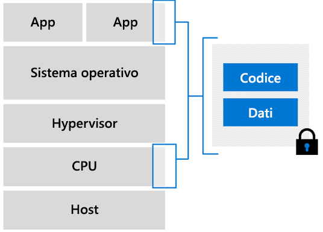

# Confidential computing in Azure

Il confidential computing di Azure consente di isolare i dati sensibili durante l'elaborazione nel cloud. Il confidential computing viene usato in molti settori per la protezione dei dati. Questi carichi di lavoro includono:

- Protezione di dati finanziari
- Protezione delle informazioni dei pazienti
- Esecuzione di processi di Machine Learning su informazioni riservate
- Esecuzione di algoritmi su set di dati crittografati provenienti da più origini

## Panoramica

> [!VIDEO https://www.youtube.com/embed/rT6zMOoLEqI]

Sappiamo quanto sia importante proteggere i dati sul cloud e ascoltiamo le preoccupazioni dei nostri clienti. Ecco alcune domande che i nostri clienti possono porre quando trasferiscono carichi di lavoro sensibili nel cloud: 

- Come assicurarsi che Microsoft non possa accedere ai dati crittografati?
- Come è possibile prevenire le minacce alla sicurezza poste da amministratori con privilegi all'interno dell'azienda?
- In quali altri modi è possibile impedire a terze parti di accedere ai dati sensibili dei clienti?

Microsoft Azure aiuta a ridurre al minimo la superficie di attacco per rafforzare la protezione dei dati. Azure offre già molti strumenti per salvaguardare i [**dati inattivi**](../security/fundamentals/encryption-atrest.md) tramite modelli come la crittografia lato client e lato server. Inoltre, Azure include meccanismi per crittografare i [**data in transito**](../security/fundamentals/data-encryption-best-practices.md#protect-data-in-transit) tramite protocolli sicuri come TLS e HTTPS. Questa pagina include un'introduzione a un terzo tipo di crittografia dei dati, la crittografia dei **dati in uso**.

## Introduzione al confidential computing 

Il termine confidential computing è stato definito nel settore dal [Confidential Computing Consortium](https://confidentialcomputing.io/) (CCC), una fondazione che si occupa di definire e accelerare l'adozione di questa metodologia. Per confidential computing si intende la protezione dei dati in uso durante l'esecuzione di calcoli. I calcoli si verificano in un ambiente TEE (Trusted Execution Environment) basato su hardware.

TEE è un ambiente che impone l'esecuzione esclusivamente di codice autorizzato. I dati inclusi nel TEE non possono essere letti o manomessi da codice all'esterno dell'ambiente.

### Enclavi e ambienti TEE

Nel contesto del confidential computing, i TEE vengono in genere definiti *enclavi* o *enclavi sicure*. Le enclavi sono parti protette del processore e della memoria dell'hardware. Non vi è alcun modo per visualizzare dati o codice all'interno dell'enclave, neanche con un debugger. Se il codice non attendibile tenta di modificare il contenuto nella memoria dell'enclave, l'ambiente viene disabilitato e le operazioni vengono negate.

Quando si sviluppano applicazioni, è possibile usare [strumenti software](#oe-sdk) per schermare parti del codice e dei dati all'interno dell'enclave. Questi strumenti garantiscono che il codice e i dati non possano essere visualizzati o modificati da utenti esterni all'ambiente attendibile. 

Fondamentalmente, un'enclave può essere paragonata a una scatola nera. Il codice e i dati crittografati vengono inseriti nella scatola. Dall'esterno della scatola, non è possibile vedere niente. All'enclave viene assegnata una chiave per decrittografare i dati, che vengono quindi elaborati e crittografati di nuovo, prima di essere inviati al di fuori.

### Attestazione

La sicurezza dell'ambiente TEE dovrebbe essere verificata e convalidata. Questa verifica è il processo di attestazione. 

L'attestazione assicura a una relying party che il software è in esecuzione in un'enclave e che quest'ultima è aggiornata e protetta. Ad esempio, un'enclave chiede all'hardware sottostante di generare una credenziale che include la prova dell'esistenza dell'enclave nella piattaforma. Il report può quindi essere assegnato a una seconda enclave che verifica che è stato generato nella stessa piattaforma.

L'attestazione deve essere implementata tramite un servizio di attestazione sicuro e compatibile con il software e il silicio del sistema. I [servizi di attestazione e provisioning di Intel](https://software.intel.com/sgx/attestation-services) sono compatibili con le macchine virtuali di confidential computing di Azure.

## Uso di Azure per il confidential computing basato sul cloud

Il confidential computing di Azure consente di sfruttarne le funzionalità in un ambiente virtuale. È ora possibile usare gli strumenti, il software e l'infrastruttura cloud per creare soluzioni basate su hardware sicuro. 

### Macchine virtuali

Azure è il primo provider di servizi cloud a offrire il confidential computing in un ambiente virtuale. Sono state sviluppate macchine virtuali che fungono da livello di astrazione tra l'hardware e l'applicazione. È possibile eseguire carichi di lavoro su larga scala e con opzioni di ridondanza e disponibilità.  

#### Macchine virtuali abilitate per Intel SGX

Nelle macchine virtuali di confidential computing di Azure, una parte dell'hardware della CPU è riservata per una parte di codice e dati dell'applicazione. Questa parte con restrizioni è l'enclave. 

L'infrastruttura di confidential computing di Azure è attualmente costituita da SKU speciali di macchine virtuali (VM). Queste VM vengono eseguite su processori Intel con tecnologia Intel SGX (Software Guard Extension). [Intel SGX](https://intel.com/sgx) è il componente che consente la maggiore protezione resa disponibile con il confidential computing. 

Oggi Azure offre la [serie DCsv2](https://docs.microsoft.com/azure/virtual-machines/dcv2-series) basata su tecnologia Intel SGX per la creazione di enclavi basate su hardware. È possibile creare applicazioni sicure basate su enclavi sicure da eseguire nella serie DCsv2 di VM per proteggere i dati e il codice dell'applicazione in uso. 

È possibile [leggere altre informazioni](virtual-machine-solutions.md) sulla distribuzione di macchine virtuali di confidential computing di Azure con enclavi attendibili basate su hardware.

## Sviluppo di applicazioni 

Per sfruttare le potenzialità delle enclavi e degli ambienti isolati, è necessario usare strumenti che supportano il confidential computing. Sono disponibili diversi strumenti che supportano lo sviluppo di applicazioni enclave. È ad esempio possibile usare questi framework open source: 

- [Open Enclave SDK (Software Development Kit)](https://github.com/openenclave/openenclave)
- [CCF (Confidential Consortium Framework)](https://github.com/Microsoft/CCF)

### Panoramica

Un'applicazione creata con enclavi viene partizionata in due modi:
1. Un componente "non attendibile" (l'host)
1. Un componente "attendibile" (l'enclave)

**L'host** è l'applicazione enclave in esecuzione in un ambiente non attendibile. Il codice presente nell'host non può accedere al codice caricato nell'enclave. 

**L'enclave** è il componente in cui vengono eseguiti codice e dati all'interno dell'implementazione TEE. I calcoli protetti devono essere eseguiti nell'enclave per garantire la protezione continua di segreti e dati sensibili. 

Quando si inizia a sviluppare un'applicazione enclave, è necessario identificare il codice e i dati che necessitano di protezione. Il codice che si sceglie di inserire nel componente attendibile viene isolato dal resto dell'applicazione. Una volta inizializzata l'enclave e caricato il codice in memoria, tale codice non può essere letto o cambiato dall'esterno dell'ambiente protetto.

### Open Enclave Software Development Kit (OE SDK) 

Se si vuole scrivere codice da eseguire in un'enclave, usare una libreria o un framework supportato dal provider. [Open Enclave SDK](https://github.com/openenclave/openenclave) è un SDK open source che consente l'astrazione per diversi componenti hardware abilitati per il confidential computing. 

Open Enclave SDK è progettato come singolo livello di astrazione per qualsiasi componente hardware e per qualsiasi CSP. Open Enclave SDK può essere usato nelle macchine virtuali di confidential computing di Azure per creare ed eseguire applicazioni sulle enclavi.

## Passaggi successivi

Distribuire una macchina virtuale serie DCsv2 e installarvi Open Enclave SDK.

> [!div class="nextstepaction"]
> [Distribuire una VM di confidential computing in Azure Marketplace](quick-create-marketplace.md)