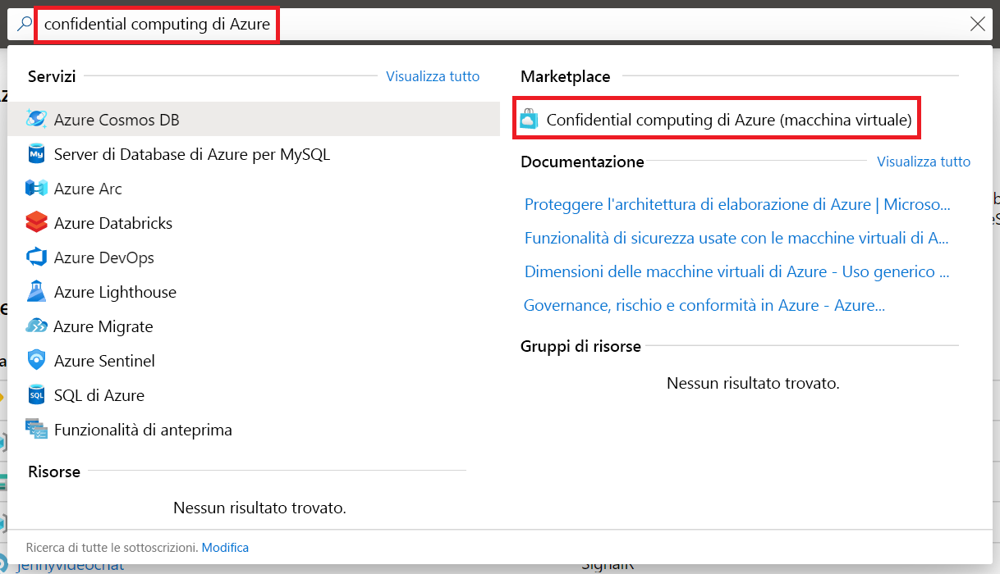

# <a name="quickstart-deploy-an-azure-confidential-computing-vm-in-the-marketplace"></a>Guida introduttiva: Distribuire una macchina virtuale di confidential computing di Azure nel Marketplace

Questo articolo illustra come creare una macchina virtuale (VM) di confidential computing supportata da Intel SGX con Azure Marketplace. Si installerà quindi Open Enclave SDK (Software Development Kit) per configurare l'ambiente di sviluppo. 

Questa esercitazione è raccomandata se si vuole avviare rapidamente la distribuzione di una macchina virtuale di confidential computing. Le VM vengono eseguite in hardware speciale e richiedono input di configurazione specifici per funzionare come previsto. L'offerta del Marketplace descritta in questo argomento di avvio rapido semplifica la distribuzione limitando l'input dell'utente.

Se si è interessati a distribuire una macchina virtuale di confidential computing con una configurazione più personalizzata, seguire la procedura per la [distribuzione di macchine virtuali di confidential computing nel portale di Azure](quick-create-portal.md).

## <a name="prerequisites"></a>Prerequisiti

Se non si ha una sottoscrizione di Azure, [creare un account](https://azure.microsoft.com/pricing/purchase-options/pay-as-you-go/) prima di iniziare.

> [!NOTE]
> Gli account di valutazione gratuiti non hanno accesso alle macchine virtuali usate in questa esercitazione. Eseguire l'aggiornamento a una sottoscrizione con pagamento in base al consumo.

## <a name="sign-in-to-azure"></a>Accedere ad Azure

1. Accedere al [portale di Azure](https://portal.azure.com/).

1. Nella barra di ricerca in alto digitare **Azure confidential computing**.

1. Selezionare **Azure confidential computing (Virtual Machine)** nella sezione **Marketplace**. 

        

1. Nella pagina di destinazione della distribuzione di confidential computing di Azure selezionare **Crea**.
 

## <a name="configure-your-virtual-machine"></a>Configurare la macchina virtuale

1. Nella scheda **Informazioni di base** selezionare le opzioni per **Sottoscrizione** e **Gruppo di risorse**. Il gruppo di risorse deve essere vuoto per distribuirvi una macchina virtuale da questo modello.

1. Digitare o selezionare i valori seguenti:

   * **Area**: selezionare l'area di Azure appropriata.

        > [!NOTE]
        > Le macchine virtuali di confidential computing vengono eseguite solo in hardware speciale disponibile in specifiche aree. Per informazioni aggiornate sulle aree disponibili per le VM serie DCsv2, vedere [Aree disponibili](https://azure.microsoft.com/global-infrastructure/services/?products=virtual-machines).
    
    * **Scegliere l'immagine**: selezionare qualsiasi immagine. Per completare questa esercitazione specifica, selezionare Ubuntu 18.04 (Gen 2). In caso contrario, si verrà reindirizzati alla procedura appropriata riportata di seguito. 

    * In **Nome macchina virtuale** immettere un nome per la nuova VM.

    * **Tipo di autenticazione**: Selezionare **Chiave pubblica SSH** se si crea una VM Linux. 

         > [!NOTE]
         > Per l'autenticazione, si può scegliere di usare una chiave pubblica SSH o una password. L'opzione più sicura è SSH. Per istruzioni su come generare una chiave SSH, vedere l'articolo su come [creare chiavi SSH in Linux e Mac per le VM Linux in Azure](../virtual-machines/linux/mac-create-ssh-keys.md).

    * **Nome utente**: immettere il nome dell'amministratore della macchina virtuale.

    * **Chiave pubblica SSH**: se applicabile, immettere la chiave pubblica RSA.
    
    * **Password**: se applicabile, immettere la password per l'autenticazione.
 
1. Fare clic sul pulsante **Avanti: Impostazioni macchina virtuale** nella parte inferiore dello schermo.

    > [!IMPORTANT]
    > Attendere l'aggiornamento della pagina. *Non dovrebbe* essere visualizzato un messaggio analogo a "Le VM serie DCsv2 di confidential computing sono disponibili in un numero limitato di aree". Se questo messaggio persiste, tornare nella pagina precedente e selezionare un'area in cui la serie DCsv2 è disponibile.

1. Per **Modifica dimensioni**, scegliere una macchina virtuale con funzionalità di confidential computing nel selettore di dimensioni. 

    > [!TIP]
    > Verranno visualizzate le dimensioni **DC1s_v2**, **DC2s_v2**, **DC4s_V2** e **DC8_v2**. Queste sono le uniche dimensioni di macchina virtuale che attualmente supportano il confidential computing. [Altre informazioni](virtual-machine-solutions.md)

1. Per **Tipo di disco del sistema operativo**, selezionare un tipo di disco.

1. Per **Rete virtuale**, scegliere una risorsa esistente o crearne una nuova.

1. Per **Subnet**, scegliere una risorsa esistente o crearne una nuova.

1. Per **Selezionare le porte in ingresso pubbliche**, scegliere **SSH(Linux)/RDP(Windows)** . In questo argomento di avvio rapido questo passaggio è necessario per connettersi alla VM e completare la configurazione di Open Enclave SDK. 

1. Per **Diagnostica di avvio**, lasciare l'opzione disabilitata per questo argomento di avvio rapido. 

1. Selezionare **Rivedi e crea**.

1. Nel riquadro **Rivedi e crea** selezionare **Crea**.

> [!NOTE]
> Procedere con la sezione successiva e continuare con questa esercitazione se è stata distribuita una VM Linux. Se è stata distribuita una VM Windows, [seguire questa procedura per connettersi alla VM Windows](../virtual-machines/windows/connect-logon.md) e quindi [installare OE SDK in Windows](https://github.com/openenclave/openenclave/blob/master/docs/GettingStartedDocs/install_oe_sdk-Windows.md).


## <a name="connect-to-the-linux-vm"></a>Connettersi alla VM Linux

Se si usa già una shell BASH, connettersi alla VM di Azure con il comando **ssh**. Nel comando seguente, sostituire il nome utente e l'indirizzo IP della VM per connettersi alla propria VM Linux.

```bash
ssh azureadmin@40.55.55.555
```

L'indirizzo IP pubblico della VM è disponibile nella relativa sezione Panoramica del portale di Azure.


Se l'esecuzione avviene in Windows e non si ha una shell BASH, installare un client SSH, ad esempio PuTTY.

1. [Scaricare e installare PuTTY](https://www.chiark.greenend.org.uk/~sgtatham/putty/download.html).

1. Eseguire PuTTY.

1. Nella schermata di configurazione di PuTTY immettere l'indirizzo IP pubblico della VM.

1. Selezionare **Apri** e immettere nome utente e password quando richiesto.

Per altre informazioni sulla connessione alle VM Linux, vedere l'articolo su come [creare una VM Linux in Azure con il portale](../virtual-machines/linux/quick-create-portal.md).

> [!NOTE]
> Se viene visualizzato un avviso di sicurezza PuTTY relativo alla mancata memorizzazione nella cache della chiave host del server, scegliere tra le opzioni seguenti. Se si considera attendibile l'host, selezionare **Sì** per aggiungere la chiave nella cache di PuTTy e continuare a la procedura di connessione. Se si vuole eseguire la connessione una sola volta, senza aggiungere la chiave nella cache, selezionare **No**. Se non si considera attendibile l'host, selezionare **Annulla** per abbandonare la connessione.

## <a name="install-the-open-enclave-sdk-oe-sdk"></a>Installare Open enclave SDK (OE SDK) <a id="Install"></a>

Seguire le istruzioni dettagliate per installare [OE SDK](https://github.com/openenclave/openenclave) nella macchina virtuale serie DCsv2 che esegue un'immagine Ubuntu 18.04 LTS Gen 2. 

Se la macchina virtuale è in esecuzione in Ubuntu 16.04 LTS Gen 2, è necessario seguire le [istruzioni per l'installazione di Ubuntu 16.04](https://github.com/openenclave/openenclave/blob/master/docs/GettingStartedDocs/install_oe_sdk-Ubuntu_16.04.md). 

#### <a name="1-configure-the-intel-and-microsoft-apt-repositories"></a>1. Configurare i repository Intel e Microsoft APT

```bash
echo 'deb [arch=amd64] https://download.01.org/intel-sgx/sgx_repo/ubuntu bionic main' | sudo tee /etc/apt/sources.list.d/intel-sgx.list
wget -qO - https://download.01.org/intel-sgx/sgx_repo/ubuntu/intel-sgx-deb.key | sudo apt-key add -

echo "deb http://apt.llvm.org/bionic/ llvm-toolchain-bionic-7 main" | sudo tee /etc/apt/sources.list.d/llvm-toolchain-bionic-7.list
wget -qO - https://apt.llvm.org/llvm-snapshot.gpg.key | sudo apt-key add -

echo "deb [arch=amd64] https://packages.microsoft.com/ubuntu/18.04/prod bionic main" | sudo tee /etc/apt/sources.list.d/msprod.list
wget -qO - https://packages.microsoft.com/keys/microsoft.asc | sudo apt-key add -
```

#### <a name="2-install-the-intel-sgx-dcap-driver"></a>2. Installare il driver DCAP di Intel SGX

```bash
sudo apt update
sudo apt -y install dkms
wget https://download.01.org/intel-sgx/sgx-dcap/1.4/linux/distro/ubuntuServer18.04/sgx_linux_x64_driver_1.21.bin -O sgx_linux_x64_driver.bin
chmod +x sgx_linux_x64_driver.bin
sudo ./sgx_linux_x64_driver.bin
```

> [!WARNING]
> Usare l'ultima versione del driver DCAP di Intel SGX disponibile sul [sito SGX di Intel](https://01.org/intel-software-guard-extensions/downloads).

#### <a name="3-install-the-intel-and-open-enclave-packages-and-dependencies"></a>3. Installare i pacchetti e le dipendenze di Intel e Open Enclave

```bash
sudo apt -y install clang-7 libssl-dev gdb libsgx-enclave-common libsgx-enclave-common-dev libprotobuf10 libsgx-dcap-ql libsgx-dcap-ql-dev az-dcap-client open-enclave
```

> [!NOTE] 
> Questo passaggio installa anche il pacchetto [az-dcap-client](https://github.com/microsoft/azure-dcap-client), che è necessario per l'esecuzione dell'attestazione remota in Azure.

#### <a name="4-verify-the-open-enclave-sdk-install"></a>4. **Verificare l'installazione di Open Enclave SDK**

Vedere le informazioni sull'[uso di Open Enclave SDK](https://github.com/openenclave/openenclave/blob/master/docs/GettingStartedDocs/Linux_using_oe_sdk.md) in GitHub per verificare e usare l'SDK installato.

## <a name="clean-up-resources"></a>Pulire le risorse

Quando non servono più, è possibile eliminare il gruppo di risorse, la macchina virtuale e tutte le risorse correlate. 

Selezionare il gruppo di risorse per la macchina virtuale, quindi fare clic su **Elimina**. Confermare il nome del gruppo di risorse da terminare eliminando le risorse.

## <a name="next-steps"></a>Passaggi successivi

In questo argomento di avvio rapido è stata distribuita una macchina virtuale di confidential computing ed è stato installato Open Enclave SDK. Per altre informazioni sulle macchine virtuali di confidential computing in Azure, vedere [Soluzioni nelle macchine virtuali](virtual-machine-solutions.md). 

Per altre informazioni su come creare applicazioni di confidential computing, continuare con gli esempi di Open Enclave SDK in GitHub. 

> [!div class="nextstepaction"]
> [Esempi di compilazione di Open Enclave SDK](https://github.com/openenclave/openenclave/blob/master/samples/README.md)
