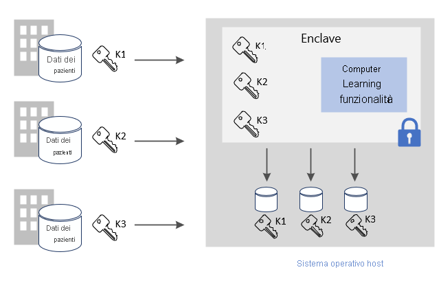
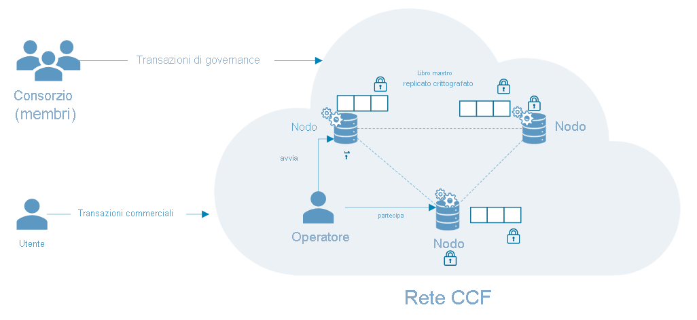

# Scenari comuni per il confidential computing di Azure

Questo articolo fornisce una panoramica di diversi scenari comuni per il confidential computing di Azure. I consigli forniti sono un punto di partenza per sviluppare applicazioni con i servizi e i framework di confidential computing. 

Alla fine della lettura, si avranno le risposte alle domande seguenti:

- Quali sono alcuni scenari per il confidential computing di Azure?
- Quali sono i vantaggi dell'uso del confidential computing di Azure per scenari che coinvolgono più parti?
- Quali sono i vantaggi dell'uso del confidential computing di Azure in una rete blockchain?

## Calcolo a parti multiple sicuro
Il confidential computing di Azure consente di elaborare i dati provenienti da più origini senza esporre i dati di input ad altre parti. Questo tipo di elaborazione sicura consente diversi scenari, come l'antiriciclaggio di denaro, il rilevamento delle frodi e l'analisi sicura dei dati sanitari.

Più origini possono caricare i propri dati in un'unica enclave in una macchina virtuale. Una parte indica all'enclave di eseguire operazioni di calcolo o elaborazione sui dati. Nessuna parte (neanche quella che esegue l'analisi) può effettivamente visualizzare i dati delle altre parti caricati nell'enclave. 

Nel calcolo a parti multiple sicuro i dati crittografati vengono inseriti nell'enclave, l'enclave decrittografa i dati usando una chiave, esegue l'analisi, ottiene un risultato e restituisce un risultato crittografato che una parte può decrittografare con la chiave designata. 

**Proteggere i dati in uso**: 
- Usare una macchina virtuale serie DCsv2 in Azure con il supporto di Intel SGX abilitato. Queste VM sono abilitate con ambienti TEE (Trusted Execution Environment) che proteggono e isolano parti dei dati e del codice dell'applicazione.
- Usare un SDK compatibile con l'enclave per creare un'enclave all'interno della macchina virtuale. I dati all'interno dell'enclave non verranno esposti a nessuno, neanche al provider delle VM. I dati nell'enclave verranno crittografati dal supporto hardware.
    - Ad esempio, è possibile usare [OE SDK](https://github.com/openenclave/openenclave) per l'elaborazione sul lato server. 

**Proteggere i dati in transito** 
- Usare il protocollo TLS attestato come canale protetto per garantire la sicurezza dei dati in transito.
- Il client garantisce che i dati vengano inviati solo al server protetto dall'enclave. 

**Proteggere i dati inattivi**
- Usare archivi dati protetti e sicuri per garantire la sicurezza dei dati inattivi. 

### Antiriciclaggio di denaro
In questo esempio di calcolo a parti multiple sicuro, più banche condividono dati tra loro senza esporre i dati personali dei clienti. Le banche eseguono analisi concordate sul set di dati sensibili combinati. L'analisi del set di dati aggregati può rilevare trasferimenti di denaro da parte di un utente tra più banche, senza che una banca acceda ai dati di un'altra banca.

Grazie al confidential computing, questi istituti finanziari possono aumentare i tassi di rilevamento delle frodi, risolvere gli scenari di riciclaggio di denaro, ridurre i falsi positivi e continuare a raccogliere informazioni utili dai set di dati più grandi. 

### Sviluppo di farmaci nel settore sanitario
Le strutture sanitarie partner contribuiscono a fornire set di dati sanitari privati per il training di un modello di Machine Learning. Ogni struttura può visualizzare solo il proprio set di dati. Nessun'altra struttura, e nemmeno il provider di servizi cloud, può visualizzare i dati o il modello di training. 

Tutte le strutture traggono vantaggio dall'utilizzo del modello sottoposto a training. Più sono i dati con cui si crea il modello e più il modello diventa accurato. Ogni struttura che ha contribuito al training del modello può usarlo e ricevere risultati utili. 

## Blockchain

Una rete blockchain è una rete di nodi decentralizzata. Questi nodi vengono eseguiti e gestiti da operatori o validator che vogliono garantire l'integrità e raggiungere il consenso sullo stato della rete. I nodi stessi sono repliche di libri mastro e vengono usati per tenere traccia delle transazioni blockchain. Ogni nodo dispone di una copia completa della cronologia delle transazioni, in modo da garantire l'integrità e la disponibilità in una rete distribuita.

Le tecnologie blockchain basate sul confidential computing possono usare la privacy basata su hardware per abilitare la riservatezza dei dati e l'elaborazione sicura. In alcuni casi, l'intero libro mastro viene crittografato per salvaguardare l'accesso ai dati. A volte la transazione stessa può essere eseguita all'interno di un modulo di calcolo all'interno dell'enclave nel nodo.

### CCF (Confidential Consortium Framework)
[CCF](https://www.microsoft.com/research/project/confidential-consortium-framework/) è un esempio di framework blockchain distribuito basato sul confidential computing di Azure. Questo framework, con Microsoft Research in testa, sfrutta la potenza degli ambienti TEE per creare una rete di enclave remote per l'attestazione. I nodi possono essere eseguiti su macchine virtuali di Azure ([serie DCsv2](confidential-computing-enclaves.md)) e sfruttare l'infrastruttura delle enclave. Tramite i protocolli di attestazione, gli utenti della blockchain possono verificare l'integrità di un singolo nodo CCF ed effettuare una verifica effettiva dell'intera rete. 

In CCF, il libro mastro decentralizzato è costituito da modifiche registrate a un archivio chiave-valore che viene replicato in tutti i nodi di rete. Ognuno di questi nodi esegue un motore di transazione che può essere attivato dagli utenti della blockchain tramite TLS. Quando si attiva un endpoint, l'archivio chiave-valore viene modificato. Prima che la modifica crittografata venga registrata nel libro mastro decentralizzato, è necessario raggiungere il consenso di un determinato numero di nodi. 

## Passaggi successivi
[Distribuire](quick-create-marketplace.md) una macchina virtuale serie DCsv2.

