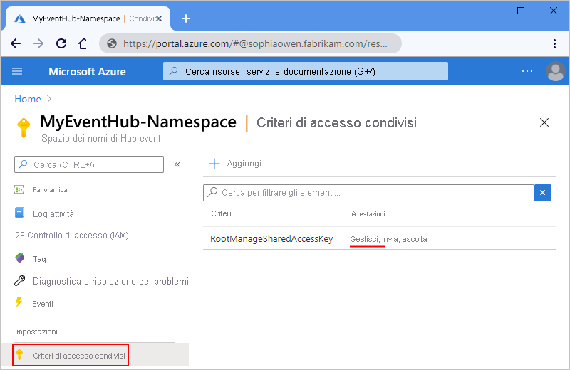
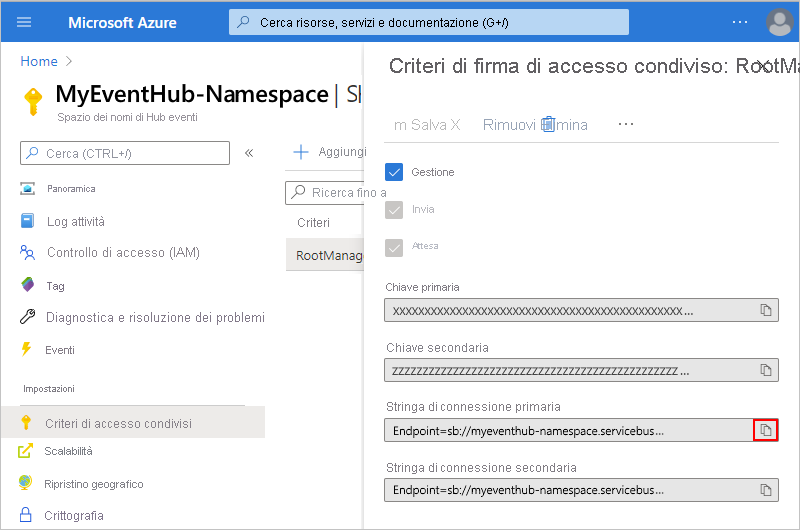
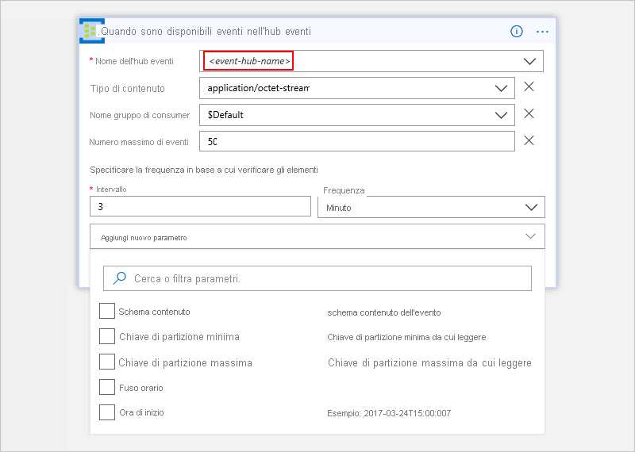

# Monitorare, ricevere e inviare eventi con il connettore di Hub eventi

Per configurare il monitoraggio degli eventi in modo che un'app per la logica possa rilevare, ricevere e inviare eventi, connettersi a un [hub eventi di Azure](https://azure.microsoft.com/services/event-hubs) dall'app per la logica. Altre informazioni su [Hub eventi di Azure](../event-hubs/event-hubs-what-is-event-hubs.md).

## Requisiti

* È necessario avere uno [spazio dei nomi di Hub eventi e un hub eventi](../event-hubs/event-hubs-create.md) in Azure. Leggere le informazioni su [come creare uno spazio dei nomi di Hub eventi e un hub eventi](../event-hubs/event-hubs-create.md). 

* Per usare [qualsiasi connettore](https://docs.microsoft.com/azure/connectors/apis-list) nell'app per la logica, è prima necessario creare un'app per la logica. Leggere le informazioni su [come creare un'app per la logica](../logic-apps/logic-apps-create-a-logic-app.md).

## Controllare le autorizzazioni dello spazio dei nomi di Hub eventi e trovare la stringa di connessione

Per consentire all'app per la logica di accedere a qualsiasi servizio, è necessario creare una [*connessione*](./connectors-overview.md) tra l'app per la logica e il servizio, se non è già presente. Questa connessione autorizza l'app per la logica ad accedere ai dati.
Affinché l'app per la logica possa accedere all'hub eventi, è necessario avere le autorizzazioni di**** gestione e la stringa di connessione per lo spazio dei nomi di Hub eventi.

Per controllare le autorizzazioni e ottenere la stringa di connessione, seguire questa procedura.

1.  Accedere al [Portale di Azure](https://portal.azure.com "Portale di Azure"). 

2.  Passare allo *spazio dei nomi* di Hub eventi, non all'hub eventi specifico. Nel pannello dello spazio dei nomi scegliere **Criteri di accesso condivisi** in **Impostazioni**. In **Attestazioni** controllare di avere le autorizzazioni di**** gestione per lo spazio dei nomi.

    

3.  Per copiare la stringa di connessione per lo spazio dei nomi di Hub eventi, scegliere **RootManageSharedAccessKey**. Accanto alla stringa di connessione della chiave primaria scegliere il pulsante Copia.

    

    > [!TIP]
    > Per verificare se la stringa di connessione è associata allo spazio dei nomi di Hub eventi o a un hub eventi specifico, controllare se nella stringa è presente il parametro `EntityPath`. Se questo parametro è presente, la stringa di connessione è per un'entità hub eventi specifica e non è la stringa corretta da usare con l'app per la logica.

4.  Quando vengono chieste le credenziali dopo l'aggiunta di un trigger o un'azione di Hub eventi per l'app per la logica, è possibile connettersi allo spazio dei nomi di Hub eventi. Assegnare un nome alla connessione, immettere la stringa di connessione copiata e quindi scegliere **Crea**.

    

    Dopo aver creato la connessione, il nome della connessione dovrebbe venire visualizzato nel trigger o nell'azione di Hub eventi. 
    È quindi possibile continuare con gli altri passaggi nell'app per la logica.

    

## Avviare il flusso di lavoro quando l'hub eventi riceve nuovi eventi

Un [*trigger*](../logic-apps/logic-apps-what-are-logic-apps.md#logic-app-concepts) è un evento che avvia un flusso di lavoro nell'app per la logica. Per avviare un flusso di lavoro quando nuovi eventi vengono inviati all'hub eventi, seguire questa procedura per l'aggiunta del trigger che rileva questo evento.

1.  Nel [portale di Azure](https://portal.azure.com "portale di Azure") passare all'app per la logica esistente o creare un'app per la logica vuota.

2.  Nella casella di ricerca della finestra di progettazione dell'app per la logica immettere `event hubs` come filtro. Selezionare il trigger: **Quando sono disponibili eventi nell'hub eventi**

    

    Se non è ancora stata stabilita una connessione allo spazio dei nomi di Hub eventi, a questo punto viene chiesto di creare la connessione. Assegnare un nome alla connessione e immettere la stringa di connessione per lo spazio dei nomi di Hub eventi. 
    Se necessario, leggere [come trovare la stringa di connessione](#permissions-connection-string).

    

    Dopo aver creato la connessione, vengono visualizzate le impostazioni per il trigger **Quando sono disponibili eventi nell'hub eventi**.

    

3.  Immettere o selezionare il nome dell'hub di eventi da monitorare. Selezionare la frequenza e l'intervallo con cui si vuole controllare l'hub eventi.

    > [!TIP]
    > Per selezionare facoltativamente un gruppo di consumer per la lettura degli eventi, scegliere **Mostra opzioni avanzate**. 

    

    A questo punto è stato impostato un trigger per avviare un flusso di lavoro per l'app per la logica. 
    L'app per la logica controlla l'hub eventi specificato in base alla pianificazione impostata. 
    Se l'app trova nuovi eventi nell'hub eventi, il trigger esegue altre azioni o trigger nell'app per la logica.

## Inviare eventi all'hub eventi dall'app per la logica

Un'[*azione*](../logic-apps/logic-apps-what-are-logic-apps.md#logic-app-concepts) è un'attività eseguita dal flusso di lavoro dell'app per la logica. Dopo avere aggiunto un trigger all'app per la logica, è possibile aggiungere un'azione per eseguire operazioni con i dati generati da tale trigger. Per inviare un evento all'hub eventi dall'app per la logica, seguire questa procedura.

1.  Nella finestra di progettazione dell'app per la logica scegliere **Nuovo passaggio** > **Aggiungi un'azione** sotto il trigger dell'app per la logica.

    

    A questo punto è possibile trovare e selezionare un'azione da eseguire. 
    Anche se è possibile selezionare qualsiasi azione, in questo esempio si vuole che l'azione di Hub eventi corrisponda all'invio degli eventi.

2.  Nella casella di ricerca immettere `event hubs` come filtro.
Selezionare questa azione: **Invia evento**

    

3.  Immettere i dettagli richiesti per l'evento, ad esempio il nome dell'hub eventi a cui si vuole inviare l'evento. Immettere eventuali altri dettagli facoltativi sull'evento, ad esempio il contenuto dell'evento.

    > [!TIP]
    > Se si vuole specificare la partizione dell'hub eventi dove inviare l'evento, scegliere **Mostra opzioni avanzate**. 

    

6.  Salvare le modifiche.

    

    A questo punto è stata configurata un'azione per inviare gli eventi dall'app per la logica. 

## Dettagli specifici del connettore

Per visualizzare eventuali azioni e trigger definiti in Swagger ed eventuali limiti, vedere i [dettagli del connettore](/connectors/eventhubs/). 

## Ottenere aiuto

Per porre domande, fornire risposte e ottenere informazioni sulle attività degli altri utenti delle app per la logica di Azure, vedere il [forum sulle app per la logica di Azure](https://social.msdn.microsoft.com/Forums/en-US/home?forum=azurelogicapps).

Per contribuire al miglioramento delle app per la logica e dei connettori, votare o inviare idee al [sito dei commenti e suggerimenti degli utenti delle app per la logica](http://aka.ms/logicapps-wish).

## Passaggi successivi

*  [Trovare altri connettori per App per la logica di Azure](./apis-list.md)
