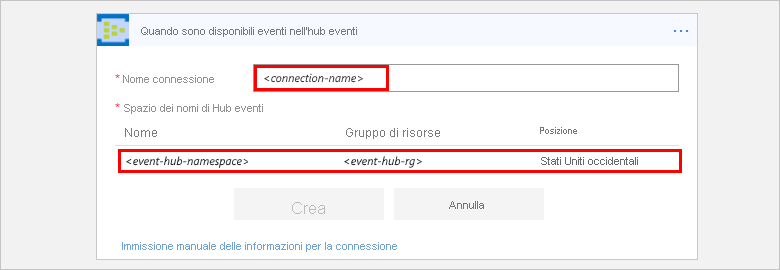
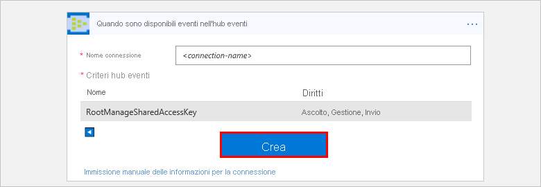

# Monitorare, ricevere e inviare eventi con il connettore di Hub eventi

Per configurare il monitoraggio degli eventi in modo che un'app per la logica possa rilevare, ricevere e inviare eventi, connettersi a un [hub eventi di Azure](https://azure.microsoft.com/services/event-hubs) dall'app per la logica. Altre informazioni su [Hub eventi di Azure](../event-hubs/event-hubs-what-is-event-hubs.md) e sul [funzionamento dei prezzi per i connettori di App per la logica](../logic-apps/logic-apps-pricing.md).

## prerequisiti

Prima di poter usare il connettore di Hub eventi, è necessario disporre degli elementi seguenti:

* Uno [spazio dei nomi di Hub eventi di Azure e Hub eventi](../event-hubs/event-hubs-create.md)
* Un'[app per la logica](../logic-apps/quickstart-create-first-logic-app-workflow.md)

## Connettersi a Hub eventi di Azure

Prima che l'app per la logica possa accedere a qualsiasi servizio, è necessario creare una [*connessione*](./connectors-overview.md) tra l'app per la logica e il servizio, se non è già presente. Questa connessione autorizza l'app per la logica ad accedere ai dati. Affinché l'app per la logica possa accedere a Hub eventi, verificare le autorizzazioni e ottenere la stringa di connessione per lo spazio dei nomi di Hub eventi.

1.  Accedere al [Portale di Azure](https://portal.azure.com "Portale di Azure"). 

2.  Passare allo *spazio dei nomi* di Hub eventi, non a un hub eventi specifico. Nella pagina dello spazio dei nomi scegliere **Criteri di accesso condivisi** in **Impostazioni**. In **Attestazioni** controllare di avere le autorizzazioni di **gestione** per lo spazio dei nomi.

    

3. Se si vogliono immettere in un secondo momento le informazioni di connessione manualmente, ottenere la stringa di connessione per lo spazio dei nomi di Hub eventi. Scegliere **RootManageSharedAccessKey**. Accanto alla stringa di connessione della chiave primaria scegliere il pulsante Copia. Salvare la stringa di connessione per usarla successivamente.

    

    > [!TIP]
    > Per verificare se la stringa di connessione è associata allo spazio dei nomi di Hub eventi o a un hub eventi specifico, controllare se nella stringa è presente il parametro `EntityPath`. Se questo parametro è presente, la stringa di connessione è per un'entità hub eventi specifica e non è la stringa corretta da usare con l'app per la logica.

## Attivare il flusso di lavoro quando Hub eventi ottiene nuovi eventi

Un [*trigger*](../logic-apps/logic-apps-overview.md#logic-app-concepts) è un evento che avvia un flusso di lavoro nell'app per la logica. Per avviare un flusso di lavoro quando nuovi eventi vengono inviati all'hub eventi, seguire questa procedura per l'aggiunta del trigger che rileva questo evento.

1. Nel [portale di Azure](https://portal.azure.com "portale di Azure") passare all'app per la logica esistente o creare un'app per la logica vuota.

2. Nella casella di ricerca della finestra di progettazione di App per la logica immettere "hub eventi" come filtro. Selezionare il trigger: **Quando sono disponibili eventi nell'hub eventi**

   

   1. Se non è ancora stata stabilita una connessione allo spazio dei nomi di Hub eventi, a questo punto viene chiesto di creare la connessione. Assegnare un nome alla connessione e selezionare lo spazio dei nomi di Hub eventi che si vuole usare.

      

      In alternativa, per immettere manualmente la stringa di connessione, scegliere **Immettere manualmente le informazioni sulla connessione**. 
      Leggere [come trovare la stringa di connessione](#permissions-connection-string).

   2. A questo punto selezionare i criteri di Hub eventi da usare e scegliere **Crea**.

      

3. Selezionare l'hub eventi da monitorare e configurare l'intervallo e la frequenza con cui si vuole controllare Hub eventi.

    
    
    > [!NOTE]
    > Tutti i trigger dell'hub eventi sono trigger con *polling prolungato*. Questo significa che, quando un trigger viene attivato, elabora tutti gli eventi e attende 30 secondi che vengano visualizzati altri eventi nell'hub eventi.
    > Se non si ricevono eventi per 30 secondi, l'esecuzione del trigger viene ignorata. In caso contrario, il trigger continua a leggere gli eventi finché l'hub eventi non è vuoto.
    > Il polling successivo si baserà sull'intervallo di ricorrenza specificato nelle proprietà del trigger.

4. Se si vogliono selezionare alcune delle opzioni di trigger avanzate, scegliere **Mostra opzioni avanzate**.

    

    | Proprietà | Dettagli |
    | --- | --- |
    | Tipo di contenuto  |Selezionare il tipo di contenuto degli eventi nell'elenco a discesa. Per impostazione predefinita, è selezionato application/octet-stream. |
    | Content schema (Schema contenuto) |Immettere lo schema contenuto in formato JSON per gli eventi che vengono letti dall'hub eventi. |
    | Consumer group name (Nome gruppo di consumer) |Immettere il [nome del gruppo di consumer](../event-hubs/event-hubs-features.md#consumer-groups) dell'hub eventi per leggere gli eventi. Se il nome del gruppo di consumer non viene specificato, viene usato il gruppo di consumer predefinito. |
    | Minimum partition key (Chiave di partizione minima) |Immettere l'ID di [partizione](../event-hubs/event-hubs-features.md#partitions) minima da leggere. Per impostazione predefinita, vengono lette tutte le partizioni. |
    | Maximum partition key (Chiave di partizione massima) |Immettere l'ID di [partizione](../event-hubs/event-hubs-features.md#partitions) massima da leggere. Per impostazione predefinita, vengono lette tutte le partizioni. |
    | Maximum events count (Numero massimo di eventi) |Immettere un valore per il numero massimo di eventi. Il trigger restituisce un valore compreso tra uno e il numero di eventi specificato da questa proprietà. |
    |||

5. Salvare l'app per la logica. Nella barra degli strumenti della finestra di progettazione scegliere **Salva**.

A questo punto, quando l'app per la logica controlla l'hub eventi selezionato e trova un nuovo evento, il trigger esegue le azioni nell'app per la logica per l'evento rilevato.

## Inviare eventi all'hub eventi dall'app per la logica

Un'[*azione*](../logic-apps/logic-apps-overview.md#logic-app-concepts) è un'attività eseguita dal flusso di lavoro dell'app per la logica. Dopo avere aggiunto un trigger all'app per la logica, è possibile aggiungere un'azione per eseguire operazioni con i dati generati da tale trigger. Per inviare un evento all'hub eventi dall'app per la logica, seguire questa procedura.

1. Nella finestra di progettazione di App per la logica scegliere **Nuovo passaggio** > **Aggiungi un'azione** sotto il trigger.

2. Nella casella di ricerca immettere "hub eventi" come filtro.
Selezionare l'azione **Hub eventi - Invia evento**.

   

3. Selezionare l'hub eventi dove inviare l'evento. Immettere quindi il contenuto dell'evento ed eventuali altri dettagli.

   

4. Salvare l'app per la logica.

A questo punto è stata configurata un'azione che invia eventi dall'app per la logica. 

## Dettagli specifici del connettore

Per altre informazioni sui trigger e le azioni definiti dal file Swagger ed eventuali limiti, rivedere i [dettagli del connettore](/connectors/eventhubs/).

## Supporto

* In caso di domande, visitare il [forum di App per la logica di Azure](https://social.msdn.microsoft.com/Forums/en-US/home?forum=azurelogicapps).
* Per votare o inviare idee relative alle funzionalità, visitare il [sito dei commenti e suggerimenti degli utenti di App per la logica](http://aka.ms/logicapps-wish).

## Passaggi successivi

* Altre informazioni su [altri connettori per App per la logica di Azure](../connectors/apis-list.md)