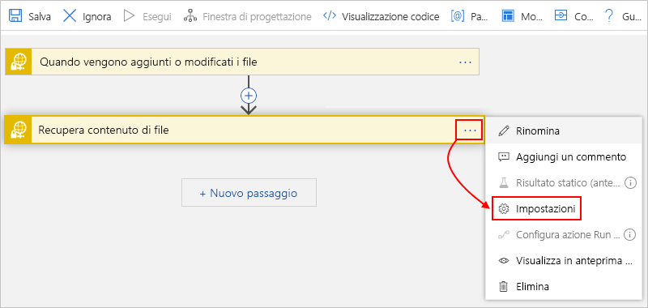

# Monitorare, creare e gestire i file SFTP usando SSH e App per la logica di Azure

Per automatizzare le attività che monitorano, creano, inviano e ricevono file in un server [SFTP (Secure File Transfer Protocol)](https://www.ssh.com/ssh/sftp/) usando il protocollo [SSH (Secure Shell)](https://www.ssh.com/ssh/protocol/), è possibile creare e automatizzare i flussi di lavoro di integrazione usando App per la logica di Azure e il connettore SFTP-SSH. SFTP è un protocollo di rete che fornisce l'accesso ai file, il trasferimento di file e la gestione di file su qualsiasi flusso di dati affidabile.

> [!NOTE]
> Il connettore SFTP-SSH attualmente non supporta questi server SFTP:
> 
> * IBM DataPower
> * MessageWay
> * OpenText Secure MFT
> * Serie GXS OpenText

Ecco alcuni esempi di attività che è possibile automatizzare:

* Monitorare quando i file vengono aggiunti o modificati.
* Ottenere, creare, copiare, rinominare, aggiornare, creare elenchi ed eliminare file.
* Creare cartelle.
* Leggere contenuti e metadati dei file.
* Estrarre archivi nella cartella.

È possibile usare trigger che monitorano eventi sul server SFTP e rendere disponibile l'output per altre azioni. È possibile usare azioni che eseguono varie attività sul server SFTP. Si può anche fare in modo che altre azioni dell'app per la logica usino l'output delle azioni SFTP. Se ad esempio si recuperano regolarmente file dal server SFTP, è possibile inviare avvisi su tali file e sul relativo contenuto tramite posta elettronica usando il connettore Outlook di Office 365 o Outlook.com. Se non si ha familiarità con le app per la logica, consultare [Informazioni su App per la logica di Azure](../logic-apps/logic-apps-overview.md)

Per le differenze tra il connettore SFTP-SSH e il connettore SFTP, vedere la sezione [confrontare SFTP-SSH rispetto a SFTP](#comparison) più avanti in questo argomento.

## Limiti

* Le azioni SFTP-SSH che supportano la [suddivisione in blocchi](../logic-apps/logic-apps-handle-large-messages.md) possono gestire file fino a 1 GB, mentre le azioni SFTP-SSH che non supportano la suddivisione in blocchi possono gestire file fino a 50 MB. Sebbene le dimensioni predefinite del blocco siano pari a 15 MB, questa dimensione può variare in modo dinamico, a partire da 5 MB e aumentando gradualmente fino al valore massimo di 50 MB, in base a fattori quali la latenza di rete, il tempo di risposta del server e così via.

  > [!NOTE]
  > Per le app per la logica in un [ambiente Integration Services (ISE)](../logic-apps/connect-virtual-network-vnet-isolated-environment-overview.md), questa versione con etichetta ISE del connettore richiede la suddivisione in blocchi per usare invece i [limiti dei messaggi di ISE](../logic-apps/logic-apps-limits-and-config.md#message-size-limits) .

  È possibile eseguire l'override di questo comportamento adattivo quando si [specificano le dimensioni del blocco costante](#change-chunk-size) da usare. Questa dimensione può variare da 5 MB a 50 MB. Si supponga, ad esempio, di disporre di un file di 45 MB e di una rete in grado di supportare le dimensioni del file senza latenza. La suddivisione in blocchi adattiva comporta diverse chiamate, invece di una chiamata. Per ridurre il numero di chiamate, è possibile provare a impostare una dimensione di blocco di 50 MB. In uno scenario diverso, se l'app per la logica sta per scadere, ad esempio quando si usano 15 MB di blocchi, è possibile provare a ridurne le dimensioni a 5 MB.

  Le dimensioni del blocco sono associate a una connessione, il che significa che è possibile usare la stessa connessione per le azioni che supportano la suddivisione in blocchi e quindi per le azioni che non supportano la suddivisione in blocchi. In questo caso, le dimensioni del blocco per le azioni che non supportano la suddivisione in blocchi variano da 5 MB a 50 MB. Questa tabella mostra le azioni SFTP-SSH che supportano la suddivisione in blocchi:

  | Azione | Supporto per la suddivisione in blocchi | Sostituisci supporto dimensioni blocco |
  |--------|------------------|-----------------------------|
  | **Copia file** | No | Non applicabile |
  | **Crea file** | Sì | Sì |
  | **Crea cartella** | Non applicabile | Non applicabile |
  | **Elimina file** | Non applicabile | Non applicabile |
  | **Estrai archivio nella cartella** | Non applicabile | Non applicabile |
  | **Recupera contenuto di file** | Sì | Sì |
  | **Recupera contenuto di file tramite percorso** | Sì | Sì |
  | **Ottenere i metadati del file** | Non applicabile | Non applicabile |
  | **Recupera metadati di file tramite percorso** | Non applicabile | Non applicabile |
  | **Elenca i file nella cartella** | Non applicabile | Non applicabile |
  | **Rinomina file** | Non applicabile | Non applicabile |
  | **Aggiorna file** | No | Non applicabile |
  ||||

* I trigger SFTP-SSH non supportano la suddivisione in blocchi del messaggio. Quando si richiede il contenuto del file, i trigger selezionano solo i file di 15 MB o inferiori. Per ottenere file di dimensioni superiori a 15 MB, seguire invece questo modello:

  1. Usare un trigger SFTP-SSH che restituisce solo le proprietà del file, ad esempio **quando un file viene aggiunto o modificato (solo proprietà)**.

  1. Seguire il trigger con l'azione SFTP-SSH **get file content** , che legge il file completo e USA in modo implicito la suddivisione in blocchi dei messaggi.

## SFTP-SSH e SFTP a confronto

Questa sezione illustra altre differenze importanti tra il connettore SFTP-SSH e il connettore SFTP. SFTP-SSH offre queste funzionalità:

* Usa la [libreria SSH.NET](https://github.com/sshnet/SSH.NET), una libreria SSH (open source Secure Shell) che supporta .NET.

* Fornisce l'azione **Crea cartella** che crea una cartella nel percorso specificato nel server SFTP.

* Fornisce l'azione **Rinomina file** che rinomina un file nel server SFTP.

* Memorizza nella cache la connessione al server SFTP *per un massimo di un'ora*, migliorando così le prestazioni e riducendo il numero di tentativi di connessione al server. Per impostare la durata di questo comportamento di memorizzazione nella cache, modificare la proprietà [**ClientAliveInterval**](https://man.openbsd.org/sshd_config#ClientAliveInterval) nella configurazione di SSH sul server SFTP.

## Prerequisiti

* Una sottoscrizione di Azure. Se non si ha una sottoscrizione di Azure, [iscriversi per creare un account Azure gratuito](https://azure.microsoft.com/free/).

* L'indirizzo del server SFTP e le credenziali dell'account che consentono all'app per la logica di accedere all'account SFTP. È anche necessario accedere a una chiave privata SSH e alla password della chiave privata SSH. Per utilizzare la suddivisione in blocchi durante il caricamento di file di grandi dimensioni, è necessario disporre delle autorizzazioni di lettura e scrittura per la cartella radice sul server SFTP. In caso contrario, viene ricevuto un errore "401 non autorizzato".

  > [!IMPORTANT]
  >
  > Il connettore SFTP-SSH supporta *solo* questi formati di chiave privata, algoritmi e impronte digitali:
  >
  > * **Formati di chiave privata**: chiavi RSA (Rivet Shamir Adleman) e DSA (Digital Signature Algorithm) nei formati OpenSSH e SSH.com. Se la chiave privata è in formato di file PuTTy (con estensione PPK), [convertire prima la chiave nel formato di file OpenSSH (con estensione PEM)](#convert-to-openssh).
  >
  > * **Algoritmi di crittografia**: DES-EDE3-CBC, DES-EDE3-CFB, DES-CBC, AES-128-CBC, AES-192-CBC e AES-256-CBC
  >
  > * **Impronta digitale**: MD5
  >
  > Dopo aver aggiunto il trigger SFTP-SSH o l'azione desiderata per l'app per la logica, è necessario fornire le informazioni di connessione per il server SFTP. Quando si specifica la chiave privata SSH per questa connessione, ***non immettere o modificare manualmente la chiave***, il che potrebbe causare l'esito negativo della connessione. Al contrario, assicurarsi di ***copiare la chiave*** dal file di chiave privata SSH e ***incollare*** la chiave nei dettagli della connessione. 
  > Per altre informazioni, vedere la sezione [connettersi a SFTP con SSH](#connect) più avanti in questo articolo.

* Conoscenza di base di [come creare le app per la logica](../logic-apps/quickstart-create-first-logic-app-workflow.md)

* L'app per la logica in cui si vuole accedere all'account SFPT. Per iniziare con un trigger SFTP-SSH, [creare un'app per la logica vuota](../logic-apps/quickstart-create-first-logic-app-workflow.md). Per usare un'azione SFTP-SSH, avviare l'app per la logica con un altro trigger, ad esempio il trigger **Ricorrenza**.

## Funzionamento dei trigger SFTP-SSH

I trigger SFTP-SSH funzionano eseguendo il polling del file system SFTP e cercando eventuali file modificati dopo l'ultimo polling. Alcuni strumenti consentono di mantenere il timestamp quando i file vengono modificati. In questi casi è necessario disabilitare questa funzionalità per consentire il funzionamento del trigger. Ecco alcune delle impostazioni comuni:

| Client SFTP | Azione |
|-------------|--------|
| Winscp | Vai a **Opzioni**  >  **Preferenze**  >  **trasferimento**  >  **modifica**  >  **Mantieni timestamp**  >  **Disabilita** |
| FileZilla | Vai al **trasferimento**  >  **Mantieni i timestamp dei file trasferiti**  >  **Disabilita** |
|||

Quando un trigger rileva un nuovo file, controlla che sia completo e non parzialmente scritto. Ad esempio, un file potrebbe avere delle modifiche in corso nel momento in cui il trigger controlla il file server. Per evitare la restituzione di un file scritto parzialmente, il trigger prende nota del timestamp del file che contiene le modifiche recenti ma non restituisce immediatamente il file. Il trigger restituisce il file solo durante il nuovo polling del server. In alcuni casi, questo comportamento potrebbe causare un ritardo fino a un massimo del doppio dell'intervallo di polling del trigger.

## Convertire la chiave basata su PuTTy in OpenSSH

Se la chiave privata è in formato PuTTy, che usa l'estensione del nome di file. PPK (PuTTy Private Key), convertire prima la chiave nel formato OpenSSH, che usa l'estensione di file PEM (Privacy Enhanced Mail).

### Sistema operativo basato su UNIX

1. Se gli strumenti PuTTy non sono già installati nel sistema, procedere ora, ad esempio:

   `sudo apt-get install -y putty`

1. Eseguire questo comando, che crea un file che è possibile usare con il connettore SFTP-SSH:

   `puttygen <path-to-private-key-file-in-PuTTY-format> -O private-openssh -o <path-to-private-key-file-in-OpenSSH-format>`

   Ad esempio:

   `puttygen /tmp/sftp/my-private-key-putty.ppk -O private-openssh -o /tmp/sftp/my-private-key-openssh.pem`

### Sistema operativo Windows

1. Se non è già stato fatto, [scaricare lo strumento del generatore PuTTY (puttygen.exe) più recente](https://www.chiark.greenend.org.uk/~sgtatham/putty/latest.html)e quindi avviare lo strumento.

1. In questa schermata selezionare **carica**.

   

1. Passare al file di chiave privata in formato PuTTy e selezionare **Apri**.

1. Nel menu **conversioni** selezionare **Esporta chiave OpenSSH**.

   

1. Salvare il file di chiave privata con l' `.pem` estensione del nome file.

## Considerazioni

Questa sezione descrive le considerazioni da considerare per i trigger e le azioni di questo connettore.

### Crea file

Per creare un file nel server SFTP, è possibile usare l'azione di **creazione file** SFTP-SSH. Quando questa azione crea il file, il servizio app per la logica chiama automaticamente anche il server SFTP per ottenere i metadati del file. Tuttavia, se si sposta il file appena creato prima che il servizio app per la logica possa effettuare la chiamata per ottenere i metadati, viene ricevuto un `404` messaggio di errore `'A reference was made to a file or folder which does not exist'` . Per ignorare la lettura dei metadati del file dopo la creazione del file, seguire i passaggi per [aggiungere e impostare la proprietà **Ottieni tutti i metadati del file** su **No**](#file-does-not-exist).

## Connettersi a SFTP con SSH

[!INCLUDE [Create connection general intro](../../includes/connectors-create-connection-general-intro.md)]

1. Accedere al [portale di Azure](https://portal.azure.com) e aprire l'app per la logica in Progettazione app per la logica, se non è già aperta.

1. Per le app per la logica vuote, nella casella di ricerca immettere `sftp ssh` come filtro. Nell'elenco dei trigger selezionare il trigger desiderato.

   -oppure-

   Per le app per la logica esistenti, nell'ultimo passaggio in cui si vuole aggiungere un'azione selezionare **nuovo passaggio**. Nella casella di ricerca immettere `sftp ssh` come filtro. Nell'elenco delle azioni selezionare l'azione desiderata.

   Per aggiungere un'azione tra i passaggi, spostare il puntatore del mouse sulla freccia tra i passaggi. Selezionare il segno più ( **+** ) visualizzato e quindi **Aggiungi un'azione**.

1. Specificare le informazioni necessarie per la connessione.

   > [!IMPORTANT]
   >
   > Quando si immette la chiave privata SSH nella proprietà **Chiave privata SSH**, seguire questi passaggi aggiuntivi che consentono di assicurarsi di specificare il valore completo e corretto per questa proprietà. Una chiave non valida provoca un errore di connessione.

   Anche se è possibile usare qualsiasi editor di testo, ecco i passaggi esemplificativi che mostrano come copiare e incollare la chiave usando Notepad.exe.

   1. Aprire il file della chiave privata SSH in un editor di testo. In questi passaggi viene usato il Blocco note come esempio.

   1. Scegliere **Seleziona tutto**dal menu **modifica** del blocco note.

   1. Selezionare **modifica**  >  **copia**.

   1. Nell'azione o nel trigger SFTP-SSH aggiunto, incollare la chiave *completa* copiata nella proprietà **Chiave privata SSH** che supporta più righe.  ***Assicurarsi di incollare*** la chiave. ***Non immettere o modificare manualmente la chiave***.

1. Al termine dell'immissione dei dettagli della connessione, selezionare **Crea**.

1. Specificare ora i dettagli necessari per l'azione o il trigger selezionato e continuare a creare il flusso di lavoro dell'app per la logica.

## Sostituisci dimensioni blocco

Per eseguire l'override del comportamento adattivo predefinito usato per la suddivisione in blocchi, è possibile specificare una dimensione di blocco costante da 5 MB a 50 MB.

1. Nell'angolo superiore destro dell'azione selezionare il pulsante con i puntini di sospensione (**...**) e quindi selezionare **Impostazioni**.

   

1. In **trasferimento contenuto**, nella proprietà **dimensioni blocco** , immettere un valore intero compreso tra `5` e `50` , ad esempio: 

   

1. Al termine, fare clic su **Fine**.

## Esempi

### Trigger SFTP-SSH: Quando viene aggiunto o modificato un file

Questo trigger avvia il flusso di lavoro di un'app per la logica quando viene aggiunto o modificato un file in un server SFTP. È ad esempio possibile aggiungere una condizione che controlla il contenuto del file e lo recupera in base al fatto che soddisfi una condizione specificata. Si può quindi aggiungere un'azione che recupera il contenuto del file e lo inserisce in una cartella del server SFTP.

**Esempio riguardante un'organizzazione**: si potrebbe usare questo trigger per monitorare una cartella SFTP per nuovi file di ordini dei clienti. Si può quindi usare un'azione SFTP come **Ottieni contenuto file** per recuperare il contenuto dell'ordine, elaborarlo ulteriormente e archiviarlo nel database degli ordini.

### SFTP-azione SSH: ottenere il contenuto del file tramite il percorso

Questa azione ottiene il contenuto da un file in un server SFTP specificando il percorso del file. Ad esempio, è possibile aggiungere il trigger dell'esempio precedente e una condizione che il contenuto del file deve soddisfare. Se la condizione è true, è possibile eseguire l'azione che recupera il contenuto.

## Risolvere gli errori

In questa sezione vengono descritte le possibili soluzioni per errori o problemi comuni.

### 404 errore: "è stato fatto riferimento a un file o a una cartella che non esiste"

Questo errore può verificarsi quando l'app per la logica crea un nuovo file nel server SFTP tramite l'azione di **creazione file** SFTP-SSH, ma il file appena creato viene spostato immediatamente prima che il servizio app per la logica possa ottenere i metadati del file. Quando l'app per la logica esegue l'azione **Crea file** , il servizio app per la logica chiama automaticamente anche il server SFTP per ottenere i metadati del file. Tuttavia, se il file viene spostato, il servizio app per la logica non è più in grado di trovare il file in modo da ottenere il `404` messaggio di errore.

Se non è possibile evitare o ritardare lo spostamento del file, è possibile ignorare la lettura dei metadati del file dopo la creazione del file attenendosi alla procedura seguente:

1. Nell'azione **Crea file** aprire l'elenco **Aggiungi nuovo parametro** , selezionare la proprietà **Ottieni tutti i metadati del file** e impostare il valore su **No**.

1. Se i metadati del file sono necessari in un secondo momento, è possibile usare l'azione **Ottieni metadati del file** .

### 504 errore: "tentativo di connessione non riuscito. risposta non corretta della parte connessa dopo un periodo di tempo oppure connessione stabilita non riuscita perché l'host connesso non ha risposto" o "la richiesta al server SFTP ha richiesto più di" 00:00:30 "secondi"

Questo errore può verificarsi quando l'app per la logica non è in grado di stabilire correttamente una connessione con il server SFTP. Potrebbero essere presenti diversi motivi ed è consigliabile risolvere il problema dai seguenti aspetti. 

1. Il timeout della connessione è di 20 secondi. Verificare che il server SFTP disponga di prestazioni ottimali e che i dispositivi intermidi come il firewall non aggiungano molto sovraccarico. 

2. Se è presente un firewall, assicurarsi che gli indirizzi IP del **connettore gestito** vengano aggiunti all'elenco approvato. È possibile trovare questi indirizzi IP per l'area dell'app per la logica [**qui**] (https://docs.microsoft.com/azure/logic-apps/logic-apps-limits-and-config#multi-tenant-azure---outbound-ip-addresses)

3. Se si tratta di un problema intermittente, verificare l'impostazione di ripetizione dei tentativi per verificare se un numero di tentativi superiore rispetto a quello predefinito può essere utile.

4. Verificare se il server SFTP impone un limite al numero di connessioni da ogni indirizzo IP. In tal caso, potrebbe essere necessario limitare il numero di istanze di app per la logica simultanee. 

5. Aumentando la proprietà [**ClientAliveInterval**](https://man.openbsd.org/sshd_config#ClientAliveInterval) a come 1 ora nella configurazione SSH nel server SFTP per ridurre il costo di creazione della connessione.

6. È possibile controllare il log del server SFTP per verificare se la richiesta dall'app per la logica ha raggiunto il server SFTP. È anche possibile eseguire alcune tracce di rete sul firewall e sul server SFTP per approfondire il problema di connettività.

## Informazioni di riferimento sui connettori

Per informazioni più tecniche su questo connettore, ad esempio trigger, azioni e limiti, come descritto dal file spavalderia del connettore, vedere la [pagina di riferimento del connettore](/connectors/sftpwithssh/).

> [!NOTE]
> Per le app per la logica in un [ambiente Integration Services (ISE)](../logic-apps/connect-virtual-network-vnet-isolated-environment-overview.md), questa versione con etichetta ISE del connettore richiede la suddivisione in blocchi per usare invece i [limiti dei messaggi di ISE](../logic-apps/logic-apps-limits-and-config.md#message-size-limits) .

## Passaggi successivi

* Informazioni su altri [connettori di App per la logica](../connectors/apis-list.md)
