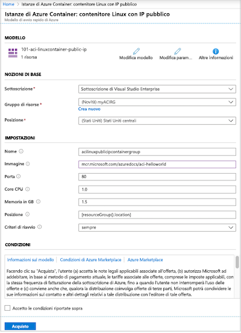
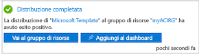
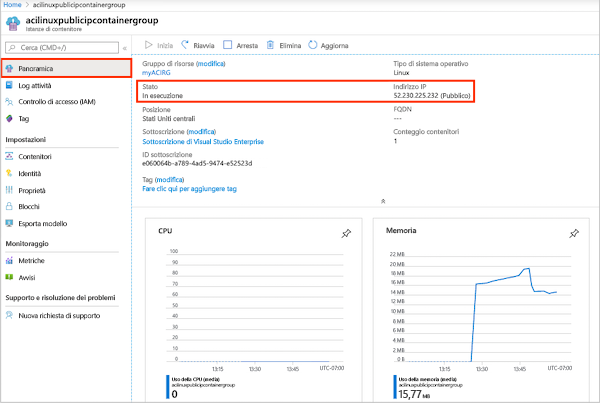
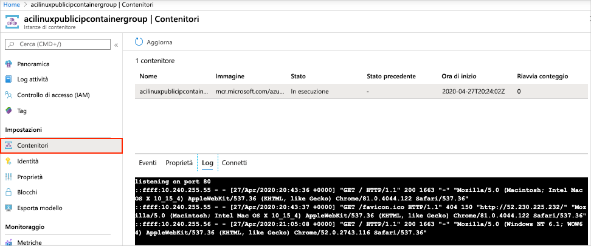

# Avvio rapido: Distribuire un'istanza di contenitore in Azure con un modello di Resource Manager

Istanze di Azure Container consente di eseguire i contenitori Docker serverless in Azure in modo semplice e rapido. Distribuire un'applicazione in un'istanza di contenitore su richiesta quando non è necessaria una piattaforma di orchestrazione di contenitori completa come il servizio Azure Kubernetes. In questo argomento di avvio rapido viene usato un modello di Azure Resource Manager per distribuire un contenitore Docker isolato e renderne disponibile la relativa applicazione Web con un indirizzo IP pubblico.

[!INCLUDE [About Azure Resource Manager](../../includes/resource-manager-quickstart-introduction.md)]

Se l'ambiente soddisfa i prerequisiti e si ha familiarità con l'uso dei modelli di Resource Manager, selezionare il pulsante **Distribuisci in Azure**. Il modello verrà aperto nel portale di Azure.

## Prerequisiti

Se non si ha una sottoscrizione di Azure, creare un account [gratuito](https://azure.microsoft.com/free/) prima di iniziare.

## Rivedere il modello

Il modello usato in questo avvio rapido proviene dai [modelli di avvio rapido di Azure](https://azure.microsoft.com/resources/templates/101-aci-linuxcontainer-public-ip/).

:::code language="json" source="~/quickstart-templates/101-aci-linuxcontainer-public-ip/azuredeploy.json" range="1-107" highlight="61-100":::

Nel modello è definita la risorsa di Azure seguente:

* **[Microsoft.ContainerInstance/containerGroups](/azure/templates/microsoft.containerinstance/containergroups)** : crea un gruppo di contenitori di Azure. Questo modello definisce un gruppo costituito da una singola istanza di contenitore.

Altri esempi di modelli di Istanze di Azure Container sono disponibili nella [raccolta di modelli di avvio rapido](https://azure.microsoft.com/resources/templates/?resourceType=Microsoft.Containerinstance&pageNumber=1&sort=Popular).

## Distribuire il modello

 1. Selezionare l'immagine seguente per accedere ad Azure e aprire un modello. Il modello crea un registro di sistema e una replica in un'altra località.

    

 2. Selezionare o immettere i valori seguenti.

    * **Sottoscrizione**: selezionare una sottoscrizione di Azure.
    * **Gruppo di risorse**: selezionare **Crea nuovo**, immettere un nome univoco per il gruppo di risorse e quindi fare clic su **OK**.
    * **Località**: selezionare una località per il gruppo di risorse. Esempio: **Stati Uniti centrali**.
    * **Nome**: accettare il nome generato per l'istanza oppure immettere un nome.
    * **Immagine**: accettare il nome dell'immagine predefinita. In questa immagine Linux di esempio è inclusa una piccola app Web scritta in Node.js che distribuisce una pagina HTML statica. 

    Accettare i valori predefiniti per le proprietà rimanenti.

    Esaminare le condizioni per l'utilizzo del servizio. Per accettarle, selezionare **Accetto le condizioni riportate sopra**.

    

 3. Una volta completata la creazione dell'istanza, si riceverà una notifica:

    

 Per distribuire il modello, si usa il portale di Azure. Oltre al portale di Azure, è possibile usare Azure PowerShell, l'interfaccia della riga di comando di Azure e l'API REST. Per informazioni sugli altri metodi di distribuzione, vedere [Distribuire modelli](../azure-resource-manager/templates/deploy-cli.md).

## Esaminare le risorse distribuite

Usare il portale di Azure o uno strumento come l'[interfaccia della riga di comando di Azure](container-instances-quickstart.md) per esaminare le proprietà dell'istanza di contenitore.

1. Nel portale cercare le istanze Container e selezionare l'istanza di contenitore creata.

1. Nella pagina **Panoramica** prendere nota del valore visualizzato in **Stato** dell'istanza e del relativo **Indirizzo IP**.

    

2. Quando lo stato è *In esecuzione*, passare all'indirizzo IP nel browser. 

    

### Visualizzare i log dei contenitori

La visualizzazione dei log per un'istanza di contenitore è utile per risolvere i problemi con il contenitore o l'applicazione eseguita.

Per visualizzare i log del contenitore, in **Impostazioni** selezionare **Contenitori** > **Log**. Dovrebbe essere visualizzata la richiesta HTTP GET generata quando è stata visualizzata l'applicazione nel browser.

## Pulire le risorse

Quando il contenitore non serve più, nella pagina **Panoramica** per l'istanza di contenitore fare clic su **Elimina**. Quando richiesto, confermare l'eliminazione.

## Passaggi successivi

In questo argomento di avvio rapido è stata creata un'istanza di contenitore di Azure da un'immagine Microsoft pubblica. Per provare a creare un'immagine del contenitore e a distribuirla da un Registro Azure Container privato, passare all'esercitazione su Istanze di Azure Container.

> [!div class="nextstepaction"]
> [Esercitazione: Creare un'immagine del contenitore per la distribuzione in Istanze di Azure Container](./container-instances-tutorial-prepare-app.md)

Per un'esercitazione dettagliata che illustra il processo di creazione di un modello, vedere:

> [!div class="nextstepaction"]
> [Esercitazione: Creare e distribuire il primo modello di Resource Manager](../azure-resource-manager/templates/template-tutorial-create-first-template.md)