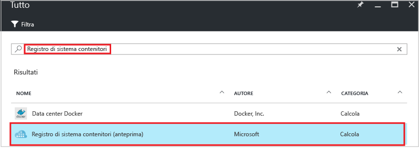
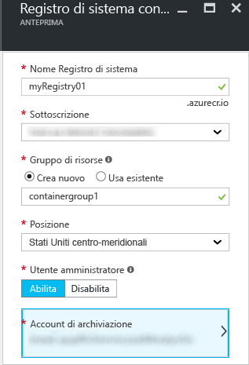
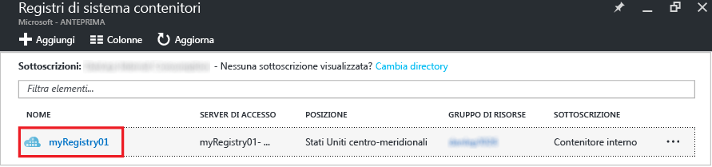
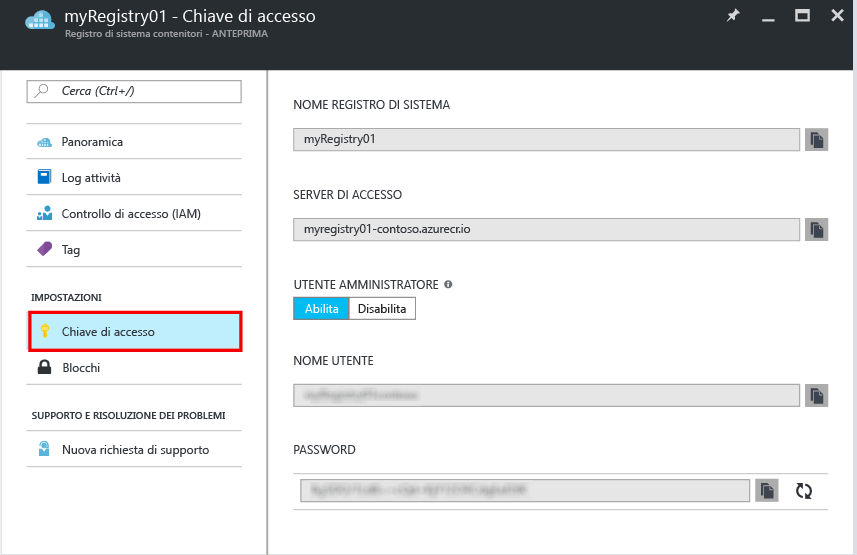

# Creare un registro per contenitori Docker privati con il portale di Azure
Usare il portale di Azure per creare un registro contenitori e gestirne le impostazioni. È anche possibile creare e gestire registri di contenitori usando i [comandi dell'interfaccia della riga di comando di Azure 2.0](container-registry-get-started-azure-cli.md) oppure, a livello di codice, con l'[API REST](https://go.microsoft.com/fwlink/p/?linkid=834376) del servizio Registro contenitori.

Per informazioni di base e concetti, vedere la [panoramica](container-registry-intro.md).

## Creare un registro contenitori
1. Nel [portale di Azure](https://portal.azure.com) fare clic su **+ Nuovo**.
2. Cercare **Registro contenitori di Azure** nel Marketplace.
3. Selezionare **Registro contenitori di Azure** pubblicato da **Microsoft**.
    
4. Fare clic su **Crea**. Verrà visualizzato il pannello **Registro contenitori di Azure**.

    
5. Nel pannello **Registro contenitori di Azure** immettere le informazioni seguenti. Al termine dell'operazione fare clic su **Crea**.

    a. **Registry name** (Nome registro): nome di dominio di primo livello univoco globale per il registro. Il nome del registro negli esempi è *myRegistry01*, ma è necessario sostituirlo con un nome univoco personalizzato. Il nome può contenere solo lettere e numeri.

    b. **Resource group** (Gruppo di risorse): selezionare un [gruppo di risorse](../azure-resource-manager/resource-group-overview.md#resource-groups) esistente o specificare il nome di un nuovo gruppo.

    c. **Location** (Posizione): selezionare la posizione di un data center di Azure in cui il servizio è [disponibile](https://azure.microsoft.com/regions/services/), ad esempio **Stati Uniti centro-meridionali**.

    d. **Admin user** (Utente amministratore): consentire eventualmente a un utente amministratore di accedere al registro. È possibile modificare questa impostazione dopo aver creato il registro.

    > [!IMPORTANT]
    > Oltre a consentire l'accesso tramite un account utente amministratore, i registri dei contenitori supportano l'autenticazione basata sulle entità servizio di Azure Active Directory. Per altre informazioni e considerazioni, vedere [Authenticate with the container registry](container-registry-authentication.md) (Eseguire l'autenticazione al registro contenitori).

    e. **Storage account** (Account di archiviazione): usare l'impostazione predefinita per creare un [account di archiviazione](../storage/storage-introduction.md) oppure selezionarne uno esistente nella stessa posizione. Archiviazione Premium non è attualmente supportata.

## Gestire le impostazioni del registro
Dopo aver creato il registro, trovare le impostazioni iniziando dal pannello **Container Registries** (Registri dei contenitori) nel portale. Le impostazioni potrebbero essere ad esempio necessarie per accedere al registro o abilitare o disabilitare l'utente amministratore.

1. Nel pannello **Container Registries** (Registri dei contenitori) fare clic sul nome del registro.

    
2. Per gestire le impostazioni di accesso, fare clic su **Access key** (Chiave di accesso).

    
3. Si notino le impostazioni seguenti:

   * **Login server** (Server di accesso): nome completo usato per accedere al registro. In questo esempio si tratta di `myregistry01.azurecr.io`.
   * **Admin user** (Utente amministratore): abilita o disabilita l'account utente amministratore per il registro.
   * **Username** (Nome utente) e **Password**: credenziali dell'account utente amministratore (se abilitato) che può essere usato per accedere al registro. È facoltativamente possibile rigenerare le password. Vengono create due password in modo da mantenere le connessioni al registro usando una password mentre si rigenera l'altra. Per eseguire invece l'autenticazione con un'entità servizio, vedere [Eseguire l'autenticazione con un registro contenitori Docker privato](container-registry-authentication.md).

## Passaggi successivi
* [Effettuare il push della prima immagine tramite l'interfaccia della riga di comando di Docker](container-registry-get-started-docker-cli.md)

