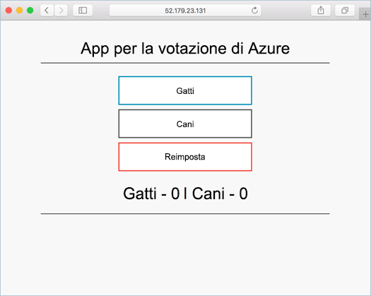

# <a name="deploy-docker-swarm-cluster"></a>Distribuire un cluster Docker Swarm

In questa guida introduttiva viene distribuito un cluster Docker Swarm usando l'interfaccia della riga di comando di Azure. Un'applicazione multicontenitore costituita dal front-end Web e da un'istanza di Redis viene quindi distribuita ed eseguita nel cluster. Al termine, l'applicazione è accessibile tramite Internet.

Se non si ha una sottoscrizione di Azure, creare un [account gratuito](https://azure.microsoft.com/free/?WT.mc_id=A261C142F) prima di iniziare.

Questa guida introduttiva richiede l'interfaccia della riga di comando di Azure 2.0.4 o versioni successive. Eseguire `az --version` per trovare la versione. Se è necessario eseguire l'installazione o l'aggiornamento, vedere [Installare l'interfaccia della riga di comando di Azure 2.0]( /cli/azure/install-azure-cli).

## <a name="create-a-resource-group"></a>Creare un gruppo di risorse

Creare un gruppo di risorse con il comando [az group create](/cli/azure/group#az_group_create). Un gruppo di risorse di Azure è un gruppo logico in cui le risorse di Azure vengono distribuite e gestite.

L'esempio seguente crea un gruppo di risorse denominato *myResourceGroup* nella posizione *westus*.

```azurecli-interactive
az group create --name myResourceGroup --location westus
```

Output:

```json
{
  "id": "/subscriptions/00000000-0000-0000-0000-000000000000/resourceGroups/myResourceGroup",
  "location": "westcentralus",
  "managedBy": null,
  "name": "myResourceGroup",
  "properties": {
    "provisioningState": "Succeeded"
  },
  "tags": null
}
```

## <a name="create-docker-swarm-cluster"></a>Creare un cluster Docker Swarm

Creare un cluster Docker Swarm nel servizio contenitore di Azure con il comando [az acs create](/cli/azure/acs#az_acs_create). 

L'esempio seguente crea un cluster denominato *mySwarmCluster* con un nodo master Linux e tre nodi agente Linux.

```azurecli-interactive
az acs create --name mySwarmCluster --orchestrator-type Swarm --resource-group myResourceGroup --generate-ssh-keys
```

In alcuni casi la sottoscrizione di Azure ha accesso limitato alle risorse di Azure, ad esempio con una versione di valutazione gratuita limitata. Se la distribuzione non riesce a causa di core disponibili limitati, ridurre il numero di agenti predefinito aggiungendo `--agent-count 1` al comando [az acs create](/cli/azure/acs#az_acs_create). 

Dopo alcuni minuti, il comando viene completato e restituisce le informazioni in formato json sul cluster.

## <a name="connect-to-the-cluster"></a>Connettersi al cluster

Nel corso di questa guida introduttiva è necessario l'indirizzo IP sia del master Docker Swarm che del pool di agenti Docker. Usare il comando seguente per restituire entrambi gli indirizzi IP.


```bash
az network public-ip list --resource-group myResourceGroup --query "[*].{Name:name,IPAddress:ipAddress}" -o table
```

Output:

```bash
Name                                                                 IPAddress
-------------------------------------------------------------------  -------------
swarmm-agent-ip-myswarmcluster-myresourcegroup-d5b9d4agent-66066781  52.179.23.131
swarmm-master-ip-myswarmcluster-myresourcegroup-d5b9d4mgmt-66066781  52.141.37.199
```

Creare un tunnel SSH per il master Swarm. Sostituire `IPAddress` con l'indirizzo IP del master Swarm.

```bash
ssh -p 2200 -fNL 2375:localhost:2375 azureuser@IPAddress
```

Impostare la variabile di ambiente `DOCKER_HOST`. In questo modo è possibile eseguire comandi di Docker su Docker Swarm senza dover specificare il nome dell'host.

```bash
export DOCKER_HOST=:2375
```

È ora possibile eseguire servizi Docker in Docker Swarm.


## <a name="run-the-application"></a>Eseguire l'applicazione

Creare un file denominato `docker-compose.yaml` e copiarvi il contenuto seguente.

```yaml
version: '3'
services:
  azure-vote-back:
    image: redis
    container_name: azure-vote-back
    ports:
        - "6379:6379"

  azure-vote-front:
    image: microsoft/azure-vote-front:v1
    container_name: azure-vote-front
    environment:
      REDIS: azure-vote-back
    ports:
        - "80:80"
```

Eseguire il comando seguente per creare il servizio Azure Vote.

```bash
docker-compose up -d
```

Output:

```bash
Creating network "user_default" with the default driver
Pulling azure-vote-front (microsoft/azure-vote-front:v1)...
swarm-agent-EE873B23000005: Pulling microsoft/azure-vote-front:v1...
swarm-agent-EE873B23000004: Pulling microsoft/azure-vote-front:v1... : downloaded
Pulling azure-vote-back (redis:latest)...
swarm-agent-EE873B23000004: Pulling redis:latest... : downloaded
Creating azure-vote-front ... 
Creating azure-vote-back ... 
Creating azure-vote-front
Creating azure-vote-back ...
```

## <a name="test-the-application"></a>Test dell'applicazione

Passare all'indirizzo IP del pool di agenti Swarm per testare l'applicazione Azure Vote.



## <a name="delete-cluster"></a>Eliminare il cluster
Quando il cluster non è più necessario, è possibile usare il comando [az group delete](/cli/azure/group#az_group_delete) per rimuovere il gruppo di risorse, il servizio contenitore e tutte le risorse correlate.

```azurecli-interactive
az group delete --name myResourceGroup --yes --no-wait
```

## <a name="get-the-code"></a>Ottenere il codice

In questa guida introduttiva sono state usate immagini del contenitore già create per creare un servizio Docker. Il codice dell'applicazione correlato, Dockerfile, e il file Compose sono disponibili in GitHub.

[https://github.com/Azure-Samples/azure-voting-app-redis](https://github.com/Azure-Samples/azure-voting-app-redis.git)

## <a name="next-steps"></a>Passaggi successivi

In questa guida introduttiva è stato distribuito un cluster Docker Swarm in cui è stata quindi distribuita un'applicazione multicontenitore.

Per informazioni sull'integrazione di Docker Swarm con Visual Studio Team Services, vedere l'articolo relativo a integrazione e distribuzione continua con Docker Swarm e VSTS.

> [!div class="nextstepaction"]
> [Integrazione continua e distribuzione continua con Docker Swarm e VSTS](./container-service-docker-swarm-setup-ci-cd.md)