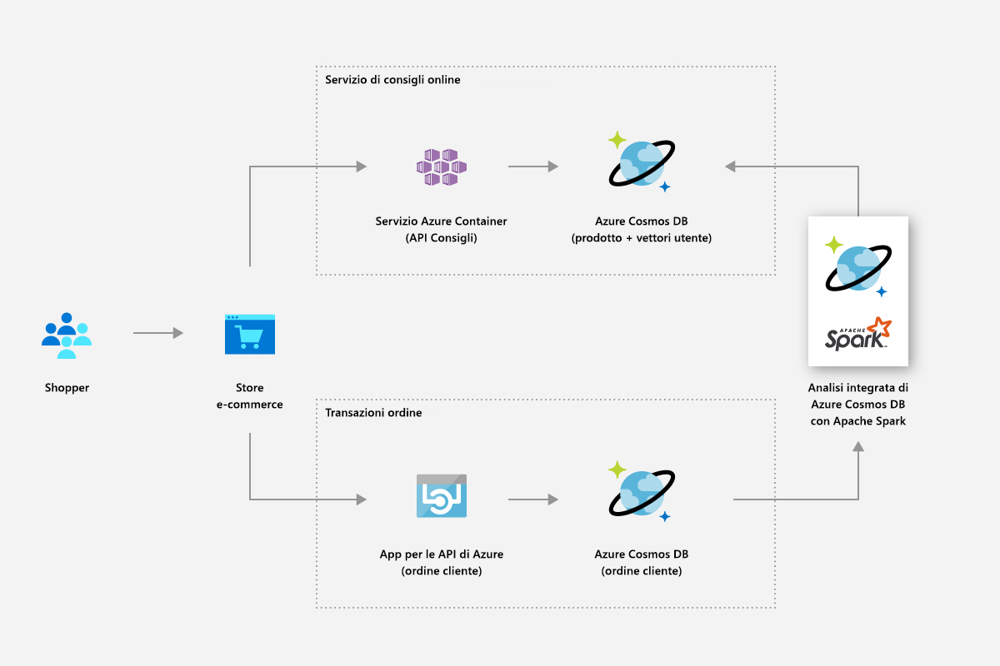
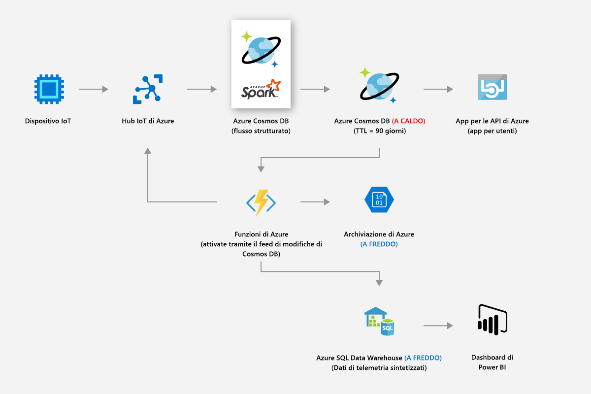
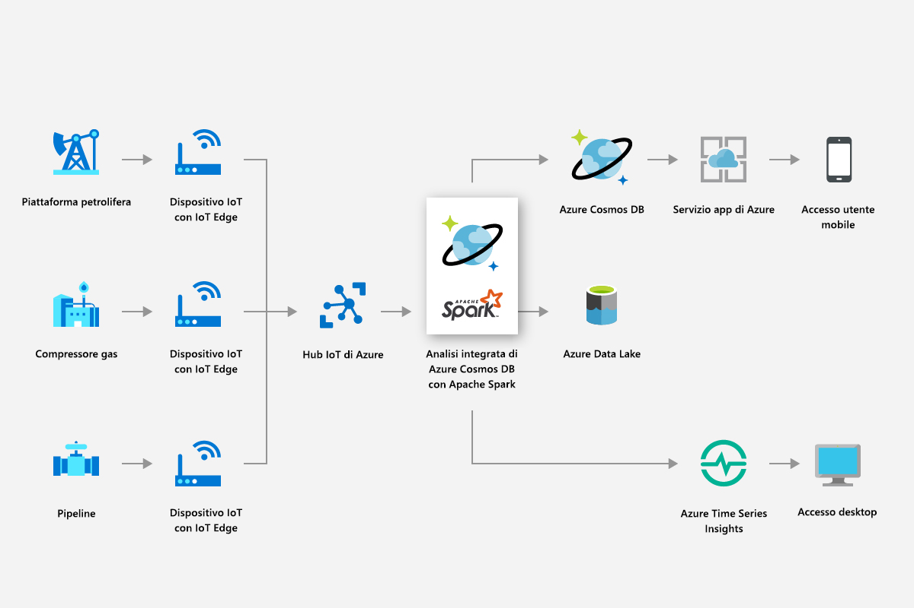
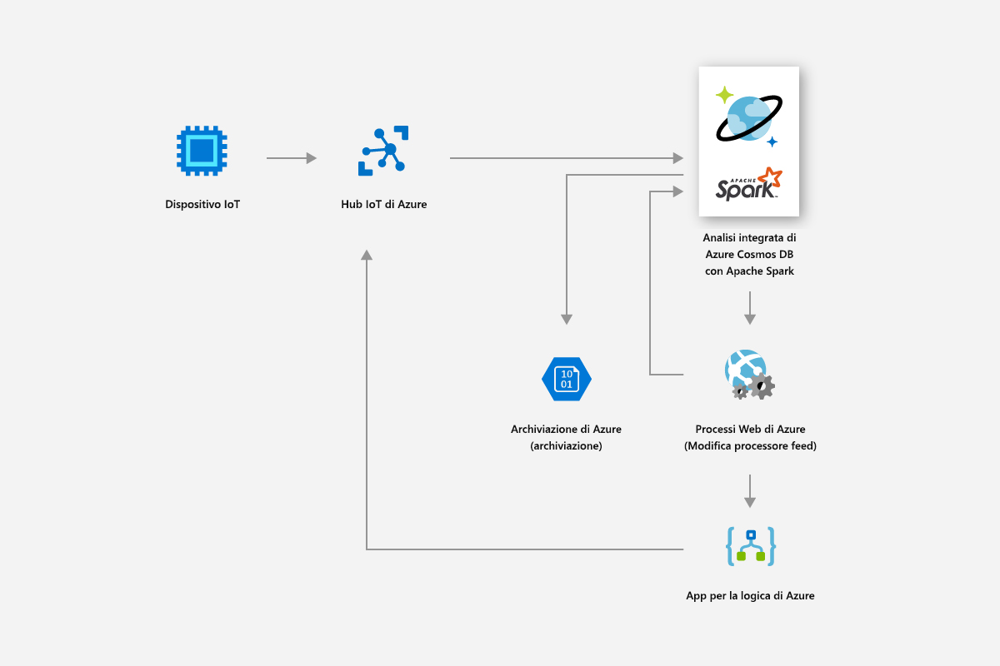
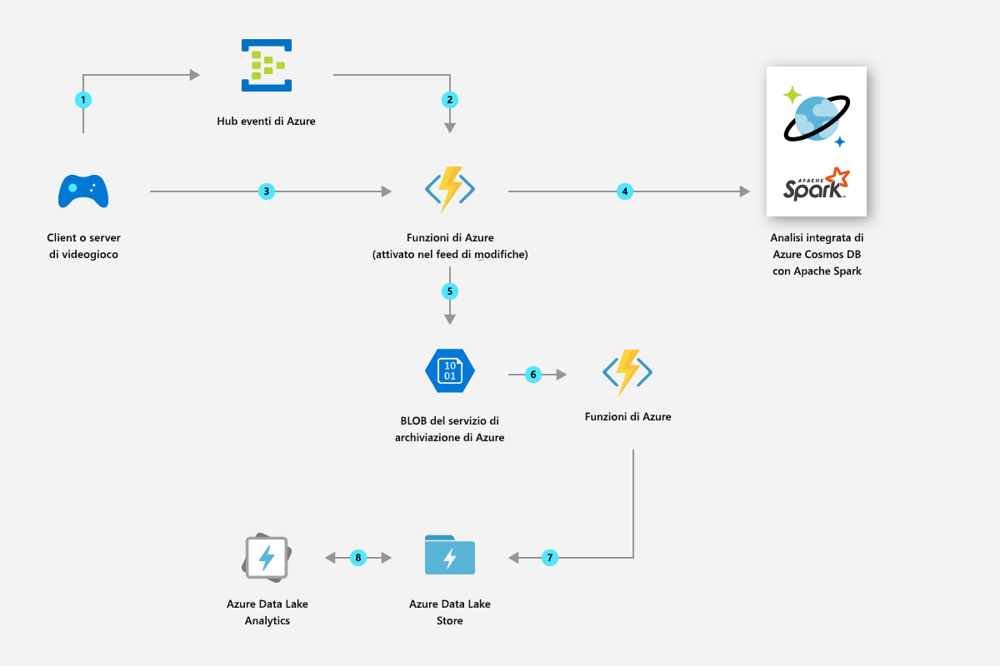

# Soluzioni che usano l'analisi distribuita a livello globale in Azure Cosmos DB

Questo articolo descrive le soluzioni che possono essere create usando l'analisi distribuita a livello globale in Azure Cosmos DB.

## Vendita al dettaglio e beni di consumo

È possibile usare il supporto Spark in Azure Cosmos DB per offrire raccomandazioni e offerte in tempo reale. In questo modo i clienti possono individuare gli elementi necessari con personalizzazioni e raccomandazioni di prodotti in tempo reale.

* Il supporto Machine Learning incorporato fornito dal runtime Apache Spark consente di generare raccomandazioni in tempo reale nei cataloghi di prodotti.

* È possibile estrarre i dati clickstream, i dati di acquisto e i dati del cliente per fornire raccomandazioni mirate che determinano il valore della durata.

* Grazie alla funzionalità di distribuzione globale di Azure Cosmos DB, è possibile analizzare in pochi millisecondi volumi elevati di dati sul prodotto distribuiti tra diverse aree geografiche.

* È possibile ottenere rapidamente informazioni dettagliate per utenti e dati distribuiti geograficamente, nonché migliorare la velocità di conversione della promozione facendo in modo che l'annuncio mirato raggiunga l'utente più appropriato al momento giusto.

* È possibile sfruttare la funzionalità incorporata di streaming di Spark per arricchire i dati in tempo reale combinando questi dati con quelli statici dei clienti. In questo modo è possibile distribuire annunci più personalizzati e mirati in tempo reale e contestualizzati in base alle operazioni dei clienti.

L'immagine seguente illustra l'utilizzo del supporto Spark di Azure Cosmos DB per l'ottimizzazione di prezzi e promozioni:

L'immagine seguente illustra l'utilizzo del supporto Spark di Azure Cosmos DB nel motore di raccomandazione in tempo reale:

## Produzione e IoT

La piattaforma di analisi integrata di Azure Cosmos DB consente di eseguire l'analisi in tempo reale dei dati IoT da milioni di dispositivi su scala globale. È possibile realizzare innovazioni moderne come la previsione dei modelli meteorologici, l'analisi predittiva e le ottimizzazioni energetiche.

* Con Azure Cosmos DB è possibile estrarre dati, ad esempio le metriche degli asset e fattori meteorologici in tempo reale e quindi applicare l'analisi delle smart grid per ottimizzare le prestazioni dei dispositivi connessi sul campo. L'analisi delle smart grid è il fattore chiave per controllare i costi operativi, migliorare l'affidabilità delle griglie e fornire servizi energetici personalizzati ai clienti.

L'immagine seguente illustra l'utilizzo del supporto Spark di Azure Cosmos DB per leggere le metriche da dispositivi IoT e applicare l'analisi delle smart grid:

## Manutenzione predittiva

* La manutenzione di asset, come i compressori usati in piccoli sistemi di perforazione per piattaforme in alto mare, è un'attività complessa. Questi asset si trovano in tutto il mondo e generano petabyte di dati. Con Azure Cosmos DB è possibile creare una pipeline di dati predittivi end-to-end che usa il flusso Spark per elaborare grandi quantità di dati di telemetria dei sensori, archiviare le parti degli asset e i dati di mapping dei sensori.

* È possibile compilare e distribuire modelli di Machine Learning per stimare i guasti degli asset prima che si verifichino ed emettere ordini di lavoro di manutenzione prima che si verifichi il guasto.

L'immagine seguente illustra l'utilizzo del supporto Spark di Azure Cosmos DB per creare un sistema di manutenzione predittiva:

L'immagine seguente illustra l'utilizzo del supporto Spark di Azure Cosmos DB per creare un sistema di diagnostica dei veicoli in tempo reale:

## Modalità di gioco

* Grazie al supporto Spark incorporato, Azure Cosmos DB consente di creare, ridimensionare e distribuire facilmente e in pochi minuti modelli avanzati di analisi avanzata e Machine Learning per creare la migliore esperienza di gioco possibile.

* È possibile analizzare i dati relativi a giocatori, acquisti e comportamenti per creare offerte personalizzate pertinenti allo scopo di ottenere tassi di conversione elevati.

* L'apprendimento automatico di Spark consente di analizzare e ottenere informazioni dettagliate sui dati di telemetria del gioco. È possibile diagnosticare e prevenire tempi di caricamento lenti e problemi durante il gioco.

L'immagine seguente illustra l'utilizzo del supporto Spark di Azure Cosmos DB nell'analisi dei giochi:

## Passaggi successivi

* Per altre informazioni sui vantaggi di Azure Cosmos DB, vedere l'articolo [Panoramica](introduction.md).
* [Introduzione all'API di Azure Cosmos DB per MongoDB](mongodb-introduction.md)
* [Introduzione all'API Cassandra di Azure Cosmos DB](cassandra-introduction.md)
* [Introduzione all'API Gremlin di Azure Cosmos DB](graph-introduction.md)
* [Introduzione all'API Tabella di Azure Cosmos DB](table-introduction.md)
