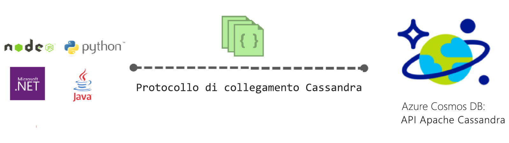

# Introduzione all'API Apache Cassandra per Azure Cosmos DB

Azure Cosmos DB offre l'API Cassandra (anteprima) per applicazioni scritte per Apache Cassandra che necessitano di funzionalità Premium, come:

* [Dimensione dell'archiviazione e velocità effettiva scalabili](partition-data.md).
* [Distribuzione globale chiavi in mano](distribute-data-globally.md).
* Latenze pari a singole unità di millisecondi al 99° percentile.
* [Cinque livelli di coerenza ben definiti](consistency-levels.md)
* [Indicizzazione automatica dei dati](http://www.vldb.org/pvldb/vol8/p1668-shukla.pdf) senza che sia necessario gestire manualmente indici e schemi. 
* Disponibilità elevata garantita, supportata da [contratti di servizio leader di settore](https://azure.microsoft.com/support/legal/sla/cosmos-db/).

## Cos'è L'API Cassandra di Azure Cosmos DB?

È possibile usare Azure Cosmos DB come archivio dati per le applicazioni scritte per [Cassandra Apache](https://cassandra.apache.org/), usando l'API Apache Cassandra. Ciò significa che usando i [driver con licenza Apache conformi con CQLv4](https://cassandra.apache.org/doc/latest/getting_started/drivers.html?highlight=driver) esistenti, l'applicazione scritta per Cassandra può comunicare con l'API Cassandra di Azure Cosmos DB. In molti casi, è possibile passare da Apache Cassandra all'API Apache Cassandra di Azure Cosmos DB semplicemente modificando una stringa di connessione. Questa funzionalità permette di sviluppare ed eseguire con facilità applicazioni di database Cassandra API nel cloud di Azure sfruttando la distribuzione globale e i [contratti di servizio completi leader del settore](https://azure.microsoft.com/support/legal/sla/cosmos-db) di Azure Cosmos DB, continuando al tempo stesso a usare competenze e strumenti familiari per l'API Cassandra.

L'API Cassandra consente di interagire con i dati archiviati in Azure Cosmos DB usando gli strumenti basati sul linguaggio di query Cassandra, ad esempio CQLSH, e i driver client Cassandra già noti.

## Quali sono i vantaggi dell'utilizzo dell'API Apace Cassandra per Azure Cosmos DB?

**Nessuna gestione delle operazioni**: come un autentico servizio completamente gestito, Azure Cosmos DB garantisce che gli amministratori dell'API Cassandra non debbano occuparsi di gestire e monitorare innumerevoli impostazioni del sistema operativo, di JVM, dei file yaml e delle loro interazioni. Azure Cosmos DB consente di monitorare velocità effettiva, latenza, archiviazione e disponibilità e avvisi configurabili. 

**Gestione delle prestazioni**: Azure Cosmos DB offre lettura e scrittura a bassa latenza garantita al 99° percentile e supportata da contratti di servizio. Gli utenti non devono occuparsi dei costi operativi per fornire contratti di servizio con capacità ottimali di lettura e scrittura. Tali contratti prevedono in genere compattazione di dati, gestione della rimozione definitiva, impostazione di filtri Bloom e ritardo di replica. Azure Cosmos DB solleva l'utente dalla gestione di questi problemi e consente di concentrarsi sui risultati finali dell'applicazione.

**Indicizzazione automatica**: Azure Cosmos DB indicizza automaticamente tutte le colonne della tabella nel database dell'API Cassandra. Non richiede la creazione di indici secondari per velocizzare le query. Fornisce un'esperienza di lettura e scrittura a bassa latenza simultanea all'indicizzazione automatica coerente. 

**Possibilità di usare codice e strumenti esistenti**: Azure Cosmos DB offre compatibilità a livello di protocollo di trasmissione con gli strumenti e gli SDK esistenti. Questa compatibilità consente di usare la base di codici esistente con l'API Cassandra di Azure Cosmos DB apportando solo semplici modifiche.

**Elasticità di velocità effettiva e archiviazione**: la piattaforma Azure Cosmos garantisce la velocità effettiva nelle aree geografiche tramite semplici operazioni eseguite con il portale, PowerShell o l'interfaccia della riga di comando. Le tabelle di Azure Cosmos DB offrono una semplice scalabilità elastica e prestazioni prevedibili in base alla crescita dell'applicazione. Azure Cosmos DB supporta le tabelle dell'API Cassandra, scalabili in misura praticamente illimitata in termini di dimensioni dell'archiviazione. 

**Distribuzione e disponibilità globale**: Azure Cosmos DB consente di distribuire i dati all'interno di aree di Azure per fornire agli utenti un'esperienza di bassa latenza assicurando la disponibilità. Fornisce una disponibilità del 99,99% all'interno di un'area e una disponibilità in lettura al 99,999% tra le aree, senza altre spese operative. Cosmos DB è disponibile in più di 30 [aree di Azure](https://azure.microsoft.com/regions/services/). Per altre informazioni, vedere [Distribuire i dati a livello globale](distribute-data-globally.md). 

**Livelli di coerenza perfezionabili:** Azure Cosmos DB consente di scegliere tra cinque livelli di coerenza ben definiti per ottenere un compromesso ottimale tra coerenza e prestazioni. I livelli di coerenza possibili sono: Strong, Bounded Staleness, Session, Consistent Prefix ed Eventual. Si tratta di livelli di coerenza granulari e ben definiti che permettono di ottenere compromessi efficaci tra coerenza, disponibilità e latenza. Per altre informazioni, vedere [Uso dei livelli di coerenza per ottimizzare la disponibilità e le prestazioni](consistency-levels.md). 

**Livello aziendale**: sicurezza e conformità per impostazione predefinita: Azure cosmos DB fornisce [certificazioni di conformità](https://www.microsoft.com/trustcenter) affinché gli utenti possono usare la piattaforma senza doversi preoccupare di problemi di conformità. Fornisce inoltre la crittografia dei dati inattivi e in transito, firewall IP e log di controllo per le attività del piano di controllo.  

## Attività iniziali
Le guide introduttive dell'API Cassandra consentono di creare un account dell'API Cassandra di Azure Cosmos DB e di creare un'app Cassandra:

* [Guida introduttiva: Creare un'app Web Cassandra con Node.js e Azure Cosmos DB](create-cassandra-nodejs.md)
* [Guida introduttiva: Creare un'app Web Cassandra con Java e Azure Cosmos DB](create-cassandra-java.md)
* [Guida introduttiva: Creare un'app Web Cassandra con .NET e Azure Cosmos DB](create-cassandra-dotnet.md)
* [Guida introduttiva: Creare un'app Web Cassandra con Python e Azure Cosmos DB](create-cassandra-python.md)

## Effettua l'iscrizione ora 

Se si dispone già di una sottoscrizione di Azure, è possibile iscriversi all'API Cassandra (anteprima) nel [portale di Azure](https://aka.ms/cosmosdb-cassandra-signup). Se non si ha familiarità con Azure, registrarsi per una [versione di prova gratuita](https://azure.microsoft.com/free) che prevede 12 mesi di accesso libero ad Azure Cosmos DB.

## Passaggi successivi

Le informazioni sull'API Cassandra di Azure Cosmos DB sono integrate nella documentazione generale di Azure Cosmos DB. Di seguito sono disponibili alcune informazioni utili per iniziare:

* Seguire le [Guide introduttive ](create-cassandra-nodejs.md) per creare un account e una nuova app con un esempio di Git.
* Seguire l'[esercitazione](tutorial-develop-cassandra-java.md) per creare una nuova app a livello di codice.
* Seguire l'[esercitazione per l'importazione dei dati di Cassandra](cassandra-import-data.md) per importare i dati esistenti in Azure Cosmos DB.
* Leggere le [Domande frequenti](faq.md#cassandra).
