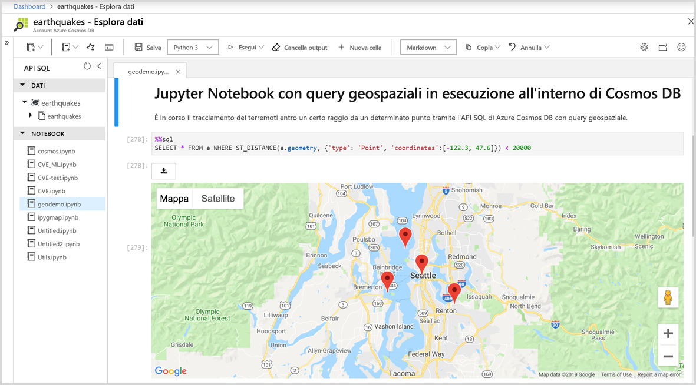

# Supporto predefinito di notebook di Jupyter in Azure Cosmos DB

Jupyter Notebook è un'applicazione Web open source che consente di creare e condividere documenti contenenti codice, equazioni, visualizzazioni e testo narrativo in tempo reale. Azure Cosmos DB supporta i notebook di Jupyter predefiniti per tutte le API, ad esempio Cassandra, MongoDB, SQL, Gremlin e Tabella. Il supporto incorporato dei notebook per tutte le API Azure Cosmos DB e i modelli di dati consente di eseguire le query in modo interattivo. I notebook di Jupyter vengono eseguiti all'interno degli account Azure Cosmos e consentono agli sviluppatori di eseguire operazioni di esplorazione, pulizia e trasformazione dei dati, simulazioni numeriche, modellazione statistica, visualizzazione di dati e Machine Learning.

I notebook di Jupyter supportano funzioni magic che estendono le funzionalità del kernel attraverso il supporto di comandi aggiuntivi. Cosmos magic è un comando che estende le funzionalità del kernel Python in Jupyter Notebook consentendo di eseguire le query dell'API SQL di Azure Cosmos oltre ad Apache Spark. È possibile combinare facilmente query dell'API SQL e Python per eseguire query e visualizzare dati tramite librerie di visualizzazione avanzate integrate con comandi di rendering.
Il portale di Azure integra in modo nativo l'esperienza di Jupyter Notebook negli account Azure Cosmos, come illustrato nella figura seguente:

## Vantaggi dei notebook di Jupyter

I notebook di Jupyter sono stati sviluppati in origine per le applicazioni di data science scritte in Python, R. Tuttavia, possono essere usati in vari modi per diversi tipi di progetto, ad esempio:

* ***Visualizzazioni di dati:** i notebook di Jupyter consentono di visualizzare i dati sotto forma di notebook condiviso che esegue il rendering grafico di alcuni dati. Permettono di creare visualizzazioni, condividerle e consentire modifiche interattive al codice e ai set di dati condivisi.

* **Condivisione del codice:** servizi come GitHub offrono la possibilità di condividere codice, ma sono prevalentemente non interattivi. Con un notebook di Jupyter, è possibile visualizzare codice, eseguirlo e mostrare i risultati direttamente nel portale di Azure.

* **Interazioni in tempo reale con il codice:** Il codice di Jupyter Notebook è dinamico, può essere modificato e rieseguito in modo incrementale in tempo reale. I notebook possono anche incorporare controlli utente, ad esempio dispositivi di scorrimento o campi di input del testo, che è possibile usare come origini di input per codice, demo o modelli di verifica.

* **Documentazione di esempi di codice e risultati dell'esplorazione dei dati:** se si vuole illustrare il funzionamento di una parte di codice riga per riga in Azure Cosmos DB, con l'output in tempo reale, è possibile incorporarlo in Jupyter Notebook. Il codice rimarrà completamente funzionale. È possibile interattività insieme alla documentazione contemporaneamente.

* **Comandi magic di Cosmos:** nei notebook di Jupyter è possibile usare comandi magic personalizzati per Azure Cosmos DB per semplificare l'elaborazione interattiva. Ad esempio, il comando magic %%sql consente di eseguire query su un contenitore Cosmos usando l'API SQL direttamente in un notebook.

* **Ambiente completo:** i notebook di Jupyter combinano codice, testo formattato, immagini, video, animazioni, equazioni matematiche, tracciati, mappe, figure interattive, widget e interfacce utente grafiche in un singolo documento.

## Componenti di un notebook di Jupyter

I notebook di Jupyter possono includere diversi tipi di componenti, ognuno organizzato in blocchi discreti:

* **Testo e HTML:** è possibile inserire in qualsiasi punto del documento testo normale o annotato nella sintassi markdown per generare HTML. È anche possibile includere stili CSS in linea o aggiungerli a un modello usato per generare il notebook.

* **Codice e output:** i notebook Jupyter supportano codice Python. I risultati del codice eseguito vengono visualizzati immediatamente dopo i blocchi di codice e questi ultimi possono essere eseguiti più volte in qualsiasi ordine.

* **Visualizzazioni:** è possibile generare grafica e grafici dal codice, usando moduli come Matplotlib, Plotly o Bokeh. In modo simile all'output, queste visualizzazioni compaiono in linea accanto al testo che le ha generate.

* **Contenuti multimediali:** Jupyter Notebook è basato sulla tecnologia Web, quindi è in grado di visualizzare tutti i tipi di contenuti multimediali supportati in una pagina Web. È possibile includerli in un notebook come elementi HTML oppure generarli a livello di codice tramite il modulo `IPython.display`.

* **Dati:** i dati dei contenitori Azure Cosmos e i risultati delle query possono essere importati in un notebook di Jupyter a livello di codice. È ad esempio possibile includere codice nel notebook per eseguire query sui dati usando una delle API di Cosmos DB oppure in modalità nativa in Apache Spark.

## Passaggi successivi

Per iniziare a usare i notebook di Jupyter incorporati in Azure Cosmos DB, vedere gli articoli seguenti:

* [Abilitare i notebook in un account Azure Cosmos](enable-notebooks.md)
* [Usare funzionalità e comandi dei notebook](use-notebook-features-and-commands.md)

