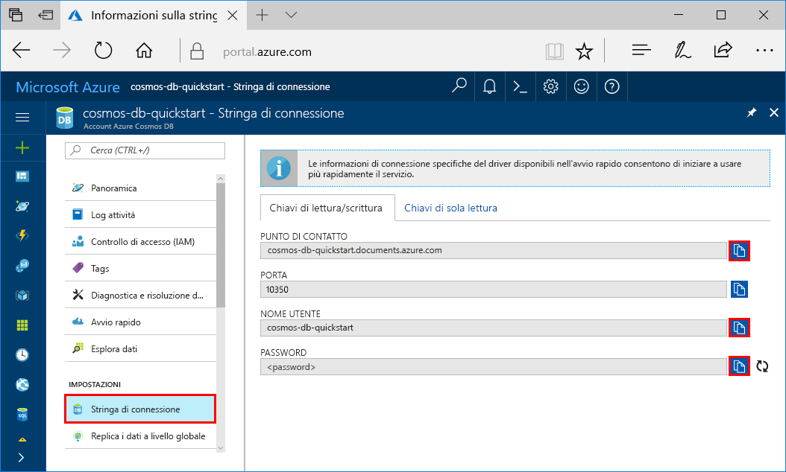
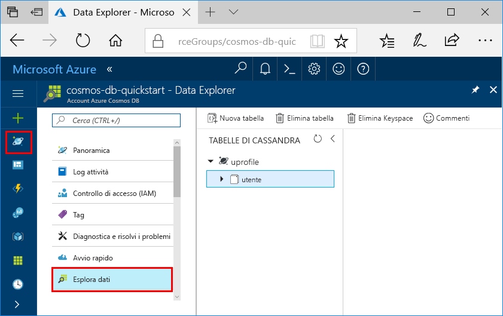

# <a name="quickstart-build-a-cassandra-app-with-net-and-azure-cosmos-db"></a>Guida introduttiva: Creare un'app Cassandra con .NET e Azure Cosmos DB

Questa guida introduttiva mostra come usare .NET e l'[API Cassandra](cassandra-introduction.md) di Azure Cosmos DB per creare un'app di profilo clonando un esempio di GitHub. Questa guida introduttiva illustra anche come creare un account Azure Cosmos DB usando il portale di Azure basato sul Web.   

Azure Cosmos DB è il servizio di database di Microsoft multimodello distribuito a livello globale. È possibile creare ed eseguire rapidamente query su database di documenti, tabelle, valori chiave e grafi, sfruttando in ognuno dei casi i vantaggi offerti dalle funzionalità di scalabilità orizzontale e distribuzione globale alla base di Azure Cosmos DB. 

## <a name="prerequisites"></a>Prerequisiti

[!INCLUDE [quickstarts-free-trial-note](../../includes/quickstarts-free-trial-note.md)]In alternativa, è possibile [provare gratuitamente Microsoft Azure Cosmos DB](https://azure.microsoft.com/try/cosmosdb/) senza una sottoscrizione di Azure e senza impegno.

Accesso al programma di anteprima dell'API Cassandra di Azure Cosmos DB. Se non è ancora stato richiesto l'accesso, [iscriversi adesso](cassandra-introduction.md#sign-up-now).

Eseguire anche queste operazioni: 
* Se Visual Studio 2017 non è ancora installato, è possibile scaricare e usare la versione **gratuita** di [Visual Studio 2017 Community Edition](https://www.visualstudio.com/downloads/). Durante l'installazione di Visual Studio abilitare **Sviluppo di Azure**.
* Installare [Git](https://www.git-scm.com/) per clonare l'esempio.

<a id="create-account"></a>
## <a name="create-a-database-account"></a>Creare un account di database

[!INCLUDE [cosmos-db-create-dbaccount-cassandra](../../includes/cosmos-db-create-dbaccount-cassandra.md)]


## <a name="clone-the-sample-application"></a>Clonare l'applicazione di esempio

Si può ora passare a usare il codice. Clonare ora un'app per le API Cassandra da GitHub, impostare la stringa di connessione ed eseguirla. Come si noterà, è facile usare i dati a livello di codice. 

1. Aprire una finestra del terminale Git, ad esempio git bash, ed eseguire il comando `cd` per passare a una cartella in cui installare l'app di esempio. 

    ```bash
    cd "C:\git-samples"
    ```

2. Eseguire il comando seguente per clonare l'archivio di esempio. Questo comando crea una copia dell'app di esempio nel computer in uso.

    ```bash
    git clone https://github.com/Azure-Samples/azure-cosmos-db-cassandra-dotnet-getting-started.git
    ```

3. Aprire quindi il file della soluzione CassandraQuickStartSample in Visual Studio. 

## <a name="review-the-code"></a>Esaminare il codice

Questo passaggio è facoltativo. Per scoprire in che modo le risorse del database vengono create nel codice, è possibile esaminare i frammenti di codice seguenti. I frammenti di codice derivano tutti dal file `Program.cs` installato nella cartella C:\git-samples\azure-cosmos-db-cassandra-dotnet-getting-started\CassandraQuickStartSample. In alternativa, è possibile passare ad [Aggiornare la stringa di connessione](#update-your-connection-string).

* Inizializzare la sessione tramite la connessione a un endpoint cluster Cassandra. L'API Cassandra in Azure Cosmos DB supporta solo TLSv1.2. 

  ```csharp
   var options = new Cassandra.SSLOptions(SslProtocols.Tls12, true, ValidateServerCertificate);
   options.SetHostNameResolver((ipAddress) => CassandraContactPoint);
   Cluster cluster = Cluster.Builder().WithCredentials(UserName, Password).WithPort(CassandraPort).AddContactPoint(CassandraContactPoint).WithSSL(options).Build();
   ISession session = cluster.Connect();
   ```

* Creare un nuovo keyspace.

    ```csharp
    session.Execute("CREATE KEYSPACE uprofile WITH REPLICATION = { 'class' : 'NetworkTopologyStrategy', 'datacenter1' : 1 };"); 
    ```

* Creare una nuova tabella.

   ```csharp
  session.Execute("CREATE TABLE IF NOT EXISTS uprofile.user (user_id int PRIMARY KEY, user_name text, user_bcity text)");
   ```

* Inserire le entità utente usando l'oggetto IMapper con una nuova sessione che si connette al keyspace uprofile.

    ```csharp
    mapper.Insert<User>(new User(1, "LyubovK", "Dubai"));
    ```
    
* Eseguire una query per ottenere tutte le informazioni utente.

    ```csharp
   foreach (User user in mapper.Fetch<User>("Select * from user"))
   {
      Console.WriteLine(user);
   }
    ```
    
 * Eseguire una query per ottenere le informazioni su un singolo utente.

    ```csharp
    mapper.FirstOrDefault<User>("Select * from user where user_id = ?", 3);
    ```

## <a name="update-your-connection-string"></a>Aggiornare la stringa di connessione

Tornare ora al portale di Azure per recuperare le informazioni sulla stringa di connessione e copiarle nell'app. Le informazioni della stringa di connessione consentono all'app di comunicare con il database ospitato.

1. Nel [portale di Azure](http://portal.azure.com/) fare clic su **Stringa di connessione**. 

    Usare il  sul lato destro della schermata per copiare il valore NOME UTENTE.

    

2. In Visual Studio 2017 aprire il file Program.cs. 

3. Incollare il valore di NOME UTENTE dal portale su `<FILLME>` nella riga 13.

    La riga 13 del file Program.cs dovrebbe ora essere simile alla seguente: 

    `private const string UserName = "cosmos-db-quickstart";`

3. Tornare al portale e copiare il valore di PASSWORD. Incollare il valore di PASSWORD dal portale su `<FILLME>` nella riga 14.

    La riga 14 del file Program.cs dovrebbe ora essere simile alla seguente: 

    `private const string Password = "2Ggkr662ifxz2Mg...==";`

4. Tornare al portale e copiare il valore di PUNTO DI CONTATTO. Incollare il valore di PUNTO DI CONTATTO dal portale su `<FILLME>` nella riga 15.

    La riga 15 del file Program.cs dovrebbe ora essere simile alla seguente: 

    `private const string CassandraContactPoint = "cosmos-db-quickstarts.documents.azure.com"; //  DnsName`

5. Salvare il file Program.cs.
    
## <a name="run-the-app"></a>Esecuzione dell'app

1. In Visual Studio fare clic su **Strumenti** > **Gestione pacchetti NuGet** > **Console di Gestione pacchetti**.

2. Al prompt dei comandi, usare il comando seguente per installare il pacchetto NuGet del driver .NET. 

    ```cmd
    Install-Package CassandraCSharpDriver
    ```
3. Premere CTRL+F5 per eseguire l'applicazione. L'app viene visualizzata nella finestra della console. 

    

    Premere CTRL+C per arrestare l'esecuzione del programma e chiudere la finestra della console. 
    
    È ora possibile aprire Esplora dati nel portale di Azure per visualizzare, modificare e usare questi nuovi dati, nonché eseguire query su di essi. 

    

## <a name="review-slas-in-the-azure-portal"></a>Esaminare i contratti di servizio nel portale di Azure

[!INCLUDE [cosmosdb-tutorial-review-slas](../../includes/cosmos-db-tutorial-review-slas.md)]

## <a name="clean-up-resources"></a>Pulire le risorse

[!INCLUDE [cosmosdb-delete-resource-group](../../includes/cosmos-db-delete-resource-group.md)]

## <a name="next-steps"></a>Passaggi successivi

In questa guida di avvio rapido si è appreso come creare un account Azure Cosmos DB, come creare una raccolta con Esplora dati e come eseguire un'app Web. È ora possibile importare dati aggiuntivi nell'account Cosmos DB. 

> [!div class="nextstepaction"]
> [Importare i dati di Cassandra in Azure Cosmos DB](cassandra-import-data.md)
