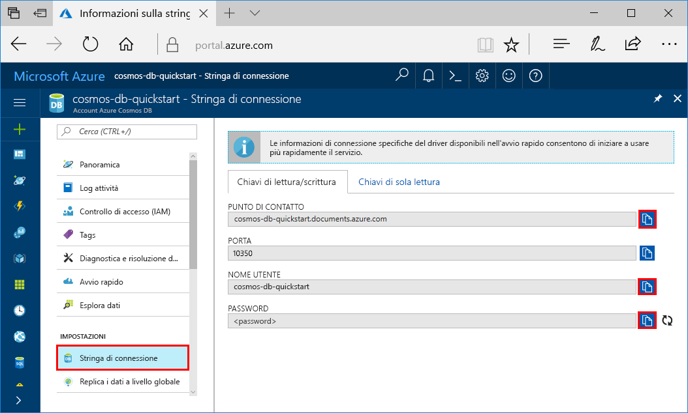

# <a name="quickstart-build-a-cassandra-app-with-java-and-azure-cosmos-db"></a>Guida introduttiva: Creare un'app Cassandra con Java e Azure Cosmos DB

Questa guida introduttiva mostra come usare Java e l'[API Cassandra](cassandra-introduction.md) di Azure Cosmos DB per creare un'app di profilo clonando un esempio di GitHub. Questa guida introduttiva illustra anche come creare un account Azure Cosmos DB usando il portale di Azure basato sul Web.

Azure Cosmos DB è il servizio di database di Microsoft multimodello distribuito a livello globale. È possibile creare ed eseguire rapidamente query su database di documenti, tabelle, valori chiave e grafi, sfruttando in ognuno dei casi i vantaggi offerti dalle funzionalità di scalabilità orizzontale e distribuzione globale alla base di Azure Cosmos DB. 

## <a name="prerequisites"></a>Prerequisiti

Accesso al programma di anteprima dell'API Cassandra di Azure Cosmos DB. Se non è ancora stato richiesto l'accesso, [iscriversi adesso](https://aka.ms/cosmosdb-cassandra-signup).

[!INCLUDE [quickstarts-free-trial-note](../../includes/quickstarts-free-trial-note.md)] In alternativa, è possibile [provare gratuitamente Azure Cosmos DB](https://azure.microsoft.com/try/cosmosdb/) senza una sottoscrizione di Azure e senza impegno.

Eseguire anche queste operazioni: 

* [Java Development Kit (JDK) 1.7+](http://www.oracle.com/technetwork/java/javase/downloads/jdk8-downloads-2133151.html)
    * In Ubuntu eseguire `apt-get install default-jdk` per installare JDK.
    * Assicurarsi di impostare la variabile di ambiente JAVA_HOME in modo che faccia riferimento alla cartella di installazione di JDK.
* [Scaricare](http://maven.apache.org/download.cgi) e [installare](http://maven.apache.org/install.html) un archivio binario [Maven](http://maven.apache.org/)
    * In Ubuntu è possibile eseguire `apt-get install maven` per installare Maven.
* [Git](https://www.git-scm.com/)
    * In Ubuntu è possibile eseguire `sudo apt-get install git` per installare Git.

## <a name="create-a-database-account"></a>Creare un account di database

Prima di poter creare un database di documenti, è necessario creare un account di Cassandra con Azure Cosmos DB.

[!INCLUDE [cosmos-db-create-dbaccount-cassandra](../../includes/cosmos-db-create-dbaccount-cassandra.md)]

## <a name="clone-the-sample-application"></a>Clonare l'applicazione di esempio

Si può ora passare a usare il codice. Clonare un'app Cassandra da GitHub, impostare la stringa di connessione ed eseguirla. Come si noterà, è facile usare i dati a livello di codice. 

1. Aprire una finestra del terminale Git, ad esempio git bash, ed eseguire il comando `cd` per passare a una cartella in cui installare l'app di esempio. 

    ```bash
    cd "C:\git-samples"
    ```

2. Eseguire il comando seguente per clonare l'archivio di esempio. Questo comando crea una copia dell'app di esempio nel computer in uso.

    ```bash
    git clone https://github.com/Azure-Samples/azure-cosmos-db-cassandra-java-getting-started.git
    ```

## <a name="review-the-code"></a>Esaminare il codice

Questo passaggio è facoltativo. Per scoprire in che modo le risorse del database vengono create nel codice, è possibile esaminare i frammenti di codice seguenti. In alternativa, è possibile passare ad [Aggiornare la stringa di connessione](#update-your-connection-string). Questi frammenti di codice sono tutti ricavati da src/main/java/com/azure/cosmosdb/cassandra/util/CassandraUtils.java.  

* Vengono impostate le opzioni per host, porta, nome utente, password e SSL di Cassandra. Le informazioni per la stringa di connessione derivano dalla pagina Stringa di connessione nel portale di Azure.

   ```java
   cluster = Cluster.builder().addContactPoint(cassandraHost).withPort(cassandraPort).withCredentials(cassandraUsername, cassandraPassword).withSSL(sslOptions).build();
   ```

* Il `cluster` si connette all'API Cassandra di Azure Cosmos DB e restituisce una sessione per l'accesso.

    ```java
    return cluster.connect();
    ```

I frammenti di codice seguenti derivano dal file src/main/java/com/azure/cosmosdb/cassandra/repository/UserRepository.java.

* Creare un nuovo keyspace.

    ```java
    public void createKeyspace() {
        final String query = "CREATE KEYSPACE IF NOT EXISTS uprofile WITH replication = {'class': 'SimpleStrategy', 'replication_factor': '3' } ";
        session.execute(query);
        LOGGER.info("Created keyspace 'uprofile'");
    }
    ```

* Creare una nuova tabella.

   ```java
   public void createTable() {
        final String query = "CREATE TABLE IF NOT EXISTS uprofile.user (user_id int PRIMARY KEY, user_name text, user_bcity text)";
        session.execute(query);
        LOGGER.info("Created table 'user'");
   }
   ```

* Inserire le entità utente usando un oggetto istruzione preparata.

    ```java
    public PreparedStatement prepareInsertStatement() {
        final String insertStatement = "INSERT INTO  uprofile.user (user_id, user_name , user_bcity) VALUES (?,?,?)";
        return session.prepare(insertStatement);
    }

    public void insertUser(PreparedStatement statement, int id, String name, String city) {
        BoundStatement boundStatement = new BoundStatement(statement);
        session.execute(boundStatement.bind(id, name, city));
    }
    ```

* Eseguire una query per ottenere tutte le informazioni utente.

    ```java
   public void selectAllUsers() {
        final String query = "SELECT * FROM uprofile.user";
        List<Row> rows = session.execute(query).all();

        for (Row row : rows) {
            LOGGER.info("Obtained row: {} | {} | {} ", row.getInt("user_id"), row.getString("user_name"), row.getString("user_bcity"));
        }
    }
    ```

* Eseguire una query per ottenere le informazioni su un singolo utente.

    ```java
    public void selectUser(int id) {
        final String query = "SELECT * FROM uprofile.user where user_id = 3";
        Row row = session.execute(query).one();

        LOGGER.info("Obtained row: {} | {} | {} ", row.getInt("user_id"), row.getString("user_name"), row.getString("user_bcity"));
    }
    ```

## <a name="update-your-connection-string"></a>Aggiornare la stringa di connessione

Tornare ora al portale di Azure per recuperare le informazioni sulla stringa di connessione e copiarle nell'app. Questo consente all'app di comunicare con il database ospitato.

1. Nel [portale di Azure](http://portal.azure.com/) fare clic su **Stringa di connessione**. 

    

2. Usare il pulsante  sul lato destro della schermata per copiare il valore PUNTO DI CONTATTO.

3. Aprire il file `config.properties` dalla cartella C:\git-samples\azure-cosmosdb-cassandra-java-getting-started\java-examples\src\main\resources. 

3. Incollare il valore di PUNTO DI CONTATTO dal portale su `<Cassandra endpoint host>` nella riga 2.

    La riga 2 di config.properties dovrebbe ora essere simile alla seguente 

    `cassandra_host=cosmos-db-quickstarts.documents.azure.com`

3. Tornare al portale e copiare il valore di NOME UTENTE. Incollare il valore di NOME UTENTE dal portale su `<cassandra endpoint username>` nella riga 4.

    La riga 4 di config.properties dovrebbe ora essere simile alla seguente 

    `cassandra_username=cosmos-db-quickstart`

4. Tornare al portale e copiare il valore di PASSWORD. Incollare il valore di PASSWORD dal portale su `<cassandra endpoint password>` nella riga 5.

    La riga 5 di config.properties dovrebbe ora essere simile alla seguente 

    `cassandra_password=2Ggkr662ifxz2Mg...==`

5. Nella riga 6, se si vuole usare un certificato SSL specifico, sostituire `<SSL key store file location>` con il percorso del certificato SSL. Se non viene fornito un valore, viene usato il certificato JDK installato in <JAVA_HOME>/jre/lib/security/cacerts. 

6. Se la riga 6 è stata modificata per usare un certificato SSL specifico, aggiornare la riga 7 per usare la password per tale certificato. 

7. Salvare il file config.properties.

## <a name="run-the-app"></a>Esecuzione dell'app

1. Nella finestra del terminale Git eseguire il comando `cd` per passare alla cartella azure-cosmosdb-cassandra-java-getting-started\java-examples.

    ```git
    cd "C:\git-samples\azure-cosmosdb-cassandra-java-getting-started\java-examples"
    ```

2. Nella finestra del terminale Git, usare il comando seguente per generare il file cosmosdb-cassandra-examples.jar.

    ```git
    mvn clean install
    ```

3. Nella finestra del terminale Git eseguire il comando seguente per avviare l'applicazione Java.

    ```git
    java -cp target/cosmosdb-cassandra-examples.jar com.azure.cosmosdb.cassandra.examples.UserProfile
    ```

    Nella finestra del terminale vengono visualizzate notifiche per il completamento della creazione di keyspace e tabella. Vengono quindi selezionati e restituiti tutti gli utenti nella tabella, quindi viene visualizzato l'output e infine viene selezionata un riga in base all'ID e ne viene visualizzato il valore.  

    Premere CTRL+C per arrestare l'esecuzione del programma e chiudere la finestra della console. 
    
    È ora possibile aprire Esplora dati nel portale di Azure per visualizzare, modificare e usare questi nuovi dati, nonché eseguire query su di essi. 

    

## <a name="review-slas-in-the-azure-portal"></a>Esaminare i contratti di servizio nel portale di Azure

[!INCLUDE [cosmosdb-tutorial-review-slas](../../includes/cosmos-db-tutorial-review-slas.md)]

## <a name="clean-up-resources"></a>Pulire le risorse

[!INCLUDE [cosmosdb-delete-resource-group](../../includes/cosmos-db-delete-resource-group.md)]

## <a name="next-steps"></a>Passaggi successivi

In questa guida introduttiva si è appreso come creare un account Azure Cosmos DB, un database Cassandra e una raccolta usando Esplora dati e come eseguire un'app per ottenere lo stesso risultato a livello di codice. È ora possibile importare dati aggiuntivi nella raccolta di Azure Cosmos DB. 

> [!div class="nextstepaction"]
> [Importare i dati di Cassandra in Azure Cosmos DB](cassandra-import-data.md)
