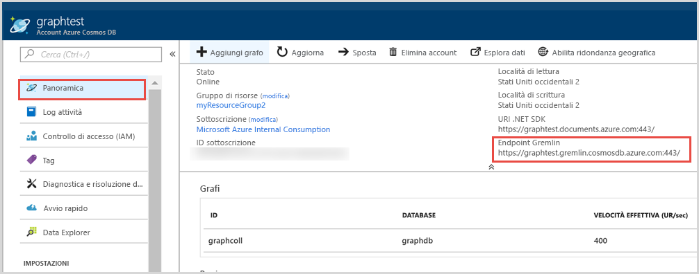

# <a name="quickstart-build-a-net-framework-or-core-application-using-the-azure-cosmos-db-gremlin-api-account"></a>Guida introduttiva: Creare un'applicazione .NET Framework o Core usando l'account dell'API Gremlin di Azure Cosmos DB

> [!div class="op_single_selector"]
> * [Console Gremlin](create-graph-gremlin-console.md)
> * [.NET](create-graph-dotnet.md)
> * [Java](create-graph-java.md)
> * [Node.js](create-graph-nodejs.md)
> * [Python](create-graph-python.md)
> * [PHP](create-graph-php.md)
>  

Azure Cosmos DB è il servizio di database di Microsoft multimodello distribuito a livello globale. È possibile creare ed eseguire rapidamente query su database di documenti, coppie chiave-valore e grafi, sfruttando in ognuno dei casi i vantaggi offerti dalle funzionalità di scalabilità orizzontale e distribuzione globale alla base di Azure Cosmos DB. 

Questo avvio rapido illustra come creare un account, un database e un grafo (contenitore) dell'[API Gremlin](graph-introduction.md) in Azure Cosmos DB tramite il portale di Azure. In seguito, si crea e si esegue un'app console basata sul driver open source [Gremlin.Net](https://tinkerpop.apache.org/docs/3.2.7/reference/#gremlin-DotNet).  

## <a name="prerequisites"></a>Prerequisiti

Se Visual Studio 2019 non è ancora installato, è possibile scaricare e usare l'edizione **gratuita** [Visual Studio 2019 Community Edition](https://www.visualstudio.com/downloads/). Durante l'installazione di Visual Studio abilitare **Sviluppo di Azure**.

[!INCLUDE [quickstarts-free-trial-note](../../includes/quickstarts-free-trial-note.md)]

## <a name="create-a-database-account"></a>Creare un account di database

[!INCLUDE [cosmos-db-create-dbaccount-graph](../../includes/cosmos-db-create-dbaccount-graph.md)]

## <a name="add-a-graph"></a>Aggiungere un grafo

[!INCLUDE [cosmos-db-create-graph](../../includes/cosmos-db-create-graph.md)]

## <a name="clone-the-sample-application"></a>Clonare l'applicazione di esempio

Per clonare un'app API Gremlin da GitHub, impostare la stringa di connessione ed eseguirla. Come si noterà, è facile usare i dati a livello di codice. 

1. Aprire un prompt dei comandi, creare una nuova cartella denominata git-samples e quindi chiudere il prompt dei comandi.

    ```bash
    md "C:\git-samples"
    ```

2. Aprire una finestra del terminale Git, ad esempio Git Bash, ed eseguire il comando `cd` per passare a una nuova cartella in cui installare l'app di esempio.

    ```bash
    cd "C:\git-samples"
    ```

3. Eseguire il comando seguente per clonare l'archivio di esempio. Questo comando crea una copia dell'app di esempio nel computer in uso.

    ```bash
    git clone https://github.com/Azure-Samples/azure-cosmos-db-graph-gremlindotnet-getting-started.git
    ```

4. Aprire quindi Visual Studio e il file della soluzione.

5. Ripristinare i pacchetti NuGet nel progetto. Sono inclusi il driver Gremlin.Net e il pacchetto Newtonsoft.Json.


6. È anche possibile installare il driver Gremlin.Net manualmente tramite Gestione pacchetti NuGet o l'[utilità della riga di comando NuGet](https://docs.microsoft.com/nuget/install-nuget-client-tools): 

    ```bash
    nuget install Gremlin.Net
    ```

## <a name="review-the-code"></a>Esaminare il codice

Questo passaggio è facoltativo. Per scoprire in che modo le risorse del database vengono create nel codice, è possibile esaminare i frammenti di codice seguenti. In alternativa, è possibile passare ad [Aggiornare la stringa di connessione](#update-your-connection-string). 

Tutti i frammenti di codice seguenti sono tratti dal file Program.cs.

* Impostare i parametri di connessione in base all'account creato in precedenza (riga 19): 

    ```csharp
    private static string hostname = "your-endpoint.gremlin.cosmosdb.azure.com";
    private static int port = 443;
    private static string authKey = "your-authentication-key";
    private static string database = "your-database";
    private static string collection = "your-graph-container";
    ```

* I comandi Gremlin da eseguire sono elencati in un dizionario (riga 26):

    ```csharp
    private static Dictionary<string, string> gremlinQueries = new Dictionary<string, string>
    {
        { "Cleanup",        "g.V().drop()" },
        { "AddVertex 1",    "g.addV('person').property('id', 'thomas').property('firstName', 'Thomas').property('age', 44).property('pk', 'pk')" },
        { "AddVertex 2",    "g.addV('person').property('id', 'mary').property('firstName', 'Mary').property('lastName', 'Andersen').property('age', 39).property('pk', 'pk')" },
        { "AddVertex 3",    "g.addV('person').property('id', 'ben').property('firstName', 'Ben').property('lastName', 'Miller').property('pk', 'pk')" },
        { "AddVertex 4",    "g.addV('person').property('id', 'robin').property('firstName', 'Robin').property('lastName', 'Wakefield').property('pk', 'pk')" },
        { "AddEdge 1",      "g.V('thomas').addE('knows').to(g.V('mary'))" },
        { "AddEdge 2",      "g.V('thomas').addE('knows').to(g.V('ben'))" },
        { "AddEdge 3",      "g.V('ben').addE('knows').to(g.V('robin'))" },
        { "UpdateVertex",   "g.V('thomas').property('age', 44)" },
        { "CountVertices",  "g.V().count()" },
        { "Filter Range",   "g.V().hasLabel('person').has('age', gt(40))" },
        { "Project",        "g.V().hasLabel('person').values('firstName')" },
        { "Sort",           "g.V().hasLabel('person').order().by('firstName', decr)" },
        { "Traverse",       "g.V('thomas').out('knows').hasLabel('person')" },
        { "Traverse 2x",    "g.V('thomas').out('knows').hasLabel('person').out('knows').hasLabel('person')" },
        { "Loop",           "g.V('thomas').repeat(out()).until(has('id', 'robin')).path()" },
        { "DropEdge",       "g.V('thomas').outE('knows').where(inV().has('id', 'mary')).drop()" },
        { "CountEdges",     "g.E().count()" },
        { "DropVertex",     "g.V('thomas').drop()" },
    };
    ```


* Creare un oggetto connessione `GremlinServer` usando i parametri forniti in precedenza (riga 52):

    ```csharp
    var gremlinServer = new GremlinServer(hostname, port, enableSsl: true, 
                                                    username: "/dbs/" + database + "/colls/" + collection, 
                                                    password: authKey);
    ```

* Creare un nuovo oggetto `GremlinClient` (riga 56):

    ```csharp
    var gremlinClient = new GremlinClient(gremlinServer, new GraphSON2Reader(), new GraphSON2Writer(), GremlinClient.GraphSON2MimeType);
    ```

* Eseguire ogni query Gremlin usando l'oggetto `GremlinClient` con un'attività asincrona (riga 63). In questo modo, le query Gremlin verranno lette dal dizionario definito in precedenza (riga 26):

    ```csharp
    var results = await gremlinClient.SubmitAsync<dynamic>(query.Value);
    ```

* Recuperare il risultato e leggere i valori, formattati come dizionario, usando la classe `JsonSerializer` da Newtonsoft.Json:

    ```csharp
    foreach (var result in results)
    {
        // The vertex results are formed as dictionaries with a nested dictionary for their properties
        string output = JsonConvert.SerializeObject(result);
        Console.WriteLine(String.Format("\tResult:\n\t{0}", output));
    }
    ```

## <a name="update-your-connection-string"></a>Aggiornare la stringa di connessione

Tornare ora al portale di Azure per recuperare le informazioni sulla stringa di connessione e copiarle nell'app.

1. Dal [portale di Azure](https://portal.azure.com/) passare all'account di database del grafo. Nella scheda **Panoramica** sono visualizzati due endpoint: 
 
   **URI .NET SDK**: questo valore viene usato quando ci si connette all'account del grafo tramite la libreria Microsoft.Azure.Graphs. 

   **Endpoint Gremlin**: questo valore viene usato quando ci si connette all'account del grafo tramite la libreria Gremlin.Net.

    

   Per eseguire questo esempio, copiare il valore **Endpoint Gremlin** ed eliminare il numero di porta alla fine, in modo che l'URI diventi `https://<your cosmos db account name>.gremlin.cosmosdb.azure.com`

2. In Program.cs incollare il valore sopra `your-endpoint` nella variabile `hostname` nella riga 19. 

    `"private static string hostname = "<your cosmos db account name>.gremlin.cosmosdb.azure.com";`

    Il valore dell'endpoint dovrebbe ora essere simile all'output seguente:

    `"private static string hostname = "testgraphacct.gremlin.cosmosdb.azure.com";`

3. Passare quindi alla scheda **Chiavi** e copiare il valore di **CHIAVE PRIMARIA** dal portale e incollarlo nella variabile `authkey`, sostituendo il segnaposto `"your-authentication-key"` nella riga 21. 

    `private static string authKey = "your-authentication-key";`

4. Usando le informazioni del database creato in precedenza, incollare il nome del database nella variabile `database` nella riga 22. 

    `private static string database = "your-database";`

5. Analogamente, usando le informazioni del contenitore creato in precedenza, incollare il nome della raccolta, che corrisponde al nome del grafico, nella variabile `collection` nella riga 23. 

    `private static string collection = "your-collection-or-graph";`

6. Salvare il file Program.cs. 

L'app è stata aggiornata con tutte le informazioni necessarie per comunicare con Azure Cosmos DB. 

## <a name="run-the-console-app"></a>Eseguire l'app console

Premere CTRL + F5 per eseguire l'applicazione. L'applicazione stamperà i comandi della query Gremlin e i risultati nella console.

   La finestra della console visualizza i vertici e gli archi aggiunti al grafo. Al completamento dello script, premere INVIO per chiudere la finestra della console.

## <a name="browse-using-the-data-explorer"></a>Esplorare i dati con Esplora dati

È ora possibile tornare a Esplora dati nel portale di Azure per esplorare i nuovi dati del grafo ed eseguire query su di essi.

1. In Esplora dati il nuovo database viene visualizzato nel riquadro Graph. Espandere il database e i nodi del contenitore e quindi fare clic su **Grafico**.

2. Fare clic sul pulsante **Applica filtro** per usare la query predefinita per visualizzare tutti i vertici nel grafico. I dati generati dall'app di esempio vengono visualizzati nel riquadro Graphs (Grafi).

    È possibile ingrandire o ridurre il grafico, espanderne lo spazio di visualizzazione, aggiungere altri vertici e spostare i vertici nell'area di visualizzazione.

    

## <a name="review-slas-in-the-azure-portal"></a>Esaminare i contratti di servizio nel portale di Azure

[!INCLUDE [cosmosdb-tutorial-review-slas](../../includes/cosmos-db-tutorial-review-slas.md)]

## <a name="clean-up-resources"></a>Pulire le risorse

[!INCLUDE [cosmosdb-delete-resource-group](../../includes/cosmos-db-delete-resource-group.md)]

## <a name="next-steps"></a>Passaggi successivi

In questa guida di avvio rapido si è appreso come creare un account Azure Cosmos DB, come creare un grafo con Esplora dati e come eseguire un'app. È ora possibile creare query più complesse e implementare la potente logica di attraversamento dei grafi usando Gremlin. 

> [!div class="nextstepaction"]
> [Eseguire query con Gremlin](tutorial-query-graph.md)

