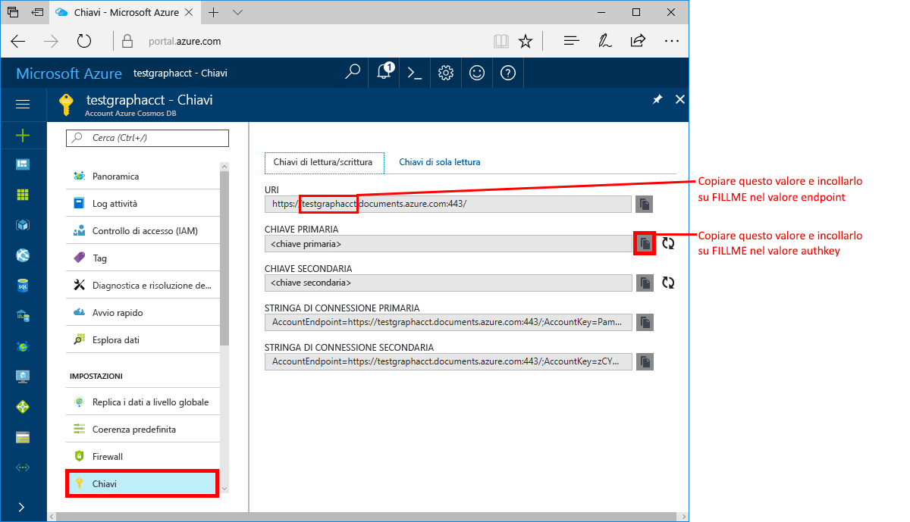
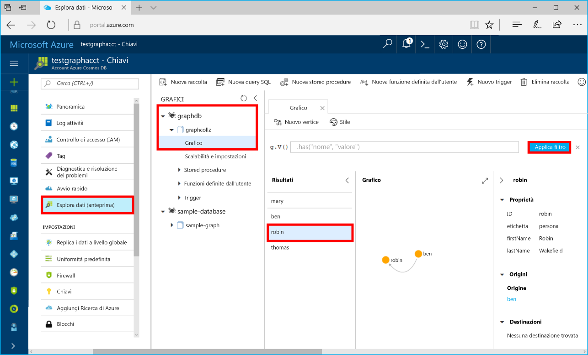

# <a name="azure-cosmos-db-build-a-net-framework-or-core-application-using-the-graph-api"></a>Azure Cosmos DB: Creare un'applicazione .NET Framework o Core tramite l'API Graph

Azure Cosmos DB è il servizio di database di Microsoft multimodello distribuito a livello globale. È possibile creare ed eseguire rapidamente query su database di documenti, coppie chiave-valore e grafi, sfruttando in ognuno dei casi i vantaggi offerti dalle funzionalità di scalabilità orizzontale e distribuzione globale alla base di Azure Cosmos DB. 

Questa guida di avvio rapido mostra come creare un account, un database e un grafo (contenitore) di Azure Cosmos DB tramite il portale di Azure. Quindi, si creerà ed eseguirà un'app console basata sull'[API Graph](graph-sdk-dotnet.md).  

## <a name="prerequisites"></a>prerequisiti

Se Visual Studio 2017 non è ancora installato, è possibile scaricare e usare la versione **gratuita** [Visual Studio 2017 Community Edition](https://www.visualstudio.com/downloads/). Durante l'installazione di Visual Studio abilitare **Sviluppo di Azure**.

Se si dispone già di Visual Studio 2017 installato, assicurarsi che sia installata la versione [Visual Studio 2017 Update 3](https://www.visualstudio.com/en-us/news/releasenotes/vs2017-relnotes).

[!INCLUDE [quickstarts-free-trial-note](../../includes/quickstarts-free-trial-note.md)]

## <a name="create-a-database-account"></a>Creare un account di database

[!INCLUDE [cosmos-db-create-dbaccount-graph](../../includes/cosmos-db-create-dbaccount-graph.md)]

## <a name="add-a-graph"></a>Aggiungere un grafo

[!INCLUDE [cosmos-db-create-graph](../../includes/cosmos-db-create-graph.md)]

## <a name="clone-the-sample-application"></a>Clonare l'applicazione di esempio

Clonare ora un'app per le API Graph da GitHub, impostare la stringa di connessione ed eseguirla. Come si noterà, è facile usare i dati a livello di codice. 

Questo progetto di esempio usa il formato di progetto .NET Core ed è stato configurato per i framework seguenti come destinazione:
 - netcoreapp2.0
 - net461

1. Aprire una finestra del terminale Git, ad esempio Git Bash, ed eseguire il comando `cd` per passare a una directory di lavoro.  

2. Eseguire il comando seguente per clonare l'archivio di esempio. 

    ```bash
    git clone https://github.com/Azure-Samples/azure-cosmos-db-graph-dotnet-getting-started.git
    ```

3. Aprire quindi Visual Studio e il file della soluzione. 

## <a name="review-the-code"></a>Esaminare il codice

Ecco una breve panoramica delle operazioni eseguire nell'app. Aprire il file Program.cs. Come si noterà, queste righe di codice creano le risorse di Azure Cosmos DB. 

* Viene inizializzato DocumentClient. Nell'anteprima è stata aggiunta un'API di estensione Graph nel client Azure Cosmos DB. È in corso lo sviluppo di un client Graph autonomo separato dal client e dalle risorse di Azure Cosmos DB.

    ```csharp
    using (DocumentClient client = new DocumentClient(
        new Uri(endpoint),
        authKey,
        new ConnectionPolicy { ConnectionMode = ConnectionMode.Direct, ConnectionProtocol = Protocol.Tcp }))
    ```

* Viene creato un nuovo database.

    ```csharp
    Database database = await client.CreateDatabaseIfNotExistsAsync(new Database { Id = "graphdb" });
    ```

* Viene creato un nuovo grafo.

    ```csharp
    DocumentCollection graph = await client.CreateDocumentCollectionIfNotExistsAsync(
        UriFactory.CreateDatabaseUri("graphdb"),
        new DocumentCollection { Id = "graph" },
        new RequestOptions { OfferThroughput = 1000 });
    ```
* Viene eseguita una serie di passaggi di Gremlin tramite il metodo `CreateGremlinQuery`.

    ```csharp
    // The CreateGremlinQuery method extensions allow you to execute Gremlin queries and iterate
    // results asychronously
    IDocumentQuery<dynamic> query = client.CreateGremlinQuery<dynamic>(graph, "g.V().count()");
    while (query.HasMoreResults)
    {
        foreach (dynamic result in await query.ExecuteNextAsync())
        {
            Console.WriteLine($"\t {JsonConvert.SerializeObject(result)}");
        }
    }

    ```

## <a name="update-your-connection-string"></a>Aggiornare la stringa di connessione

Tornare ora al portale di Azure per recuperare le informazioni sulla stringa di connessione e copiarle nell'app.

1. Nel [portale di Azure](http://portal.azure.com/) fare clic su **Chiavi**. 

    Copiare la prima parte del valore dell'URI.

    

2. In Visual Studio 2017 aprire il file appsettings.json e incollare il valore su `FILLME` in `endpoint`. 

    `"endpoint": "https://FILLME.documents.azure.com:443/",`

    Il valore dell'endpoint dovrebbe ora essere simile all'output seguente:

    `"endpoint": "https://testgraphacct.documents.azure.com:443/",`

3. Se l'account del database a grafo è stato creato prima del 27 novembre 2017, sostituire `documents` con `graphs` nel valore di `endpoint`. Se l'account del database a grafo è stato creato il 27 novembre 2017 o dopo, sostituire `documents` con `gremlin.cosmosdb` nel valore di `endpoint`.

    Il valore dell'endpoint dovrebbe ora essere simile all'output seguente:

    `"endpoint": "https://testgraphacct.graphs.azure.com:443/",` oppure `"endpoint": "https://testgraphacct.gremlin.cosmosdb.azure.com:443/",`

4. Copiare il valore di **CHIAVE PRIMARIA** dal portale e impostarlo come valore della chiave AuthKey in App.config, quindi salvare le modifiche. 

    `"authkey": "FILLME"`

5. Salvare il file appsettings.json. 

L'app è stata aggiornata con tutte le informazioni necessarie per comunicare con Azure Cosmos DB. 

## <a name="run-the-console-app"></a>Eseguire l'app console

Prima di eseguire l'applicazione si consiglia di aggiornare il pacchetto *Microsoft.Azure.Graphs* alla versione più recente.

1. In Visual Studio fare clic con il pulsante destro del mouse sul progetto **GraphGetStarted** in **Esplora soluzioni** e quindi scegliere **Gestisci pacchetti NuGet**. 

2. Nella scheda **Updates** (Aggiornamenti) di NuGet Package Manager digitare *Microsoft.Azure.Graphs* e selezionare la casella **Includes prerelease** (Include versione preliminare). 

3. In base ai risultati, aggiornare la libreria **Microsoft.Azure.Graphs** alla versione più recente del pacchetto. Viene installato il pacchetto della libreria di estensioni Graph per Azure Cosmos DB, insieme a tutte le dipendenze.

    Se viene visualizzato un messaggio sulla verifica delle modifiche alla soluzione, fare clic su **OK**. Se viene visualizzato un messaggio sull'accettazione della licenza, fare clic su **Accetto**.

4. Premere CTRL + F5 per eseguire l'applicazione.

   La finestra della console visualizza i vertici e gli archi aggiunti al grafo. Al termine dello script, premere INVIO due volte per chiudere la finestra della console.

## <a name="browse-using-the-data-explorer"></a>Esplorare i dati con Esplora dati

È ora possibile tornare a Esplora dati nel portale di Azure per esplorare i nuovi dati del grafo ed eseguire query su di essi.

1. In Esplora dati il nuovo database viene visualizzato nel riquadro Graph. Espandere **graphdb** e **graphcollz** e quindi fare clic su **Grafico**.

2. Fare clic sul pulsante **Applica filtro** per usare la query predefinita per visualizzare tutti i vertici nel grafico. I dati generati dall'app di esempio vengono visualizzati nel riquadro Graphs (Grafi).

    È possibile ingrandire o ridurre il grafico, espanderne lo spazio di visualizzazione, aggiungere altri vertici e spostare i vertici nell'area di visualizzazione.

    

## <a name="review-slas-in-the-azure-portal"></a>Esaminare i contratti di servizio nel portale di Azure

[!INCLUDE [cosmosdb-tutorial-review-slas](../../includes/cosmos-db-tutorial-review-slas.md)]

## <a name="clean-up-resources"></a>Pulire le risorse

Se non si intende continuare a usare l'app, eliminare tutte le risorse create tramite questa guida di avvio rapido nel portale di Azure eseguendo questi passaggi: 

1. Scegliere **Gruppi di risorse** dal menu a sinistra del portale di Azure e quindi fare clic sul nome della risorsa creata. 
2. Nella pagina del gruppo di risorse fare clic su **Elimina**, digitare il nome della risorsa da eliminare nella casella di testo e quindi fare clic su **Elimina**.

## <a name="next-steps"></a>Passaggi successivi

In questa guida di avvio rapido si è appreso come creare un account Azure Cosmos DB, come creare un grafo con Esplora dati e come eseguire un'app. È ora possibile creare query più complesse e implementare la potente logica di attraversamento dei grafi usando Gremlin. 

> [!div class="nextstepaction"]
> [Eseguire query con Gremlin](tutorial-query-graph.md)

