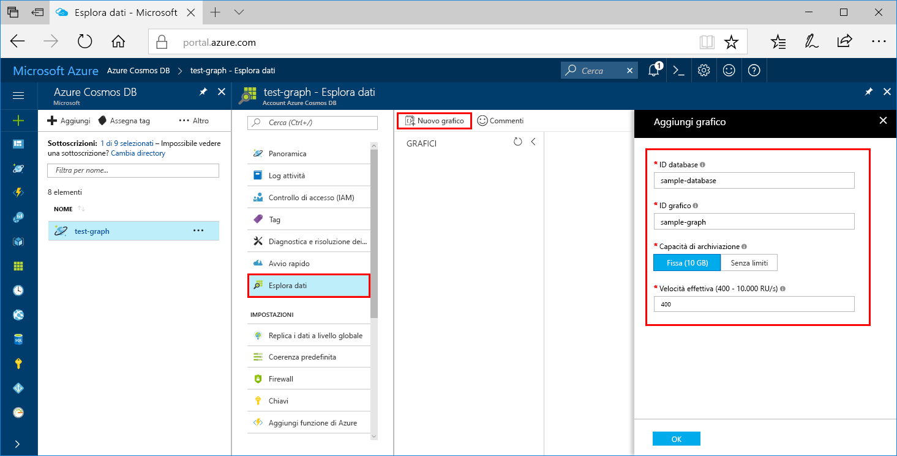

# <a name="azure-cosmos-db-create-a-graph-database-using-java-and-the-azure-portal"></a>Azure Cosmos DB: Creare un database a grafo con Java e il portale di Azure

Azure Cosmos DB è il servizio di database multimodello distribuito a livello globale di Microsoft. Questo servizio consente di creare rapidamente database di documenti, tabelle e a grafo e di eseguire query su di essi. 

Questa guida introduttiva crea un database a grafo semplice usando gli strumenti del portale di Azure per Azure Cosmos DB. Illustra anche come creare rapidamente un'app console Java usando un database a grafo con il driver OSS [Gremlin Java](https://mvnrepository.com/artifact/org.apache.tinkerpop/gremlin-driver). Le istruzioni di questa guida introduttiva possono essere eseguite in qualsiasi sistema operativo in grado di eseguire Java. Questa guida consente di acquisire familiarità con la creazione e la modifica di grafi nell'interfaccia utente o a livello di codice, in base alle proprie preferenze. 

## <a name="prerequisites"></a>Prerequisiti
[!INCLUDE [quickstarts-free-trial-note](../../includes/quickstarts-free-trial-note.md)]

Eseguire anche queste operazioni:

* [Java Development Kit (JDK) 1.7+](http://www.oracle.com/technetwork/java/javase/downloads/jdk8-downloads-2133151.html)
    * In Ubuntu eseguire `apt-get install default-jdk` per installare JDK.
    * Assicurarsi di impostare la variabile di ambiente JAVA_HOME in modo che faccia riferimento alla cartella di installazione di JDK.
* [Scaricare](http://maven.apache.org/download.cgi) e [installare](http://maven.apache.org/install.html) un archivio binario [Maven](http://maven.apache.org/)
    * In Ubuntu è possibile eseguire `apt-get install maven` per installare Maven.
* [Git](https://www.git-scm.com/)
    * In Ubuntu è possibile eseguire `sudo apt-get install git` per installare Git.

## <a name="create-a-database-account"></a>Creare un account di database

Prima di potere creare un database a grafo, è necessario creare un account database Gremlin (grafo) con Azure Cosmos DB.

[!INCLUDE [cosmos-db-create-dbaccount-graph](../../includes/cosmos-db-create-dbaccount-graph.md)]

## <a name="add-a-graph"></a>Aggiungere un grafo

È ora possibile usare lo strumento Esplora dati nel portale di Azure per creare un database a grafo. 

1. Fare clic su **Esplora dati** > **New Graph** (Nuovo grafo).

    Viene visualizzata l'area **Add Graph** (Aggiungi grafo) all'estrema destra. Per vederla potrebbe essere necessario scorrere la schermata.

    

2. Nella pagina **Add Graph** (Aggiungi grafo) immettere le impostazioni per il nuovo grafo.

    Impostazione|Valore consigliato|Descrizione
    ---|---|---
    ID database|sample-database|Immettere *sample-database* come nome del nuovo database. I nomi dei database devono avere una lunghezza compresa tra 1 e 255 caratteri e non possono contenere `/ \ # ?` o spazi finali.
    ID grafo|sample-graph|Immettere *sample-graph* come nome della nuova raccolta. I nomi dei grafi presentano gli stessi requisiti relativi ai caratteri degli ID di database.
    Capacità di archiviazione|Fissa (10 GB)|Modificare il valore in **Fissa (10 GB)**. Questo valore indica la capacità di archiviazione del database.
    Velocità effettiva|400 UR/s|Modificare la velocità effettiva in 400 unità richiesta al secondo (UR/sec). Se si vuole ridurre la latenza, è possibile aumentare la velocità effettiva in un secondo momento.
    Chiave di partizione|Lasciare vuoto|Per le finalità di questa esercitazione introduttiva, lasciare vuoto il valore relativo alla chiave di partizione.

3. Dopo aver compilato il modulo, fare clic su **OK**.

## <a name="clone-the-sample-application"></a>Clonare l'applicazione di esempio

Si può ora passare a usare il codice. È possibile clonare ora un'app API Graph da GitHub, impostare la stringa di connessione ed eseguirla. Come si noterà, è facile usare i dati a livello di codice.  

1. Aprire un prompt dei comandi, creare una nuova cartella denominata git-samples e quindi chiudere il prompt dei comandi.

    ```bash
    md "C:\git-samples"
    ```

2. Aprire una finestra del terminale Git, ad esempio git bash, ed eseguire il comando `cd` per passare a una cartella in cui installare l'app di esempio.  

    ```bash
    cd "C:\git-samples"
    ```

3. Eseguire il comando seguente per clonare l'archivio di esempio. Questo comando crea una copia dell'app di esempio nel computer in uso. 

    ```bash
    git clone https://github.com/Azure-Samples/azure-cosmos-db-graph-java-getting-started.git
    ```

## <a name="review-the-code"></a>Esaminare il codice

Questo passaggio è facoltativo. Per scoprire in che modo le risorse del database vengono create nel codice, è possibile esaminare i frammenti di codice seguenti. I frammenti di codice derivano tutti dal file `Program.java` che si trova nella cartella C:\git-samples\azure-cosmos-db-graph-java-getting-started\src\GetStarted. In alternativa, è possibile passare ad [Aggiornare la stringa di connessione](#update-your-connection-information). 

* Viene inizializzato `Client` di Gremlin dalla configurazione in `src/remote.yaml`.

    ```java
    cluster = Cluster.build(new File("src/remote.yaml")).create();
    ...
    client = cluster.connect();
    ```

* Viene eseguita una serie di passaggi di Gremlin tramite il metodo `client.submit`.

    ```java
    ResultSet results = client.submit(gremlin);

    CompletableFuture<List<Result>> completableFutureResults = results.all();
    List<Result> resultList = completableFutureResults.get();

    for (Result result : resultList) {
        System.out.println(result.toString());
    }
    ```

## <a name="update-your-connection-information"></a>Aggiornare la stringa di connessione

Tornare ora al portale di Azure per recuperare la stringa di connessione e copiarla nell'app. Queste impostazioni consentono all'app di comunicare con il database ospitato.

1. Nel [portale di Azure](http://portal.azure.com/) fare clic su **Chiavi**. 

    Copiare la prima parte del valore dell'URI.

    
2. Aprire il file src/remote.yaml e incollare il valore su `$name$` in `hosts: [$name$.graphs.azure.com]`.

    La riga 1 del file remote.yaml si presenta ora nel modo seguente: 

    `hosts: [test-graph.graphs.azure.com]`

3. Nel portale di Azure usare il pulsante Copia per copiare la CHIAVE PRIMARIA e incollarla su `$masterKey$` in `password: $masterKey$`.

    La riga 4 del file remote.yaml si presenta ora nel modo seguente: 

    `password: 2Ggkr662ifxz2Mg==`

4. Modificare la riga 3 di remote.yaml da

    `username: /dbs/$database$/colls/$collection$`

    to 

    `username: /dbs/sample-database/colls/sample-graph`

5. Salvare il file remote.yaml.

## <a name="run-the-console-app"></a>Eseguire l'app console

1. Nella finestra del terminale git eseguire il comando `cd` per passare alla cartella azure-cosmos-db-graph-java-getting-started.

    ```git
    cd "C:\git-samples\azure-cosmos-db-graph-java-getting-started"
    ```

2. Nella finestra del terminale Git usare il comando seguente per installare i pacchetti Java necessari.

   ```
   mvn package
   ```

3. Nella finestra del terminale Git usare il comando seguente per avviare l'applicazione Java.
    
    ```
    mvn exec:java -D exec.mainClass=GetStarted.Program
    ```

    La finestra del terminale mostra l'aggiunta dei vertici al grafo. 
    
    Se si verificano errori di timeout, controllare di avere aggiornato correttamente le informazioni di connessione in [Aggiornare le informazioni di connessione](#update-your-connection-information) e provare a eseguire di nuovo l'ultimo comando. 
    
    All'arresto del programma premere Invio per tornare al portale di Azure nel browser Internet. 

<a id="add-sample-data"></a>
## <a name="review-and-add-sample-data"></a>Verificare e aggiungere dati di esempio

È ora possibile tornare a Esplora dati e visualizzare i vertici aggiunti al grafo, quindi aggiungere altri punti dati.

1. Fare clic su **Esplora dati**, espandere **sample-graph**, fare clic su **Grafo** e quindi su **Applica filtro**. 

   

2. Nell'elenco **Risultati** verificare i nuovi utenti aggiunti al grafo. Selezionare **ben**. Come si può notare, è connesso a robin. È possibile spostare i vertici intorno mediante trascinamento della selezione, applicare lo zoom mediante lo scorrimento della rotellina del mouse ed espandere le dimensioni del grafo usando la doppia freccia. 

   

3. Vengono ora aggiunti alcuni nuovi utenti. Fare clic sul pulsante **New Vertex** (Nuovo vertice) per aggiungere dati al grafo.

   

4. Immettere un'etichetta di *persona*.

5. Fare clic su **Add property** (Aggiungi proprietà) per aggiungere ognuna delle proprietà seguenti. Si noti che è possibile creare proprietà univoche per ogni persona del grafo. È necessaria solo la chiave id.

    key|value|Note
    ----|----|----
    id|ashley|Identificatore univoco per il vertice. Se non si specifica alcun ID, ne verrà generato automaticamente uno.
    gender|female| 
    tech | java | 

    > [!NOTE]
    > In questa esercitazione introduttiva viene creata una raccolta non partizionata. Se tuttavia si crea una raccolta partizionata specificando una chiave di partizione durante la creazione della raccolta, sarà necessario includere la chiave di partizione come chiave in ogni nuovo vertice. 

6. Fare clic su **OK**. Potrebbe essere necessario espandere la schermata per vedere il pulsante **OK** nella parte inferiore dello schermo.

7. Fare di nuovo clic su **New Vertex** (Nuovo vertice) e aggiungere un altro nuovo utente. 

8. Immettere un'etichetta di *persona*.

9. Fare clic su **Add property** (Aggiungi proprietà) per aggiungere ognuna delle proprietà seguenti:

    key|value|Note
    ----|----|----
    id|rakesh|Identificatore univoco per il vertice. Se non si specifica alcun ID, ne verrà generato automaticamente uno.
    gender|male| 
    school|MIT| 

10. Fare clic su **OK**. 

11. Fare clic sul pulsante **Applica filtro** con il filtro `g.V()` predefinito per visualizzare tutti i valori nel grafo. Tutti gli utenti sono ora visualizzati nell'elenco **Risultati**. 

    Quando si aggiungono altri dati, è possibile usare i filtri per limitare i risultati visualizzati. Per impostazione predefinita, Esplora dati usa `g.V()` per recuperare tutti i vertici di un grafo. È possibile modificarlo in un'altra [query di grafo](tutorial-query-graph.md), ad esempio `g.V().count()`, per restituire un conteggio di tutti i vertici del grafo in formato JSON. Se è stato modificato il filtro, reimpostarlo su `g.V()` e fare clic su **Applica filtro** per visualizzare di nuovo tutti i risultati.

12. È ora possibile connettere rakesh e ashley. Assicurarsi che il valore **ashley** sia selezionato nell'elenco **Risultati**, quindi fare clic sul pulsante di modifica accanto a **Destinazioni** in basso a destra. Potrebbe essere necessario allargare la finestra per visualizzare l'area **Proprietà**.

   

13. Nella casella **Destinazione** digitare *rakesh* e nella casella **Edge label** (Etichetta arco) digitare *knows*, quindi selezionare la casella di controllo.

   

14. Selezionare ora **rakesh** dall'elenco Risultati. Come si può notare ashley e rakesh sono connessi. 

   

   È stata completata la parte della creazione di risorse di questa esercitazione. È possibile continuare a aggiungere vertici al grafo, modificare quelli esistenti o modificare le query. Vengono ora esaminate le metriche di Azure Cosmos DB e quindi pulite le risorse. 

## <a name="review-slas-in-the-azure-portal"></a>Esaminare i contratti di servizio nel portale di Azure

[!INCLUDE [cosmosdb-tutorial-review-slas](../../includes/cosmos-db-tutorial-review-slas.md)]

## <a name="clean-up-resources"></a>Pulire le risorse

[!INCLUDE [cosmosdb-delete-resource-group](../../includes/cosmos-db-delete-resource-group.md)]

## <a name="next-steps"></a>Passaggi successivi

In questa guida di avvio rapido si è appreso come creare un account Azure Cosmos DB, come creare un grafo con Esplora dati e come eseguire un'app. È ora possibile creare query più complesse e implementare la potente logica di attraversamento dei grafi usando Gremlin. 

> [!div class="nextstepaction"]
> [Eseguire query con Gremlin](tutorial-query-graph.md)

