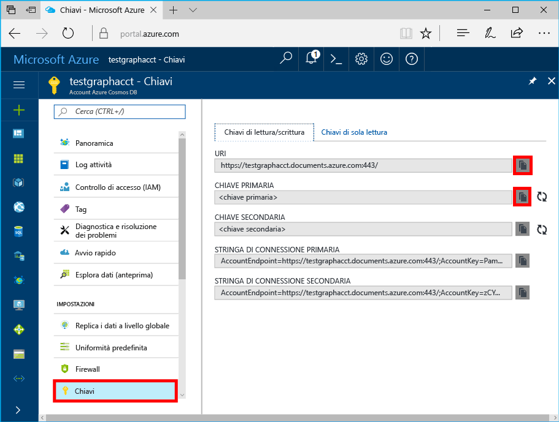
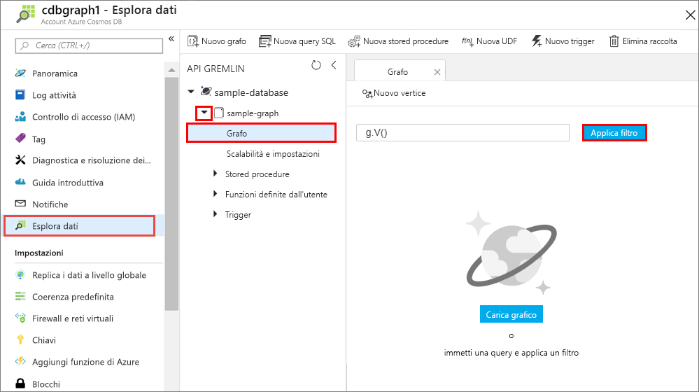
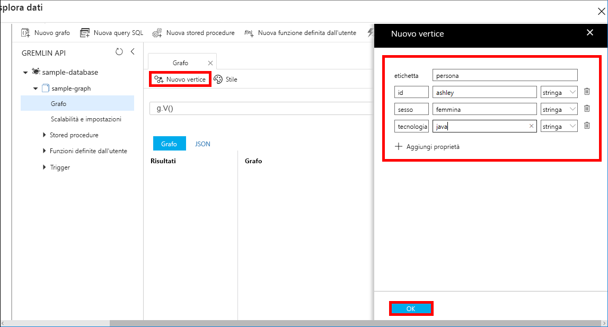
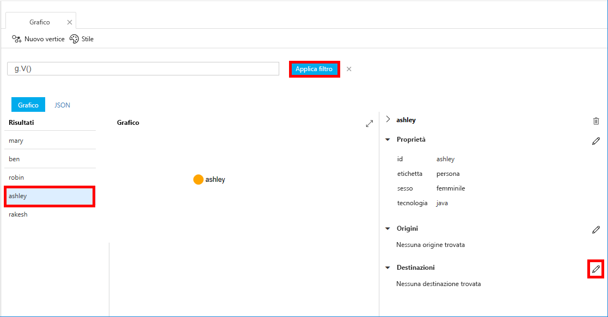

# <a name="azure-cosmos-db-create-a-graph-database-using-java-and-the-azure-portal"></a>Azure Cosmos DB: Creare un database a grafo con Java e il portale di Azure

Azure Cosmos DB è il servizio di database multimodello distribuito a livello globale di Microsoft. È possibile creare ed eseguire rapidamente query su database di documenti, coppie chiave/valore e grafi, sfruttando in ognuno dei casi i vantaggi offerti dalle funzionalità di scalabilità orizzontale e distribuzione globale alla base di Azure Cosmos DB. 

Questa esercitazione introduttiva illustra come creare un database a grafo con gli strumenti del portale di Azure per Azure Cosmos DB. Illustra anche come creare rapidamente un'app console Java usando un database a grafo con il driver OSS [Gremlin Java](https://mvnrepository.com/artifact/org.apache.tinkerpop/gremlin-driver). Le istruzioni di questa guida introduttiva possono essere eseguite in qualsiasi sistema operativo in grado di eseguire Java. Questa guida introduttiva consente di acquisire familiarità con la creazione e la modifica di risorse di tipo grafo nell'interfaccia utente o a livello di codice, in base alle proprie preferenze. 

## <a name="prerequisites"></a>Prerequisiti

* [Java Development Kit (JDK) 1.7+](http://www.oracle.com/technetwork/java/javase/downloads/jdk8-downloads-2133151.html)
    * In Ubuntu eseguire `apt-get install default-jdk` per installare JDK.
    * Assicurarsi di impostare la variabile di ambiente JAVA_HOME in modo che faccia riferimento alla cartella di installazione di JDK.
* [Scaricare](http://maven.apache.org/download.cgi) e [installare](http://maven.apache.org/install.html) un archivio binario [Maven](http://maven.apache.org/)
    * In Ubuntu è possibile eseguire `apt-get install maven` per installare Maven.
* [Git](https://www.git-scm.com/)
    * In Ubuntu è possibile eseguire `sudo apt-get install git` per installare Git.

[!INCLUDE [quickstarts-free-trial-note](../../includes/quickstarts-free-trial-note.md)]

## <a name="create-a-database-account"></a>Creare un account di database

Prima di potere creare un database a grafo, è necessario creare un account database Gremlin (grafo) con Azure Cosmos DB.

[!INCLUDE [cosmos-db-create-dbaccount-graph](../../includes/cosmos-db-create-dbaccount-graph.md)]

## <a name="add-a-graph"></a>Aggiungere un grafo

È ora possibile usare lo strumento Esplora dati nel portale di Azure per creare un database a grafo. 

1. Nel menu di navigazione a sinistra del portale di Azure fare clic su **Esplora dati (anteprima)**. 
2. Nel pannello **Esplora dati (anteprima)** fare clic su **New Graph** (Nuovo grafo) e quindi compilare i campi della pagina con le informazioni seguenti:

    

    Impostazione|Valore consigliato|Descrizione
    ---|---|---
    ID database|sample-database|ID del nuovo database. I nomi dei database devono avere una lunghezza compresa tra 1 e 255 caratteri e non possono contenere `/ \ # ?` o spazi finali.
    ID grafo|sample-graph|ID del nuovo grafo. I nomi dei grafi presentano gli stessi requisiti relativi ai caratteri degli ID di database.
    Capacità di archiviazione| 10 GB|Lasciare il valore predefinito. Indica la capacità di archiviazione del database.
    Velocità effettiva|400 UR/s|Lasciare il valore predefinito. È possibile aumentare la velocità effettiva in un secondo momento se si desidera ridurre la latenza.
    Chiave di partizione|Lasciare vuoto|Per le finalità di questa esercitazione introduttiva, lasciare vuoto il valore relativo alla chiave di partizione.

3. Dopo aver compilato il modulo, fare clic su **OK**.

## <a name="clone-the-sample-application"></a>Clonare l'applicazione di esempio

Clonare ora un'app Graph da GitHub, impostare la stringa di connessione ed eseguirla. Come si noterà, è facile usare i dati a livello di codice. 

1. Aprire una finestra del terminale Git, ad esempio Git Bash, ed eseguire il comando `cd` per passare a una directory di lavoro.  

2. Eseguire il comando seguente per clonare l'archivio di esempio. 

    ```bash
    git clone https://github.com/Azure-Samples/azure-cosmos-db-graph-java-getting-started.git
    ```

## <a name="review-the-code"></a>Esaminare il codice

Ecco una breve analisi di ciò che accade nell'app. Aprire il file `Program.java` dalla cartella \src\GetStarted e trovare queste righe di codice. 

* Viene inizializzato `Client` di Gremlin dalla configurazione in `src/remote.yaml`.

    ```java
    cluster = Cluster.build(new File("src/remote.yaml")).create();
    ...
    client = cluster.connect();
    ```

* Viene eseguita una serie di passaggi di Gremlin tramite il metodo `client.submit`.

    ```java
    ResultSet results = client.submit(gremlin);

    CompletableFuture<List<Result>> completableFutureResults = results.all();
    List<Result> resultList = completableFutureResults.get();

    for (Result result : resultList) {
        System.out.println(result.toString());
    }
    ```

## <a name="update-your-connection-string"></a>Aggiornare la stringa di connessione

1. Aprire il file src/remote.yaml. 

3. Inserire i valori relativi a *hosts*, *username* e *password* nel file src/remote.yaml. Non è necessario modificare le impostazioni rimanenti.

    Impostazione|Valore consigliato|Descrizione
    ---|---|---
    Hosts|[***.graphs.azure.com]|Vedere la schermata che segue questa tabella. Si tratta del valore URI Gremlin disponibile nella pagina Panoramica del portale di Azure, tra parentesi quadre, senza la parte finale :443/.<br><br>Questo valore può anche essere recuperato dalla scheda Chiavi, usando il valore dell'URI senza https://, sostituendo documents con graphs e rimuovendo la parte :443/ finale.
    Username|/dbs/sample-database/colls/sample-graph|Risorsa nel formato `/dbs/<db>/colls/<coll>` dove `<db>` è il nome del database esistente e `<coll>` è il nome della raccolta esistente.
    Password|*Chiave master primaria*|Vedere la seconda schermata che segue questa tabella. Si tratta della chiave primaria, che può essere recuperata dalla pagina Chiavi del portale di Azure nella casella Chiave primaria. Copiare il valore usando il pulsante di copia a destra della casella.

    Per il valore Hosts copiare il valore **URI Gremlin** dalla pagina **Panoramica**. Se la casella è vuota, vedere le istruzioni relative alla riga Hosts nella tabella precedente per la creazione dell'URI Gremlin dal pannello Chiavi.


    Per il valore Password, copiare la **Chiave primaria** dal pannello **Chiavi**: 

## <a name="run-the-console-app"></a>Eseguire l'app console

1. Nella finestra del terminale git eseguire il comando `cd` per passare alla cartella azure-cosmos-db-graph-java-getting-started.

2. Nella finestra del terminale git digitare `mvn package` per installare i pacchetti Java necessari.

3. Nella finestra del terminale git eseguire `mvn exec:java -D exec.mainClass=GetStarted.Program` per avviare l'applicazione Java.

La finestra del terminale mostra l'aggiunta dei vertici al grafo. Al termine del programma, tornare al portale di Azure nel browser Internet. 

<a id="add-sample-data"></a>
## <a name="review-and-add-sample-data"></a>Verificare e aggiungere dati di esempio

È ora possibile tornare a Esplora dati e visualizzare i vertici aggiunti al grafo, quindi aggiungere altri punti dati.

1. In Esplora dati espandere **sample-database**/**sample-graph**, fare clic su **Graph** (Grafo) e infine su **Applica filtro**. 

   

2. Nell'elenco **Risultati** verificare i nuovi utenti aggiunti al grafo. Selezionare **ben**. Come si può notare, è connesso a robin. È possibile spostare i vertici nello strumento di esplorazione del grafo, fare zoom avanti e indietro ed espandere le dimensioni dell'area dello strumento di esplorazione del grafo. 

   

3. È ora possibile aggiungere alcuni nuovi utenti al grafo tramite Esplora dati. Fare clic sul pulsante **New Vertex** (Nuovo vertice) per aggiungere dati al grafo.

   

4. Immettere un'etichetta di tipo *person* e quindi inserire le chiavi e i valori seguenti per creare il primo vertice nel grafo. Si noti che è possibile creare proprietà univoche per ogni persona del grafo. È necessaria solo la chiave id.

    key|value|Note
    ----|----|----
    id|ashley|Identificatore univoco per il vertice. Se non si specifica alcun ID, ne verrà generato automaticamente uno.
    gender|female| 
    tech | java | 

    > [!NOTE]
    > In questa esercitazione introduttiva viene creata una raccolta non partizionata. Se tuttavia si crea una raccolta partizionata specificando una chiave di partizione durante la creazione della raccolta, sarà necessario includere la chiave di partizione come chiave in ogni nuovo vertice. 

5. Fare clic su **OK**. Potrebbe essere necessario espandere la schermata per vedere il pulsante **OK** nella parte inferiore dello schermo.

6. Fare di nuovo clic su **New Vertex** (Nuovo vertice) e aggiungere un altro nuovo utente. Immettere un'etichetta di tipo *person* e quindi specificare le chiavi e i valori seguenti:

    key|value|Note
    ----|----|----
    id|rakesh|Identificatore univoco per il vertice. Se non si specifica alcun ID, ne verrà generato automaticamente uno.
    gender|male| 
    school|MIT| 

7. Fare clic su **OK**. 

8. Fare clic su **Applica filtro** usando il filtro `g.V()` predefinito. Tutti gli utenti sono ora visualizzati nell'elenco **Risultati**. Quando si aggiungono altri dati, è possibile usare i filtri per limitare i risultati visualizzati. Per impostazione predefinita, Esplora dati usa `g.V()` per recuperare tutti i vertici in un grafo, ma è possibile cambiare questa impostazione per specificare una [query per grafi](tutorial-query-graph.md), ad esempio `g.V().count()`, per restituire il conteggio di tutti i vertici nel grafo in formato JSON.

9. È ora possibile connettere rakesh e ashley. Assicurarsi che il valore **ashley** sia selezionato nell'elenco **Risultati**, quindi fare clic sul pulsante di modifica accanto a **Destinazioni** in basso a destra. Potrebbe essere necessario allargare la finestra per visualizzare l'area **Proprietà**.

   

10. Nella casella **Destinazione** digitare *rakesh* e nella casella **Edge label** (Etichetta arco) digitare *knows*, quindi selezionare la casella di controllo.

   

11. Selezionare ora **rakesh** dall'elenco Risultati. Come si può notare ashley e rakesh sono connessi. 

   

    È anche possibile usare Esplora dati per creare stored procedure, funzioni definite dall'utente e trigger per eseguire la logica di business sul lato server e aumentare la velocità effettiva. Esplora dati espone tutti i tipi di accesso ai dati a livello di codice predefiniti disponibili nelle API, ma consente anche di accedere facilmente ai dati nel portale di Azure.


## <a name="review-slas-in-the-azure-portal"></a>Esaminare i contratti di servizio nel portale di Azure

[!INCLUDE [cosmosdb-tutorial-review-slas](../../includes/cosmos-db-tutorial-review-slas.md)]

## <a name="clean-up-resources"></a>Pulire le risorse

Se non si intende continuare a usare l'app, eliminare tutte le risorse create tramite questa guida di avvio rapido nel portale di Azure eseguendo questi passaggi: 

1. Scegliere **Gruppi di risorse** dal menu a sinistra del portale di Azure e quindi fare clic sul nome della risorsa creata. 
2. Nella pagina del gruppo di risorse fare clic su **Elimina**, digitare il nome della risorsa da eliminare nella casella di testo e quindi fare clic su **Elimina**.

## <a name="next-steps"></a>Passaggi successivi

In questa guida di avvio rapido si è appreso come creare un account Azure Cosmos DB, come creare un grafo con Esplora dati e come eseguire un'app. È ora possibile creare query più complesse e implementare la potente logica di attraversamento dei grafi usando Gremlin. 

> [!div class="nextstepaction"]
> [Eseguire query con Gremlin](tutorial-query-graph.md)

