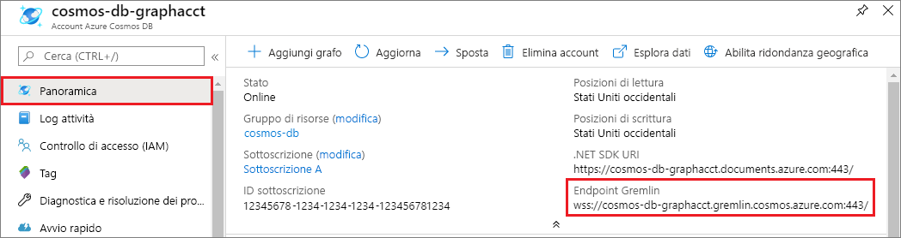
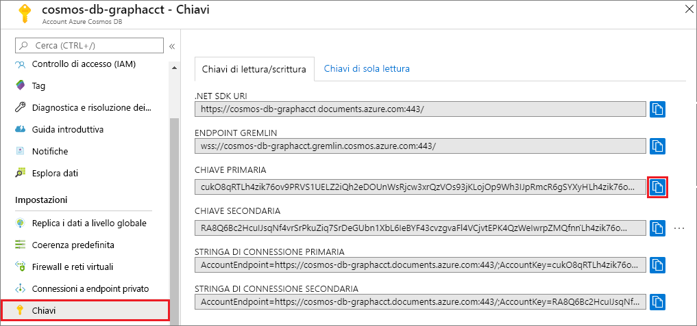

# <a name="azure-cosmos-db-build-a-nodejs-application-by-using-graph-api"></a>Azure Cosmos DB: Creare un'applicazione Node.js tramite l'API Graph

Azure Cosmos DB è il servizio di database multimodello distribuito a livello globale di Microsoft. È possibile creare ed eseguire rapidamente query su database di documenti, coppie chiave/valore e grafi, sfruttando in ognuno dei casi i vantaggi offerti dalle funzionalità di scalabilità orizzontale e distribuzione globale alla base di Azure Cosmos DB. 

Questa guida introduttiva mostra come creare un account Azure Cosmos DB per l'API Graph (anteprima), un database e un grafo tramite il portale di Azure. Si creerà ed eseguirà quindi un'app console usando il driver open source [Gremlin Node.js](https://www.npmjs.com/package/gremlin).

## <a name="prerequisites"></a>Prerequisiti

Prima di poter eseguire questo esempio, è necessario soddisfare i prerequisiti seguenti:
* [Node.js](https://nodejs.org/en/) versione v0.10.29 o versioni successive
* [Git](http://git-scm.com/)

[!INCLUDE [quickstarts-free-trial-note](../../includes/quickstarts-free-trial-note.md)]

## <a name="create-a-database-account"></a>Creare un account di database

[!INCLUDE [cosmos-db-create-dbaccount-graph](../../includes/cosmos-db-create-dbaccount-graph.md)]

## <a name="add-a-graph"></a>Aggiungere un grafo

[!INCLUDE [cosmos-db-create-graph](../../includes/cosmos-db-create-graph.md)]

## <a name="clone-the-sample-application"></a>Clonare l'applicazione di esempio

Clonare ora un'app per le API Graph da GitHub, impostare la stringa di connessione ed eseguirla. Come si noterà, è facile usare i dati a livello di codice. 

1. Aprire una finestra del terminale Git, ad esempio Git Bash, e usare il comando `cd` per passare a una directory di lavoro.

2. Eseguire il comando seguente per clonare il repository di esempio: 

    ```bash
    git clone https://github.com/Azure-Samples/azure-cosmos-db-graph-nodejs-getting-started.git
    ```

3. Aprire il file della soluzione in Visual Studio. 

## <a name="review-the-code"></a>Esaminare il codice

Ecco una breve analisi di ciò che accade nell'app. Aprire il file `app.js`. Verranno visualizzate le righe di codice seguenti. 

* Viene creato il client di Gremlin.

    ```nodejs
    const client = Gremlin.createClient(
        443, 
        config.endpoint, 
        { 
            "session": false, 
            "ssl": true, 
            "user": `/dbs/${config.database}/colls/${config.collection}`,
            "password": config.primaryKey
        });
    ```

  Le configurazioni sono tutte incluse in `config.js`, che verrà modificato nella sezione seguente.

* Viene eseguita una serie di passaggi di Gremlin con il metodo `client.execute`.

    ```nodejs
    console.log('Running Count'); 
    client.execute("g.V().count()", { }, (err, results) => {
        if (err) return console.error(err);
        console.log(JSON.stringify(results));
        console.log();
    });
    ```

## <a name="update-your-connection-string"></a>Aggiornare la stringa di connessione

1. Aprire il file config.js. 

2. In config.js compilare la chiave config.endpoint con il valore **URI Gremlin** disponibile nella pagina **Panoramica** del portale di Azure. 

    `config.endpoint = "GRAPHENDPOINT";`

    

   Se il valore di **URI Gremlin** è vuoto, è possibile generarlo dalla pagina **Chiavi** nel portale. Usare il valore di **URI**, rimuovere https:// e modificare i documenti in grafi.

   L'endpoint Gremlin deve essere solo il nome host senza protocollo/numero di porta, ad esempio `mygraphdb.graphs.azure.com` (non `https://mygraphdb.graphs.azure.com` o `mygraphdb.graphs.azure.com:433`).

3. Nel file config.js compilare il valore di config.primaryKey con il valore **Chiave primaria** disponibile nella pagina **Chiavi** del portale di Azure. 

    `config.primaryKey = "PRIMARYKEY";`

   

4. Immettere il nome del database e il nome del grafo (contenitore) per il valore di config.database e config.collection. 

Ecco un esempio dell'aspetto che dovrebbe avere il file config.js completato:

```nodejs
var config = {}

// Note that this must not have HTTPS or the port number
config.endpoint = "testgraphacct.graphs.azure.com";
config.primaryKey = "Pams6e7LEUS7LJ2Qk0fjZf3eGo65JdMWHmyn65i52w8ozPX2oxY3iP0yu05t9v1WymAHNcMwPIqNAEv3XDFsEg==";
config.database = "graphdb"
config.collection = "Persons"

module.exports = config;
```

## <a name="run-the-console-app"></a>Eseguire l'app console

1. Aprire una finestra del terminale e usare il comando `cd` per passare alla directory di installazione del file package.json incluso nel progetto.

2. Eseguire `npm install` per installare i moduli npm necessari, tra cui `gremlin`.

3. Eseguire `node app.js` in un terminale per avviare l'applicazione Node.js.

## <a name="browse-with-data-explorer"></a>Esplorare con Esplora dati

È ora possibile tornare a Esplora dati nel portale di Azure per visualizzare, modificare e usare i nuovi dati del grafo ed eseguire query su di essi.

In Esplora dati il nuovo database viene visualizzato nel riquadro **Graph**. Espandere il database e la raccolta, quindi fare clic su **Graph**.

I dati generati dall'app di esempio vengono visualizzati nel riquadro successivo nella scheda **Graph** quando si fa clic su **Applica filtro**.

Provare a completare `g.V()` con `.has('firstName', 'Thomas')` per testare il filtro. Il valore distingue tra maiuscole e minuscole.

## <a name="review-slas-in-the-azure-portal"></a>Esaminare i contratti di servizio nel portale di Azure

[!INCLUDE [cosmosdb-tutorial-review-slas](../../includes/cosmos-db-tutorial-review-slas.md)]

## <a name="clean-up-your-resources"></a>Pulire le risorse

Se non si prevede di continuare a usare questa app, eliminare tutte le risorse create in questo articolo eseguendo la procedura illustrata di seguito: 

1. Nel portale di Azure, nel menu di spostamento di sinistra selezionare **Gruppi di risorse**. Selezionare quindi il nome della risorsa che è stata creata. 

2. Nella pagina del gruppo di risorse selezionare **Elimina**. Digitare il nome della risorsa da eliminare, quindi selezionare **Elimina**.

## <a name="next-steps"></a>Passaggi successivi

In questo articolo si è appreso come creare un account Azure Cosmos DB, come creare un grafo con Esplora dati e come eseguire un'app. È ora possibile creare query più complesse e implementare la potente logica di attraversamento dei grafi usando Gremlin. 

> [!div class="nextstepaction"]
> [Eseguire query con Gremlin](tutorial-query-graph.md)

