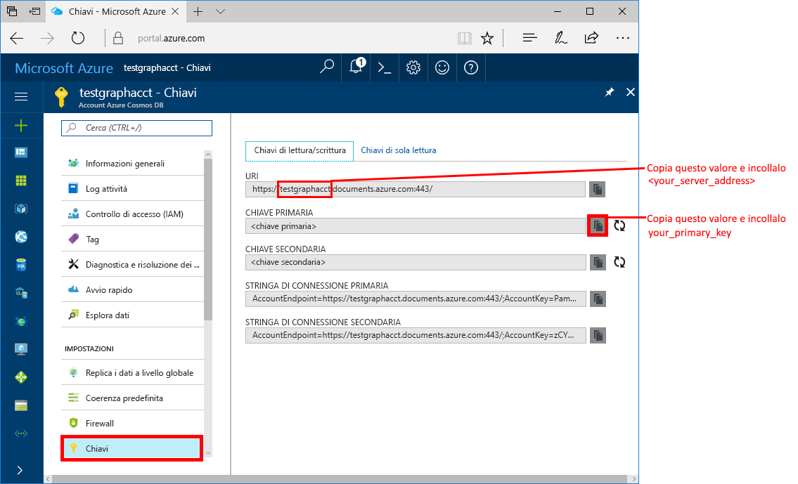
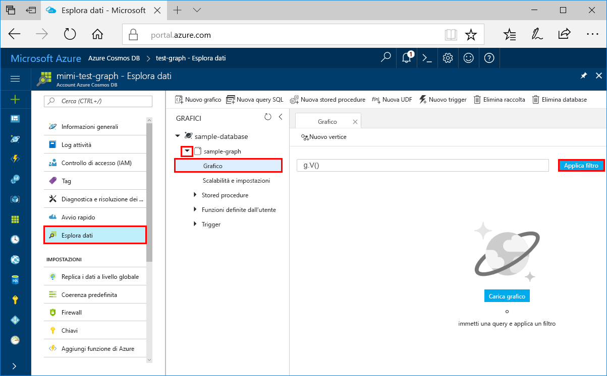
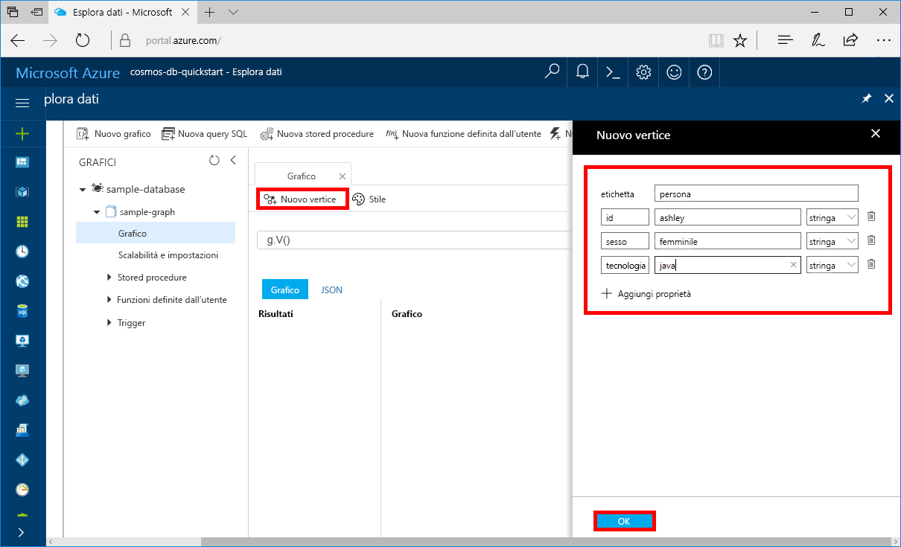
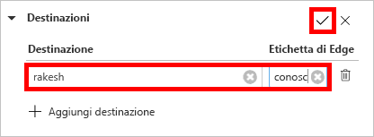

# <a name="quickstart-create-a-graph-database-in-azure-cosmos-db-using-php-and-the-azure-portal"></a>Avvio rapido: Creare un database a grafo in Azure Cosmos DB usando PHP e il portale di Azure

> [!div class="op_single_selector"]
> * [Console Gremlin](create-graph-gremlin-console.md)
> * [.NET](create-graph-dotnet.md)
> * [Java](create-graph-java.md)
> * [Node.js](create-graph-nodejs.md)
> * [Python](create-graph-python.md)
> * [PHP](create-graph-php.md)
>  

Questa guida introduttiva illustra come usare PHP e l'[API Gremlin](graph-introduction.md) di Azure Cosmos DB per creare un'app console clonando un esempio di GitHub. Questa guida introduttiva illustra anche come creare un account Azure Cosmos DB usando il portale di Azure basato sul Web.   

Azure Cosmos DB è il servizio di database di Microsoft multimodello distribuito a livello globale. È possibile creare ed eseguire rapidamente query su database di documenti, tabelle, valori chiave e grafi, sfruttando in ognuno dei casi i vantaggi offerti dalle funzionalità di scalabilità orizzontale e distribuzione globale alla base di Azure Cosmos DB.  

## <a name="prerequisites"></a>Prerequisiti

[!INCLUDE [quickstarts-free-trial-note](../../includes/quickstarts-free-trial-note.md)]In alternativa, è possibile [provare gratuitamente Microsoft Azure Cosmos DB](https://azure.microsoft.com/try/cosmosdb/) senza una sottoscrizione di Azure e senza impegno.

Eseguire anche queste operazioni:
* [PHP](https://php.net/) 5.6 o versioni successive
* [Composer](https://getcomposer.org/download/)

## <a name="create-a-database-account"></a>Creare un account di database

Prima di potere creare un database a grafo, è necessario creare un account database Gremlin (grafo) con Azure Cosmos DB.

[!INCLUDE [cosmos-db-create-dbaccount-graph](../../includes/cosmos-db-create-dbaccount-graph.md)]

## <a name="add-a-graph"></a>Aggiungere un grafo

[!INCLUDE [cosmos-db-create-graph](../../includes/cosmos-db-create-graph.md)]

## <a name="clone-the-sample-application"></a>Clonare l'applicazione di esempio

Si può ora passare a usare il codice. Per clonare un'app API Gremlin da GitHub, impostare la stringa di connessione ed eseguirla. Come si noterà, è facile usare i dati a livello di codice.  

1. Aprire un prompt dei comandi, creare una nuova cartella denominata git-samples e quindi chiudere il prompt dei comandi.

    ```bash
    md "C:\git-samples"
    ```

2. Aprire una finestra del terminale Git, ad esempio git bash, ed eseguire il comando `cd` per passare a una cartella in cui installare l'app di esempio.  

    ```bash
    cd "C:\git-samples"
    ```

3. Eseguire il comando seguente per clonare l'archivio di esempio. Questo comando crea una copia dell'app di esempio nel computer in uso. 

    ```bash
    git clone https://github.com/Azure-Samples/azure-cosmos-db-graph-php-getting-started.git
    ```

## <a name="review-the-code"></a>Esaminare il codice

Questo passaggio è facoltativo. Per scoprire in che modo le risorse del database vengono create nel codice, è possibile esaminare i frammenti di codice seguenti. I frammenti di codice provengono tutti dal file connect.php, che si trova nella cartella C:\git-samples\azure-cosmos-db-graph-php-getting-started\. In alternativa, è possibile passare ad [Aggiornare la stringa di connessione](#update-your-connection-information). 

* Il Gremlin `connection` viene inizializzato all'inizio del file `connect.php` usando l'oggetto `$db`.

    ```php
    $db = new Connection([
        'host' => '<your_server_address>.graphs.azure.com',
        'username' => '/dbs/<db>/colls/<coll>',
        'password' => 'your_primary_key'
        ,'port' => '443'

        // Required parameter
        ,'ssl' => TRUE
    ]);
    ```

* Viene eseguita una serie di passaggi di Gremlin tramite il metodo `$db->send($query);`.

    ```php
    $query = "g.V().drop()";
    ...
    $result = $db->send($query);
    $errors = array_filter($result);
    }
    ```

## <a name="update-your-connection-information"></a>Aggiornare la stringa di connessione

Tornare ora al portale di Azure per recuperare la stringa di connessione e copiarla nell'app. Queste impostazioni consentono all'app di comunicare con il database ospitato.

1. Nel [portale di Azure](https://portal.azure.com/) fare clic su **Chiavi**. 

    Copiare la prima parte del valore dell'URI.

    
2. Aprire il file `connect.php` e alla riga 8 incollare il valore di URI su `your_server_address`.

    Il codice di inizializzazione dell'oggetto Connection sarà simile al seguente:

    ```php
    $db = new Connection([
        'host' => 'testgraphacct.graphs.azure.com',
        'username' => '/dbs/<db>/colls/<coll>',
        'password' => 'your_primary_key'
        ,'port' => '443'

        // Required parameter
        ,'ssl' => TRUE
    ]);
    ```

3. Se l'account di database Graph è stato creato il 20 dicembre 2017 o successivamente, sostituire `graphs.azure.com` nel nome host con `gremlin.cosmosdb.azure.com`.

4. Modificare il parametro `username` nell'oggetto Connection con il nome del database e del grafo. Se sono stati usati i valori consigliati `sample-database` e `sample-graph`, il codice sarà simile al seguente:

    `'username' => '/dbs/sample-database/colls/sample-graph'`

    L'intero oggetto Connection avrà ora l'aspetto del frammento di codice seguente:

    ```php
    $db = new Connection([
        'host' => 'testgraphacct.graphs.azure.com',
        'username' => '/dbs/sample-database/colls/sample-graph',
        'password' => 'your_primary_key',
        'port' => '443'

        // Required parameter
        ,'ssl' => TRUE
    ]);
    ```

5. Nel portale di Azure usare il pulsante Copia per copiare la CHIAVE PRIMARIA e incollarla su `your_primary_key` nel parametro password.

    Il codice di inizializzazione dell'oggetto Connection sarà ora simile al seguente:

    ```php
    $db = new Connection([
        'host' => 'testgraphacct.graphs.azure.com',
        'username' => '/dbs/sample-database/colls/sample-graph',
        'password' => '2Ggkr662ifxz2Mg==',
        'port' => '443'

        // Required parameter
        ,'ssl' => TRUE
    ]);
    ```

6. Salvare il file.`connect.php`

## <a name="run-the-console-app"></a>Eseguire l'app console

1. Nella finestra del terminale Git eseguire il comando `cd` per passare alla cartella azure-cosmos-db-graph-php-getting-started.

    ```git
    cd "C:\git-samples\azure-cosmos-db-graph-php-getting-started"
    ```

2. Nella finestra del terminale Git usare il comando seguente per installare le dipendenze PHP necessarie.

   ```
   composer install
   ```

3. Nella finestra del terminale Git usare il comando seguente per avviare l'applicazione PHP.
    
    ```
    php connect.php
    ```

    La finestra del terminale mostra l'aggiunta dei vertici al grafo. 
    
    Se si verificano errori di timeout, controllare di avere aggiornato correttamente le informazioni di connessione in [Aggiornare le informazioni di connessione](#update-your-connection-information) e provare a eseguire di nuovo l'ultimo comando. 
    
    All'arresto del programma premere Invio per tornare al portale di Azure nel browser Internet. 

<a id="add-sample-data"></a>
## <a name="review-and-add-sample-data"></a>Verificare e aggiungere dati di esempio

È ora possibile tornare a Esplora dati e visualizzare i vertici aggiunti al grafo, quindi aggiungere altri punti dati.

1. Fare clic su **Esplora dati**, espandere **sample-graph**, fare clic su **Grafo** e quindi su **Applica filtro**. 

   

2. Nell'elenco **Risultati** verificare i nuovi utenti aggiunti al grafo. Selezionare **ben**. Come si può notare, è connesso a robin. È possibile spostare i vertici intorno mediante trascinamento della selezione, applicare lo zoom mediante lo scorrimento della rotellina del mouse ed espandere le dimensioni del grafo usando la doppia freccia. 

   

3. Vengono ora aggiunti alcuni nuovi utenti. Fare clic sul pulsante **New Vertex** (Nuovo vertice) per aggiungere dati al grafo.

   

4. Immettere un'etichetta di *persona*.

5. Fare clic su **Add property** (Aggiungi proprietà) per aggiungere ognuna delle proprietà seguenti. Si noti che è possibile creare proprietà univoche per ogni persona del grafo. È necessaria solo la chiave id.

    key|value|Note
    ----|----|----
    id|ashley|Identificatore univoco per il vertice. Se non si specifica alcun ID, ne verrà generato automaticamente uno.
    gender|female| 
    tech | java | 

    > [!NOTE]
    > In questa esercitazione introduttiva si crea una raccolta non partizionata. Se tuttavia si crea una raccolta partizionata specificando una chiave di partizione durante la creazione della raccolta, sarà necessario includere la chiave di partizione come chiave in ogni nuovo vertice. 

6. Fare clic su **OK**. Potrebbe essere necessario espandere la schermata per vedere il pulsante **OK** nella parte inferiore dello schermo.

7. Fare di nuovo clic su **New Vertex** (Nuovo vertice) e aggiungere un altro nuovo utente. 

8. Immettere un'etichetta di *persona*.

9. Fare clic su **Add property** (Aggiungi proprietà) per aggiungere ognuna delle proprietà seguenti:

    key|value|Note
    ----|----|----
    id|rakesh|Identificatore univoco per il vertice. Se non si specifica alcun ID, ne verrà generato automaticamente uno.
    gender|male| 
    school|MIT| 

10. Fare clic su **OK**. 

11. Fare clic sul pulsante **Applica filtro** con il filtro `g.V()` predefinito per visualizzare tutti i valori nel grafo. Tutti gli utenti sono ora visualizzati nell'elenco **Risultati**. 

    Quando si aggiungono altri dati, è possibile usare i filtri per limitare i risultati visualizzati. Per impostazione predefinita, Esplora dati usa `g.V()` per recuperare tutti i vertici di un grafo. È possibile modificarlo in un'altra [query di grafo](tutorial-query-graph.md), ad esempio `g.V().count()`, per restituire un conteggio di tutti i vertici del grafo in formato JSON. Se è stato modificato il filtro, reimpostarlo su `g.V()` e fare clic su **Applica filtro** per visualizzare di nuovo tutti i risultati.

12. È ora possibile connettere rakesh e ashley. Assicurarsi che il valore **ashley** sia selezionato nell'elenco **Risultati**, quindi fare clic sul pulsante di modifica accanto a **Destinazioni** in basso a destra. Potrebbe essere necessario allargare la finestra per visualizzare l'area **Proprietà**.

   

13. Nella casella **Destinazione** digitare *rakesh* e nella casella **Edge label** (Etichetta arco) digitare *knows*, quindi selezionare la casella di controllo.

   

14. Selezionare ora **rakesh** dall'elenco Risultati. Come si può notare ashley e rakesh sono connessi. 

   

   È stata completata la parte relativa alla creazione delle risorse di questa guida introduttiva. È possibile continuare ad aggiungere vertici al grafo, modificare quelli esistenti o modificare le query. Vengono ora esaminate le metriche di Azure Cosmos DB e quindi pulite le risorse. 

## <a name="review-slas-in-the-azure-portal"></a>Esaminare i contratti di servizio nel portale di Azure

[!INCLUDE [cosmosdb-tutorial-review-slas](../../includes/cosmos-db-tutorial-review-slas.md)]

## <a name="clean-up-resources"></a>Pulire le risorse

[!INCLUDE [cosmosdb-delete-resource-group](../../includes/cosmos-db-delete-resource-group.md)]

## <a name="next-steps"></a>Passaggi successivi

In questa guida di avvio rapido si è appreso come creare un account Azure Cosmos DB, come creare un grafo con Esplora dati e come eseguire un'app. È ora possibile creare query più complesse e implementare la potente logica di attraversamento dei grafi usando Gremlin. 

> [!div class="nextstepaction"]
> [Eseguire query con Gremlin](tutorial-query-graph.md)

