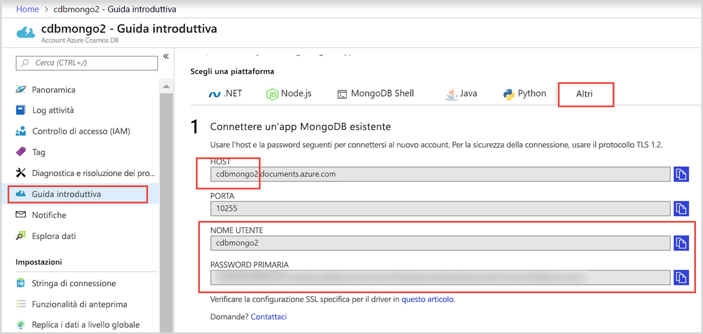
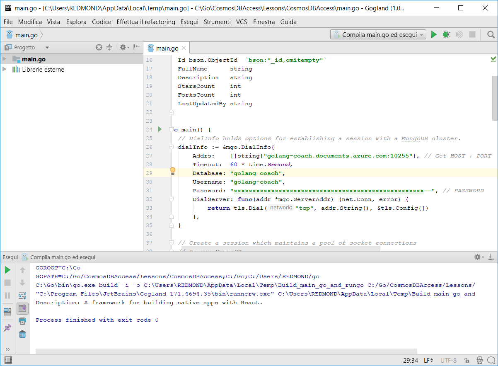
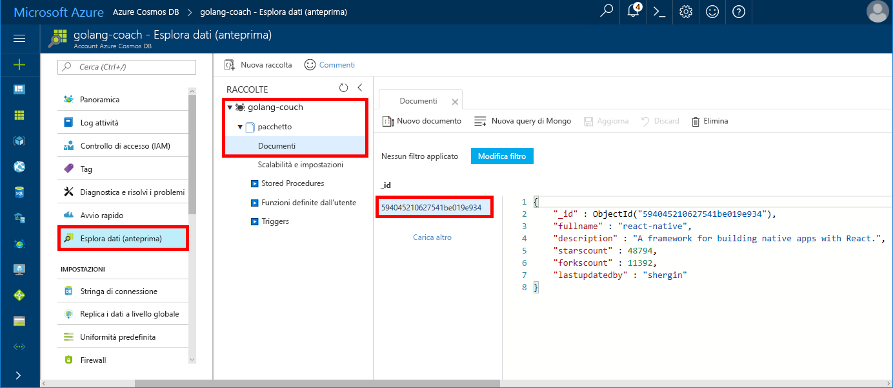

# <a name="azure-cosmos-db-build-a-mongodb-api-console-app-with-golang-and-the-azure-portal"></a>Azure Cosmos DB: creare un'app console per le API MongoDB con Golang e il portale di Azure

Azure Cosmos DB è il servizio di database multimodello distribuito a livello globale di Microsoft. È possibile creare ed eseguire rapidamente query su database di documenti, coppie chiave/valore e grafi, sfruttando in ognuno dei casi i vantaggi offerti dalle funzionalità di scalabilità orizzontale e distribuzione globale alla base di Azure Cosmos DB.

Questa guida introduttiva illustra come usare un'app [MongoDB](https://docs.microsoft.com/azure/cosmos-db/mongodb-introduction) esistente scritta in [Golang](https://golang.org/) e connetterla al database Azure Cosmos DB, che supporta connessioni client MongoDB.

In altri termini, l'applicazione Golang rileva solo la connessione a un database con API MongoDB. Il fatto che i dati siano archiviati in Azure Cosmos DB è trasparente per l'applicazione.

## <a name="prerequisites"></a>Prerequisiti

- Una sottoscrizione di Azure. Se non si ha una sottoscrizione di Azure, creare un [account gratuito](https://azure.microsoft.com/free) prima di iniziare. 

  [!INCLUDE [cosmos-db-emulator-mongodb](../../includes/cosmos-db-emulator-mongodb.md)]

- [Go](https://golang.org/dl/) e una conoscenza di base del linguaggio [Go](https://golang.org/).
- Un IDE. [Gogland](https://www.jetbrains.com/go/) di Jetbrains, [Visual Studio Code](https://code.visualstudio.com/) di Microsoft o [Atom](https://atom.io/). In questa esercitazione si usa Gogland.

<a id="create-account"></a>
## <a name="create-a-database-account"></a>Creare un account di database

[!INCLUDE [cosmos-db-create-dbaccount](../../includes/cosmos-db-create-dbaccount-mongodb.md)]

## <a name="clone-the-sample-application"></a>Clonare l'applicazione di esempio

Clonare l'applicazione di esempio e installare i pacchetti necessari.

1. Creare una cartella denominata CosmosDBSample all'interno della cartella GOROOT\src, che per impostazione predefinita è C:\Go\.
2. Eseguire questo comando usando una finestra del terminale git, ad esempio git bash, per clonare il repository di esempio nella cartella CosmosDBSample. 

    ```bash
    git clone https://github.com/Azure-Samples/azure-cosmos-db-mongodb-golang-getting-started.git
    ```
3.  Eseguire questo comando per ottenere il pacchetto mgo. 

    ```
    go get gopkg.in/mgo.v2
    ```

Il driver [mgo](http://labix.org/mgo) (pronunciato *mango*) è un driver [MongoDB](http://www.mongodb.org/) per il [linguaggio Go](http://golang.org/) che implementa una selezione estesa e ben collaudata di funzionalità in un'API molto semplice basata sui termini Go standard.

<a id="connection-string"></a>

## <a name="update-your-connection-string"></a>Aggiornare la stringa di connessione

Tornare ora al portale di Azure per recuperare le informazioni sulla stringa di connessione e copiarle nell'app.

1. Fare clic su **Avvio rapido** nel menu di spostamento a sinistra e quindi su **Altri** per visualizzare le informazioni relative alla stringa di connessione necessarie per l'applicazione Go.

2. In Gogland aprire il file main.go nella directory GOROOT\CosmosDBSample e aggiornare le righe di codice seguenti usando le informazioni relative alla stringa di connessione del portale di Azure illustrate nello screenshot riportato di seguito. 

    Il nome del database è il prefisso del valore **Host** nel riquadro relativo alla stringa di connessione del portale di Azure. Per l'account riportato nell'immagine seguente, il nome del database è golang-coach.

    ```go
    Database: "The prefix of the Host value in the Azure portal",
    Username: "The Username in the Azure portal",
    Password: "The Password in the Azure portal",
    ```

    

3. Salvare il file main.go.

## <a name="review-the-code"></a>Esaminare il codice

Di seguito è riportata una breve panoramica delle operazioni eseguite nel file main.go. 

### <a name="connecting-the-go-app-to-azure-cosmos-db"></a>Connessione dell'app Go ad Azure Cosmos DB

Azure Cosmos DB supporta le istanze di MongoDB abilitate per SSL. Per connettersi a un'istanza di MongoDB abilitata per SSL, è necessario definire la funzione **DialServer** in [mgo.DialInfo](http://gopkg.in/mgo.v2#DialInfo) e usare la funzione [tls.*Dial*](http://golang.org/pkg/crypto/tls#Dial) per eseguire la connessione.

Il frammento di codice Golang seguente connette l'app Go con l'API MongoDB di Azure Cosmos DB. La classe *DialInfo* contiene opzioni per stabilire una sessione con un cluster MongoDB.

```go
// DialInfo holds options for establishing a session with a MongoDB cluster.
dialInfo := &mgo.DialInfo{
    Addrs:    []string{"golang-couch.documents.azure.com:10255"}, // Get HOST + PORT
    Timeout:  60 * time.Second,
    Database: "database", // It can be anything
    Username: "username", // Username
    Password: "Azure database connect password from Azure Portal", // PASSWORD
    DialServer: func(addr *mgo.ServerAddr) (net.Conn, error) {
        return tls.Dial("tcp", addr.String(), &tls.Config{})
    },
}

// Create a session which maintains a pool of socket connections
// to our Azure Cosmos DB MongoDB database.
session, err := mgo.DialWithInfo(dialInfo)

if err != nil {
    fmt.Printf("Can't connect to mongo, go error %v\n", err)
    os.Exit(1)
}

defer session.Close()

// SetSafe changes the session safety mode.
// If the safe parameter is nil, the session is put in unsafe mode, 
// and writes become fire-and-forget,
// without error checking. The unsafe mode is faster since operations won't hold on waiting for a confirmation.
// 
session.SetSafe(&mgo.Safe{})
```

Il metodo **mgo.Dial()** viene usato quando non è disponibile una connessione SSL. Per una connessione SSL è necessario il metodo **mgo.DialWithInfo()**.

Per creare l'oggetto sessione viene usata un'istanza dell'oggetto **DialWIthInfo{}**. Dopo che la sessione è stata stabilita, è possibile accedere alla raccolta usando il frammento di codice seguente:

```go
collection := session.DB(“database”).C(“package”)
```

<a id="create-document"></a>

### <a name="create-a-document"></a>Creare un documento

```go
// Model
type Package struct {
    Id bson.ObjectId  `bson:"_id,omitempty"`
    FullName      string
    Description   string
    StarsCount    int
    ForksCount    int
    LastUpdatedBy string
}

// insert Document in collection
err = collection.Insert(&Package{
    FullName:"react",
    Description:"A framework for building native apps with React.",
    ForksCount: 11392,
    StarsCount:48794,
    LastUpdatedBy:"shergin",

})

if err != nil {
    log.Fatal("Problem inserting data: ", err)
    return
}
```

### <a name="query-or-read-a-document"></a>Leggere o eseguire query in un documento

Azure Cosmos DB supporta query avanzate sui documenti JSON archiviati in ogni raccolta. L'esempio di codice seguente illustra una query eseguibile nei documenti della raccolta.

```go
// Get a Document from the collection
result := Package{}
err = collection.Find(bson.M{"fullname": "react"}).One(&result)
if err != nil {
    log.Fatal("Error finding record: ", err)
    return
}

fmt.Println("Description:", result.Description)
```


### <a name="update-a-document"></a>Aggiornare un documento

```go
// Update a document
updateQuery := bson.M{"_id": result.Id}
change := bson.M{"$set": bson.M{"fullname": "react-native"}}
err = collection.Update(updateQuery, change)
if err != nil {
    log.Fatal("Error updating record: ", err)
    return
}
```

### <a name="delete-a-document"></a>Eliminare un documento

Azure Cosmos DB supporta l'eliminazione di documenti JSON.

```go
// Delete a document
query := bson.M{"_id": result.Id}
err = collection.Remove(query)
if err != nil {
   log.Fatal("Error deleting record: ", err)
   return
}
```
    
## <a name="run-the-app"></a>Esecuzione dell'app

1. In Gogland verificare che il valore GOPATH, disponibile in **File**, **Settings** (Impostazioni), **Go**, **GOPATH**, includa il percorso di installazione di gopkg, che per impostazione predefinita è USERPROFILE\g. 
2. Impostare come commento le righe 91-96 che eliminano il documento per poter visualizzare il documento dopo l'esecuzione dell'app.
3. In Gogland fare clic su **Run** (Esegui) e quindi su **Run 'Build main.go and run'** (Esegui 'Compila main.go ed esegui').

    L'app viene completata e visualizza la descrizione del documento creato in [Creare un documento](#create-document).
    
    ```
    Description: A framework for building native apps with React.
    
    Process finished with exit code 0
    ```

    
    
## <a name="review-your-document-in-data-explorer"></a>Esaminare il documento in Esplora dati

Tornare al portale di Azure per visualizzare il documento in Esplora dati.

1. Fare clic su **Esplora dati (anteprima)** nel menu di spostamento a sinistra, espandere **golang-coach**, **pacchetto** e quindi fare clic su **Documenti**. Nella scheda **Documenti** fare clic su \_id per visualizzare il documento nel riquadro destro. 

    
    
2. Si può quindi lavorare sul documento inline e fare clic su **Aggiorna** per salvarlo. È anche possibile eliminare il documento oppure creare nuovi documenti o nuove query.

## <a name="review-slas-in-the-azure-portal"></a>Esaminare i contratti di servizio nel portale di Azure

[!INCLUDE [cosmosdb-tutorial-review-slas](../../includes/cosmos-db-tutorial-review-slas.md)]

## <a name="clean-up-resources"></a>Pulire le risorse

Se non si intende continuare a usare l'app, eliminare tutte le risorse create tramite questa guida di avvio rapido nel portale di Azure eseguendo questi passaggi:

1. Scegliere **Gruppi di risorse** dal menu a sinistra del portale di Azure e quindi fare clic sul nome della risorsa creata. 
2. Nella pagina del gruppo di risorse fare clic su **Elimina**, digitare il nome della risorsa da eliminare nella casella di testo e quindi fare clic su **Elimina**.

## <a name="next-steps"></a>Passaggi successivi

In questa guida introduttiva si è appreso come creare un account Azure Cosmos DB ed eseguire un'app Golang con l'API per MongoDB. È ora possibile importare dati aggiuntivi nell'account Cosmos DB. 

> [!div class="nextstepaction"]
> [Importare dati in Azure Cosmos DB per l'API MongoDB](mongodb-migrate.md)

