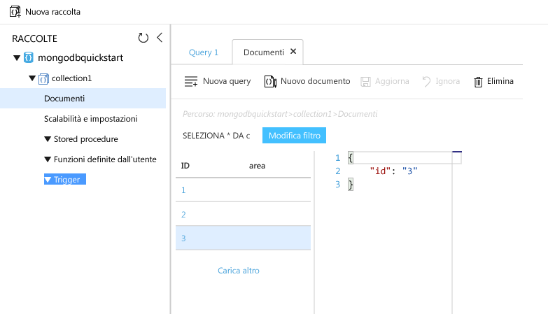

# <a name="azure-cosmos-db-migrate-an-existing-nodejs-mongodb-web-app"></a>Azure Cosmos DB: Eseguire la migrazione di un'app Web MongoDB Node.js esistente 

Azure Cosmos DB è il servizio di database multimodello distribuito a livello globale di Microsoft. È possibile creare ed eseguire rapidamente query su database di documenti, coppie chiave/valore e grafi, sfruttando in ognuno dei casi i vantaggi offerti dalle funzionalità di scalabilità orizzontale e distribuzione globale alla base di Azure Cosmos DB. 

Questa guida di avvio rapido illustra come usare un'app [MongoDB](mongodb-introduction.md) esistente scritta in Node.js e connetterla al database Azure Cosmos DB, che supporta le connessioni client MongoDB. In altre parole, l'applicazione Node.js sa solo che si sta connettendo a un database usando le API MongoDB. Il fatto che i dati siano archiviati in Azure Cosmos DB è trasparente per l'applicazione.

Al termine, si avrà un'applicazione MEAN (MongoDB, Express, AngularJS e Node.js) in esecuzione in [Azure Cosmos DB](https://azure.microsoft.com/services/cosmos-db/). 


[!INCLUDE [cloud-shell-try-it](../../includes/cloud-shell-try-it.md)]

Se si sceglie di installare e usare l'interfaccia della riga di comando in locale, per questo argomento è necessario eseguire la versione 2.0 o successiva dell'interfaccia della riga di comando di Azure. Eseguire `az --version` per trovare la versione. Se è necessario eseguire l'installazione o l'aggiornamento, vedere [Installare l'interfaccia della riga di comando di Azure 2.0]( /cli/azure/install-azure-cli). 

## <a name="prerequisites"></a>Prerequisiti 
Oltre all'interfaccia della riga di comando di Azure, è necessario che [Node.js](https://nodejs.org/) e [Git](http://www.git-scm.com/downloads) siano installati localmente per eseguire i comandi `npm` e `git`.

È necessario saper usare Node.js. Questa guida di avvio rapido non ha lo scopo di offrire informazioni generali sullo sviluppo di applicazioni Node.js.

## <a name="clone-the-sample-application"></a>Clonare l'applicazione di esempio

Aprire una finestra del terminale Git, ad esempio Git Bash, ed eseguire il comando `cd` per passare a una directory di lavoro.  

Eseguire i comandi seguenti per clonare il repository di esempio. Questo archivio di esempio contiene l'applicazione [MEAN.js](http://meanjs.org/) predefinita. 

```bash
git clone https://github.com/prashanthmadi/mean
```

## <a name="run-the-application"></a>Eseguire l'applicazione

Installare i pacchetti necessari e avviare l'applicazione.

```bash
cd mean
npm install
npm start
```

## <a name="log-in-to-azure"></a>Accedere ad Azure

Se si usa un'interfaccia della riga di comando di Azure installata, accedere alla sottoscrizione di Azure con il comando [az login](/cli/azure/#login) e seguire le istruzioni visualizzate. Se si usa Azure Cloud Shell, è possibile ignorare questo passaggio.

```azurecli
az login 
``` 
   
## <a name="add-the-azure-cosmos-db-module"></a>Aggiungere il modulo Azure Cosmos DB

Se si usa un'interfaccia della riga di comando di Azure installata, verificare se il componente `cosmosdb` è già installato eseguendo il comando `az`. Se `cosmosdb` è nell'elenco di comandi di base, passare al comando successivo. Se si usa Azure Cloud Shell, è possibile ignorare questo passaggio.

Se `cosmosdb` non è nell'elenco dei comandi di base, reinstallare l'[interfaccia della riga di comando di Azure 2.0]( /cli/azure/install-azure-cli).

## <a name="create-a-resource-group"></a>Creare un gruppo di risorse

Creare un [gruppo di risorse](../azure-resource-manager/resource-group-overview.md) con il comando [az group create](/cli/azure/group#create). Un gruppo di risorse di Azure è un contenitore logico in cui vengono distribuite e gestite risorse di Azure come app Web, database e account di archiviazione. 

L'esempio seguente crea un gruppo di risorse nell'area Europa occidentale. Scegliere un nome univoco per il gruppo di risorse.

Se si usa Azure Cloud Shell, fare clic su **Prova**, seguire le istruzioni visualizzate per eseguire l'accesso e quindi copiare il comando al prompt dei comandi.

```azurecli-interactive
az group create --name myResourceGroup --location "West Europe"
```

## <a name="create-an-azure-cosmos-db-account"></a>Creare un account Azure Cosmos DB

Creare un account Azure Cosmos DB con il comando [az cosmosdb create](/cli/azure/cosmosdb#create).

Nel comando seguente sostituire il segnaposto `<cosmosdb-name>` con il nome univoco dell'account Azure Cosmos DB. Questo nome univoco verrà usato come parte dell'endpoint di Azure Cosmos DB, `https://<cosmosdb-name>.documents.azure.com/`, pertanto deve essere univoco rispetto a tutti gli account Azure Cosmos DB presenti in Azure. 

```azurecli-interactive
az cosmosdb create --name <cosmosdb-name> --resource-group myResourceGroup --kind MongoDB
```

Il parametro `--kind MongoDB` consente le connessioni al client MongoDB.

Dopo la creazione dell'account Azure Cosmos DB, l'interfaccia della riga di comando di Azure mostra informazioni simili all'esempio seguente. 

> [!NOTE]
> Questo esempio usa JSON come formato di output dell'interfaccia della riga di comando di Azure, ovvero l'impostazione predefinita. Per usare un altro formato di output, vedere [Formati di output per i comandi dell'interfaccia della riga di comando di Azure 2.0](https://docs.microsoft.com/cli/azure/format-output-azure-cli).

```json
{
  "databaseAccountOfferType": "Standard",
  "documentEndpoint": "https://<cosmosdb-name>.documents.azure.com:443/",
  "id": "/subscriptions/00000000-0000-0000-0000-000000000000/resourceGroups/myResourceGroup/providers/Microsoft.Document
DB/databaseAccounts/<cosmosdb-name>",
  "kind": "MongoDB",
  "location": "West Europe",
  "name": "<cosmosdb-name>",
  "readLocations": [
    {
      "documentEndpoint": "https://<cosmosdb-name>-westeurope.documents.azure.com:443/",
      "failoverPriority": 0,
      "id": "<cosmosdb-name>-westeurope",
      "locationName": "West Europe",
      "provisioningState": "Succeeded"
    }
  ],
  "resourceGroup": "myResourceGroup",
  "type": "Microsoft.DocumentDB/databaseAccounts",
  "writeLocations": [
    {
      "documentEndpoint": "https://<cosmosdb-name>-westeurope.documents.azure.com:443/",
      "failoverPriority": 0,
      "id": "<cosmosdb-name>-westeurope",
      "locationName": "West Europe",
      "provisioningState": "Succeeded"
    }
  ]
} 
```

## <a name="connect-your-nodejs-application-to-the-database"></a>Connettere l'applicazione Node.js al database

In questo passaggio si usa una stringa di connessione MongoDB per connettere l'applicazione di esempio MEAN.js a un database Azure Cosmos DB appena creato. 

<a name="devconfig"></a>
## <a name="configure-the-connection-string-in-your-nodejs-application"></a>Configurare la stringa di connessione nell'applicazione Node.js

Nel repository di MEAN.js aprire `config/env/local-development.js`.

Sostituire il contenuto del file con il codice seguente. Assicurarsi di sostituire anche i due segnaposto `<cosmosdb-name>` con il nome dell'account Azure Cosmos DB.

```javascript
'use strict';

module.exports = {
  db: {
    uri: 'mongodb://<cosmosdb-name>:<primary_master_key>@<cosmosdb-name>.documents.azure.com:10255/mean-dev?ssl=true&sslverifycertificate=false'
  }
};
```

## <a name="retrieve-the-key"></a>Recuperare la chiave

Per connettersi a un database Azure Cosmos DB, è necessaria la chiave del database. Usare il comando [az cosmosdb list-keys](/cli/azure/cosmosdb#list-keys) per recuperare la chiave primaria.

```azurecli-interactive
az cosmosdb list-keys --name <cosmosdb-name> --resource-group myResourceGroup --query "primaryMasterKey"
```

L'interfaccia della riga di comando di Azure restituisce informazioni simili all'esempio seguente. 

```json
"RUayjYjixJDWG5xTqIiXjC..."
```

Copiare il valore di `primaryMasterKey`. Incollarlo tramite `<primary_master_key>` in `local-development.js`.

Salvare le modifiche.

### <a name="run-the-application-again"></a>Eseguire di nuovo l'applicazione.

Eseguire di nuovo `npm start`. 

```bash
npm start
```

Un messaggio della console dovrebbe ora indicare che l'ambiente di sviluppo è operativo. 

Andare a `http://localhost:3000` in un browser. Fare clic su **Iscrizione** nel menu in alto e provare a creare due utenti fittizi. 

L'applicazione di esempio MEAN.js archivia i dati utente nel database. Se l'operazione ha esito positivo e l'applicazione MEAN.js accede automaticamente all'utente creato, la connessione ad Azure Cosmos DB funziona. 


## <a name="view-data-in-data-explorer"></a>Visualizzare i dati in Esplora dati

I dati archiviati da Azure Cosmos DB sono disponibili per la visualizzazione, l'esecuzione di query e l'esecuzione di logica di business nel portale di Azure.

Per visualizzare e usare i dati utente creati nel passaggio precedente, nonché eseguire query su di essi, accedere al [portale di Azure](https://portal.azure.com) nel Web browser.

Nella casella di ricerca nella parte superiore digitare Azure Cosmos DB. Quando il pannello dell'account Cosmos DB si apre, selezionare l'account Cosmos DB. Nel riquadro di spostamento a sinistra fare clic su Esplora dati. Espandere la raccolta nel riquadro Raccolte. Sarà quindi possibile visualizzare i documenti nella raccolta, eseguire query sui dati e anche creare ed eseguire stored procedure, trigger e funzioni definite dall'utente. 




## <a name="deploy-the-nodejs-application-to-azure"></a>Distribuire l'applicazione Node.js in Azure

In questo passaggio si distribuisce l'applicazione Node.js connessa a MongoDB in Azure Cosmos DB.

Si sarà probabilmente notato che il file di configurazione modificato in precedenza è per l'ambiente di sviluppo (`/config/env/local-development.js`). Quando si distribuisce l'applicazione nel servizio app, per impostazione predefinita viene eseguita nell'ambiente di produzione. A questo punto, è quindi necessario apportare la stessa modifica al file di configurazione corrispondente.

Nel repository di MEAN.js aprire `config/env/production.js`.

Nell'oggetto `db` sostituire il valore di `uri` come mostrato nell'esempio seguente. Assicurarsi di sostituire i segnaposto come fatto in precedenza.

```javascript
'mongodb://<cosmosdb-name>:<primary_master_key>@<cosmosdb-name>.documents.azure.com:10255/mean?ssl=true&sslverifycertificate=false',
```

> [!NOTE] 
> L'opzione `ssl=true` è importante perché [Azure Cosmos DB richiede l'uso di SSL](connect-mongodb-account.md#connection-string-requirements). 
>
>

Nel terminale eseguire il commit tutte le modifiche in Git. È possibile copiare entrambi i comandi per eseguirli insieme.

```bash
git add .
git commit -m "configured MongoDB connection string"
```
## <a name="clean-up-resources"></a>Pulire le risorse

Se non si intende continuare a usare l'app, eliminare tutte le risorse create tramite questa guida di avvio rapido nel portale di Azure eseguendo questi passaggi:

1. Scegliere **Gruppi di risorse** dal menu a sinistra del portale di Azure e quindi fare clic sul nome della risorsa creata. 
2. Nella pagina del gruppo di risorse fare clic su **Elimina**, digitare il nome della risorsa da eliminare nella casella di testo e quindi fare clic su **Elimina**.

## <a name="next-steps"></a>Passaggi successivi

In questa guida di avvio rapido si è appreso come creare un account Azure Cosmos DB e come creare una raccolta MongoDB tramite Esplora dati. È ora possibile eseguire la migrazione dei dati di MongoDB in Azure Cosmos DB.  

> [!div class="nextstepaction"]
> [Importare i dati di MongoDB in Azure Cosmos DB](mongodb-migrate.md)

