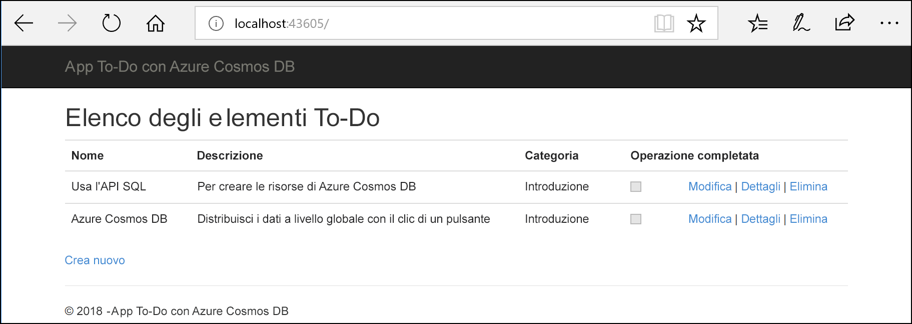
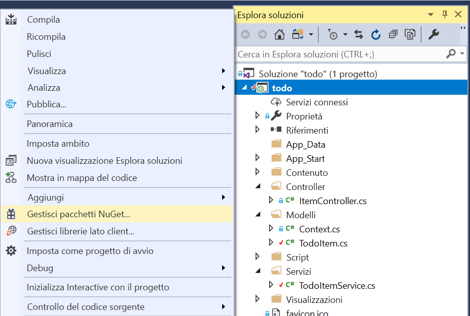

# <a name="quickstart-build-an-aspnet-web-app-with-azure-cosmos-db-using-the-sql-api-and-the-azure-portal"></a>Avvio rapido: Creare un'app Web ASP.NET con Azure Cosmos DB usando l'API SQL e il portale di Azure

> [!div class="op_single_selector"]
> * [.NET (Preview)](create-sql-api-dotnet-preview.md)
> * [.NET](create-sql-api-dotnet.md)
> * [Java](create-sql-api-java.md)
> * [Node.js](create-sql-api-nodejs.md)
> * [Python](create-sql-api-python.md)
> * [Xamarin](create-sql-api-xamarin-dotnet.md)
>  
> 

Azure Cosmos DB è il servizio di database di Microsoft multimodello distribuito a livello globale e a disponibilità elevata. È possibile creare ed eseguire rapidamente query su database di documenti, coppie chiave-valore e grafi, sfruttando in ognuno dei casi i vantaggi offerti dalle funzionalità di scalabilità orizzontale e distribuzione globale alla base di Azure Cosmos DB. 

Questo avvio rapido illustra come creare un account dell'[API SQL](sql-api-introduction.md) di Azure Cosmos DB, un database e un contenitore usando il portale di Azure. Si creerà e distribuirà quindi un'app Web ASP.NET di elenco attività basata sull'[API .NET SQL](sql-api-sdk-dotnet.md), come mostrato nello screenshot seguente. 

Questo avvio rapido usa la versione 3.0 e versioni successive di Azure Cosmos DB .NET SDK. 



## <a name="prerequisites"></a>Prerequisiti

Se Visual Studio 2017 non è ancora installato, è possibile scaricare e usare la versione **gratuita** [Visual Studio 2017 Community Edition](https://www.visualstudio.com/downloads/). Durante l'installazione di Visual Studio, abilitare il carico di lavoro **Sviluppo di Azure**.

[!INCLUDE [quickstarts-free-trial-note](../../includes/quickstarts-free-trial-note.md)] 
[!INCLUDE [cosmos-db-emulator-docdb-api](../../includes/cosmos-db-emulator-docdb-api.md)]  

<a id="create-account"></a>
## <a name="create-a-database-account"></a>Creare un account di database

[!INCLUDE [cosmos-db-create-dbaccount-preview](../../includes/cosmos-db-create-dbaccount-preview.md)]

<a id="create-collection"></a>
## <a name="add-a-collection"></a>Aggiungere una raccolta

[!INCLUDE [cosmos-db-create-collection-preview](../../includes/cosmos-db-create-collection-preview.md)]

<a id="add-sample-data"></a>
## <a name="add-sample-data"></a>Aggiungere dati di esempio

[!INCLUDE [cosmos-db-create-sql-api-add-sample-data](../../includes/cosmos-db-create-sql-api-add-sample-data.md)]

## <a name="query-your-data"></a>Eseguire query sui dati

[!INCLUDE [cosmos-db-create-sql-api-query-data](../../includes/cosmos-db-create-sql-api-query-data.md)]

## <a name="clone-the-sample-application"></a>Clonare l'applicazione di esempio

Si può ora passare a usare il codice. Clonare un'[app per le API SQL da GitHub](https://github.com/Azure-Samples/cosmos-dotnet-todo-app), impostare la stringa di connessione ed eseguirla. 

1. Aprire un prompt dei comandi, creare una nuova cartella denominata git-samples e quindi chiudere il prompt dei comandi.

    ```bash
    md "C:\git-samples"
    ```

2. Aprire una finestra del terminale Git, ad esempio Git Bash, ed eseguire il comando `cd` per passare a una nuova cartella in cui installare l'app di esempio.

    ```bash
    cd "C:\git-samples"
    ```

3. Eseguire il comando seguente per clonare l'archivio di esempio. Questo comando crea una copia dell'app di esempio nel computer in uso.

    ```bash
    git clone https://github.com/Azure-Samples/cosmos-dotnet-todo-app.git
    ```

4. Aprire il file della soluzione **todo.sln** in Visual Studio. 

## <a name="review-the-code"></a>Esaminare il codice

Questo passaggio è facoltativo. Per scoprire in che modo le risorse del database vengono create nel codice, è possibile esaminare i frammenti di codice seguenti. In alternativa, è possibile passare ad [Aggiornare la stringa di connessione](#update-your-connection-string). 

Si noti che, se si ha familiarità con la versione precedente di .NET SDK, ci si potrebbe aspettare di vedere termini come "raccolta" e "documento". Poiché Azure Cosmos DB supporta più modelli di API, nella versione 3.0+ di .NET SDK vengono usati i termini generici "contenitore" ed "elemento". Un contenitore può essere una raccolta, un grafo o una tabella. Un elemento può essere un documento, un arco/vertice o una riga ed è il contenuto all'interno di un contenitore. [Altre informazioni su database, contenitori ed elementi.](databases-containers-items.md)

Tutti i frammenti di codice seguenti sono tratti dal file ToDoItemService.cs.

* Alle righe 68-69 viene inizializzato CosmosClient.

    ```csharp
    CosmosConfiguration config = new CosmosConfiguration(Endpoint, PrimaryKey);
    client = new CosmosClient(config);
    ```

* Alla riga 71 viene creato un nuovo database.

    ```csharp
    CosmosDatabase database = await client.Databases.CreateDatabaseIfNotExistsAsync(DatabaseId);
    ```

* Alla riga 72 viene creato un nuovo contenitore con chiave di partizione "/category".

    ```csharp
    CosmosContainer container = await database.Containers.CreateContainerIfNotExistsAsync(ContainerId, "/category");
    ```

## <a name="update-your-connection-string"></a>Aggiornare la stringa di connessione

Tornare ora al portale di Azure per recuperare le informazioni sulla stringa di connessione e copiarle nell'app.

1. Nell'account Azure Cosmos DB nel [portale di Azure](http://portal.azure.com/) selezionare **Chiavi** nel riquadro di spostamento a sinistra e quindi selezionare **Chiavi di lettura/scrittura**. Usare i pulsanti di copia sul lato destro dello schermo per copiare l'URI e la chiave primaria nel file web.config nel passaggio seguente.

    

2. In Visual Studio 2017 aprire il file **web.config**. 

3. Copiare il valore dell'URI dal portale (usando il pulsante di copia) e impostarlo come valore della chiave ``endpoint`` in web.config. 

    `<add key="endpoint" value="FILLME" />`

4. Copiare quindi il valore di CHIAVE PRIMARIA dal portale e impostarlo come valore di ``primarykey`` in web.config. 

    `<add key="primaryKey" value="FILLME" />`
    
5. Aggiornare quindi il valore del database e del contenitore in base al nome del database e del contenitore creati in precedenza. L'app è stata aggiornata con tutte le informazioni necessarie per comunicare con Azure Cosmos DB. 

    `<add key="database" value="Tasks" />`

    `<add key="container" value="Items" />`
    
## <a name="run-the-web-app"></a>Eseguire l'app Web

1. In **Esplora soluzioni** fare clic con il pulsante destro del mouse sul nuovo progetto di applicazione console, disponibile nella soluzione di Visual Studio, quindi scegliere **Gestisci pacchetti NuGet**.
    
    
1. Nella scheda **NuGet** fare clic su **Sfoglia** e digitare **Microsoft.Azure.Cosmos** nella casella di ricerca.
1. Nei risultati trovare **Microsoft.Azure.Cosmos** e fare clic su **Installa**.
   L'ID pacchetto per la libreria client dell'API SQL di Azure Cosmos DB è [Microsoft Azure Cosmos DB Client Library](https://www.nuget.org/packages/Microsoft.Azure.Cosmos/).

   

    Se viene visualizzato un messaggio sulla verifica delle modifiche alla soluzione, fare clic su **OK**. Se viene visualizzato un messaggio sull'accettazione della licenza, fare clic su **Accetto**.

1. Premere CTRL + F5 per eseguire l'applicazione. L'app viene visualizzata nel browser. 

1. Selezionare su **Crea nuovo** nel browser e creare alcune nuove attività nell'app elenco attività. Si dovrebbero vedere anche le attività create in [Aggiungere dati di esempio](#add-sample-data)

   

È ora possibile tornare a Esplora dati e visualizzare, modificare e usare questi nuovi dati, nonché eseguire query su di essi. 

## <a name="review-slas-in-the-azure-portal"></a>Esaminare i contratti di servizio nel portale di Azure

[!INCLUDE [cosmosdb-tutorial-review-slas](../../includes/cosmos-db-tutorial-review-slas.md)]

## <a name="clean-up-resources"></a>Pulire le risorse

[!INCLUDE [cosmosdb-delete-resource-group](../../includes/cosmos-db-delete-resource-group.md)]

## <a name="next-steps"></a>Passaggi successivi

In questo avvio rapido si è appreso come creare un account Azure Cosmos DB, come creare un contenitore e aggiungervi elementi con Esplora dati e come eseguire un'app Web. È ora possibile importare dati aggiuntivi nell'account Cosmos DB. 

> [!div class="nextstepaction"]
> [Importare dati in Azure Cosmos DB](import-data.md)


