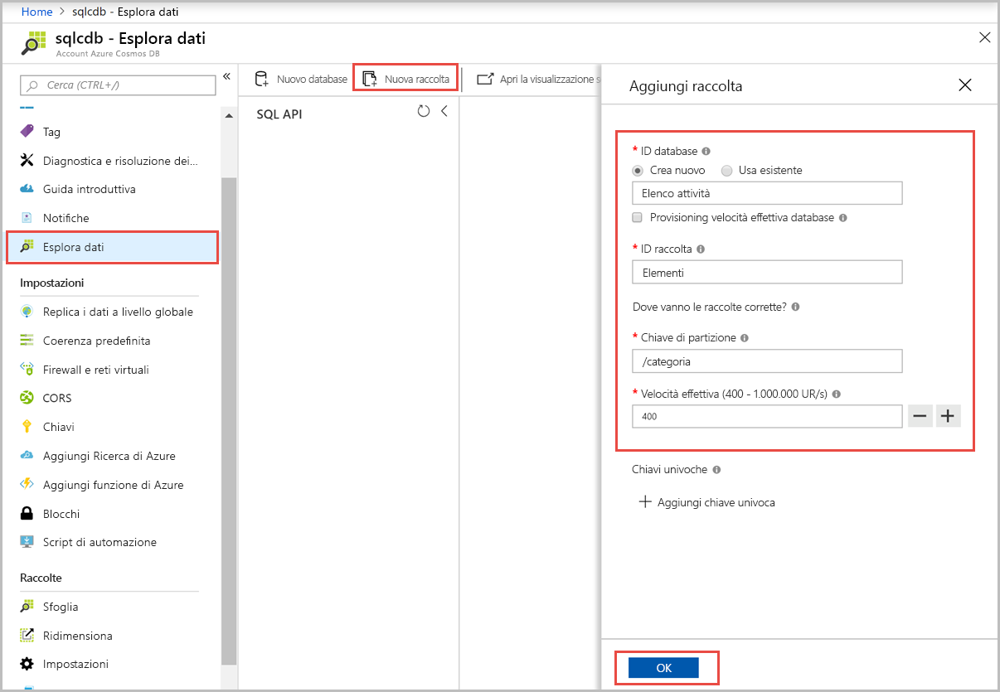
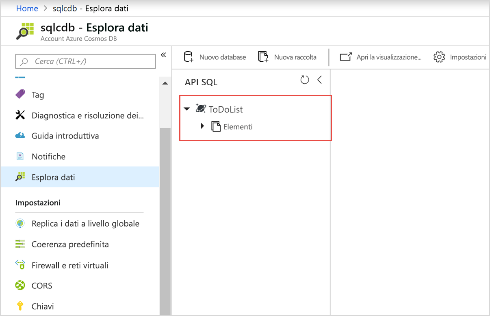
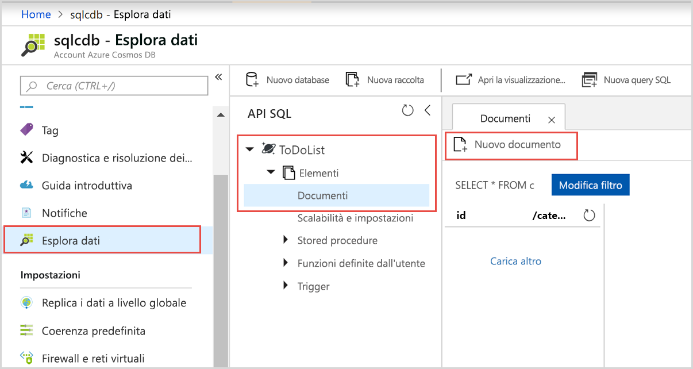
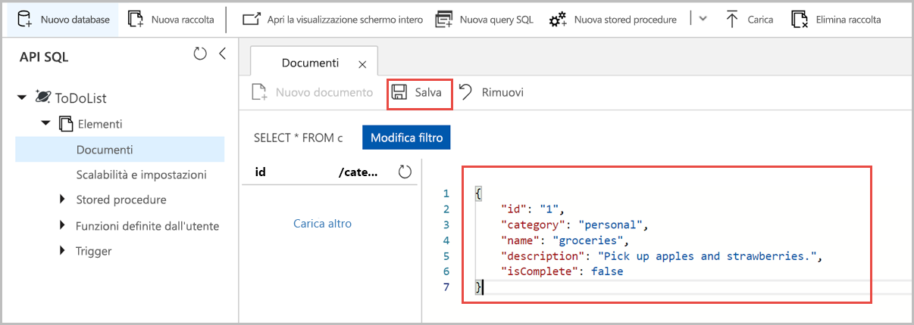

# <a name="quickstart-build-a-net-web-app-using-sql-api-account-in-azure-cosmos-db"></a>Avvio rapido: Compilare un'app Web .NET usando l'account API SQL in Azure Cosmos DB

> [!div class="op_single_selector"]
> * [.NET](create-sql-api-dotnet.md)
> * [.NET (Preview)](create-sql-api-dotnet-preview.md)
> * [Java](create-sql-api-java.md)
> * [Node.js](create-sql-api-nodejs.md)
> * [Python](create-sql-api-python.md)
> * [Xamarin](create-sql-api-xamarin-dotnet.md)
>  
> 

Azure Cosmos DB è il servizio di database di Microsoft multimodello distribuito a livello globale. È possibile usare Cosmos DB per creare ed eseguire rapidamente query su chiavi/valori, database di documenti e database a grafo che sfruttano i vantaggi delle funzionalità di distribuzione globale e scalabilità orizzontale alla base di Azure Cosmos DB. 

Questa guida di avvio rapido illustra come usare il portale di Azure per creare un account [API SQL](sql-api-introduction.md) di Azure Cosmos DB, creare un database e una raccolta di documenti e aggiungere dati alla raccolta. Si userà quindi un'app Web [SQL .NET SDK](sql-api-sdk-dotnet.md) per aggiungere altri dati alla raccolta. 

In questa guida di avvio rapido si usa Esplora dati nel portale di Azure per creare il database e la raccolta. È anche possibile creare il database e la raccolta con il codice di esempio .NET. Per altre informazioni, vedere [Esaminare il codice .NET](#review-the-net-code). 

## <a name="prerequisites"></a>Prerequisiti

Visual Studio 2017 con il flusso di lavoro di sviluppo di Azure installato
- È possibile scaricare e usare la **versione gratuita** di [Visual Studio 2017 Community Edition](https://www.visualstudio.com/downloads/). Durante l'installazione di Visual Studio abilitare **Sviluppo di Azure**. 

Una sottoscrizione di Azure o un account di prova gratuito di Azure Cosmos DB
- [!INCLUDE [quickstarts-free-trial-note](../../includes/quickstarts-free-trial-note.md)] 
- [!INCLUDE [cosmos-db-emulator-docdb-api](../../includes/cosmos-db-emulator-docdb-api.md)]  

<a id="create-account"></a>
## <a name="create-an-azure-cosmos-db-account"></a>Creare un account Azure Cosmos DB

[!INCLUDE [cosmos-db-create-dbaccount](../../includes/cosmos-db-create-dbaccount.md)]

<a id="create-collection-database"></a>
## <a name="add-a-database-and-a-collection"></a>Aggiungere un database e una raccolta 

È possibile usare Esplora dati nel portale di Azure per creare un database e una raccolta. 

1.  Selezionare **Esplora dati** dal menu di spostamento a sinistra nella pagina dell'account di Azure Cosmos DB, quindi selezionare **Nuova raccolta**. 
    
    Potrebbe essere necessario scorrere verso destra per visualizzare l'area **Aggiungi raccolta**.
    
    
    
1.  Nella pagina **Aggiungi raccolta** immettere le impostazioni per la nuova raccolta.
    
    |Impostazione|Valore consigliato|DESCRIZIONE
    |---|---|---|
    |**ID database**|ToDoList|Immettere *ToDoList* come nome del nuovo database. I nomi dei database devono avere una lunghezza compresa tra 1 e 255 caratteri e non possono contenere `/, \\, #, ?` o spazi finali.|
    |**ID raccolta**|Items|Immettere *Items* come nome della nuova raccolta. Gli ID delle raccolte prevedono gli stessi requisiti relativi ai caratteri dei nomi di database.|
    |**Chiave di partizione**| /category| L'esempio descritto in questo articolo usa */category* come chiave di partizione.|
    |**Velocità effettiva**|400|Lasciare la velocità effettiva a 400 unità di richiesta al secondo (UR/s). Se si vuole ridurre la latenza, è possibile aumentare la velocità effettiva in un secondo momento.| 
    
    Non aggiungere **chiavi univoche** per questo esempio. Le chiavi univoche consentono di aggiungere un livello di integrità dei dati al database garantendo l'univocità di uno o più valori per ogni chiave di partizione. Per altre informazioni, vedere [Chiavi univoche in Azure Cosmos DB](unique-keys.md).
    
1.  Selezionare **OK**. 
    In Esplora dati verranno visualizzati il nuovo database e la nuova raccolta.
    
    

## <a name="add-data-to-your-database"></a>Aggiungere dati al database

Aggiungere dati al nuovo database usando Esplora dati.

1. In **Esplora dati** il nuovo database viene visualizzato nel riquadro **Raccolte**. Espandere il database **ToDoList**, espandere la raccolta **Items**, selezionare **Documenti**, quindi selezionare **Nuovo documento**. 
   
   
   
1. Aggiungere la struttura seguente al documento sul lato destro del riquadro **Documenti**:

     ```json
     {
         "id": "1",
         "category": "personal",
         "name": "groceries",
         "description": "Pick up apples and strawberries.",
         "isComplete": false
     }
     ```

1. Selezionare **Salva**.
   
   
   
1. Selezionare **Nuovo documento** e creare e salvare un altro documento con un `id` univoco ed eventuali altri valori e proprietà desiderati. I documenti possono avere qualsiasi struttura perché Azure Cosmos DB non impone alcuno schema ai dati.

## <a name="query-your-data"></a>Eseguire query sui dati

[!INCLUDE [cosmos-db-create-sql-api-query-data](../../includes/cosmos-db-create-sql-api-query-data.md)]

## <a name="use-the-net-web-app-to-manage-data"></a>Usare l'app Web .NET per gestire i dati

Per vedere come è facile interagire con i dati di Azure Cosmos DB a livello di codice, clonare l'app Web API SQL .NET di esempio da GitHub, aggiornare la stringa di connessione ed eseguire l'app per aggiornare i dati. 

È anche possibile creare il database e la raccolta con il codice di esempio .NET. Per altre informazioni, vedere [Esaminare il codice .NET](#review-the-net-code).

### <a name="clone-the-sample-app"></a>Clonare l'app di esempio

Clonare prima di tutto un'app [API SQL](https://github.com/Azure-Samples/documentdb-dotnet-todo-app) in C# da GitHub. 

1. Aprire una finestra di terminale git, ad esempio Git Bash, creare una nuova directory denominata *git-samples* e passare alla directory: 
   
   ```bash
   mkdir /c/git-samples/
   cd /c/git-samples/
   ```
   
1. Eseguire questo comando per clonare il repository di esempio e creare una copia dell'app di esempio nel computer:
   
   ```bash
   git clone https://github.com/Azure-Samples/documentdb-dotnet-todo-app.git
   ```

### <a name="update-the-connection-string"></a>Aggiornare la stringa di connessione 

1. Trovare e aprire il file *todo.sln* dell'app clonata in Visual Studio. 

1. In **Esplora soluzioni** di Visual Studio aprire il file *web.config*. 

1. Tornare al portale di Azure per copiare le informazioni della stringa di connessione da incollare nel file *web.config*.
   
   1. Selezionare **Chiavi** nel menu di spostamento a sinistra dell'account Azure Cosmos DB.
      
      
      
   1. In **Chiavi di lettura/scrittura** copiare il valore **URI** usando il pulsante di copia a destra e incollarlo nella chiave `endpoint` del file *web.config*. Ad esempio:  
      
      `<add key="endpoint" value="https://mysqlapicosmosdb.documents.azure.com:443/" />`
      
   1. Copiare il valore **CHIAVE PRIMARIA** e incollarlo nella chiave `authKey` del file *web.config*. Ad esempio: 
      
      `<add key="authKey" value="19ZDNJAiYL26tmnRvoez6hmtIfBGwjun50PWRjNYMC2ig8Ob9hYk7Fq1RYSv8FcIYnh1TdBISvCh7s6yyb0000==" />`

       
1. Assicurarsi che i valori del database e della raccolta nel file *web.config* corrispondano ai nomi creati in precedenza. 

   ```csharp
   <add key="database" value="ToDoList"/>
   <add key="collection" value="Items"/>
   ```
 
1. Salvare il file *web.config.* L'app è stata aggiornata con tutte le informazioni necessarie per comunicare con Azure Cosmos DB.

### <a name="run-the-web-app"></a>Eseguire l'app Web

1. In Visual Studio fare clic con il pulsante destro del mouse sul progetto **todo** in **Esplora soluzioni** e quindi scegliere **Gestisci pacchetti NuGet**. 

1. Nella casella **Sfoglia** di NuGet digitare *DocumentDB*.

1. Dai risultati installare la libreria **Microsoft.Azure.DocumentDB**, se non è già stata installata. Verrà installato il pacchetto [Microsoft.Azure.DocumentDB](https://www.nuget.org/packages/Microsoft.Azure.DocumentDB/) insieme a tutte le dipendenze.
   
   Se Gestione pacchetti NuGet visualizza un messaggio per indicare che mancano alcuni pacchetti nella soluzione, selezionare **Ripristina** per installarli da origini interne. 

1. Premere **Ctrl**+**F5** per eseguire l'app nel browser. 

1. Selezionare **Crea nuovo** nell'app to-do e creare alcune nuove attività.

   

È possibile tornare a Esplora dati nel portale di Azure per visualizzare, modificare e usare questi nuovi dati, nonché eseguire query su di essi. 

## <a name="review-the-net-code"></a>Esaminare il codice .NET

Questo passaggio è facoltativo. In questa guida di avvio rapido sono stati creati un database e una raccolta nel portale di Azure e sono stati aggiunti dati di esempio usando l'esempio .NET. Tuttavia, è anche possibile creare il database e la raccolta usando l'esempio di .NET. Esaminare i frammenti di codice seguenti per scoprire come vengono create le risorse del database nel codice. Tutti i frammenti di codice sono tratti dal file *DocumentDBRepository.cs* del progetto **todo**.

* Questo codice inizializza l'elemento `DocumentClient`: 

    ```csharp
    client = new DocumentClient(new Uri(ConfigurationManager.AppSettings["endpoint"]), ConfigurationManager.AppSettings["authKey"]);
    ```

* Questo codice crea il nuovo database con il metodo `CreateDatabaseAsync`:

    ```csharp
    await client.CreateDatabaseAsync(new Database { Id = DatabaseId });
    ```

* Il codice seguente crea la nuova raccolta con il metodo `CreateDocumentCollectionAsync`:

    ```csharp
    private static async Task CreateCollectionIfNotExistsAsync(string partitionkey)
    {
       try
       {       
        await client.ReadDocumentCollectionAsync(UriFactory.CreateDocumentCollectionUri(DatabaseId, CollectionId), new RequestOptions { PartitionKey = new PartitionKey(partitionkey) });
       }
        catch (DocumentClientException e)
        {
           if (e.StatusCode == System.Net.HttpStatusCode.NotFound)
            {
                await client.CreateDocumentCollectionAsync(
                  UriFactory.CreateDatabaseUri(DatabaseId),
                   new DocumentCollection
                    {
                      Id = CollectionId,
                      PartitionKey = new PartitionKeyDefinition
                       {
                           Paths = new System.Collections.ObjectModel.Collection<string>(new List<string>() { partitionkey })
                        }
                    },
                      new RequestOptions { OfferThroughput = 400 });
            }
            else
            {
                throw;
            }
        }
    }
    ```

## <a name="clean-up-resources"></a>Pulire le risorse

[!INCLUDE [cosmosdb-delete-resource-group](../../includes/cosmos-db-delete-resource-group.md)]

## <a name="next-steps"></a>Passaggi successivi

In questa guida di avvio rapido si è appreso come creare un account Azure Cosmos DB, creare un database e una raccolta con Esplora dati ed eseguire un'app Web .NET per aggiornare i dati. È ora possibile importare dati aggiuntivi nell'account Azure Cosmos DB. 

> [!div class="nextstepaction"]
> [Importare dati in Azure Cosmos DB](import-data.md)

