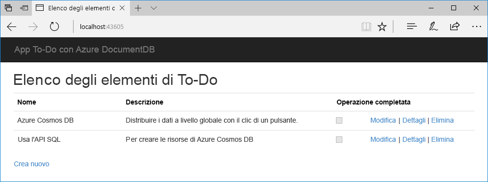

# <a name="quickstart-build-a-net-web-app-with-azure-cosmos-db-using-the-sql-api-and-the-azure-portal"></a>Guida introduttiva: Creare un'app Web .NET con Azure Cosmos DB usando l'API SQL e il portale di Azure

Azure Cosmos DB è il servizio di database di Microsoft multimodello distribuito a livello globale. È possibile creare ed eseguire rapidamente query su database di documenti, coppie chiave-valore e grafi, sfruttando in ognuno dei casi i vantaggi offerti dalle funzionalità di scalabilità orizzontale e distribuzione globale alla base di Azure Cosmos DB. 

Questa guida di avvio rapido mostra come creare un account, un database di documenti e una raccolta di Azure Cosmos DB tramite il portale di Azure. Si creerà e distribuirà quindi l'app Web elenco attività basata sull'[API .NET SQL](sql-api-sdk-dotnet.md), come mostrato nello screenshot seguente. 



## <a name="prerequisites"></a>prerequisiti

Se Visual Studio 2017 non è ancora installato, è possibile scaricare e usare la versione **gratuita** [Visual Studio 2017 Community Edition](https://www.visualstudio.com/downloads/). Durante l'installazione di Visual Studio abilitare **Sviluppo di Azure**.

[!INCLUDE [quickstarts-free-trial-note](../../includes/quickstarts-free-trial-note.md)] 
[!INCLUDE [cosmos-db-emulator-docdb-api](../../includes/cosmos-db-emulator-docdb-api.md)]  

<a id="create-account"></a>
## <a name="create-a-database-account"></a>Creare un account di database

[!INCLUDE [cosmos-db-create-dbaccount](../../includes/cosmos-db-create-dbaccount.md)]

<a id="create-collection"></a>
## <a name="add-a-collection"></a>Aggiungere una raccolta

[!INCLUDE [cosmos-db-create-collection](../../includes/cosmos-db-create-collection.md)]

<a id="add-sample-data"></a>
## <a name="add-sample-data"></a>Aggiungere dati di esempio

È ora possibile aggiungere dati alla nuova raccolta usando Esplora dati.

1. In Esplora dati il nuovo database viene visualizzato nel riquadro Raccolte. Espandere il database **Tasks**, espandere la raccolta **Items**, fare clic su **Documenti** e quindi su **Nuovo documento**. 

   
  
2. Aggiungere ora un documento alla raccolta con la struttura seguente.

     ```json
     {
         "id": "1",
         "category": "personal",
         "name": "groceries",
         "description": "Pick up apples and strawberries.",
         "isComplete": false
     }
     ```

3. Dopo avere aggiunto il codice JSON alla scheda **Documenti**, fare clic su **Salva**.

    

4.  Creare e salvare un altro documento inserendo un valore univoco per la proprietà `id` e modificando le altre proprietà come si preferisce. I nuovi documenti possono avere la struttura desiderata, perché Azure Cosmos DB non impone alcuno schema per i dati.

     È ora possibile usare query in Esplora dati per recuperare i dati. Per impostazione predefinita, Esplora dati usa `SELECT * FROM c` per recuperare tutti i documenti della raccolta, ma è possibile usare una [query SQL](sql-api-sql-query.md) diversa, ad esempio `SELECT * FROM c ORDER BY c._ts DESC`, per restituire tutti i documenti in ordine decrescente in base al timestamp.
 
     È anche possibile usare Esplora dati per creare stored procedure, funzioni definite dall'utente e trigger per eseguire la logica di business sul lato server e aumentare la velocità effettiva. Esplora dati espone tutti i tipi di accesso ai dati a livello di codice predefiniti disponibili nelle API, ma consente anche di accedere facilmente ai dati nel portale di Azure.

## <a name="clone-the-sample-application"></a>Clonare l'applicazione di esempio

Si può ora passare a usare il codice. Clonare un'app per le API SQL da GitHub, impostare la stringa di connessione ed eseguirla. Come si noterà, è facile usare i dati a livello di codice. 

1. Aprire una finestra del terminale Git, ad esempio Git Bash, ed eseguire il comando `CD` per passare a una directory di lavoro.  

2. Eseguire il comando seguente per clonare l'archivio di esempio. 

    ```bash
    git clone https://github.com/Azure-Samples/documentdb-dotnet-todo-app.git
    ```

3. Aprire quindi il file della soluzione todo in Visual Studio. 

## <a name="review-the-code"></a>Esaminare il codice

Ecco una breve panoramica delle operazioni da eseguire nell'app. Aprire il file DocumentDBRepository.cs. Come si noterà, queste righe di codice creano le risorse di Azure Cosmos DB. 

* Viene inizializzato DocumentClient alla riga 76.

    ```csharp
    client = new DocumentClient(new Uri(ConfigurationManager.AppSettings["endpoint"]), ConfigurationManager.AppSettings["authKey"]);
    ```

* Viene creato un nuovo database alla riga 91.

    ```csharp
    await client.CreateDatabaseAsync(new Database { Id = DatabaseId });
    ```

* Viene creata una nuova raccolta alla riga 110.

    ```csharp
    await client.CreateDocumentCollectionAsync(
        UriFactory.CreateDatabaseUri(DatabaseId),
        new DocumentCollection { Id = CollectionId },
        new DocumentCollection
            {
               Id = CollectionId
            },
        new RequestOptions { OfferThroughput = 400 });
    ```

## <a name="update-your-connection-string"></a>Aggiornare la stringa di connessione

Tornare ora al portale di Azure per recuperare le informazioni sulla stringa di connessione e copiarle nell'app.

1. Nell'account Azure Cosmos DB nel [portale di Azure](http://portal.azure.com/) fare clic su **Chiavi** nel riquadro di spostamento a sinistra e quindi su **Chiavi di lettura/scrittura**. Usare i pulsanti di copia sul lato destro dello schermo per copiare l'URI e la chiave primaria nel file web.config nel passaggio seguente.

    

2. In Visual Studio 2017 aprire il file web.config. 

3. Copiare il valore di URI dal portale (usando il pulsante di copia) e impostarlo come valore della chiave di endpoint in web.config. 

    `<add key="endpoint" value="FILLME" />`

4. Copiare quindi il valore di CHIAVE PRIMARIA dal portale e impostarlo come valore di authKey in web.config. L'app è stata aggiornata con tutte le informazioni necessarie per comunicare con Azure Cosmos DB. 

    `<add key="authKey" value="FILLME" />`
    
## <a name="run-the-web-app"></a>Eseguire l'app Web
1. In Visual Studio fare clic con il pulsante destro del mouse sul progetto in **Esplora soluzioni** e quindi scegliere **Gestisci pacchetti NuGet**. 

2. Nella casella **Sfoglia** di NuGet digitare *DocumentDB*.

3. Dai risultati installare la libreria **Microsoft.Azure.DocumentDB**. Viene installato il pacchetto Microsoft.Azure.DocumentDB, insieme a tutte le dipendenze.

4. Premere CTRL + F5 per eseguire l'applicazione. L'app viene visualizzata nel browser. 

5. Fare clic su **Crea nuovo** nel browser e creare alcune nuove attività nell'app elenco attività.

   

È ora possibile tornare a Esplora dati e visualizzare, modificare e usare questi nuovi dati, nonché eseguire query su di essi. 

## <a name="review-slas-in-the-azure-portal"></a>Esaminare i contratti di servizio nel portale di Azure

[!INCLUDE [cosmosdb-tutorial-review-slas](../../includes/cosmos-db-tutorial-review-slas.md)]

## <a name="clean-up-resources"></a>Pulire le risorse

Se non si intende continuare a usare l'app, eliminare tutte le risorse create tramite questa guida di avvio rapido nel portale di Azure eseguendo questi passaggi:

1. Scegliere **Gruppi di risorse** dal menu a sinistra del portale di Azure e quindi fare clic sul nome della risorsa creata. 
2. Nella pagina del gruppo di risorse fare clic su **Elimina**, digitare il nome della risorsa da eliminare nella casella di testo e quindi fare clic su **Elimina**.

## <a name="next-steps"></a>Passaggi successivi

In questa guida di avvio rapido si è appreso come creare un account Azure Cosmos DB, come creare una raccolta con Esplora dati e come eseguire un'app Web. È ora possibile importare dati aggiuntivi nell'account Cosmos DB. 

> [!div class="nextstepaction"]
> [Importare dati in Azure Cosmos DB](import-data.md)


