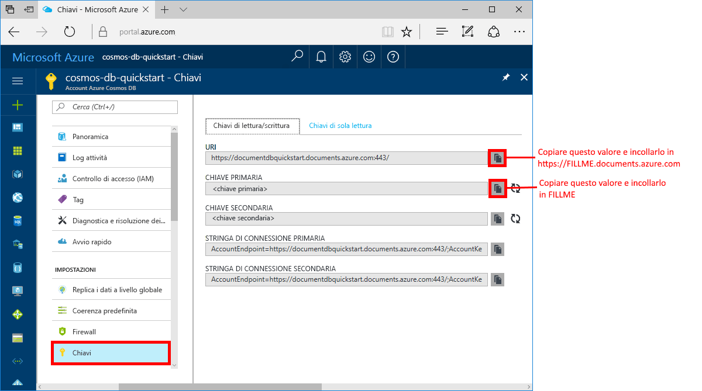

# <a name="azure-cosmos-db-create-a-document-database-using-java-and-the-azure-portal"></a>Azure Cosmos DB: Creare un database di documenti con Java e il portale di Azure

Azure Cosmos DB è il servizio di database di Microsoft multimodello distribuito a livello globale. Questo servizio consente di creare rapidamente database di documenti, tabelle e a grafo e di eseguire query su di essi.

Questa guida introduttiva illustra come creare un database di documenti con gli strumenti del portale di Azure per l'[API SQL](sql-api-introduction.md) di Azure Cosmos DB. Illustra anche come creare rapidamente un'app console Java usando l'[API Java SQL](sql-api-sdk-java.md). Le istruzioni di questa guida introduttiva possono essere eseguite in qualsiasi sistema operativo in grado di eseguire Java. Questa guida introduttiva consente di acquisire familiarità con la creazione e la modifica delle risorse di database di documenti nell'interfaccia utente o a livello di codice, in base alle proprie preferenze.

## <a name="prerequisites"></a>prerequisiti

[!INCLUDE [quickstarts-free-trial-note](../../includes/quickstarts-free-trial-note.md)] 
[!INCLUDE [cosmos-db-emulator-docdb-api](../../includes/cosmos-db-emulator-docdb-api.md)]

Eseguire anche queste operazioni: 

* [Java Development Kit (JDK) 1.7+](http://www.oracle.com/technetwork/java/javase/downloads/jdk8-downloads-2133151.html)
    * In Ubuntu eseguire `apt-get install default-jdk` per installare JDK.
    * Assicurarsi di impostare la variabile di ambiente JAVA_HOME in modo che faccia riferimento alla cartella di installazione di JDK.
* [Scaricare](http://maven.apache.org/download.cgi) e [installare](http://maven.apache.org/install.html) un archivio binario [Maven](http://maven.apache.org/)
    * In Ubuntu è possibile eseguire `apt-get install maven` per installare Maven.
* [Git](https://www.git-scm.com/)
    * In Ubuntu è possibile eseguire `sudo apt-get install git` per installare Git.

## <a name="create-a-database-account"></a>Creare un account di database

Per poter creare un database di documenti, è prima necessario creare un account API SQL con Azure Cosmos DB.

[!INCLUDE [cosmos-db-create-dbaccount](../../includes/cosmos-db-create-dbaccount.md)]

## <a name="add-a-collection"></a>Aggiungere una raccolta

[!INCLUDE [cosmos-db-create-collection](../../includes/cosmos-db-create-collection.md)]

<a id="add-sample-data"></a>
## <a name="add-sample-data"></a>Aggiungere dati di esempio

[!INCLUDE [cosmos-db-create-sql-api-add-sample-data](../../includes/cosmos-db-create-sql-api-add-sample-data.md)]

## <a name="query-your-data"></a>Eseguire query sui dati

[!INCLUDE [cosmos-db-create-sql-api-query-data](../../includes/cosmos-db-create-sql-api-query-data.md)]

## <a name="clone-the-sample-application"></a>Clonare l'applicazione di esempio

Si può ora passare a usare il codice. Clonare un'app per le API SQL da GitHub, impostare la stringa di connessione ed eseguirla. Come si noterà, è facile usare i dati a livello di codice. 

1. Aprire un prompt dei comandi, creare una nuova cartella denominata git-samples e quindi chiudere il prompt dei comandi.

    ```bash
    md "C:\git-samples"
    ```

2. Aprire una finestra del terminale Git, ad esempio Git Bash, ed eseguire il comando `cd` per passare a una nuova cartella in cui installare l'app di esempio. 

    ```bash
    cd "C:\git-samples"
    ```

3. Eseguire il comando seguente per clonare l'archivio di esempio. Questo comando crea una copia dell'app di esempio nel computer in uso.

    ```bash
    git clone https://github.com/Azure-Samples/azure-cosmos-db-documentdb-java-getting-started.git
    ```

## <a name="review-the-code"></a>Esaminare il codice

Questo passaggio è facoltativo. Per scoprire in che modo le risorse del database vengono create nel codice, è possibile esaminare i frammenti di codice seguenti. In alternativa, è possibile passare ad [Aggiornare la stringa di connessione](#update-your-connection-string). 

I frammenti seguenti provengono tutti dal file C:\git-samples\azure-cosmos-db-documentdb-java-getting-started\src\GetStarted\Program.java.

* Inizializzazione di `DocumentClient`. L'oggetto [DocumentClient](https://docs.microsoft.com/java/api/com.microsoft.azure.documentdb._document_client) fornisce una rappresentazione logica lato client per il servizio di database Azure Cosmos DB. Questo client viene usato per configurare ed eseguire richieste nel servizio. Le porzioni `FILLME` di questo codice verranno aggiornate più avanti nella guida introduttiva.

    ```java
    this.client = new DocumentClient("https://FILLME.documents.azure.com",
            "FILLME", 
            new ConnectionPolicy(),
            ConsistencyLevel.Session);
    ```

* Creazione di [database](https://docs.microsoft.com/java/api/com.microsoft.azure.documentdb._database).

    ```java
    Database database = new Database();
    database.setId(databaseName);
    
    this.client.createDatabase(database, null);
    ```

* Creazione di [DocumentCollection](https://docs.microsoft.com/java/api/com.microsoft.azure.documentdb._document_collection).

    ```java
    DocumentCollection collectionInfo = new DocumentCollection();
    collectionInfo.setId(collectionName);

    ...

    this.client.createCollection(databaseLink, collectionInfo, requestOptions);
    ```

* Creazione di documenti tramite il metodo [createDocument](https://docs.microsoft.com/java/api/com.microsoft.azure.documentdb._document_client.createdocument).

    ```java
    // Any Java object within your code can be serialized into JSON and written to Azure Cosmos DB
    Family andersenFamily = new Family();
    andersenFamily.setId("Andersen.1");
    andersenFamily.setLastName("Andersen");
    // More properties

    String collectionLink = String.format("/dbs/%s/colls/%s", databaseName, collectionName);
    this.client.createDocument(collectionLink, family, new RequestOptions(), true);
    ```

* Le query SQL su JSON vengono eseguite usando il metodo [queryDocuments](https://docs.microsoft.com/java/api/com.microsoft.azure.documentdb._document_client.querydocuments).

    ```java
    FeedOptions queryOptions = new FeedOptions();
    queryOptions.setPageSize(-1);
    queryOptions.setEnableCrossPartitionQuery(true);

    String collectionLink = String.format("/dbs/%s/colls/%s", databaseName, collectionName);
    FeedResponse<Document> queryResults = this.client.queryDocuments(
        collectionLink,
        "SELECT * FROM Family WHERE Family.lastName = 'Andersen'", queryOptions);

    System.out.println("Running SQL query...");
    for (Document family : queryResults.getQueryIterable()) {
        System.out.println(String.format("\tRead %s", family));
    }
    ```    

## <a name="update-your-connection-string"></a>Aggiornare la stringa di connessione

Tornare ora al portale di Azure per recuperare le informazioni sulla stringa di connessione e copiarle nell'app. Questo consente all'app di comunicare con il database ospitato.

1. Nel [portale di Azure](http://portal.azure.com/) fare clic su **Chiavi**. 

    Usare i pulsanti di copia sul lato destro della schermata per copiare il valore superiore, l'URI.

    

2. Aprire il file `Program.java` che si trova nella cartella C:\git-samples\azure-cosmos-db-documentdb-java-getting-started\src\GetStarted. 

3. Incollare il valore dell'URI dal portale su `https://FILLME.documents.azure.com` nella riga 45.

4. Tornare al portale e copiare il valore della CHIAVE PRIMARIA, come illustrato nella schermata. Incollare il valore della CHIAVE PRIMARIA dal portale su `FILLME` nella riga 46.

    Il metodo getStartedDemo si presenta ora in modo simile al seguente: 
    
    ```java
    private void getStartedDemo() throws DocumentClientException, IOException {
        this.client = new DocumentClient("https://youraccountname.documents.azure.com:443/",
                "your-primary-key...RJhQrqQ5QQ==", 
                new ConnectionPolicy(),
                ConsistencyLevel.Session);
    ```

5. Salvare il file Program.java.

## <a name="run-the-app"></a>Esecuzione dell'app

1. Nella finestra del terminale Git eseguire il comando `cd` per passare alla cartella azure-cosmos-db-documentdb-java-getting-started.

    ```git
    cd "C:\git-samples\azure-cosmos-db-documentdb-java-getting-started"
    ```

2. Nella finestra del terminale Git usare il comando seguente per installare i pacchetti Java necessari.

    ```
    mvn package
    ```

3. Nella finestra del terminale Git usare il comando seguente per avviare l'applicazione Java.

    ```
    mvn exec:java -D exec.mainClass=GetStarted.Program
    ```

    La finestra del terminale visualizza una notifica di creazione del database FamilyDB. 
    
4. Premere un tasto per creare il database e quindi un altro tasto per creare la raccolta. 

    Al termine del programma vengono eliminate tutte le risorse. Tornare quindi a Esplora dati nel browser per verificare che siano ora presenti un database FamilyDB e una raccolta FamilyCollection.

5. Passare alla finestra della console e premere un tasto per creare il primo documento e quindi un altro tasto per creare il secondo. Tornare quindi a Esplora dati per visualizzarli. 

6. Premere un tasto per eseguire una query e visualizzare l'output nella finestra della console. 

7. La pressione del tasto successivo determina l'eliminazione delle risorse. Se si vogliono mantenere le risorse, si può premere CTRL+C nella finestra della console per terminare il programma. In caso contrario, premere qualsiasi tasto per eliminare le risorse dall'account ed evitare così l'addebito di costi. 

    


## <a name="review-slas-in-the-azure-portal"></a>Esaminare i contratti di servizio nel portale di Azure

[!INCLUDE [cosmosdb-tutorial-review-slas](../../includes/cosmos-db-tutorial-review-slas.md)]

## <a name="clean-up-resources"></a>Pulire le risorse

[!INCLUDE [cosmosdb-delete-resource-group](../../includes/cosmos-db-delete-resource-group.md)]

## <a name="next-steps"></a>Passaggi successivi

In questa guida di avvio rapido si è appreso come creare un account Azure Cosmos DB, un database di documenti e una raccolta usando Esplora dati e come creare eseguire un'app per ottenere lo stesso risultato a livello di codice. È ora possibile importare dati aggiuntivi nella raccolta di Azure Cosmos DB. 

> [!div class="nextstepaction"]
> [Importare dati in Azure Cosmos DB](import-data.md)


