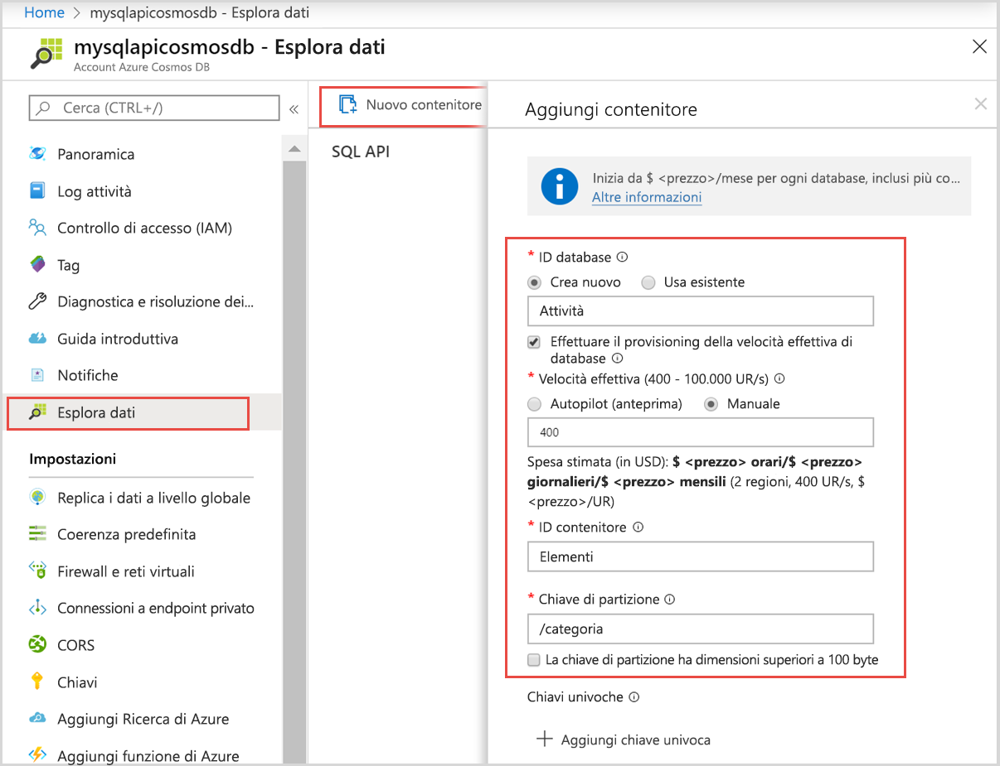

# <a name="quickstart-use-nodejs-to-connect-and-query-data-from-azure-cosmos-db-sql-api-account"></a>Guida introduttiva: Usare Node.js per connettersi ai dati ed eseguire query da un account API SQL di Azure Cosmos DB

> [!div class="op_single_selector"]
> - [.NET V3](create-sql-api-dotnet.md)
> - [.NET V4](create-sql-api-dotnet-V4.md)
> - [Java SDK v4](create-sql-api-java.md)
> - [Node.js](create-sql-api-nodejs.md)
> - [Python](create-sql-api-python.md)
> - [Xamarin](create-sql-api-xamarin-dotnet.md)

In questa guida di avvio rapido si apprenderà a creare e gestire un account API SQL di Azure Cosmos DB dal portale di Azure usando un'app Node.js clonata da GitHub. Azure Cosmos DB è un servizio di database modello che consente di creare ed eseguire rapidamente query su database di documenti, tabelle, valori chiave e grafi, con funzionalità di scalabilità orizzontale e distribuzione globale.

## <a name="walkthrough-video"></a>Video della procedura dettagliata

Guardare questo video per una procedura dettagliata completa del contenuto di questo articolo.

> [!VIDEO https://channel9.msdn.com/Shows/Docs-Azure/Quickstart-Use-Nodejs-to-connect-and-query-data-from-Azure-Cosmos-DB-SQL-API-account/player]

## <a name="prerequisites"></a>Prerequisiti

- Un account Azure con una sottoscrizione attiva. [È possibile crearne uno gratuitamente](https://azure.microsoft.com/free/?ref=microsoft.com&utm_source=microsoft.com&utm_medium=docs&utm_campaign=visualstudio). In alternativa, è possibile [provare gratuitamente Azure Cosmos DB](https://azure.microsoft.com/try/cosmosdb/) senza una sottoscrizione di Azure. È anche possibile usare l'[Emulatore di Azure Cosmos DB](https://aka.ms/cosmosdb-emulator) con l'URI `https://localhost:8081` e la chiave `C2y6yDjf5/R+ob0N8A7Cgv30VRDJIWEHLM+4QDU5DE2nQ9nDuVTqobD4b8mGGyPMbIZnqyMsEcaGQy67XIw/Jw==`.
- [Node.js 6.0.0+](https://nodejs.org/).
- [Git](https://www.git-scm.com/downloads).

## <a name="create-an-azure-cosmos-account"></a>Creare un account Azure Cosmos

Ai fini di questo argomento di avvio rapido, è possibile usare l'opzione [Prova gratuitamente Azure Cosmos DB](https://azure.microsoft.com/try/cosmosdb/) per creare un account Azure Cosmos.

1. Passare alla pagina [Prova gratuitamente Azure Cosmos DB](https://azure.microsoft.com/try/cosmosdb/).

1. Scegliere l'account API **SQL** e selezionare **Crea**. Accedere con l'account Microsoft.

1. Una volta effettuato l'accesso, l'account Azure Cosmos dovrebbe essere pronto. Selezionare **Apri nel portale di Azure** per aprire l'account appena creato.

L'opzione "Prova gratuitamente Azure Cosmos DB" non richiede una sottoscrizione di Azure e offre un account Azure Cosmos per un periodo limitato di 30 giorni. Se si vuole usare l'account Azure Cosmos per un periodo di tempo più lungo, è necessario [creare l'account](create-cosmosdb-resources-portal.md#create-an-azure-cosmos-db-account) all'interno della sottoscrizione di Azure.

## <a name="add-a-container"></a>Aggiungere un contenitore

È ora possibile usare lo strumento Esplora dati nel portale di Azure per creare un database e un contenitore.

1. Selezionare **Esplora dati** > **Nuovo contenitore**.

   A destra viene visualizzata l'area **Aggiungi contenitore**. Per vederla potrebbe essere necessario scorrere verso destra.

   

2. Nella pagina **Aggiungi contenitore** immettere le impostazioni per il nuovo contenitore.

   | Impostazione           | Valore consigliato | Descrizione                                                                                                                                                                                                                                                                                                                                                                           |
   | ----------------- | --------------- | ------------------------------------------------------------------------------------------------------------------------------------------------------------------------------------------------------------------------------------------------------------------------------------------------------------------------------------------------------------------------------------- |
   | **ID database**   | Attività           | Immettere _Tasks_ come nome del nuovo database. I nomi dei database devono avere una lunghezza compresa tra 1 e 255 caratteri e non possono contenere `/, \\, #, ?` o spazi finali. Selezionare l'opzione **Provision database throughput** (Provisioning delle unità di elaborazione del database) che consente di condividere le unità di elaborazione del database con tra tutti i contenitori al suo interno. Questa opzione permette anche di risparmiare sui costi. |
   | **Velocità effettiva**    | 400             | Lasciare la velocità effettiva a 400 unità di richiesta al secondo (UR/s). Se si vuole ridurre la latenza, è possibile aumentare la velocità effettiva in un secondo momento.                                                                                                                                                                                                                                                    |
   | **ID contenitore**  | Items           | Immettere _Items_ come nome per il nuovo contenitore. Gli ID contenitore prevedono gli stessi requisiti relativi ai caratteri dei nomi di database.                                                                                                                                                                                                                                                               |
   | **Chiave di partizione** | /category       | L'esempio descritto in questo articolo usa _/category_ come chiave di partizione.                                                                                                                                                                                                                                                                                                           |

   Oltre alle impostazioni precedenti, è possibile aggiungere **Chiavi univoche** per il contenitore. In questo esempio il campo viene lasciato vuoto. Le chiavi univoche consentono agli sviluppatori di aggiungere un livello di integrità dei dati nel database. Se si definiscono criteri di chiave univoca durante la creazione di un contenitore, si ha la sicurezza che uno o più valori siano univoci per ogni chiave di partizione. Per altre informazioni, vedere l'articolo [Chiavi univoche in Azure Cosmos DB](unique-keys.md).

   Selezionare **OK**. In Esplora dati vengono visualizzati il nuovo database e il nuovo contenitore.

## <a name="add-sample-data"></a>Aggiungere dati di esempio

[!INCLUDE [cosmos-db-create-sql-api-add-sample-data](../../includes/cosmos-db-create-sql-api-add-sample-data.md)]

## <a name="query-your-data"></a>Eseguire query sui dati

[!INCLUDE [cosmos-db-create-sql-api-query-data](../../includes/cosmos-db-create-sql-api-query-data.md)]

## <a name="clone-the-sample-application"></a>Clonare l'applicazione di esempio

Clonare ora un'app Node.js da GitHub, impostare la stringa di connessione ed eseguirla.

1. Eseguire il comando seguente per clonare l'archivio di esempio. Questo comando crea una copia dell'app di esempio nel computer in uso.

   ```bash
   git clone https://github.com/Azure-Samples/azure-cosmos-db-sql-api-nodejs-getting-started.git
   ```

## <a name="review-the-code"></a>Esaminare il codice

Questo passaggio è facoltativo. Per scoprire in che modo le risorse del database Azure Cosmos vengono create nel codice, è possibile esaminare i frammenti di codice seguenti. In alternativa, è possibile passare ad [Aggiornare la stringa di connessione](#update-your-connection-string).

Se si ha familiarità con la versione precedente di SQL JavaScript SDK, ci si potrebbe aspettare di vedere termini come _raccolta_ e _documento_. Dal momento che Azure Cosmos DB supporta [più modelli di API](introduction.md), nella [versione 2.0+ di JavaScript SDK](https://www.npmjs.com/package/@azure/cosmos) vengono usati i termini generici _contenitore_, che può essere una raccolta, un grafo o una tabella, ed _elemento_ per descrivere il contenuto del contenitore.

Cosmos DB JavaScript SDK è denominato "@azure/cosmos" e può essere installato da npm.

```bash
npm install @azure/cosmos
```

Tutti i frammenti di codice seguenti sono tratti dal file _app.js_.

- `CosmosClient` viene importato dal pacchetto npm `@azure/cosmos`.

  ```javascript
  const CosmosClient = require("@azure/cosmos").CosmosClient;
  ```

- Viene inizializzato un nuovo oggetto `CosmosClient`.

  ```javascript
  const client = new CosmosClient({ endpoint, key });
  ```

- Selezionare il database "Tasks".

  ```javascript
  const database = client.database(databaseId);
  ```

- Selezionare il contenitore/raccolta "Items".

  ```javascript
  const container = database.container(containerId);
  ```

- Selezionare tutti gli elementi nel contenitore "Items".

  ```javascript
  // query to return all items
  const querySpec = {
    query: "SELECT * from c"
  };

  const { resources: items } = await container.items
    .query(querySpec)
    .fetchAll();
  ```

- Creare un nuovo elemento

  ```javascript
  const { resource: createdItem } = await container.items.create(newItem);
  ```

- Aggiornare un elemento

  ```javascript
  const { id, category } = createdItem;

  createdItem.isComplete = true;
  const { resource: updatedItem } = await container
    .item(id, category)
    .replace(createdItem);
  ```

- Eliminare un elemento

  ```javascript
  const { resource: result } = await container.item(id, category).delete();
  ```

> [!NOTE]
> Nei metodi "update" e "delete" l'elemento deve essere selezionato dal database chiamando `container.item()`. I due parametri passati sono l'ID dell'elemento e la chiave di partizione dell'elemento. In questo caso, la chiave partizione è il valore del campo "category".

## <a name="update-your-connection-string"></a>Aggiornare la stringa di connessione

Tornare ora al portale di Azure per ottenere i dettagli della stringa di connessione dell'account Azure Cosmos. Copiare la stringa di connessione nell'app in modo che possa connettersi al database.

1. Nell'account Azure Cosmos DB nel [portale di Azure](https://portal.azure.com/) selezionare **Chiavi** nel riquadro di spostamento a sinistra e quindi selezionare **Chiavi di lettura/scrittura**. Usare i pulsanti di copia sul lato destro dello schermo per copiare l'URI e la chiave primaria nel file _app.js_ nel passaggio seguente.

   

2. Aprire il file _config.js_.

3. Copiare il valore di URI dal portale (usando il pulsante di copia) e impostarlo come valore della chiave di endpoint in _config.js_.

   `endpoint: "<Your Azure Cosmos account URI>"`

4. Copiare quindi il valore di CHIAVE PRIMARIA dal portale e impostarlo come valore di `config.key` in _config.js_. L'app è stata aggiornata con tutte le informazioni necessarie per comunicare con Azure Cosmos DB.

   `key: "<Your Azure Cosmos account key>"`

## <a name="run-the-app"></a>Eseguire l'app

1. Eseguire `npm install` in un terminale per installare il pacchetto npm "@azure/cosmos"

2. Eseguire `node app.js` in un terminale per avviare l'applicazione Node.js.

3. Vengono visualizzati i due elementi creati in precedenza. Viene creato un nuovo elemento. Il flag "isComplete" su tale elemento viene aggiornato su "true" e infine l'elemento viene eliminato.

È possibile continuare a provare questa applicazione di esempio o tornare in Esplora dati, modificare e usare i propri dati.

## <a name="review-slas-in-the-azure-portal"></a>Esaminare i contratti di servizio nel portale di Azure

[!INCLUDE [cosmosdb-tutorial-review-slas](../../includes/cosmos-db-tutorial-review-slas.md)]

## <a name="next-steps"></a>Passaggi successivi

In questo argomento di avvio rapido si è appreso come creare un account Azure Cosmos DB, come creare un contenitore con Esplora dati e come eseguire un'app Node.js. È ora possibile importare dati aggiuntivi nell'account Azure Cosmos DB.

> [!div class="nextstepaction"]
> [Importare dati in Azure Cosmos DB](import-data.md)
