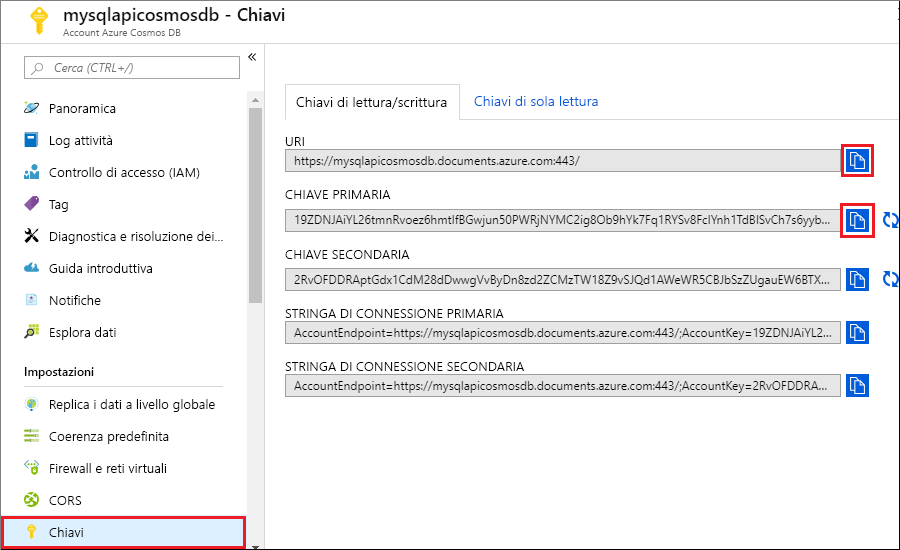

# <a name="azure-cosmos-db-build-a-sql-api-app-with-nodejs-and-the-azure-portal"></a>Azure Cosmos DB: Creare un'app per le API SQL con Node.js e il portale di Azure

Azure Cosmos DB è il servizio di database di Microsoft multimodello distribuito a livello globale. È possibile creare ed eseguire rapidamente query su database di documenti, coppie chiave-valore e grafi, sfruttando in ognuno dei casi i vantaggi offerti dalle funzionalità di scalabilità orizzontale e distribuzione globale alla base di Azure Cosmos DB. 

Questa guida di avvio rapido mostra come creare un account, un database di documenti e una raccolta di Azure Cosmos DB tramite il portale di Azure. Quindi, si creerà ed eseguirà un'app console basata sull'[API Node.js SQL](sql-api-sdk-node.md).

## <a name="prerequisites"></a>prerequisiti

[!INCLUDE [quickstarts-free-trial-note](../../includes/quickstarts-free-trial-note.md)] 
[!INCLUDE [cosmos-db-emulator-docdb-api](../../includes/cosmos-db-emulator-docdb-api.md)]

* Eseguire anche queste operazioni:
    * [Node.js](https://nodejs.org/en/) 0.10.29 o versione successiva
    * [Git](http://git-scm.com/)

## <a name="create-a-database-account"></a>Creare un account di database

[!INCLUDE [cosmos-db-create-dbaccount](../../includes/cosmos-db-create-dbaccount.md)]

## <a name="add-a-collection"></a>Aggiungere una raccolta

[!INCLUDE [cosmos-db-create-collection](../../includes/cosmos-db-create-collection.md)]

## <a name="clone-the-sample-application"></a>Clonare l'applicazione di esempio

Clonare ora un'app per le API SQL da GitHub, impostare la stringa di connessione ed eseguirla. Come si noterà, è facile usare i dati a livello di codice. 

1. Aprire una finestra del terminale Git, ad esempio Git Bash, ed eseguire il comando `CD` per passare a una directory di lavoro.  

2. Eseguire il comando seguente per clonare l'archivio di esempio. 

    ```bash
    git clone https://github.com/Azure-Samples/azure-cosmos-db-documentdb-nodejs-getting-started.git
    ```

## <a name="review-the-code"></a>Esaminare il codice

Ecco una breve panoramica delle operazioni da eseguire nell'app. Aprire il file `app.js`. Come si noterà, queste righe di codice creano le risorse di Azure Cosmos DB. 

* Viene inizializzato `documentClient`.

    ```nodejs
    var client = new documentClient(config.endpoint, { "masterKey": config.primaryKey });
    ```

* Viene creato un nuovo database.

    ```nodejs
    client.createDatabase(config.database, (err, created) => {
        if (err) reject(err)
        else resolve(created);
    });
    ```

* Viene creata una nuova raccolta.

    ```nodejs
    client.createCollection(databaseUrl, config.collection, { offerThroughput: 400 }, (err, created) => {
        if (err) reject(err)
        else resolve(created);
    });
    ```

* Vengono creati alcuni documenti.

    ```nodejs
    client.createDocument(collectionUrl, document, (err, created) => {
        if (err) reject(err)
        else resolve(created);
    });
    ```

* Viene eseguita una query SQL su JSON.

    ```nodejs
    client.queryDocuments(
        collectionUrl,
        'SELECT VALUE r.children FROM root r WHERE r.lastName = "Andersen"'
    ).toArray((err, results) => {
        if (err) reject(err)
        else {
            for (var queryResult of results) {
                let resultString = JSON.stringify(queryResult);
                console.log(`\tQuery returned ${resultString}`);
            }
            console.log();
            resolve(results);
        }
    });
    ```    

## <a name="update-your-connection-string"></a>Aggiornare la stringa di connessione

Tornare ora al portale di Azure per recuperare le informazioni sulla stringa di connessione e copiarle nell'app.

1. Nell'account Azure Cosmos DB nel [portale di Azure](http://portal.azure.com/) fare clic su **Chiavi** nel riquadro di spostamento a sinistra e quindi su **Chiavi di lettura/scrittura**. Usare i pulsanti di copia sul lato destro dello schermo per copiare l'URI e la chiave primaria nel file `config.js` nel passaggio seguente.

    

2. Aprire il file `config.js`. 

3. Copiare il valore di URI dal portale (usando il pulsante di copia) e impostarlo come valore della chiave di endpoint in `config.js`. 

    `config.endpoint = "https://FILLME.documents.azure.com"`

4. Copiare quindi il valore di CHIAVE PRIMARIA dal portale e impostarlo come valore di `config.primaryKey` in `config.js`. L'app è stata aggiornata con tutte le informazioni necessarie per comunicare con Azure Cosmos DB. 

    `config.primaryKey "FILLME"`
    
## <a name="run-the-app"></a>Esecuzione dell'app
1. Eseguire `npm install` in un terminale per installare i moduli npm necessari

2. Eseguire `node app.js` in un terminale per avviare l'applicazione Node.js.

È ora possibile tornare a Esplora dati e visualizzare, modificare e usare questi nuovi dati, nonché eseguire query su di essi. 

## <a name="review-slas-in-the-azure-portal"></a>Esaminare i contratti di servizio nel portale di Azure

[!INCLUDE [cosmosdb-tutorial-review-slas](../../includes/cosmos-db-tutorial-review-slas.md)]

## <a name="clean-up-resources"></a>Pulire le risorse

Se non si intende continuare a usare l'app, eliminare tutte le risorse create tramite questa guida di avvio rapido nel portale di Azure eseguendo questi passaggi:

1. Scegliere **Gruppi di risorse** dal menu a sinistra del portale di Azure e quindi fare clic sul nome della risorsa creata. 
2. Nella pagina del gruppo di risorse fare clic su **Elimina**, digitare il nome della risorsa da eliminare nella casella di testo e quindi fare clic su **Elimina**.

## <a name="next-steps"></a>Passaggi successivi

In questa guida di avvio rapido si è appreso come creare un account Azure Cosmos DB, come creare una raccolta con Esplora dati e come eseguire un'app. È ora possibile importare dati aggiuntivi nell'account Cosmos DB. 

> [!div class="nextstepaction"]
> [Importare dati in Azure Cosmos DB](import-data.md)


